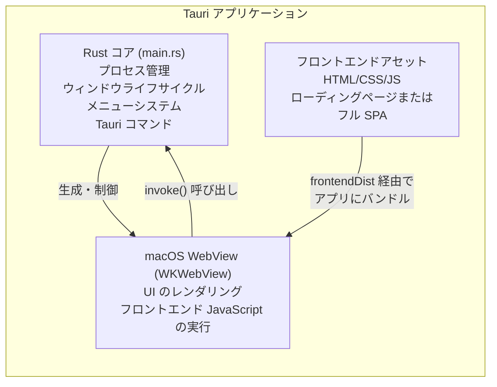
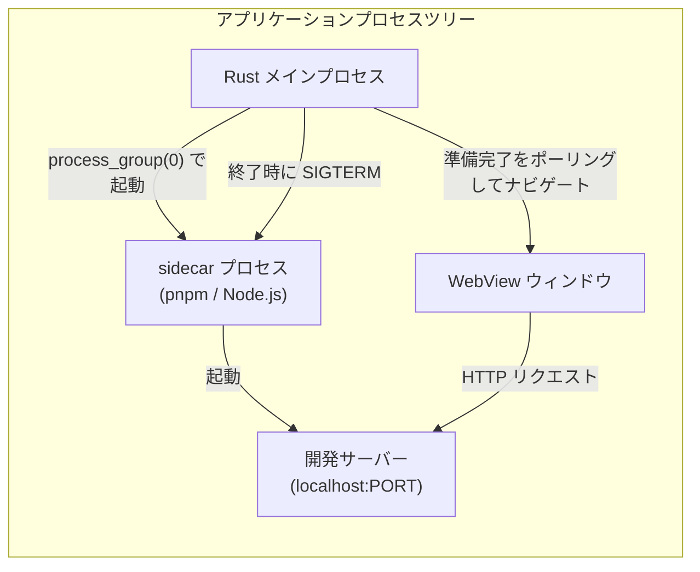
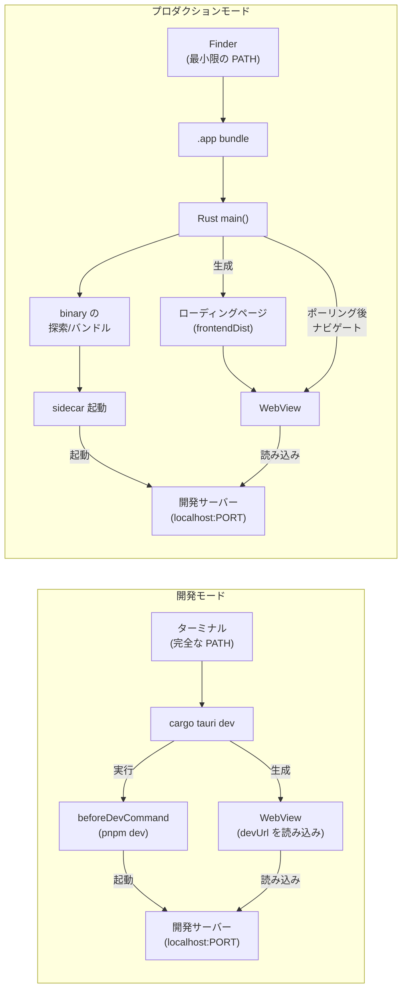
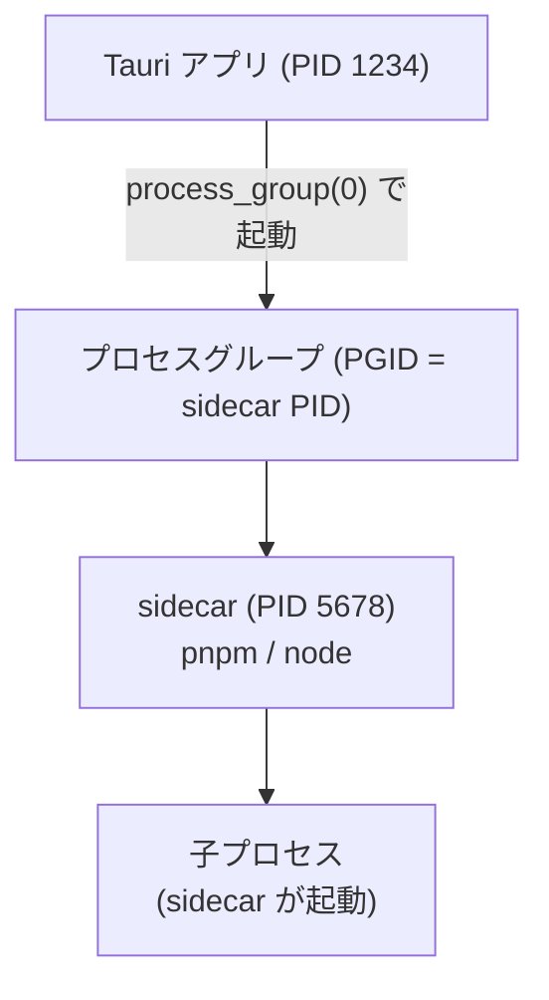

# アーキテクチャ概要

このセクションでは、Tauri v2 macOS ラッパーアプリケーションで使われるアーキテクチャパターンを扱う。基本的な考え方はシンプルである。Rust binary が WebView を管理し、必要に応じてバックグラウンドプロセスを起動する。しかし、これが実際にどう動作するか -- 特に開発モードとプロダクションモードの間で -- は、慎重な設計を要する。

## コア構造

すべての Tauri v2 アプリは3つのレイヤーを持つ:



**Rust コア**がすべてを管理する: ウィンドウ生成、メニュー処理、プロセス起動、シグナル処理、シャットダウン。**WebView** は薄いレンダリングレイヤーであり、Rust コアが指示する URL や HTML を表示するだけである。**フロントエンド**は単一のローディングページ HTML ファイルのように単純なものでよい。

## sidecar アプローチ

開発サーバー（ドキュメントサイト、プレビューツール）をラップするアプリでは、sidecar プロセスレイヤーが追加される:



Rust プロセスは sidecar を独自のプロセスグループ内で起動する。これはクリーンシャットダウンに不可欠である -- アプリ終了時に、個々の子プロセスを追跡する代わりにプロセスグループ全体にシグナルを送ることができる。

## 開発 vs プロダクション アーキテクチャ

開発モードとプロダクションモードではアーキテクチャが大きく異なる:



主な違い:

1. **開発モード**はサーバー起動を `beforeDevCommand` に委任し、`devUrl` から直接読み込む
2. **プロダクションモード**はすべてを自前で処理する必要がある: binary の探索/バンドル、プロセスの起動、ローディングページの表示、準備完了のポーリング、そしてナビゲーション

## 状態管理

Rust 側では、Tauri のマネージド状態システムを通じてアプリケーション状態を管理する:

```rust
struct AppState {
    sidecar: Arc<Mutex<Option<Sidecar>>>,
    pnpm_path: Option<PathBuf>,
    zoom: Mutex<f64>,
}

// アプリビルド時に登録
tauri::Builder::default()
    .manage(app_state)
    // ...
```

状態には、メニューイベントハンドラ、Tauri コマンド、シャットダウンハンドラから `app_handle.state::<AppState>()` 経由でアクセスする。

## プロセスツリー

実行中の Tauri ラッパーアプリは以下のプロセスツリーを持つ:



`process_group(0)` を使用すると、sidecar の PID をグループ ID とする新しいプロセスグループが作成される。シャットダウン時に `SIGTERM` を `-pid`（負の PID）に送ることでグループ全体にシグナルが届き、すべての子プロセスが確実にクリーンアップされる。

## セクションの内容

このセクションの各ページでは、それぞれのアーキテクチャパターンを詳しく解説する:

- **[sidecar パターン](/architecture/sidecar-pattern/)** -- 外部 binary のバンドルと管理
- **[ローディング画面](/architecture/loading-screen/)** -- バックグラウンド処理中に即座に UI を表示する手法
- **[プロセスライフサイクル](/architecture/process-lifecycle/)** -- ポートのクリーンアップ、シャットダウンシーケンス、シグナル処理
