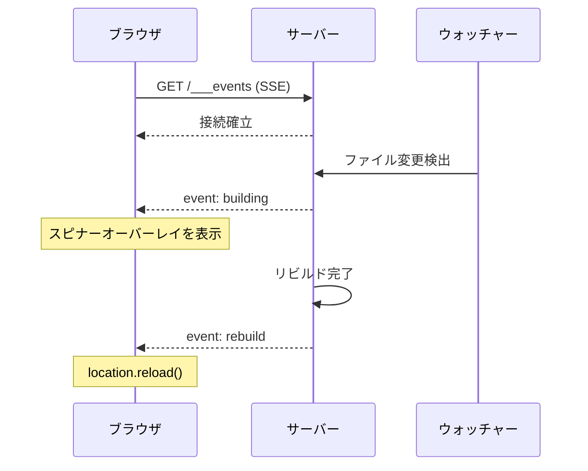

# SSE ベースのライブリロード

開発サーバーが HMR（Vite/webpack）ではなくフルリビルドを行う場合、カスタムのライブリロード機構が必要になる。Server-Sent Events (SSE) はシンプルかつ信頼性の高いアプローチである。サーバーが接続中のブラウザに `"building"` と `"rebuild"` イベントをプッシュし、ブラウザ側でスピナーオーバーレイの表示やページのリロードを行う。

## WebSocket ではなく SSE を使う理由

ライブリロードには WebSocket よりも SSE の方が適している。その理由は以下の通りである。

- **単方向で十分** -- サーバーがブラウザにリロードを指示するだけであり、ブラウザからメッセージを送る必要がない
- **自動再接続** -- `EventSource` は接続が切れた場合に自動的に再接続する
- **ライブラリ不要** -- ネイティブのブラウザ API であり、依存関係がない
- **サーバーコードがシンプル** -- レスポンスストリームに書き込むだけでよい

## アーキテクチャ



## サーバー実装

### SSE クライアント管理

`Set` を使用して、接続中のすべての SSE クライアントを追跡する。各クライアントは書き込み可能なレスポンスオブジェクトである。

```javascript
const sseClients = new Set();

function broadcast(event) {
  for (const res of sseClients) {
    res.write(`event: ${event}\ndata: {}\n\n`);
  }
}
```

### SSE エンドポイント

接続を維持し、クライアントを登録する `GET /___events` エンドポイントを作成する。

```javascript
app.get('/___events', (req, res) => {
  res.writeHead(200, {
    'Content-Type': 'text/event-stream',
    'Cache-Control': 'no-cache',
    Connection: 'keep-alive',
  });

  // Send initial connection event
  res.write('event: connected\ndata: {}\n\n');

  // Register this client
  sseClients.add(res);

  // Clean up on disconnect
  req.on('close', () => {
    sseClients.delete(res);
  });
});
```

### ビルドイベントのブロードキャスト

ファイルウォッチャーが変更を検出した場合は以下の手順で処理する。

1. `"building"` を即座にブロードキャスト（ブラウザがスピナーを表示）
2. ビルドを実行
3. 完了したら `"rebuild"` をブロードキャスト（ブラウザがリロード）

```javascript
async function onFileChange(changedPath) {
  // Tell all browsers a build is starting
  broadcast('building');

  try {
    await runBuild();
  } catch (err) {
    console.error('Build failed:', err);
  }

  // Broadcast rebuild regardless of success or failure.
  // On failure, the browser still needs to dismiss the spinner.
  // It will reload and show the error in the page.
  broadcast('rebuild');
}
```

<Warning>

ビルドが失敗した場合でも、必ず `"rebuild"` をブロードキャストすること。失敗時にスキップすると、スピナーオーバーレイが永遠に表示されたままとなり、開発者が手動でリロードしなければならなくなる。ビルド失敗の出力は、リロード後のページまたはターミナルで確認できる。

</Warning>

### リロードスクリプトの注入

HTML レスポンスをインターセプトし、`</body>` の前に SSE クライアントスクリプトを注入する。これにより、フロントエンドコードがリロード機構を意識する必要がなくなる。

```javascript
function injectReloadScript(html) {
  const script = `
<script>
(function() {
  var overlay = null;

  function showSpinner() {
    if (overlay) return;
    overlay = document.createElement('div');
    overlay.style.cssText =
      'position:fixed;inset:0;background:rgba(0,0,0,0.3);' +
      'display:flex;align-items:center;justify-content:center;z-index:99999';
    overlay.innerHTML = '<div style="color:white;font-size:24px">Rebuilding...</div>';
    document.body.appendChild(overlay);
  }

  function connect() {
    var es = new EventSource('/___events');

    es.addEventListener('building', function() {
      showSpinner();
    });

    es.addEventListener('rebuild', function() {
      location.reload();
    });

    es.onerror = function() {
      es.close();
      // Reconnect after a short delay
      setTimeout(connect, 1000);
    };
  }

  connect();
})();
</script>`;

  return html.replace('</body>', script + '</body>');
}
```

サーバーのレスポンス処理で以下のように使用する。

```javascript
// When serving HTML responses, inject the reload script
app.get('*', (req, res) => {
  const html = renderPage(req.path);
  res.type('html').send(injectReloadScript(html));
});
```

## 完全なサーバー例

以下は、SSE ライブリロードを備えた最小限の開発サーバーの完全な例である。

```javascript
import express from 'express';
import chokidar from 'chokidar';
import { execSync } from 'child_process';

const PORT = 32342;
const app = express();
const sseClients = new Set();

// SSE endpoint
app.get('/___events', (req, res) => {
  res.writeHead(200, {
    'Content-Type': 'text/event-stream',
    'Cache-Control': 'no-cache',
    Connection: 'keep-alive',
  });
  res.write('event: connected\ndata: {}\n\n');
  sseClients.add(res);
  req.on('close', () => sseClients.delete(res));
});

function broadcast(event) {
  for (const res of sseClients) {
    res.write(`event: ${event}\ndata: {}\n\n`);
  }
}

// Serve built files (with script injection for HTML)
app.use(express.static('./dist', {
  setHeaders: (res, filePath) => {
    // Static middleware doesn't let us modify body,
    // so HTML injection is handled in the fallback route
  }
}));

app.get('*', (req, res) => {
  // Serve index.html with injected reload script
  const fs = require('fs');
  let html = fs.readFileSync('./dist/index.html', 'utf-8');
  html = html.replace('</body>', `
<script>
(function() {
  var overlay = null;
  function showSpinner() {
    if (overlay) return;
    overlay = document.createElement('div');
    overlay.style.cssText = 'position:fixed;inset:0;background:rgba(0,0,0,0.3);display:flex;align-items:center;justify-content:center;z-index:99999';
    overlay.innerHTML = '<div style="color:white;font-size:24px">Rebuilding...</div>';
    document.body.appendChild(overlay);
  }
  var es = new EventSource('/___events');
  es.addEventListener('building', showSpinner);
  es.addEventListener('rebuild', function() { location.reload(); });
  es.onerror = function() { es.close(); setTimeout(function() { location.reload(); }, 2000); };
})();
</script>
</body>`);
  res.type('html').send(html);
});

// File watcher
let buildTimeout = null;
chokidar.watch('./src', { ignoreInitial: true }).on('all', () => {
  clearTimeout(buildTimeout);
  buildTimeout = setTimeout(() => {
    broadcast('building');
    try {
      execSync('pnpm build', { stdio: 'inherit' });
    } catch (e) {
      console.error('Build failed');
    }
    broadcast('rebuild');
  }, 200); // Debounce 200ms
});

app.listen(PORT, () => {
  console.log(`Dev server: http://localhost:${PORT}`);
});
```

## 主な設計判断

### 専用エンドポイントを使う理由

`___events`（アンダースコア3つのプレフィックス）という専用パスを使用することで、アプリケーションのルートとの競合を回避できる。アンダースコア3つの命名規則は、これがアプリケーションコードではなくインフラストラクチャであることを明確にする。

### クライアント管理に Set を使う理由

`Set` は SSE クライアントの管理に適したデータ構造である。

- 追加・削除が O(1)
- 自動的に重複を排除（各レスポンスオブジェクトは一意であるため実質的には不要だが）
- ブロードキャスト時のイテレーションが容易

### デバウンス

ファイルウォッチャーは、1回の保存に対して複数のイベントを発火することがある（エディタが一時ファイルを書き込み、リネームするなど）。短い遅延（100〜300ms）でデバウンスし、これらを1回のリビルドにまとめること。

<Tip>

ビルドが高速（1秒未満）な場合、スピナーの表示が一瞬すぎて気づかないことがある。ちらつきを避けるため、スピナーオーバーレイに最低表示時間として300msを設定することを検討するとよい。

</Tip>
