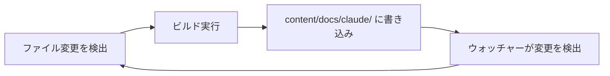

# ウォッチャーループの防止

開発サーバーで最もフラストレーションの溜まる問題の一つが、無限リビルドループである。ビルドがウォッチャーの監視対象ディレクトリにファイルを書き込み、それが新たなビルドをトリガーし、さらにファイルが書き込まれ、再びビルドがトリガーされ......という繰り返しが発生する。CPU 使用率が100%に跳ね上がり、ターミナルがビルド出力で埋め尽くされる。

## 問題

この問題は、ビルドが生成するコンテンツがソースコンテンツと同じ場所に配置される場合に発生する。典型的な例を以下に示す。

```
content/
  docs/
    getting-started.md    <-- ソース（手書き）
    api-reference.md      <-- ソース（手書き）
    claude/               <-- 生成物（ビルドが自動作成）
      index.md
      commands.md
```

ウォッチャーが `content/docs/` を監視していて、ビルドが `content/docs/claude/` にファイルを生成する場合、無限ループが発生する。



## 解決策：生成パスのフィルタリング

修正方法はシンプルである。ウォッチャーのコールバック内で、変更されたファイルが生成ディレクトリ内のものかどうかを確認し、該当する場合はリビルドをスキップする。

```javascript
import chokidar from 'chokidar';

const GENERATED_DIRS = [
  'content/docs/claude/',
  'content/docs/auto-generated/',
];

function isGeneratedPath(filePath) {
  return GENERATED_DIRS.some(dir => filePath.includes(dir));
}

const watcher = chokidar.watch('./content', {
  ignoreInitial: true,
});

watcher.on('all', (event, filePath) => {
  // Skip changes to generated content
  if (isGeneratedPath(filePath)) {
    return;
  }

  // Proceed with rebuild
  triggerRebuild();
});
```

## パスマッチングのパターン

### 単純な文字列マッチング

ほとんどの場合、パスに生成ディレクトリが含まれているかどうかを確認するだけで十分である。

```javascript
function isGeneratedPath(filePath) {
  // Normalize to forward slashes for cross-platform
  const normalized = filePath.replace(/\\/g, '/');
  return normalized.includes('content/docs/claude/');
}
```

### 複数の生成ディレクトリ

生成ディレクトリが複数ある場合は、配列を使用する。

```javascript
const GENERATED_PATTERNS = [
  'content/docs/claude/',
  'dist/',
  '.cache/',
  'node_modules/',
];

function isGeneratedPath(filePath) {
  const normalized = filePath.replace(/\\/g, '/');
  return GENERATED_PATTERNS.some(pattern => normalized.includes(pattern));
}
```

### chokidar の `ignored` オプションの使用

chokidar 自体にこれらのパスを無視するよう設定することもできる。ウォッチャーがファイルシステムイベントを登録すらしないため、わずかに効率的である。

```javascript
const watcher = chokidar.watch('./content', {
  ignoreInitial: true,
  ignored: [
    '**/content/docs/claude/**',
    '**/node_modules/**',
    '**/.git/**',
  ],
});
```

<Tip>

コールバック内でのフィルタリングよりも、chokidar の `ignored` オプションを優先すること。OS レベルでファイルシステムイベントのノイズを削減できるため、大規模プロジェクトではパフォーマンスが向上する。

</Tip>

## 実際の使用例

以下は、Claude Code のリソースからコンテンツの一部を生成しつつ、手動でのコンテンツ変更も監視するドキュメントサイトのウォッチャー設定例である。

```javascript
import chokidar from 'chokidar';

const WATCH_DIRS = ['./content', './src'];
const IGNORE_PATTERNS = [
  // Generated documentation from Claude Code resources
  'content/docs/claude/',
  // Build output
  'dist/',
  '.astro/',
  // Dependencies
  'node_modules/',
];

function shouldRebuild(filePath) {
  const normalized = filePath.replace(/\\/g, '/');
  return !IGNORE_PATTERNS.some(pattern => normalized.includes(pattern));
}

let debounceTimer = null;

const watcher = chokidar.watch(WATCH_DIRS, {
  ignoreInitial: true,
  ignored: [
    '**/node_modules/**',
    '**/.git/**',
  ],
});

watcher.on('all', (event, filePath) => {
  if (!shouldRebuild(filePath)) {
    // Log skipped paths during development to verify filtering works
    console.log(`[watcher] skipping generated: ${filePath}`);
    return;
  }

  clearTimeout(debounceTimer);
  debounceTimer = setTimeout(() => {
    console.log(`[watcher] rebuilding due to: ${filePath}`);
    triggerRebuild();
  }, 200);
});
```

## ループのデバッグ

無限ループが疑われる場合、ログを追加してどのファイルがリビルドをトリガーしているかを特定する。

```javascript
watcher.on('all', (event, filePath) => {
  console.log(`[watcher] ${event}: ${filePath}`);
  // ... rest of handler
});
```

出力で繰り返されるパターンを探す。同じ生成ファイルが何度も出現している場合、ループの原因が特定できたことになる。

<Warning>

ウォッチャーの無視設定の根拠として `.gitignore` を使用しないこと。この2つの関心事は関連しているが異なるものである。gitignore されているファイルを監視したい場合もあるし（ローカル設定ファイルなど）、git で追跡されているファイルを無視したい場合もある（コミットされた生成ドキュメントなど）。

</Warning>

## まとめ

| アプローチ | 利点 | 欠点 |
|----------|------|------|
| コールバック内でフィルタリング | ログの追加が容易、柔軟性が高い | ウォッチャーはイベントを受け取り続ける |
| chokidar の `ignored` | 効率的、ノイズが少ない | デバッグが困難（イベントが到達しない） |
| ディレクトリの分離 | 最もクリーンな分離 | プロジェクト構造に合わない場合がある |

最良の長期的な解決策は、生成コンテンツをソースコンテンツと明確に分離されたディレクトリに配置することである。しかし、それが不可能な場合は、ウォッチャーのコールバック内でのパスフィルタリングがシンプルかつ信頼性の高い解決策となる。
