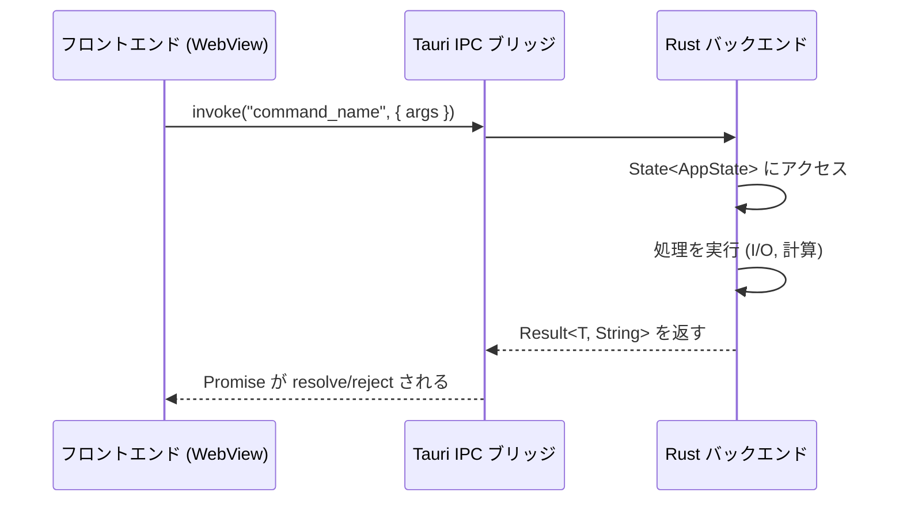

このセクションでは、Tauri v2 アプリケーション向けのフロントエンド統合パターンを扱う。フロントエンドはプラットフォームの WebView（macOS では WKWebView、Windows では WebView2）内で動作し、IPC コマンドを通じて Rust バックエンドと通信する。

## ここで扱う内容

### IPC コマンド

フロントエンドと Rust バックエンドの橋渡し。[IPC コマンド](/frontend/ipc-commands/)ページでは、コマンド登録、関数シグネチャ、State アクセス、エラーハンドリング、実際の例を使った非同期パターンを扱う。

### useEffect の落とし穴

Tauri の WebView に固有の、微妙だが深刻なパフォーマンスバグ。[useEffect の落とし穴](/frontend/use-effect-pitfall/)ページでは、`useLayoutEffect` による IPC 呼び出しが macOS のビーチボール（レインボースピナー）を引き起こす理由とその修正方法を解説する。

### Capabilities と権限

Tauri v2 はフロントエンドがアクセスできる内容を制御する Capabilities システムを使用する。[Capabilities](/frontend/capabilities/)ページでは、権限モデル、プラグインアクセス、セキュリティの考慮事項を扱う。

## IPC モデル

Tauri v2 はフロントエンドと Rust バックエンド間でメッセージパッシングアーキテクチャを使用する：



主な特徴：

- **デフォルトで非同期** -- `invoke()` は `Promise` を返す
- **JSON シリアライゼーション** -- 引数と戻り値は serde 経由でシリアライズされる
- **Rust 側は型安全** -- コマンドは型付きパラメータを持つ通常の Rust 関数である
- **文字列エラー** -- Tauri コマンドはエラーハンドリングに `Result<T, String>` を返す

## フロントエンドフレームワークの互換性

これらのパターンはどのフロントエンドフレームワークでも動作する。Tauri の `invoke()` API はフレームワーク非依存である：

```tsx
// React
import { invoke } from "@tauri-apps/api/core";

useEffect(() => {
  invoke("settings_get").then((settings) => {
    setSettings(settings);
  });
}, []);
```

```tsx
// Svelte
import { invoke } from "@tauri-apps/api/core";

onMount(async () => {
  const settings = await invoke("settings_get");
});
```

```tsx
// Vue
import { invoke } from "@tauri-apps/api/core";

onMounted(async () => {
  const settings = await invoke("settings_get");
});
```

## Rust からフロントエンドへのイベント

Rust バックエンドは `AppHandle::emit()` を使用してフロントエンドにイベントをプッシュできる：

```rust
// Rust side
app_handle.emit("messages:changed", payload)?;
```

```tsx
// Frontend side
import { listen } from "@tauri-apps/api/event";

const unlisten = await listen("messages:changed", (event) => {
  console.log("File changed:", event.payload.filename);
});

// Clean up on unmount
onCleanup(() => unlisten());
```

この双方向通信モデル（フロントエンドからバックエンドへは invoke、バックエンドからフロントエンドへは emit/listen）が、レスポンシブな Tauri アプリケーションを構築するための基盤である。
