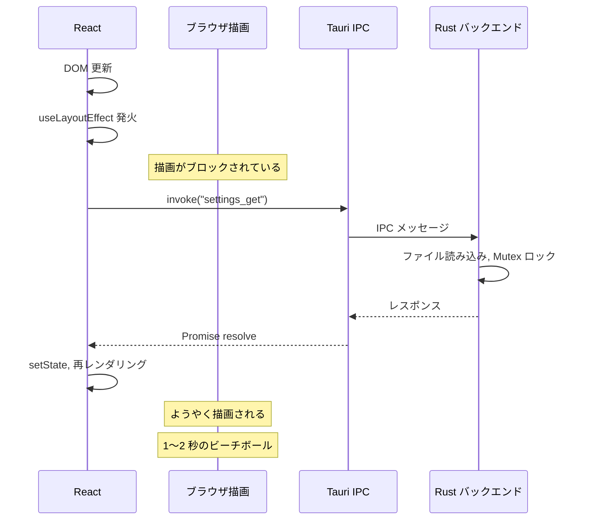

## 問題

`useLayoutEffect` を使用して Tauri IPC 呼び出し（`invoke()`）を行うと、macOS でアプリが 1〜2 秒間フリーズし、恐怖のレインボービーチボールスピナーが表示される。これは一貫して発生し、アプリが壊れているように感じさせる。

<Warning>

**Tauri IPC 呼び出しに `useLayoutEffect` を使用してはならない。** ブラウザの描画サイクルをブロックし、WebView で目に見えるフリーズを引き起こす。代わりに必ず `useEffect` を使用する。

</Warning>

## なぜこれが起こるのか

`useLayoutEffect` は **DOM の変更後、ブラウザの描画前に同期的に** 実行される。React は `useLayoutEffect` が完了するまでブラウザが描画しないことを保証する。

通常の Web アプリでは、ユーザーに見せる前に DOM 要素を測定するのに便利である。しかし Tauri では、`invoke()` は IPC ブリッジを通じて Rust バックエンドにメッセージを送り、処理して応答を返す。`invoke()` は Promise を返す（JavaScript の実行をブロックしない）が、`useLayoutEffect` が実行中であることがブラウザの描画を妨げる。

イベントの連鎖：

1. コンポーネントがレンダリングされ、DOM が更新される
2. `useLayoutEffect` が発火する（ブラウザの描画がブロックされる）
3. `invoke()` が Rust に IPC メッセージを送信する
4. Rust がリクエストを処理する（ファイル I/O、State アクセス）
5. IPC を通じてレスポンスが返ってくる
6. State 更新が再レンダリングをトリガーする
7. **ここでようやく** ブラウザが描画できる

ステップ 3〜6 の間、WebView はフリーズしている。macOS では、WKWebView がシステムレベルの「アプリケーション応答なし」インジケーター -- レインボースピナー -- をトリガーする。



## 修正前（壊れた状態）

```tsx
import { invoke } from "@tauri-apps/api/core";
import { useLayoutEffect, useState } from "react";

function SettingsPanel() {
  const [settings, setSettings] = useState(null);

  // BAD: useLayoutEffect blocks paint during IPC round-trip
  useLayoutEffect(() => {
    invoke("settings_get").then((result) => {
      setSettings(result);
    });
  }, []);

  return <div>{settings ? <Form data={settings} /> : <Loading />}</div>;
}
```

## 修正後

```tsx
import { invoke } from "@tauri-apps/api/core";
import { useEffect, useState } from "react";

function SettingsPanel() {
  const [settings, setSettings] = useState(null);

  // GOOD: useEffect runs after paint, no blocking
  useEffect(() => {
    invoke("settings_get").then((result) => {
      setSettings(result);
    });
  }, []);

  return <div>{settings ? <Form data={settings} /> : <Loading />}</div>;
}
```

変更箇所は `useLayoutEffect` から `useEffect` への変更のみである。動作は同一であるが、DOM 更新後すぐにブラウザが描画でき、IPC 呼び出しがバックグラウンドで完了する間にローディング状態を表示できる。

## いつどちらを使うか

### useEffect（ほぼ常に）

以下の場合に `useEffect` を使用する：

- **すべての Tauri IPC 呼び出し**（`invoke()`、`listen()`）
- データフェッチ
- サブスクリプションとイベントリスナー
- 描画をブロックする必要のないあらゆる副作用

### useLayoutEffect（まれな特定のケース）

以下の場合にのみ `useLayoutEffect` を使用する：

- **同期的な DOM 測定**（描画前に要素のサイズを読み取る）
- **視覚的なちらつきの防止**（例：測定した位置に基づいてツールチップを再配置する）

```tsx
// Legitimate useLayoutEffect usage:
// measuring DOM before paint to prevent flicker
useLayoutEffect(() => {
  const rect = tooltipRef.current.getBoundingClientRect();
  setPosition({ x: rect.left, y: rect.top - 40 });
}, [tooltipRef]);
```

<Tip>

シンプルなルール：Effect 内のコードが `invoke()` やその他の非同期 IPC 関数を呼び出す場合、それは `useEffect` に入れなければならず、`useLayoutEffect` には決して入れてはならない。

</Tip>

## 他のフレームワークでも同様

これは React 固有の問題ではない。描画前にコードを同期的に実行するフレームワークパターンは、Tauri IPC で同じ問題を引き起こす：

- **Svelte**: IPC 呼び出しに `beforeUpdate` を使用しない。代わりに `onMount` を使用する
- **Vue**: IPC 呼び出しに `onBeforeUpdate` を使用しない。`onMounted` を使用する
- **Solid**: IPC に `createRenderEffect` を使用しない。`createEffect` を使用する

根本的な原因は同じである：Rust バックエンドを通じた IPC のラウンドトリップを待つ間、WebView の描画サイクルをブロックしている。

## 重要なポイント

1. **`useLayoutEffect` + `invoke()` = ビーチボール** -- これはパフォーマンス最適化ではなく厳守すべきルールである
2. **IPC 呼び出しには常に `useEffect` を使用する** -- 描画前のわずかな遅延はユーザーには認識できない
3. **`useLayoutEffect` は同期的な DOM 測定専用** -- 非同期操作を含めてはならない
4. **これはすべてのフレームワークに影響する** -- React だけでなく、IPC 呼び出しを含むあらゆる描画前フックがフリーズを引き起こす
