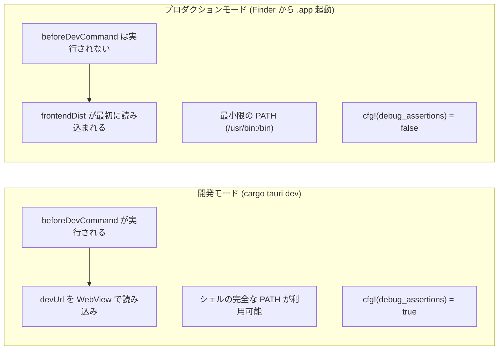

# 開発モード vs プロダクションモード

Tauri 開発において最も重要な概念は、**開発モード**と**プロダクションモード**の違いである。Tauri デスクトップアプリ固有のバグは、ほぼすべてこの区別に起因する。

## 2つのモードの概観



| 観点 | 開発モード | プロダクションモード |
|--------|----------|-----------------|
| 起動方法 | ターミナルで `cargo tauri dev` | Finder で `.app` をダブルクリック |
| フロントエンドソース | `devUrl`（ライブ開発サーバー） | `frontendDist`（バンドルされた静的ファイル） |
| シェル環境 | シェルプロファイルの完全な PATH | 最小限の PATH（`/usr/bin:/bin:/usr/sbin:/sbin`） |
| Node.js/pnpm は使えるか？ | はい（PATH 経由） | いいえ。明示的に探索またはバンドルしない限り使えない |
| Rust デバッグフラグ | `cfg!(debug_assertions)` が true | `cfg!(debug_assertions)` が false |
| `beforeDevCommand` | 自動的に実行される | 実行されない |
| ホットリロード | 通常あり（Vite 等を通じて） | なし |

## 開発モード: 動作の仕組み

`cargo tauri dev` を実行すると、Tauri は以下の処理を行う:

1. `beforeDevCommand` を実行する（例: Vite 開発サーバーの起動）
2. デバッグアサーションを有効にして Rust binary をコンパイル・実行する
3. WebView が `devUrl`（開発サーバーの URL）から読み込みを行う

典型的な開発モード設定は以下のとおりである:

```json
{
  "build": {
    "beforeDevCommand": "cd ../../doc && pnpm dev",
    "devUrl": "http://localhost:32342/"
  }
}
```

ターミナル内で実行するため、シェルの完全な環境 -- Homebrew のパス、nvm、nodenv、pnpm など -- がすべて利用可能であり、すべてがシームレスに動作する。

## プロダクションモード: 何が変わるか

ユーザー（あるいは自分自身）が `.app` bundle を Finder から起動すると、状況は根本的に異なる:

1. **`beforeDevCommand` は実行されない。** 開発サーバーは自動起動しない。
2. **PATH は最小限。** macOS の Finder から起動されたアプリは `/usr/bin:/bin:/usr/sbin:/sbin` のみを持つ。Homebrew のツール、nvm で管理された Node.js、グローバルインストールされた pnpm はこの環境には存在しない。
3. **`frontendDist` が最初のコンテンツ。** WebView はバンドルされた静的ファイルから読み込む。

<Warning>

これは Tauri 開発における混乱の最大の原因である。`cargo tauri dev` では完璧に動作するのに、Finder から起動するとクラッシュしたり白い画面が表示されたりする場合、原因はほぼ確実にプロダクション環境でのツール不足または PATH の問題である。

</Warning>

## Rust でのモード検出

コンパイル時定数 `cfg!(debug_assertions)` を使用して、開発とプロダクションの動作を分岐させる:

```rust
const IS_DEV: bool = cfg!(debug_assertions);

fn main() {
    if IS_DEV {
        // 開発モード: beforeDevCommand がサーバーを処理する
        // こちら側で何かを起動する必要はない
    } else {
        // プロダクションモード: 自前でサーバーを起動する必要がある
        let pnpm_path = find_pnpm();
        spawn_sidecar(&pnpm_path);
    }
}
```

これはコンパイル時定数であり、ランタイムチェックではない。コンパイラがデッドブランチを完全に除去するため、ランタイムコストは一切ない。

### 実例: 条件付き sidecar 起動

ドキュメントサイトをラップする実際のアプリから抽出した例:

```rust
const IS_DEV: bool = cfg!(debug_assertions);

fn main() {
    let found_pnpm = if IS_DEV { None } else { find_pnpm() };

    let sidecar: Option<Sidecar> = if IS_DEV {
        None  // beforeDevCommand が処理する
    } else {
        kill_port();
        match found_pnpm {
            Some(ref pnpm_path) => {
                Some(spawn_sidecar(pnpm_path))
            }
            None => {
                panic!("pnpm not found. Install pnpm globally.");
            }
        }
    };

    // ... 残りのアプリセットアップ
}
```

開発モードでは、Tauri の `beforeDevCommand` がすでに開発サーバーを起動しているため、Rust コードは何もしない。プロダクションモードでは、Rust コードが既知の絶対パスで pnpm を探し、自前でサーバーを起動する必要がある。

## プロダクションで PATH が壊れる理由

ターミナルからアプリを起動すると、シェルの PATH を継承する:

```
/opt/homebrew/bin:/usr/local/bin:/usr/bin:/bin:...
```

Finder から起動すると、PATH は以下のようになる:

```
/usr/bin:/bin:/usr/sbin:/sbin
```

これは以下を意味する:

- `pnpm` -- 見つからない（Homebrew または npm 経由でインストール）
- `node` -- 見つからない（nvm、nodenv、または Homebrew 経由でインストール）
- `npm` -- 見つからない
- `git` -- 見つかる場合と見つからない場合がある（Xcode コマンドラインツールが `/usr/bin` にインストールする）

### 解決策: 絶対パス

プロダクションコードでは PATH 解決に依存してはならない。絶対パスを使用する:

```rust
fn find_pnpm() -> Option<PathBuf> {
    let candidates = [
        "/opt/homebrew/bin/pnpm",    // Apple Silicon Homebrew
        "/usr/local/bin/pnpm",       // Intel Homebrew
    ];
    for p in &candidates {
        let path = PathBuf::from(p);
        if path.exists() {
            return Some(path);
        }
    }

    // 最後の手段: which pnpm（ターミナルからのみ動作）
    if let Ok(output) = Command::new("/usr/bin/which").arg("pnpm").output() {
        let path_str = String::from_utf8_lossy(&output.stdout)
            .trim().to_string();
        if !path_str.is_empty() {
            let path = PathBuf::from(&path_str);
            if path.exists() {
                return Some(path);
            }
        }
    }

    None
}
```

<Tip>

完全に自己完結したアプリにするには、binary（Node.js など）を Tauri sidecar として `externalBin` でバンドルする。これによりシステム依存を完全に排除できる。詳細は [sidecar パターン](/architecture/sidecar-pattern/)のページを参照のこと。

</Tip>

## 設定の比較: 開発 vs プロダクション

### ラッパーアプリ（システムの pnpm に依存）

```json
{
  "build": {
    "frontendDist": "./frontend",
    "beforeDevCommand": "cd ../../doc && pnpm dev",
    "devUrl": "http://localhost:32342/"
  }
}
```

- **開発**: `beforeDevCommand` が doc ディレクトリで `pnpm dev` を実行する。WebView は `devUrl` から読み込む。
- **プロダクション**: `frontendDist` がローディングページを提供する。Rust コードが pnpm を探して起動する。

### 自己完結型アプリ（Vite ビルドフロントエンド）

```json
{
  "build": {
    "beforeDevCommand": "pnpm exec vite --config vite.config.ts",
    "beforeBuildCommand": "pnpm exec vite build --config vite.config.ts",
    "devUrl": "http://localhost:37461",
    "frontendDist": "./dist-renderer"
  }
}
```

- **開発**: Vite 開発サーバーが起動し、WebView は `devUrl` から HMR 付きで読み込む。
- **プロダクション**: `beforeBuildCommand` がビルド済みフロントエンドを `dist-renderer` に生成する。WebView はそれらの静的ファイルから直接読み込む。ランタイムにサーバーは不要。

### バンドル済み sidecar アプリ

```json
{
  "build": {
    "frontendDist": "./frontend"
  },
  "bundle": {
    "externalBin": ["binaries/node"]
  }
}
```

- **開発・プロダクション共通**: `beforeDevCommand` は一切ない。Rust コードが常にバンドルされた Node.js binary を起動する。サーバー起動中は `frontendDist` のローディングページが表示される。

## ウィンドウ生成パターン

開発/プロダクションの分岐があるため、各モードでウィンドウの生成方法が異なる:

```rust
if IS_DEV {
    // 開発モード: beforeDevCommand によりサーバーはすでに起動済み
    let url: tauri::Url = server_url().parse().unwrap();
    WebviewWindowBuilder::new(app, "main", WebviewUrl::External(url))
        .title("My App")
        .inner_size(1200.0, 800.0)
        .build()?;
} else {
    // プロダクション: ローディングページを即座に表示し、準備完了後にナビゲート
    WebviewWindowBuilder::new(app, "main", WebviewUrl::default())
        .title("My App")
        .inner_size(1200.0, 800.0)
        .build()?;

    let handle = app.handle().clone();
    thread::spawn(move || {
        wait_for_ready(Duration::from_secs(120));
        if let Some(w) = handle.get_webview_window("main") {
            let url: tauri::Url = server_url().parse().unwrap();
            let _ = w.navigate(url);
        }
    });
}
```

開発モードでは、ウィンドウは開発サーバーの URL を直接開く。プロダクションモードでは、ローディングページ（`frontendDist` から）で開き、バックグラウンドスレッドが sidecar サーバーの準備完了までポーリングし、その後ナビゲートする。

<Note>

ローディング用 HTML ページを含む完全なパターンについては、[ローディング画面](/architecture/loading-screen/)ページを参照のこと。

</Note>
