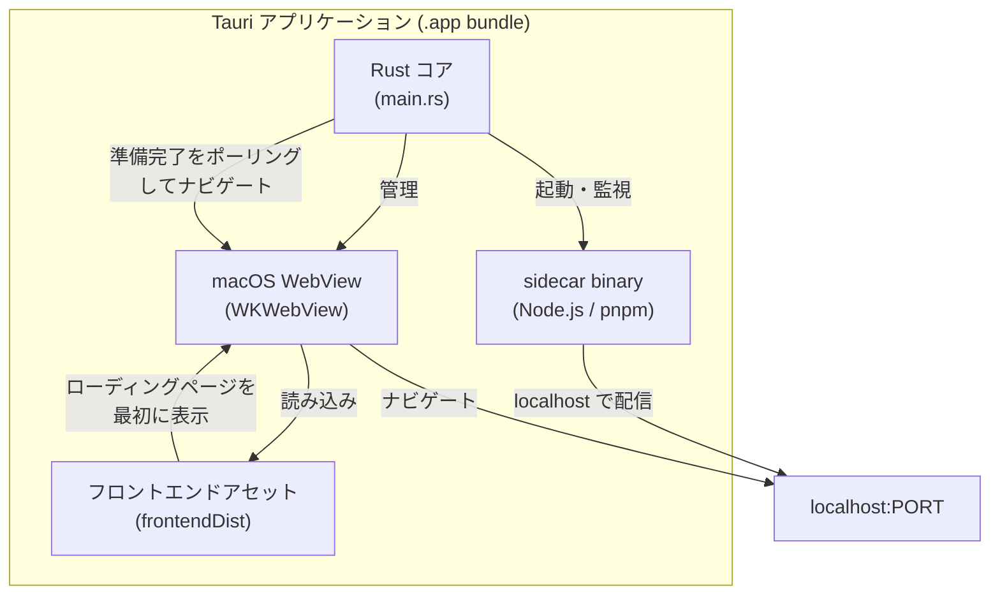

# 概要

[Takazudo](https://x.com/Takazudo) の個人的な開発メモ。Tauri 公式ドキュメントではない。
自分用のリファレンスと AI コーディング支援のために書かれたもの。

このサイトは、Tauri v2 で **macOS ラッパーアプリケーション** を構築するための実践的なパターンをまとめたものである。対象とするのは、Web フロントエンドを薄くネイティブでラップし、Rust がプロセス管理・システム連携・ライフサイクル制御を担うタイプのデスクトップアプリだ。

## 本ドキュメントの対象範囲

ここで取り上げるのは、実際のプロダクションアプリから抽出したパターンに基づく以下のトピックである:

- **プロジェクトセットアップ** -- Cargo.toml、tauri.conf.json、capabilities、ディレクトリ構成
- **開発モードとプロダクションモード** -- ほとんどのアーキテクチャ上の判断を左右する根本的な違い
- **sidecar プロセス** -- Node.js などの binary をアプリにバンドルして管理する方法
- **ローディング画面** -- バックグラウンドプロセスの起動中に即座に UI を表示する手法
- **プロセスライフサイクル** -- ポートのクリーンアップ、シグナル処理、macOS でのクリーンシャットダウン

## ハイレベルアーキテクチャ

典型的な Tauri v2 ラッパーアプリは以下のような構成を持つ:

## 2つのアプリパターン

ここで文書化するアプリは2つのパターンに分類される:

### パターン1: システム依存型ラッパー

`pnpm` などのツールがシステムにインストールされていることを前提とするパターンである。既知のパス（`/opt/homebrew/bin/pnpm`、`/usr/local/bin/pnpm`）でツールを探し、子プロセスとして起動する。セットアップは簡単だが、ユーザーが適切なツールをインストールしている必要がある。

### パターン2: バンドル済み sidecar

スタンドアロン binary（Node.js ランタイムなど）を Tauri の `externalBin` 機能を使って `.app` bundle 内にバンドルするパターンである。完全に自己完結しておりシステム依存がないが、ターゲットプラットフォーム向けの binary を取得するためのダウンロード/ビルド手順が必要となる。

<Tip>

パターン2（バンドル済み sidecar）のほうが配布には堅牢である。パターン1は、ユーザーが開発環境を持っていることを前提にできる開発者ツールに適している。

</Tip>

## 重要な知見: 開発モード vs プロダクションモード

Tauri 開発において最も重要な概念は、開発モードとプロダクションモードの違いである。開発モードでは、アプリはソースから実行され、シェル環境にフルアクセスできる。プロダクションモードでは、スタンドアロンの `.app` bundle として Finder から起動され、最小限の PATH しか持たない。ほぼすべてのアーキテクチャ上の判断がこの違いから導かれる。

この点を完全に理解するには、次の[開発モード vs プロダクションモード](/getting-started/dev-vs-production/)ページを読んでほしい。

## 前提条件

これらのパターンを実践するには、以下が必要である:

- **Rust**（stable ツールチェイン）と `cargo`
- **Tauri CLI v2**: `cargo install tauri-cli` または `cargo binstall tauri-cli`
- **Node.js と pnpm**（フロントエンド開発および sidecar パターン用）
- **macOS**（これらのパターンは macOS に特化しているが、Tauri 自体はクロスプラットフォームである）
