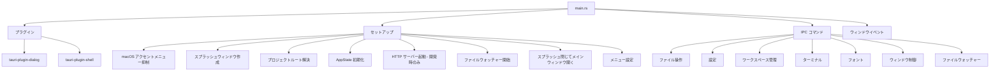

# テキストエディタアプリ

このレシピでは、Tauri で構築されたフル機能テキストエディタのアーキテクチャを解説する。[ドキュメントビューアー](./doc-viewer-app)が開発サーバーの薄いラッパーであるのとは異なり、このアプリは Vite + React フロントエンドを持ち、ファイル操作、ターミナル管理、ファイルウォッチャー、ワークスペース管理のための豊富な Rust IPC コマンドを備えている。

## アーキテクチャ概要



## モジュール構成

Rust コードは各関心事ごとにモジュールに分割されている。

```
src/
  main.rs              # エントリーポイント、セットアップ、プラグイン登録
  state.rs             # AppState 定義
  commands/
    files.rs           # ファイルの読み書き・一覧の IPC コマンド
    settings.rs        # 設定の取得・保存
    workspace.rs       # ワークスペース管理
    terminal.rs        # PTY ターミナルの起動
    watchers.rs        # ファイルシステムウォッチャー
    fonts.rs           # フォント一覧
    window.rs          # ウィンドウの透過度制御
  helpers/             # 共有ユーティリティ
  http_server.rs       # Axum REST サーバー（開発モード専用）
  native/
    window.rs          # ウィンドウ作成（スプラッシュ＋メイン）
    menu.rs            # アプリケーションメニュー
    dialog.rs          # ネイティブファイル/ディレクトリダイアログ
```

## プラグインの使用

このアプリは2つの Tauri プラグインを使用する。

```rust
tauri::Builder::default()
    .plugin(tauri_plugin_dialog::init())
    .plugin(tauri_plugin_shell::init())
```

- **tauri-plugin-dialog** -- ネイティブのファイルオープン/保存ダイアログおよびディレクトリピッカー
- **tauri-plugin-shell** -- シェルコマンドの実行（外部エディタでファイルを開く場合に使用）

<Note>

Tauri v2 では、Tauri v1 に組み込まれていた多くの機能が個別のプラグインに分離されている。OS レベルの機能が必要な場合は、[Tauri プラグイン一覧](https://v2.tauri.app/plugin/)を確認すること。

</Note>

## Arc による AppState の共有

`AppState` は HTTP サーバーとの共有のために `Arc` でラップされている。

```rust
// Initialize app state (Arc-wrapped for sharing with HTTP server)
let app_state = Arc::new(AppState::new(project_root));
let http_state = app_state.clone();
app.manage(app_state);
```

`AppState` 内部では、個々のフィールドが内部可変性のために `Mutex` を使用する。

```rust
// Conceptual structure (simplified)
pub struct AppState {
    pub project_root: Mutex<String>,
    pub settings: Mutex<Settings>,
    pub watchers: Mutex<HashMap<String, WatcherHandle>>,
    // ... more fields
}
```

<Tip>

構造体全体に対して1つの `Mutex` を使うのではなく、各フィールドに個別に `Mutex` を使用すること。これにより、異なるフィールドへの同時アクセスが可能になる。構造体全体をロックすると、長時間のファイル操作が設定へのアクセスをブロックしてしまう。

</Tip>

## スプラッシュスクリーンフロー

アプリは即座にスプラッシュスクリーンを表示し、初期化が完了したらメインウィンドウに置き換える。

```rust
.setup(|app| {
    // Show splash immediately (non-fatal if it fails)
    if let Err(e) = native::window::create_splash_window(app.handle()) {
        eprintln!("Failed to create splash window: {e}");
    }

    // ... initialization work (resolve root, create state, start watchers) ...

    // Replace splash with main window
    native::window::close_splash_window(app.handle());
    native::window::create_main_window(app.handle())?;

    Ok(())
})
```

このパターンにより、アプリがファイルウォッチャーの初期化、設定の読み込み、その他の起動作業を行っている間、ユーザーには空白の画面ではなく何かが即座に表示される。

## IPC コマンドの登録

アプリはカテゴリ別に整理された多数の IPC コマンドを登録する。

```rust
.invoke_handler(tauri::generate_handler![
    // File operations
    commands::files::messages_list,
    commands::files::messages_read,
    commands::files::messages_write,
    commands::files::messages_delete,
    commands::files::messages_create,
    commands::files::pins_list,
    commands::files::pins_read,
    commands::files::pins_write,
    commands::files::pins_delete,
    commands::files::draft_read,
    commands::files::draft_write,
    commands::files::draft_clear,
    // ... more file commands ...

    // Settings
    commands::settings::settings_get,
    commands::settings::settings_save,

    // Workspace
    commands::workspace::workspace_get_dir,
    commands::workspace::workspace_set_dir,
    commands::workspace::workspace_list_all,
    commands::workspace::workspace_switch,

    // Terminal
    commands::terminal::terminal_spawn,
    commands::terminal::terminal_write,
    commands::terminal::terminal_resize,
    commands::terminal::terminal_kill,

    // Window control
    commands::window::set_window_opacity,

    // Native dialog
    native::dialog::open_directory,
])
```

<Note>

各コマンドは `generate_handler![]` に個別にリストする必要がある。モジュール全体を一括で登録する方法はない。保守性のため、コメントでリストを整理すること。

</Note>

## ファイルウォッチャー

アプリはファイルシステムの外部変更を監視し、フロントエンドに通知する。

```rust
// Start file watchers for the initial workspace
let state_ref = app.state::<Arc<AppState>>();
commands::watchers::start_messages_watcher(&state_ref, app.handle());
commands::watchers::start_draft_watcher(&state_ref, app.handle());
```

ファイルウォッチャーは `setup()` 中に開始され、ファイルが変更された際にフロントエンドにイベントを発行する。これにより、外部ツール（別のエディタや git 操作など）によってファイルが変更された際に、UI がリアルタイムで更新される。

## HTTP REST サーバー（開発モード）

開発モードでは、Tauri アプリと並行して Axum HTTP サーバーを実行する。これは外部ツールからテストやオートメーションに使用できる REST API を提供する。

```rust
// Start REST adapter (axum HTTP server on port 3001) -- dev only
if cfg!(debug_assertions) {
    tauri::async_runtime::spawn(async move {
        http_server::start(http_state, 3001).await;
    });
}
```

HTTP サーバーは Tauri アプリと同じ `Arc<AppState>` を共有しているため、同じデータにアクセスし変更できる。これは以下の用途に有用である。

- WebView を経由せずに IPC コマンドをテスト
- 外部開発ツールとの連携
- 状態変更のデバッグ

<Tip>

`tauri::async_runtime::spawn` は内部的に Tokio を使用している。これらのスポーンされたタスク内で、Axum のような任意の非同期 Rust ライブラリを使用できる。

</Tip>

## macOS 長押し抑制

macOS では、キーを長押しするとキーリピートの代わりにアクセント文字ピッカーのポップアップが表示される。テキストエディタではこれは望ましくない。アプリはこれをプログラム的に抑制する。

```rust
#[cfg(target_os = "macos")]
{
    use objc2_foundation::{NSUserDefaults, NSString};
    let defaults = NSUserDefaults::standardUserDefaults();
    unsafe {
        let key = NSString::from_str("ApplePressAndHoldEnabled");
        defaults.setBool_forKey(false, &key);
    }
}
```

これはアプリのプロセスに対して `ApplePressAndHoldEnabled` ユーザーデフォルトを `false` に設定する。このアプリのみに影響し、システム上の他のアプリには影響しない。

<Warning>

これは `unsafe` コードとプラットフォーム固有の API を使用する。他のプラットフォームでもコンパイルできるよう、`#[cfg(target_os = "macos")]` でガードすること。`objc2_foundation` クレートを `Cargo.toml` に追加する必要がある。

</Warning>

## プロセスクリーンアップ

アプリはメインウィンドウが破棄された際にターミナル PTY プロセスをクリーンアップする。

```rust
.on_window_event(|window, event| {
    if let tauri::WindowEvent::Destroyed = event {
        if window.label() == "main" {
            if let Some(state) = window.try_state::<Arc<AppState>>() {
                commands::terminal::kill_all_ptys(&state);
            }
        }
    }
})
```

## プロジェクトルートの解決

アプリは開発モードと本番モードでプロジェクトルートを異なる方法で解決する。

```rust
fn resolve_project_root() -> String {
    // Dev mode: repo root (parent of tauri-app/)
    if cfg!(debug_assertions) {
        return std::path::Path::new(env!("CARGO_MANIFEST_DIR"))
            .parent()
            .unwrap()
            .to_string_lossy()
            .to_string();
    }

    // Production: derive app name from .app bundle path
    // e.g., /Applications/ztoffice.app/Contents/MacOS/zudotext
    //        -> app_name = "ztoffice"
    let app_name = std::env::current_exe()
        .ok()
        .and_then(|exe| {
            exe.ancestors()
                .find(|p| p.extension().map(|ext| ext == "app").unwrap_or(false))
                .and_then(|app_dir| {
                    app_dir.file_stem()
                        .map(|s| s.to_string_lossy().to_string())
                })
        })
        .unwrap_or_else(|| "default".to_string());

    // Check per-app config file
    let home = dirs::home_dir().expect("could not determine home directory");
    let config_path = home
        .join(".config/zudotext")
        .join(&app_name)
        .join("config.json");

    if let Ok(content) = std::fs::read_to_string(&config_path) {
        if let Ok(config) = serde_json::from_str::<serde_json::Value>(&content) {
            if let Some(workspace) = config["workspace"].as_str() {
                if std::path::Path::new(workspace).exists() {
                    return workspace.to_string();
                }
            }
        }
    }

    // Default workspace
    let default_dir = home.join("Documents/zudo-text").join(&app_name);
    std::fs::create_dir_all(&default_dir).ok();
    default_dir.to_string_lossy().to_string()
}
```

この処理は、アプリが複数のバリアントとしてビルドできるため特に興味深い（[マルチコンフィグ](./multi-config)を参照）。各バリアントは `.app` バンドル名から導出された独自のワークスペースディレクトリを持つ。

## 設定ファイル

対応する `tauri.conf.json` は以下の通りである。

```json
{
  "productName": "zudotext",
  "version": "0.1.0",
  "identifier": "com.takazudo.zudotext",
  "build": {
    "beforeDevCommand": "pnpm exec vite --config vite.config.ts",
    "beforeBuildCommand": "pnpm exec vite build --config vite.config.ts",
    "devUrl": "http://localhost:37461",
    "frontendDist": "./dist-renderer"
  },
  "app": {
    "macOSPrivateApi": true,
    "windows": [],
    "security": {
      "csp": null
    }
  },
  "bundle": {
    "active": true,
    "targets": "all",
    "category": "DeveloperTool",
    "macOS": {
      "minimumSystemVersion": "10.15"
    }
  }
}
```

ポイント：

- **`macOSPrivateApi: true`** -- プライベート macOS API を有効化（ウィンドウの透過度/透明度制御に必要）
- **`windows: []`** -- ウィンドウはプログラム的に作成（スプラッシュ、次にメイン）
- **明示的な Vite 設定** -- `--config vite.config.ts` により、CWD に関係なく正しい設定が使用される
- **`frontendDist: "./dist-renderer"`** -- Vite のビルド出力ディレクトリ
