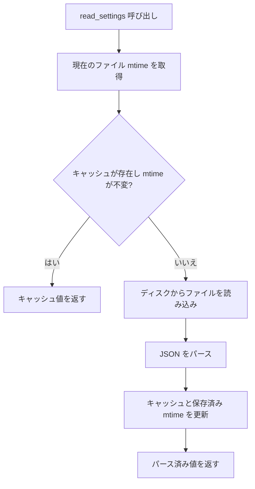

## 問題

Tauri アプリは多くの IPC 呼び出しで設定ファイル（JSON、TOML など）を読み込むことが多い。毎回ディスクから読み込むのは無駄であるが、単純なインメモリキャッシュでは、ユーザーがテキストエディタや別のアプリケーションで外部からファイルを編集した場合に正しく動作しない。

解決策は **mtime ベースのキャッシュ無効化** である。キャッシュデータと共にファイルの最終更新時刻を保存し、各読み取り時に比較する。mtime が変更されていれば、ディスクから再読み込みする。

## AppState フィールド

`AppState` に 2 つのフィールドを追加する：

```rust
pub struct AppState {
    /// Cached settings JSON to avoid re-reading from disk on every operation.
    pub settings_cache: Mutex<Option<serde_json::Value>>,
    /// Last-known mtime (ms since UNIX epoch) of the settings file, used to
    /// invalidate `settings_cache` when the file is modified externally.
    pub settings_mtime: Mutex<u64>,
    // ... other fields
}
```

両方を空/ゼロで初期化する：

```rust
impl AppState {
    pub fn new(project_root: String) -> Self {
        Self {
            settings_cache: Mutex::new(None),
            settings_mtime: Mutex::new(0),
            // ...
        }
    }
}
```

## キャッシュ付き読み込み

`read_settings` 関数はディスク上の mtime と保存された mtime を比較する。一致しキャッシュが存在する場合はキャッシュ値を返す。それ以外の場合はディスクから再読み込みし、キャッシュと保存された mtime の両方を更新する。

```rust
use std::fs;
use std::path::Path;

pub(crate) fn read_settings(
    project_root: &str,
    state: &AppState,
) -> Option<serde_json::Value> {
    let settings_path = Path::new(project_root)
        .join(".zudotext.settings.json");

    // Check whether the on-disk file has changed since we last cached it.
    let current_mtime = mtime_ms(&settings_path);
    let stored_mtime = state.settings_mtime
        .lock().ok()
        .map(|m| *m)
        .unwrap_or(0);

    let mut cache = state.settings_cache.lock().ok()?;

    // If cached and mtime unchanged, return the cached value.
    if let Some(ref cached) = *cache {
        if current_mtime == stored_mtime {
            return Some(cached.clone());
        }
    }

    // Cache miss or mtime changed -- re-read from disk.
    let content = fs::read_to_string(&settings_path).ok()?;
    let value: serde_json::Value =
        serde_json::from_str(&content).ok()?;
    *cache = Some(value.clone());
    if let Ok(mut m) = state.settings_mtime.lock() {
        *m = current_mtime;
    }
    Some(value)
}
```

<Note>

`mtime_ms` ヘルパーは、ファイルの変更時刻を UNIX エポックからのミリ秒として返す。ミリ秒精度を使用することで、同じ秒内に発生する高速な編集を見逃す可能性を低減する。

</Note>

## フローダイアグラム



## キャッシュ更新付き書き込み

アプリが設定を書き込む際は、キャッシュを更新し新しい mtime を即座に記録する。これにより、次の `read_settings` 呼び出しが直前に書き込んだファイルを再読み込みすることを防ぐ：

```rust
pub(crate) fn save_settings(
    project_root: &str,
    settings: &serde_json::Value,
    state: &AppState,
) -> bool {
    let settings_path = Path::new(project_root)
        .join(".zudotext.settings.json");

    match serde_json::to_string_pretty(settings) {
        Ok(json) => {
            let ok = fs::write(&settings_path, json).is_ok();
            if ok {
                // Update cache
                if let Ok(mut cache) = state.settings_cache.lock() {
                    *cache = Some(settings.clone());
                }
                // Record the new mtime so read_settings won't
                // re-read immediately.
                let new_mtime = mtime_ms(&settings_path);
                if let Ok(mut m) = state.settings_mtime.lock() {
                    *m = new_mtime;
                }
            }
            ok
        }
        Err(_) => false,
    }
}
```

<Tip>

保存された mtime の更新は常にファイル書き込みの**後**に行う。ファイルシステムは書き込み中に mtime を割り当てるため、正しい値を取得するにはそれを読み戻す必要がある。

</Tip>

## Tauri コマンドラッパー

Tauri コマンドはこれらの関数の薄いラッパーである：

```rust
#[tauri::command]
pub fn settings_get(
    state: State<'_, Arc<AppState>>,
) -> Option<serde_json::Value> {
    let root = state
        .project_root
        .lock()
        .map_err(|e| format!("Failed to lock project root: {}", e))
        .ok()?
        .clone();
    if root.is_empty() {
        return None;
    }
    read_settings(&root, &**state)
}

#[tauri::command]
pub fn settings_save(
    state: State<'_, Arc<AppState>>,
    settings: serde_json::Value,
) -> bool {
    let root = match state.project_root.lock() {
        Ok(r) => r.clone(),
        Err(_) => return false,
    };
    if root.is_empty() {
        return false;
    }

    // Basic validation: must be an object
    if !settings.is_object() {
        return false;
    }

    save_settings(&root, &settings, &**state)
}
```

<Note>

コアロジック（`read_settings`、`save_settings`）を Tauri コマンドラッパーから分離することで、他の Rust コード（例：内部で設定を読み込む必要がある他のコマンド）からも関数を再利用できるようになる。

</Note>

## ワークスペース切り替え時の無効化

ユーザーがワークスペースを切り替える際は、キャッシュを `None` に、mtime を `0` に設定してキャッシュを無効化する：

```rust
pub fn switch_workspace(&self, new_root: String) -> Result<(), String> {
    {
        let mut root = self.project_root.lock()
            .map_err(|e| format!("Failed to lock project root: {}", e))?;
        *root = new_root;
    }
    {
        let mut cache = self.settings_cache.lock()
            .map_err(|e| format!("Failed to lock settings cache: {}", e))?;
        *cache = None;
    }
    {
        let mut m = self.settings_mtime.lock()
            .map_err(|e| format!("Failed to lock settings mtime: {}", e))?;
        *m = 0;
    }
    Ok(())
}
```

## 重要なポイント

1. **パース済みの値をキャッシュする** -- 生の文字列ではなく、繰り返しの JSON パースを省く
2. **mtime をキャッシュ無効化に使用する** -- チェックが安価で、外部編集を検出できる
3. **書き込み時にキャッシュと mtime を更新する** -- 自身の書き込み後の不要な再読み込みを防ぐ
4. **コンテキスト変更時に無効化する** -- ワークスペースやプロジェクトルートが変更された場合にキャッシュをクリアする
5. **すべての Mutex アクセスは `.lock().ok()` または `.map_err()` を使用する** -- `.unwrap()` は決して使わない
