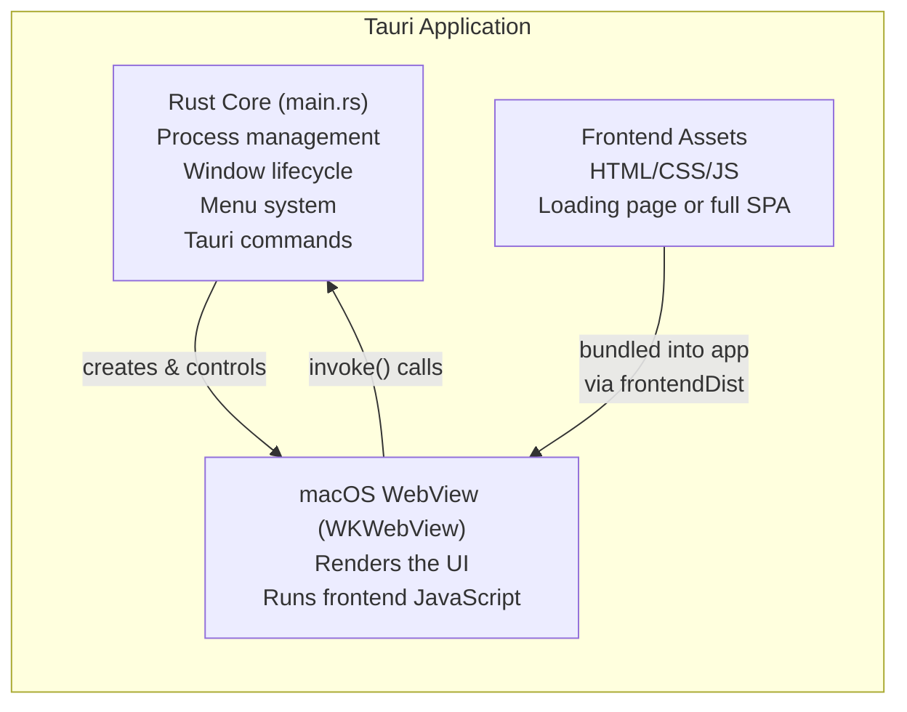
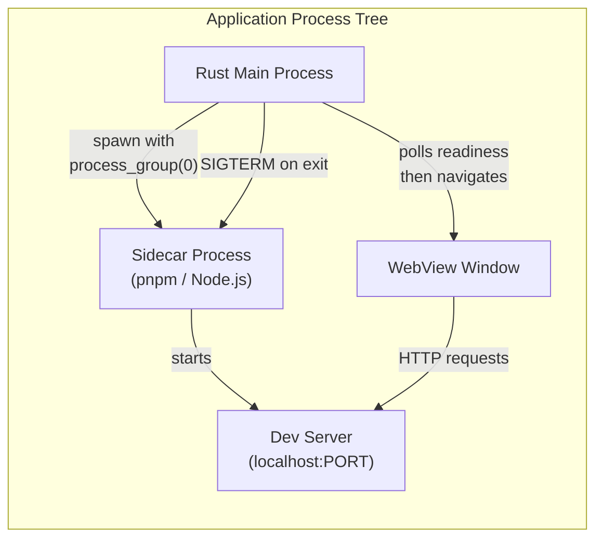
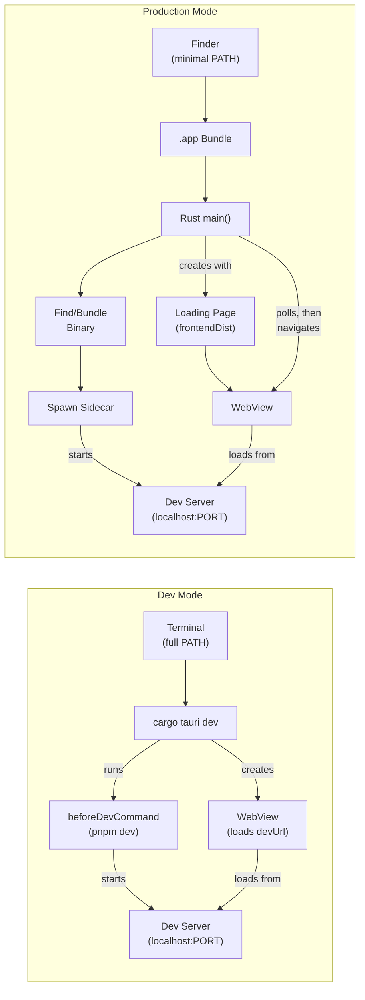
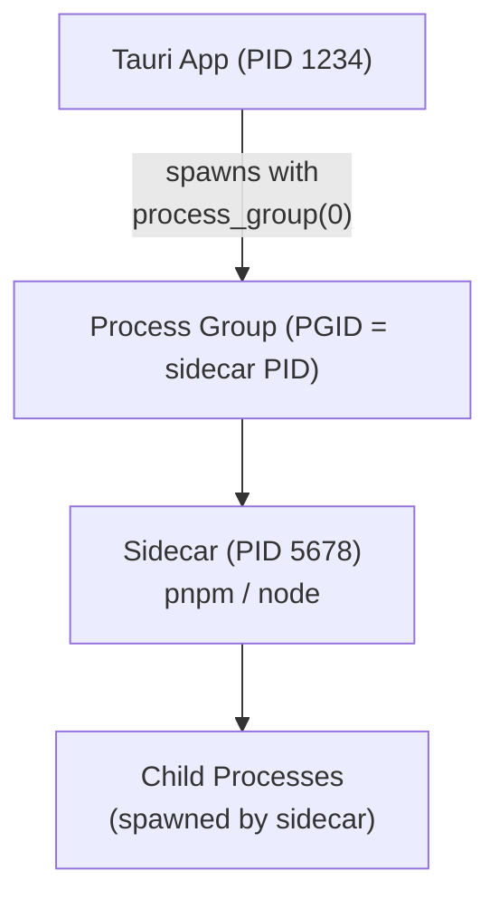

# Architecture Overview

This section covers the architectural patterns used in Tauri v2 macOS wrapper applications. The core idea is straightforward: a Rust binary manages a WebView and optionally spawns background processes, but the details of how this works in practice -- especially across dev and production modes -- require careful design.

## Core Structure

Every Tauri v2 app has three layers:



The **Rust core** manages everything: window creation, menu handling, process spawning, signal handling, and shutdown. The **WebView** is a thin rendering layer -- it displays whatever URL or HTML the Rust core tells it to. The **frontend** can be as simple as a single loading page HTML file.

## The Sidecar Approach

For apps that wrap a dev server (documentation sites, preview tools), the architecture adds a sidecar process layer:



The Rust process spawns the sidecar in its own process group. This is essential for clean shutdown -- when the app exits, it can signal the entire process group rather than hunting down individual child processes.

## Dev vs Production Architecture

The architecture changes significantly between dev mode and production mode:



The key differences:

1. **Dev mode** delegates server startup to `beforeDevCommand` and loads directly from `devUrl`
2. **Production mode** must handle everything itself: finding/bundling the binary, spawning the process, showing a loading page, polling for readiness, then navigating

## State Management

The Rust side manages application state through Tauri's managed state system:

```rust
struct AppState {
    sidecar: Arc<Mutex<Option<Sidecar>>>,
    pnpm_path: Option<PathBuf>,
    zoom: Mutex<f64>,
}

// Register during app build
tauri::Builder::default()
    .manage(app_state)
    // ...
```

State is accessed from menu event handlers, Tauri commands, and the shutdown handler via `app_handle.state::<AppState>()`.

## Process Tree

A running Tauri wrapper app has this process tree:



Using `process_group(0)` creates a new process group with the sidecar's PID as the group ID. On shutdown, sending `SIGTERM` to `-pid` (negative PID) signals the entire group, ensuring all child processes are cleaned up.

## Section Contents

The pages in this section cover each architectural pattern in detail:

- **[Sidecar Pattern](/architecture/sidecar-pattern/)** -- Bundling and managing external binaries
- **[Loading Screen](/architecture/loading-screen/)** -- Showing UI immediately while background work happens
- **[Process Lifecycle](/architecture/process-lifecycle/)** -- Port cleanup, shutdown sequences, and signal handling
