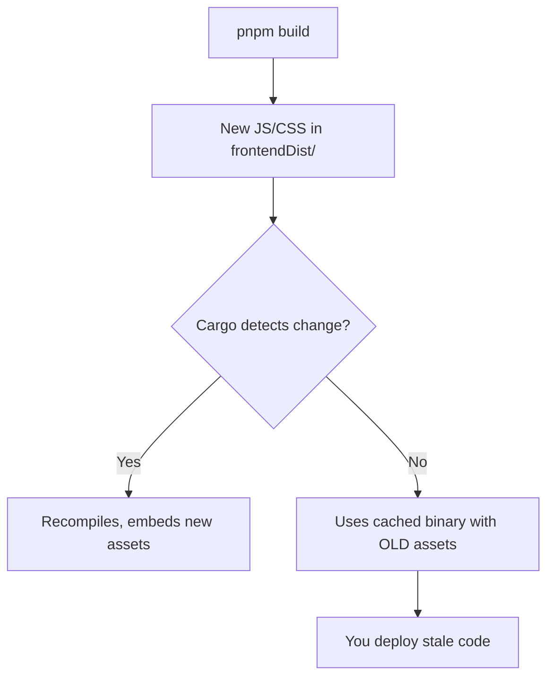

# Cargo Cache Invalidation

Cargo is smart about incremental compilation -- it only recompiles what has changed. But this intelligence sometimes works against you when it comes to Tauri's frontend asset embedding. Cargo may not detect that the files in `frontendDist` have changed, resulting in a production build that ships stale frontend code.

## The Problem

When you run `cargo tauri build`, the frontend build runs first (`beforeBuildCommand`), producing new files in `frontendDist`. Then Cargo compiles the Rust code, which calls `tauri::generate_context!()` to embed those files.

The issue: Cargo tracks changes to Rust source files and `Cargo.toml`, but it does not always notice when the contents of `frontendDist` change. If only the frontend changed (no Rust code changes), Cargo may reuse the cached binary with the old frontend assets embedded.



## Solutions

### touch src/main.rs

The classic workaround is to touch a Rust source file to force Cargo to recompile:

```bash
touch src/main.rs
cargo tauri build
```

<Warning>

`touch src/main.rs` does not always work reliably. Cargo's change detection has become smarter over time, and in some cases it recognizes that the file content has not actually changed (only the timestamp) and skips recompilation anyway.

</Warning>

### cargo clean -p (Recommended)

The reliable solution is to clean only your crate's build artifacts, forcing a fresh compilation:

```bash
# Clean only your crate (fast, doesn't rebuild all dependencies)
cargo clean -p your-crate-name

# Then build
cargo tauri build
```

Replace `your-crate-name` with the `name` field from your `Cargo.toml`. This is much faster than `cargo clean` because it only removes your crate's artifacts, not all dependencies.

```bash
# Example for a crate named "zudotext"
cargo clean -p zudotext
cargo tauri build
```

<Tip>

Add this to your build script or Makefile so you never forget:

```bash
# build.sh
#!/bin/bash
set -e
cargo clean -p zudotext
cargo tauri build
```

</Tip>

### Full cargo clean (Nuclear Option)

If `cargo clean -p` does not help, clean everything:

```bash
cargo clean
cargo tauri build
```

This rebuilds all dependencies from scratch, which takes significantly longer (minutes vs seconds). Only use this as a last resort.

## Verifying the Build

After building, verify that the new frontend code is actually embedded in the binary.

### Verify New Code IS Present

Search for a string that should exist in the new frontend build:

```bash
# Search for a known string from the new frontend code
grep -c "your-new-feature-string" \
  target/release/bundle/macos/YourApp.app/Contents/Resources/*.js

# Or in the main binary (if assets are embedded directly)
strings target/release/YourApp | grep "your-new-feature-string"
```

### Verify Old Code is NOT Present

Search for a string that was removed or changed:

```bash
# This should return 0 matches
grep -c "old-removed-string" \
  target/release/bundle/macos/YourApp.app/Contents/Resources/*.js
```

If the old string is found, your build still contains stale code. Go back and do `cargo clean -p`.

### Check Build Timestamps

```bash
# When was the binary built?
stat -f "%Sm" target/release/YourApp

# When were the frontend assets built?
stat -f "%Sm" dist-renderer/index.html
```

The binary timestamp should be **after** the frontend build timestamp. If the binary is older, Cargo did not recompile.

## Automation

To avoid ever shipping stale assets, add verification to your deploy script:

```bash
#!/bin/bash
set -e

APP_NAME="zudotext"
EXPECTED_STRING="v2.1.0"  # Something unique to the current version

# Force fresh build
cargo clean -p "$APP_NAME"
cargo tauri build

# Verify
if ! strings "target/release/$APP_NAME" | grep -q "$EXPECTED_STRING"; then
  echo "ERROR: Expected string '$EXPECTED_STRING' not found in binary!"
  echo "The build may contain stale frontend assets."
  exit 1
fi

echo "Build verified: contains '$EXPECTED_STRING'"
```

## Why This Happens

Tauri uses the `include_dir` macro (via `tauri::generate_context!()`) to embed frontend assets at compile time. This is a proc macro that runs during compilation, not a build script. Cargo's dependency tracking for proc macro inputs is limited -- it tracks the macro invocation site (typically `main.rs`) but not the external files the macro reads.

This is a known limitation of Cargo's build system, not a Tauri bug. The workaround (`cargo clean -p`) is the official recommendation.
