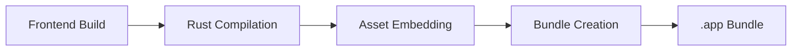

# Build and Deployment

Building a Tauri app for production involves more steps and more gotchas than most frameworks. This section covers the full deployment pipeline, from `cargo tauri build` to installing the `.app` bundle on a target machine.

## The Build Pipeline



1. **Frontend Build** -- Tauri runs `beforeBuildCommand` (e.g., `vite build`) to produce static assets
2. **Rust Compilation** -- Cargo compiles the Rust backend in release mode
3. **Asset Embedding** -- `tauri::generate_context!()` embeds the `frontendDist` contents into the binary
4. **Bundle Creation** -- Tauri packages everything into a `.app` bundle (and optionally `.dmg`)

## Topics in This Section

- **[Building App Bundles](./build-bundle)** -- The `cargo tauri build` command, bundle targets, icons, and installation
- **[macOS Pitfalls](./macos-pitfalls)** -- Critical `.app` replacement issues that will waste hours of your time
- **[Cargo Cache Invalidation](./cargo-cache)** -- Forcing Cargo to re-embed frontend assets when it doesn't detect changes
- **[Bundling Node.js](./node-download)** -- Download script for including a standalone Node.js binary in your app

## Quick Reference

```bash
# Build for production
cargo tauri build

# Build with a specific config
cargo tauri build --config tauri.conf.myapp.json

# The output .app bundle is at:
# target/release/bundle/macos/YourApp.app

# Install to /Applications
rm -rf /Applications/YourApp.app
cp -r target/release/bundle/macos/YourApp.app /Applications/
```

<Warning>

Always `rm -rf` the old `.app` before copying the new one. See [macOS Pitfalls](./macos-pitfalls) for why `cp -rf` alone is not safe.

</Warning>
