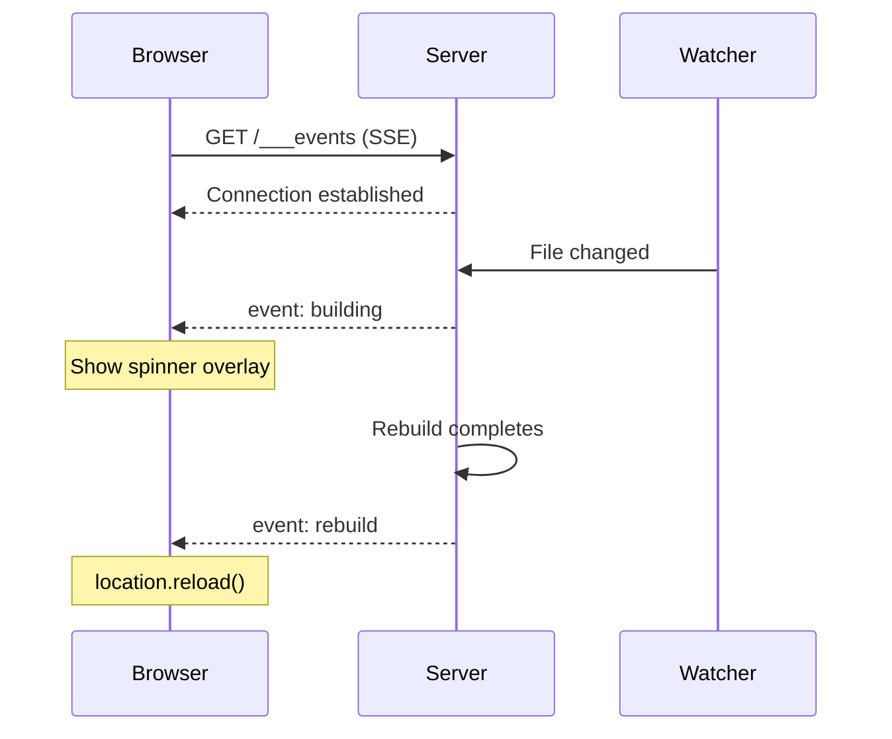

# SSE-Based Live Reload

If your dev server performs full rebuilds (not Vite/webpack HMR), you need a custom live-reload mechanism. Server-Sent Events (SSE) are a simple, reliable approach: the server pushes `"building"` and `"rebuild"` events to connected browsers, which respond by showing a spinner overlay or reloading the page.

## Why SSE Instead of WebSocket

SSE is a better fit than WebSocket for live reload because:

- **One-direction is enough** -- the server tells the browser to reload; the browser never needs to send messages back
- **Auto-reconnect** -- `EventSource` reconnects automatically if the connection drops
- **No library needed** -- native browser API, no dependencies
- **Simple server code** -- just write to a response stream

## Architecture



## Server Implementation

### SSE Client Management

Use a `Set` to track all connected SSE clients. Each client is a writable response object.

```javascript
const sseClients = new Set();

function broadcast(event) {
  for (const res of sseClients) {
    res.write(`event: ${event}\ndata: {}\n\n`);
  }
}
```

### The SSE Endpoint

Create a `GET /___events` endpoint that keeps the connection open and registers the client.

```javascript
app.get('/___events', (req, res) => {
  res.writeHead(200, {
    'Content-Type': 'text/event-stream',
    'Cache-Control': 'no-cache',
    Connection: 'keep-alive',
  });

  // Send initial connection event
  res.write('event: connected\ndata: {}\n\n');

  // Register this client
  sseClients.add(res);

  // Clean up on disconnect
  req.on('close', () => {
    sseClients.delete(res);
  });
});
```

### Broadcasting Build Events

When the file watcher detects a change:

1. Broadcast `"building"` immediately (browser shows spinner)
2. Run the build
3. Broadcast `"rebuild"` when done (browser reloads)

```javascript
async function onFileChange(changedPath) {
  // Tell all browsers a build is starting
  broadcast('building');

  try {
    await runBuild();
  } catch (err) {
    console.error('Build failed:', err);
  }

  // Broadcast rebuild regardless of success or failure.
  // On failure, the browser still needs to dismiss the spinner.
  // It will reload and show the error in the page.
  broadcast('rebuild');
}
```

<Warning>

Always broadcast `"rebuild"` even when the build fails. If you skip it on failure, the spinner overlay stays visible forever and the developer has to manually reload. The failed build output will be visible in the reloaded page or terminal anyway.

</Warning>

### Injecting the Reload Script

Intercept HTML responses and inject the SSE client script before `</body>`. This avoids requiring the frontend code to know about the reload mechanism.

```javascript
function injectReloadScript(html) {
  const script = `
<script>
(function() {
  var overlay = null;

  function showSpinner() {
    if (overlay) return;
    overlay = document.createElement('div');
    overlay.style.cssText =
      'position:fixed;inset:0;background:rgba(0,0,0,0.3);' +
      'display:flex;align-items:center;justify-content:center;z-index:99999';
    overlay.innerHTML = '<div style="color:white;font-size:24px">Rebuilding...</div>';
    document.body.appendChild(overlay);
  }

  function connect() {
    var es = new EventSource('/___events');

    es.addEventListener('building', function() {
      showSpinner();
    });

    es.addEventListener('rebuild', function() {
      location.reload();
    });

    es.onerror = function() {
      es.close();
      // Reconnect after a short delay
      setTimeout(connect, 1000);
    };
  }

  connect();
})();
</script>`;

  return html.replace('</body>', script + '</body>');
}
```

Then use this in your server's response handling:

```javascript
// When serving HTML responses, inject the reload script
app.get('*', (req, res) => {
  const html = renderPage(req.path);
  res.type('html').send(injectReloadScript(html));
});
```

## Full Server Example

Here is a complete minimal dev server with SSE live reload:

```javascript
import express from 'express';
import chokidar from 'chokidar';
import { execSync } from 'child_process';

const PORT = 32342;
const app = express();
const sseClients = new Set();

// SSE endpoint
app.get('/___events', (req, res) => {
  res.writeHead(200, {
    'Content-Type': 'text/event-stream',
    'Cache-Control': 'no-cache',
    Connection: 'keep-alive',
  });
  res.write('event: connected\ndata: {}\n\n');
  sseClients.add(res);
  req.on('close', () => sseClients.delete(res));
});

function broadcast(event) {
  for (const res of sseClients) {
    res.write(`event: ${event}\ndata: {}\n\n`);
  }
}

// Serve built files (with script injection for HTML)
app.use(express.static('./dist', {
  setHeaders: (res, filePath) => {
    // Static middleware doesn't let us modify body,
    // so HTML injection is handled in the fallback route
  }
}));

app.get('*', (req, res) => {
  // Serve index.html with injected reload script
  const fs = require('fs');
  let html = fs.readFileSync('./dist/index.html', 'utf-8');
  html = html.replace('</body>', `
<script>
(function() {
  var overlay = null;
  function showSpinner() {
    if (overlay) return;
    overlay = document.createElement('div');
    overlay.style.cssText = 'position:fixed;inset:0;background:rgba(0,0,0,0.3);display:flex;align-items:center;justify-content:center;z-index:99999';
    overlay.innerHTML = '<div style="color:white;font-size:24px">Rebuilding...</div>';
    document.body.appendChild(overlay);
  }
  var es = new EventSource('/___events');
  es.addEventListener('building', showSpinner);
  es.addEventListener('rebuild', function() { location.reload(); });
  es.onerror = function() { es.close(); setTimeout(function() { location.reload(); }, 2000); };
})();
</script>
</body>`);
  res.type('html').send(html);
});

// File watcher
let buildTimeout = null;
chokidar.watch('./src', { ignoreInitial: true }).on('all', () => {
  clearTimeout(buildTimeout);
  buildTimeout = setTimeout(() => {
    broadcast('building');
    try {
      execSync('pnpm build', { stdio: 'inherit' });
    } catch (e) {
      console.error('Build failed');
    }
    broadcast('rebuild');
  }, 200); // Debounce 200ms
});

app.listen(PORT, () => {
  console.log(`Dev server: http://localhost:${PORT}`);
});
```

## Key Design Decisions

### Why a Separate Endpoint

Using a dedicated `___events` path (with triple underscore prefix) avoids conflicts with your application's routes. The triple underscore convention makes it clear this is infrastructure, not application code.

### Why a Set for Clients

A `Set` is the right data structure for SSE clients:

- O(1) add and delete
- Automatic deduplication (though each response object is unique)
- Easy iteration for broadcasting

### Debouncing

File watchers often fire multiple events for a single save (editor writes temp file, renames, etc.). Always debounce with a short delay (100-300ms) to batch these into a single rebuild.

<Tip>

If your build is fast (under 1 second), the spinner might flash too briefly to be noticeable. Consider adding a minimum display time of 300ms to the spinner overlay to avoid a jarring flash.

</Tip>
