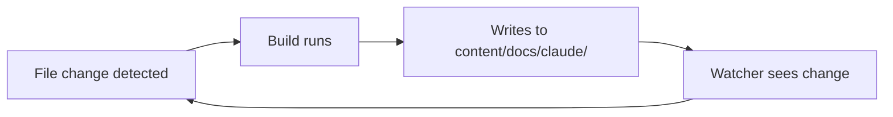

# Preventing Watcher Loops

One of the most frustrating dev server issues is the infinite rebuild loop: your build writes files into a directory that your watcher is watching, which triggers another build, which writes more files, which triggers another build, and so on. Your CPU spikes to 100% and your terminal floods with build output.

## The Problem

This happens when your build generates content that lives alongside source content. A common example:

```
content/
  docs/
    getting-started.md    <-- source (hand-written)
    api-reference.md      <-- source (hand-written)
    claude/               <-- generated (auto-created by build)
      index.md
      commands.md
```

If your watcher watches `content/docs/` and your build generates files into `content/docs/claude/`, you get an infinite loop:



## The Solution: Filter Generated Paths

The fix is straightforward: in your watcher callback, check whether the changed file is in a generated directory. If it is, skip the rebuild.

```javascript
import chokidar from 'chokidar';

const GENERATED_DIRS = [
  'content/docs/claude/',
  'content/docs/auto-generated/',
];

function isGeneratedPath(filePath) {
  return GENERATED_DIRS.some(dir => filePath.includes(dir));
}

const watcher = chokidar.watch('./content', {
  ignoreInitial: true,
});

watcher.on('all', (event, filePath) => {
  // Skip changes to generated content
  if (isGeneratedPath(filePath)) {
    return;
  }

  // Proceed with rebuild
  triggerRebuild();
});
```

## Path Matching Patterns

### Simple String Matching

For most cases, checking if the path contains the generated directory is sufficient:

```javascript
function isGeneratedPath(filePath) {
  // Normalize to forward slashes for cross-platform
  const normalized = filePath.replace(/\\/g, '/');
  return normalized.includes('content/docs/claude/');
}
```

### Multiple Generated Directories

When you have several generated directories, use an array:

```javascript
const GENERATED_PATTERNS = [
  'content/docs/claude/',
  'dist/',
  '.cache/',
  'node_modules/',
];

function isGeneratedPath(filePath) {
  const normalized = filePath.replace(/\\/g, '/');
  return GENERATED_PATTERNS.some(pattern => normalized.includes(pattern));
}
```

### Using chokidar's `ignored` Option

You can also configure chokidar itself to ignore these paths, which is slightly more efficient because the watcher never even registers the file system events:

```javascript
const watcher = chokidar.watch('./content', {
  ignoreInitial: true,
  ignored: [
    '**/content/docs/claude/**',
    '**/node_modules/**',
    '**/.git/**',
  ],
});
```

<Tip>

Prefer chokidar's `ignored` option over filtering in the callback. It reduces file system event noise at the OS level, which is better for performance on large projects.

</Tip>

## Real-World Example

Here is a watcher setup from a documentation site that generates some content from Claude Code resources while also watching for manual content changes:

```javascript
import chokidar from 'chokidar';

const WATCH_DIRS = ['./content', './src'];
const IGNORE_PATTERNS = [
  // Generated documentation from Claude Code resources
  'content/docs/claude/',
  // Build output
  'dist/',
  '.astro/',
  // Dependencies
  'node_modules/',
];

function shouldRebuild(filePath) {
  const normalized = filePath.replace(/\\/g, '/');
  return !IGNORE_PATTERNS.some(pattern => normalized.includes(pattern));
}

let debounceTimer = null;

const watcher = chokidar.watch(WATCH_DIRS, {
  ignoreInitial: true,
  ignored: [
    '**/node_modules/**',
    '**/.git/**',
  ],
});

watcher.on('all', (event, filePath) => {
  if (!shouldRebuild(filePath)) {
    // Log skipped paths during development to verify filtering works
    console.log(`[watcher] skipping generated: ${filePath}`);
    return;
  }

  clearTimeout(debounceTimer);
  debounceTimer = setTimeout(() => {
    console.log(`[watcher] rebuilding due to: ${filePath}`);
    triggerRebuild();
  }, 200);
});
```

## Debugging Loops

If you suspect an infinite loop, add logging to identify which files are triggering rebuilds:

```javascript
watcher.on('all', (event, filePath) => {
  console.log(`[watcher] ${event}: ${filePath}`);
  // ... rest of handler
});
```

Look for repeating patterns in the output. If you see the same generated files appearing over and over, you have found your loop source.

<Warning>

Do not use `.gitignore` as your source of truth for watcher ignores. The two concerns are related but different -- you might want to watch some files that are gitignored (like local config), and you might want to ignore some files that are tracked by git (like generated docs that are committed).

</Warning>

## Summary

| Approach | Pros | Cons |
|----------|------|------|
| Filter in callback | Easy to add logging, flexible | Watcher still receives events |
| chokidar `ignored` | More efficient, less noise | Harder to debug (events never arrive) |
| Separate directories | Cleanest separation | May not fit your project structure |

The best long-term fix is to keep generated content in a directory that is clearly separate from source content. But when that is not possible, path filtering in the watcher callback is a simple, reliable solution.
