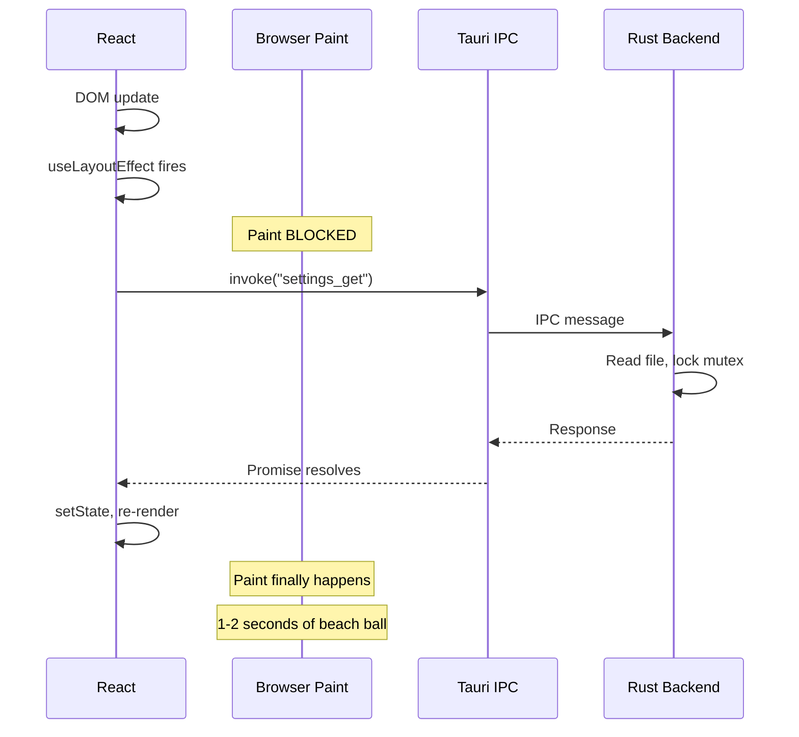

## The problem

If you use `useLayoutEffect` to make Tauri IPC calls (`invoke()`), your app will freeze for 1-2 seconds on macOS, showing the dreaded rainbow beach ball spinner. This happens consistently and makes the app feel broken.

<Warning>

**Never use `useLayoutEffect` for Tauri IPC calls.** It blocks the browser's paint cycle and causes a visible freeze in the webview. Always use `useEffect` instead.

</Warning>

## Why this happens

`useLayoutEffect` runs **synchronously after DOM mutations but before the browser paints**. React guarantees that the browser will not paint until `useLayoutEffect` finishes.

In a normal web app, this is useful for measuring DOM elements before the user sees them. But in Tauri, `invoke()` sends a message through the IPC bridge to the Rust backend, which processes it and sends a response back. Even though `invoke()` returns a Promise (and does not block JavaScript execution), the fact that `useLayoutEffect` is running prevents the browser from painting.

The chain of events:

1. Component renders, DOM updates
2. `useLayoutEffect` fires (browser paint is blocked)
3. `invoke()` sends IPC message to Rust
4. Rust processes the request (file I/O, state access)
5. Response comes back through IPC
6. State update triggers re-render
7. **Only now** can the browser paint

During steps 3-6, the webview is frozen. On macOS, this causes the WKWebView to trigger the system-level "application not responding" indicator -- the rainbow spinner.



## Before (broken)

```tsx
import { invoke } from "@tauri-apps/api/core";
import { useLayoutEffect, useState } from "react";

function SettingsPanel() {
  const [settings, setSettings] = useState(null);

  // BAD: useLayoutEffect blocks paint during IPC round-trip
  useLayoutEffect(() => {
    invoke("settings_get").then((result) => {
      setSettings(result);
    });
  }, []);

  return <div>{settings ? <Form data={settings} /> : <Loading />}</div>;
}
```

## After (fixed)

```tsx
import { invoke } from "@tauri-apps/api/core";
import { useEffect, useState } from "react";

function SettingsPanel() {
  const [settings, setSettings] = useState(null);

  // GOOD: useEffect runs after paint, no blocking
  useEffect(() => {
    invoke("settings_get").then((result) => {
      setSettings(result);
    });
  }, []);

  return <div>{settings ? <Form data={settings} /> : <Loading />}</div>;
}
```

The only change is `useLayoutEffect` to `useEffect`. The behavior is identical except the browser can paint immediately after the DOM update, showing the loading state while the IPC call completes in the background.

## When to use each

### useEffect (almost always)

Use `useEffect` for:

- **All Tauri IPC calls** (`invoke()`, `listen()`)
- Data fetching
- Subscriptions and event listeners
- Any side effect that does not need to block paint

### useLayoutEffect (rare, specific cases)

Reserve `useLayoutEffect` for:

- **Synchronous DOM measurement** (reading element dimensions before paint)
- **Preventing visual flicker** (e.g., repositioning a tooltip based on measured position)

```tsx
// Legitimate useLayoutEffect usage:
// measuring DOM before paint to prevent flicker
useLayoutEffect(() => {
  const rect = tooltipRef.current.getBoundingClientRect();
  setPosition({ x: rect.left, y: rect.top - 40 });
}, [tooltipRef]);
```

<Tip>

A simple rule: if the code inside the effect calls `invoke()` or any other async IPC function, it must be in `useEffect`, never `useLayoutEffect`.

</Tip>

## The same applies to other frameworks

This is not React-specific. Any framework pattern that runs code synchronously before paint will cause the same problem with Tauri IPC:

- **Svelte**: avoid `beforeUpdate` for IPC calls; use `onMount` instead
- **Vue**: avoid `onBeforeUpdate` with IPC calls; use `onMounted`
- **Solid**: avoid `createRenderEffect` for IPC; use `createEffect`

The underlying cause is the same: blocking the webview's paint cycle while waiting for an IPC round-trip through the Rust backend.

## Key takeaways

1. **`useLayoutEffect` + `invoke()` = beach ball** -- this is a hard rule, not a performance optimization
2. **Always use `useEffect` for IPC calls** -- the slight delay before paint is invisible to users
3. **`useLayoutEffect` is only for synchronous DOM measurement** -- it should never contain async operations
4. **This affects all frameworks**, not just React -- any pre-paint hook with IPC calls will freeze
