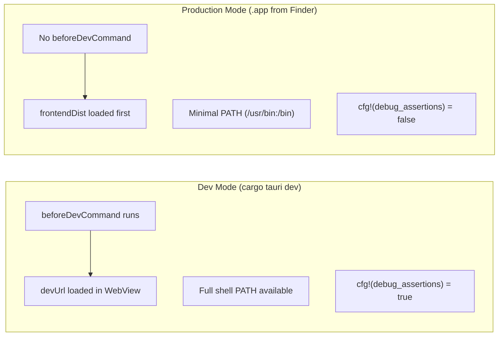

# Dev vs Production

The single most important concept in Tauri development is the difference between **dev mode** and **production mode**. Nearly every bug unique to Tauri desktop apps traces back to this distinction.

## The Two Modes at a Glance



| Aspect | Dev Mode | Production Mode |
|--------|----------|-----------------|
| How it starts | `cargo tauri dev` in terminal | Double-click `.app` in Finder |
| Frontend source | `devUrl` (live dev server) | `frontendDist` (bundled static files) |
| Shell environment | Full PATH from your shell profile | Minimal PATH (`/usr/bin:/bin:/usr/sbin:/sbin`) |
| Node.js/pnpm available? | Yes (via PATH) | No, unless explicitly located or bundled |
| Rust debug flag | `cfg!(debug_assertions)` is true | `cfg!(debug_assertions)` is false |
| `beforeDevCommand` | Runs automatically | Does not run |
| Hot reload | Typically yes (via Vite/similar) | No |

## Dev Mode: How It Works

When you run `cargo tauri dev`, Tauri does the following:

1. Executes `beforeDevCommand` (e.g., starts Vite dev server)
2. Compiles and runs your Rust binary with debug assertions enabled
3. The WebView loads from `devUrl` (your dev server's URL)

Here is what a typical dev-mode config looks like:

```json
{
  "build": {
    "beforeDevCommand": "cd ../../doc && pnpm dev",
    "devUrl": "http://localhost:32342/"
  }
}
```

Everything works seamlessly because you are running inside your terminal, which has your full shell environment -- Homebrew paths, nvm, nodenv, pnpm, and everything else.

## Production Mode: What Changes

When a user (or you) launches the `.app` bundle from Finder, the situation is fundamentally different:

1. **`beforeDevCommand` never runs.** There is no dev server started for you.
2. **PATH is minimal.** macOS Finder-launched apps get `/usr/bin:/bin:/usr/sbin:/sbin` only. Your Homebrew tools, nvm-managed Node.js, and globally installed pnpm do not exist in this environment.
3. **`frontendDist` is the initial content.** The WebView loads from the bundled static files.

<Warning>

This is the number one source of confusion in Tauri development. If your app works perfectly with `cargo tauri dev` but crashes or shows a blank screen when launched from Finder, the cause is almost always a missing tool or PATH issue in the production environment.

</Warning>

## Detecting the Mode in Rust

Use the `cfg!(debug_assertions)` compile-time constant to branch between dev and production behavior:

```rust
const IS_DEV: bool = cfg!(debug_assertions);

fn main() {
    if IS_DEV {
        // Dev mode: beforeDevCommand handles the server
        // No need to spawn anything ourselves
    } else {
        // Production mode: we must start the server ourselves
        let pnpm_path = find_pnpm();
        spawn_sidecar(&pnpm_path);
    }
}
```

This is a compile-time constant, not a runtime check. The compiler eliminates the dead branch entirely, so there is no runtime cost.

### Practical Example: Conditional Sidecar Spawn

From a real app that wraps a documentation site:

```rust
const IS_DEV: bool = cfg!(debug_assertions);

fn main() {
    let found_pnpm = if IS_DEV { None } else { find_pnpm() };

    let sidecar: Option<Sidecar> = if IS_DEV {
        None  // beforeDevCommand handles it
    } else {
        kill_port();
        match found_pnpm {
            Some(ref pnpm_path) => {
                Some(spawn_sidecar(pnpm_path))
            }
            None => {
                panic!("pnpm not found. Install pnpm globally.");
            }
        }
    };

    // ... rest of app setup
}
```

In dev mode, Tauri's `beforeDevCommand` already starts the dev server, so the Rust code does nothing. In production mode, the Rust code must find pnpm at a known absolute path and start the server itself.

## Why PATH Breaks in Production

When you launch an app from the terminal, it inherits your shell's PATH:

```
/opt/homebrew/bin:/usr/local/bin:/usr/bin:/bin:...
```

When you launch from Finder, the PATH is:

```
/usr/bin:/bin:/usr/sbin:/sbin
```

This means:

- `pnpm` -- not found (installed via Homebrew or npm)
- `node` -- not found (installed via nvm, nodenv, or Homebrew)
- `npm` -- not found
- `git` -- may or may not be found (Xcode command line tools install to `/usr/bin`)

### Solution: Absolute Paths

Never rely on PATH resolution in production code. Use absolute paths:

```rust
fn find_pnpm() -> Option<PathBuf> {
    let candidates = [
        "/opt/homebrew/bin/pnpm",    // Apple Silicon Homebrew
        "/usr/local/bin/pnpm",       // Intel Homebrew
    ];
    for p in &candidates {
        let path = PathBuf::from(p);
        if path.exists() {
            return Some(path);
        }
    }

    // Last resort: which pnpm (only works from terminal)
    if let Ok(output) = Command::new("/usr/bin/which").arg("pnpm").output() {
        let path_str = String::from_utf8_lossy(&output.stdout)
            .trim().to_string();
        if !path_str.is_empty() {
            let path = PathBuf::from(&path_str);
            if path.exists() {
                return Some(path);
            }
        }
    }

    None
}
```

<Tip>

For truly self-contained apps, bundle the binary (Node.js, etc.) as a Tauri sidecar using `externalBin`. This eliminates the system dependency entirely. See the [Sidecar Pattern](/architecture/sidecar-pattern/) page for details.

</Tip>

## Config Comparison: Dev vs Production

### Wrapper app (relies on system pnpm)

```json
{
  "build": {
    "frontendDist": "./frontend",
    "beforeDevCommand": "cd ../../doc && pnpm dev",
    "devUrl": "http://localhost:32342/"
  }
}
```

- **Dev**: `beforeDevCommand` runs `pnpm dev` in the doc directory. WebView loads from `devUrl`.
- **Production**: `frontendDist` provides the loading page. Rust code finds pnpm and spawns it.

### Self-contained app (Vite-built frontend)

```json
{
  "build": {
    "beforeDevCommand": "pnpm exec vite --config vite.config.ts",
    "beforeBuildCommand": "pnpm exec vite build --config vite.config.ts",
    "devUrl": "http://localhost:37461",
    "frontendDist": "./dist-renderer"
  }
}
```

- **Dev**: Vite dev server runs, WebView loads from `devUrl` with HMR.
- **Production**: `beforeBuildCommand` creates the built frontend in `dist-renderer`. WebView loads directly from those static files. No server needed at runtime.

### Bundled sidecar app

```json
{
  "build": {
    "frontendDist": "./frontend"
  },
  "bundle": {
    "externalBin": ["binaries/node"]
  }
}
```

- **Dev and Production**: No `beforeDevCommand` at all. The Rust code always spawns the bundled Node.js binary. The `frontendDist` loading page shows while the server starts.

## The Window Creation Pattern

Because of the dev/production split, windows are created differently in each mode:

```rust
if IS_DEV {
    // Dev mode: server is already running via beforeDevCommand
    let url: tauri::Url = server_url().parse().unwrap();
    WebviewWindowBuilder::new(app, "main", WebviewUrl::External(url))
        .title("My App")
        .inner_size(1200.0, 800.0)
        .build()?;
} else {
    // Production: show loading page immediately, navigate when ready
    WebviewWindowBuilder::new(app, "main", WebviewUrl::default())
        .title("My App")
        .inner_size(1200.0, 800.0)
        .build()?;

    let handle = app.handle().clone();
    thread::spawn(move || {
        wait_for_ready(Duration::from_secs(120));
        if let Some(w) = handle.get_webview_window("main") {
            let url: tauri::Url = server_url().parse().unwrap();
            let _ = w.navigate(url);
        }
    });
}
```

In dev mode, the window opens directly to the dev server URL. In production mode, it opens with the loading page (from `frontendDist`) and a background thread polls the sidecar server until it is ready, then navigates to it.

<Note>

See the [Loading Screen](/architecture/loading-screen/) page for the full pattern including the HTML loading page.

</Note>
