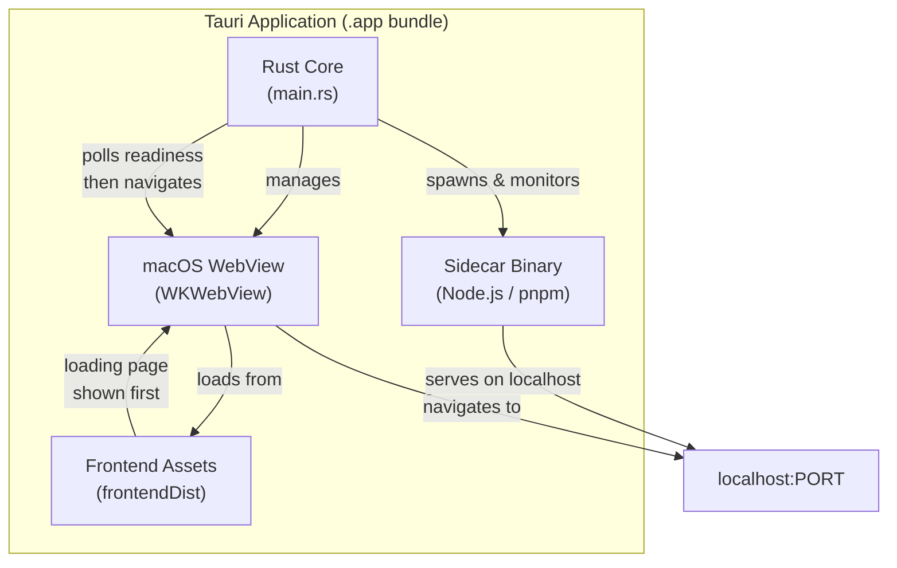

# Overview

Personal dev notes by [Takazudo](https://x.com/Takazudo). Not official Tauri documentation.
Written for personal reference and AI-assisted coding.

This site covers practical patterns for building **macOS wrapper applications** with Tauri v2. The focus is on a specific category of desktop app: thin native wrappers around web frontends, with Rust handling process management, system integration, and lifecycle concerns.

## What This Covers

These are the core topics documented here, all based on patterns extracted from real production apps:

- **Project setup** -- Cargo.toml, tauri.conf.json, capabilities, and directory structure
- **Dev vs production** -- The fundamental split that drives most architectural decisions
- **Sidecar processes** -- Bundling and managing Node.js or other binaries alongside your app
- **Loading screens** -- Showing immediate UI while background processes start up
- **Process lifecycle** -- Port cleanup, signal handling, and clean shutdown on macOS

## High-Level Architecture

A typical Tauri v2 wrapper app has this structure:

## The Two App Patterns

The apps documented here fall into two patterns:

### Pattern 1: System Dependency Wrapper

The app expects tools like `pnpm` to be installed on the system. It finds them at known paths (`/opt/homebrew/bin/pnpm`, `/usr/local/bin/pnpm`) and spawns them as child processes. This is simpler to set up but requires the user to have the right tools installed.

### Pattern 2: Bundled Sidecar

The app bundles a standalone binary (like a Node.js runtime) inside the `.app` bundle using Tauri's `externalBin` feature. This is fully self-contained -- no system dependencies required -- but needs a download/build step to fetch the binary for the target platform.

<Tip>

Pattern 2 (bundled sidecar) is more robust for distribution. Pattern 1 works well for developer tools where you can assume the user has a development environment set up.

</Tip>

## Key Insight: Dev vs Production

The single most important concept in Tauri development is the difference between dev mode and production mode. In dev mode, your app runs from source with full access to the shell environment. In production mode, it is a standalone `.app` bundle launched from Finder with a minimal PATH. Nearly every architectural decision flows from this distinction.

Read the [Dev vs Production](/getting-started/dev-vs-production/) page next to understand this fully.

## Prerequisites

To follow along with these patterns, you need:

- **Rust** (stable toolchain) and `cargo`
- **Tauri CLI v2**: `cargo install tauri-cli` or `cargo binstall tauri-cli`
- **Node.js and pnpm** (for frontend development and sidecar patterns)
- **macOS** (these patterns are macOS-focused, though Tauri itself is cross-platform)
