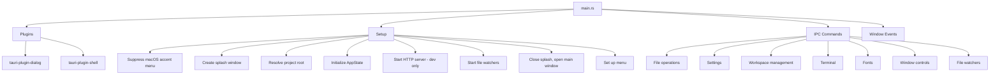

# Text Editor App

This recipe covers the architecture of a full-featured text editor built with Tauri. Unlike the [Doc Viewer](./doc-viewer-app), which is a thin wrapper around a dev server, this app has a Vite + React frontend with extensive Rust IPC commands for file operations, terminal management, file watchers, and workspace handling.

## Architecture Overview



## Module Organization

The Rust code is split into modules, each handling a specific concern:

```
src/
  main.rs              # Entry point, setup, plugin registration
  state.rs             # AppState definition
  commands/
    files.rs           # File read/write/list IPC commands
    settings.rs        # Settings get/save
    workspace.rs       # Workspace management
    terminal.rs        # PTY terminal spawning
    watchers.rs        # File system watchers
    fonts.rs           # Font listing
    window.rs          # Window opacity control
  helpers/             # Shared utilities
  http_server.rs       # Axum REST server (dev mode only)
  native/
    window.rs          # Window creation (splash + main)
    menu.rs            # Application menu
    dialog.rs          # Native file/directory dialogs
```

## Plugin Usage

The app uses two Tauri plugins:

```rust
tauri::Builder::default()
    .plugin(tauri_plugin_dialog::init())
    .plugin(tauri_plugin_shell::init())
```

- **tauri-plugin-dialog** -- Native file open/save dialogs and directory pickers
- **tauri-plugin-shell** -- Shell command execution (used for opening files in external editors)

<Note>

In Tauri v2, many features that were built into Tauri v1 are now separate plugins. Check the [Tauri plugins list](https://v2.tauri.app/plugin/) when you need OS-level functionality.

</Note>

## AppState with Arc

The `AppState` is wrapped in `Arc` for sharing with the HTTP server:

```rust
// Initialize app state (Arc-wrapped for sharing with HTTP server)
let app_state = Arc::new(AppState::new(project_root));
let http_state = app_state.clone();
app.manage(app_state);
```

Inside `AppState`, individual fields use `Mutex` for interior mutability:

```rust
// Conceptual structure (simplified)
pub struct AppState {
    pub project_root: Mutex<String>,
    pub settings: Mutex<Settings>,
    pub watchers: Mutex<HashMap<String, WatcherHandle>>,
    // ... more fields
}
```

<Tip>

Use `Mutex` for each field individually rather than one `Mutex` for the entire struct. This allows concurrent access to different fields. If you lock the entire struct, a long file operation blocks settings access.

</Tip>

## Splash Screen Flow

The app shows a splash screen immediately, then replaces it with the main window once initialization is complete:

```rust
.setup(|app| {
    // Show splash immediately (non-fatal if it fails)
    if let Err(e) = native::window::create_splash_window(app.handle()) {
        eprintln!("Failed to create splash window: {e}");
    }

    // ... initialization work (resolve root, create state, start watchers) ...

    // Replace splash with main window
    native::window::close_splash_window(app.handle());
    native::window::create_main_window(app.handle())?;

    Ok(())
})
```

This pattern ensures the user sees something immediately instead of a blank screen while the app initializes file watchers, loads settings, and performs other startup work.

## IPC Command Registration

The app registers a large number of IPC commands organized by category:

```rust
.invoke_handler(tauri::generate_handler![
    // File operations
    commands::files::messages_list,
    commands::files::messages_read,
    commands::files::messages_write,
    commands::files::messages_delete,
    commands::files::messages_create,
    commands::files::pins_list,
    commands::files::pins_read,
    commands::files::pins_write,
    commands::files::pins_delete,
    commands::files::draft_read,
    commands::files::draft_write,
    commands::files::draft_clear,
    // ... more file commands ...

    // Settings
    commands::settings::settings_get,
    commands::settings::settings_save,

    // Workspace
    commands::workspace::workspace_get_dir,
    commands::workspace::workspace_set_dir,
    commands::workspace::workspace_list_all,
    commands::workspace::workspace_switch,

    // Terminal
    commands::terminal::terminal_spawn,
    commands::terminal::terminal_write,
    commands::terminal::terminal_resize,
    commands::terminal::terminal_kill,

    // Window control
    commands::window::set_window_opacity,

    // Native dialog
    native::dialog::open_directory,
])
```

<Note>

Each command must be listed individually in `generate_handler![]`. There is no way to register an entire module at once. Keep the list organized with comments for maintainability.

</Note>

## File Watchers

The app watches the file system for external changes and notifies the frontend:

```rust
// Start file watchers for the initial workspace
let state_ref = app.state::<Arc<AppState>>();
commands::watchers::start_messages_watcher(&state_ref, app.handle());
commands::watchers::start_draft_watcher(&state_ref, app.handle());
```

File watchers are started during `setup()` and emit events to the frontend when files change. This allows the UI to update in real-time when files are modified by external tools (like another editor or a git operation).

## HTTP REST Server (Dev Mode)

In dev mode, the app runs an Axum HTTP server alongside the Tauri app. This provides a REST API that can be used by external tools for testing and automation:

```rust
// Start REST adapter (axum HTTP server on port 3001) -- dev only
if cfg!(debug_assertions) {
    tauri::async_runtime::spawn(async move {
        http_server::start(http_state, 3001).await;
    });
}
```

The HTTP server shares the same `Arc<AppState>` as the Tauri app, so it can access and modify the same data. This is useful for:

- Testing IPC commands without going through the webview
- Integrating with external development tools
- Debugging state changes

<Tip>

`tauri::async_runtime::spawn` uses Tokio under the hood. You can use any async Rust library (like Axum) within these spawned tasks.

</Tip>

## macOS Press-and-Hold Suppression

On macOS, holding down a key shows an accent character picker popup instead of repeating the key. This is undesirable in a text editor. The app suppresses it programmatically:

```rust
#[cfg(target_os = "macos")]
{
    use objc2_foundation::{NSUserDefaults, NSString};
    let defaults = NSUserDefaults::standardUserDefaults();
    unsafe {
        let key = NSString::from_str("ApplePressAndHoldEnabled");
        defaults.setBool_forKey(false, &key);
    }
}
```

This sets the `ApplePressAndHoldEnabled` user default to `false` for the app's process. It only affects this app -- other apps on the system are not affected.

<Warning>

This uses `unsafe` code and platform-specific APIs. Guard it with `#[cfg(target_os = "macos")]` so the code compiles on other platforms. The `objc2_foundation` crate must be added to `Cargo.toml`.

</Warning>

## Process Cleanup

The app cleans up terminal PTY processes when the main window is destroyed:

```rust
.on_window_event(|window, event| {
    if let tauri::WindowEvent::Destroyed = event {
        if window.label() == "main" {
            if let Some(state) = window.try_state::<Arc<AppState>>() {
                commands::terminal::kill_all_ptys(&state);
            }
        }
    }
})
```

## Project Root Resolution

The app resolves its project root differently in dev and production:

```rust
fn resolve_project_root() -> String {
    // Dev mode: repo root (parent of tauri-app/)
    if cfg!(debug_assertions) {
        return std::path::Path::new(env!("CARGO_MANIFEST_DIR"))
            .parent()
            .unwrap()
            .to_string_lossy()
            .to_string();
    }

    // Production: derive app name from .app bundle path
    // e.g., /Applications/ztoffice.app/Contents/MacOS/zudotext
    //        -> app_name = "ztoffice"
    let app_name = std::env::current_exe()
        .ok()
        .and_then(|exe| {
            exe.ancestors()
                .find(|p| p.extension().map(|ext| ext == "app").unwrap_or(false))
                .and_then(|app_dir| {
                    app_dir.file_stem()
                        .map(|s| s.to_string_lossy().to_string())
                })
        })
        .unwrap_or_else(|| "default".to_string());

    // Check per-app config file
    let home = dirs::home_dir().expect("could not determine home directory");
    let config_path = home
        .join(".config/zudotext")
        .join(&app_name)
        .join("config.json");

    if let Ok(content) = std::fs::read_to_string(&config_path) {
        if let Ok(config) = serde_json::from_str::<serde_json::Value>(&content) {
            if let Some(workspace) = config["workspace"].as_str() {
                if std::path::Path::new(workspace).exists() {
                    return workspace.to_string();
                }
            }
        }
    }

    // Default workspace
    let default_dir = home.join("Documents/zudo-text").join(&app_name);
    std::fs::create_dir_all(&default_dir).ok();
    default_dir.to_string_lossy().to_string()
}
```

This is particularly interesting because the app can be built as multiple variants (see [Multi-Config](./multi-config)). Each variant gets its own workspace directory, derived from the `.app` bundle name.

## Config File

The corresponding `tauri.conf.json`:

```json
{
  "productName": "zudotext",
  "version": "0.1.0",
  "identifier": "com.takazudo.zudotext",
  "build": {
    "beforeDevCommand": "pnpm exec vite --config vite.config.ts",
    "beforeBuildCommand": "pnpm exec vite build --config vite.config.ts",
    "devUrl": "http://localhost:37461",
    "frontendDist": "./dist-renderer"
  },
  "app": {
    "macOSPrivateApi": true,
    "windows": [],
    "security": {
      "csp": null
    }
  },
  "bundle": {
    "active": true,
    "targets": "all",
    "category": "DeveloperTool",
    "macOS": {
      "minimumSystemVersion": "10.15"
    }
  }
}
```

Key points:

- **`macOSPrivateApi: true`** -- enables private macOS APIs (needed for window transparency/opacity control)
- **`windows: []`** -- windows are created programmatically (splash, then main)
- **Vite with explicit config** -- `--config vite.config.ts` ensures the right config is used regardless of CWD
- **`frontendDist: "./dist-renderer"`** -- the Vite build output directory
