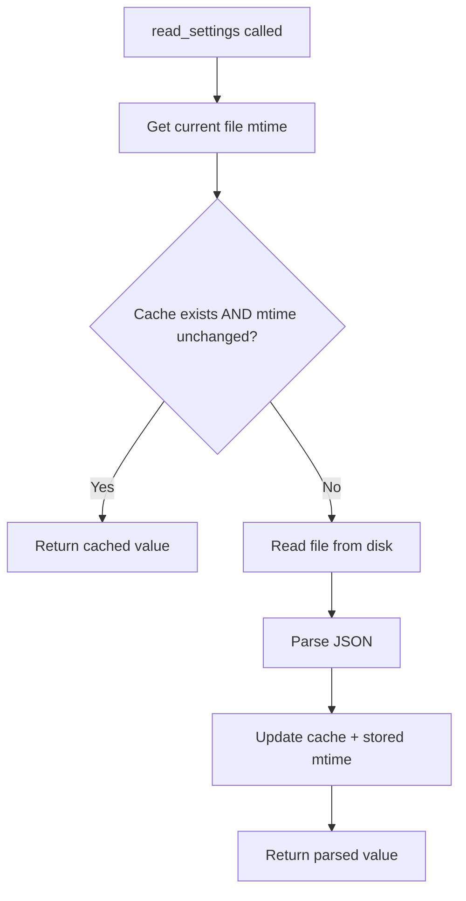

## The problem

A Tauri app often reads a settings file (JSON, TOML, etc.) on many IPC calls. Reading from disk on every call is wasteful, but naive in-memory caching breaks when the user edits the file externally with a text editor or another application.

The solution is **mtime-based cache invalidation**: store the file's last-modified time alongside the cached data, and compare it on each read. If the mtime has changed, re-read from disk.

## AppState fields

Add two fields to your `AppState`:

```rust
pub struct AppState {
    /// Cached settings JSON to avoid re-reading from disk on every operation.
    pub settings_cache: Mutex<Option<serde_json::Value>>,
    /// Last-known mtime (ms since UNIX epoch) of the settings file, used to
    /// invalidate `settings_cache` when the file is modified externally.
    pub settings_mtime: Mutex<u64>,
    // ... other fields
}
```

Initialize both to empty/zero:

```rust
impl AppState {
    pub fn new(project_root: String) -> Self {
        Self {
            settings_cache: Mutex::new(None),
            settings_mtime: Mutex::new(0),
            // ...
        }
    }
}
```

## Reading with cache

The `read_settings` function checks the on-disk mtime against the stored mtime. If they match and a cache exists, it returns the cached value. Otherwise it re-reads from disk and updates both the cache and the stored mtime.

```rust
use std::fs;
use std::path::Path;

pub(crate) fn read_settings(
    project_root: &str,
    state: &AppState,
) -> Option<serde_json::Value> {
    let settings_path = Path::new(project_root)
        .join(".zudotext.settings.json");

    // Check whether the on-disk file has changed since we last cached it.
    let current_mtime = mtime_ms(&settings_path);
    let stored_mtime = state.settings_mtime
        .lock().ok()
        .map(|m| *m)
        .unwrap_or(0);

    let mut cache = state.settings_cache.lock().ok()?;

    // If cached and mtime unchanged, return the cached value.
    if let Some(ref cached) = *cache {
        if current_mtime == stored_mtime {
            return Some(cached.clone());
        }
    }

    // Cache miss or mtime changed -- re-read from disk.
    let content = fs::read_to_string(&settings_path).ok()?;
    let value: serde_json::Value =
        serde_json::from_str(&content).ok()?;
    *cache = Some(value.clone());
    if let Ok(mut m) = state.settings_mtime.lock() {
        *m = current_mtime;
    }
    Some(value)
}
```

<Note>

The `mtime_ms` helper returns the file's modification time as milliseconds since the UNIX epoch. Using millisecond precision reduces the chance of missing rapid edits that happen within the same second.

</Note>

## Flow diagram



## Writing with cache update

When the app writes settings, update the cache and record the new mtime immediately. This prevents the next `read_settings` call from re-reading the file we just wrote:

```rust
pub(crate) fn save_settings(
    project_root: &str,
    settings: &serde_json::Value,
    state: &AppState,
) -> bool {
    let settings_path = Path::new(project_root)
        .join(".zudotext.settings.json");

    match serde_json::to_string_pretty(settings) {
        Ok(json) => {
            let ok = fs::write(&settings_path, json).is_ok();
            if ok {
                // Update cache
                if let Ok(mut cache) = state.settings_cache.lock() {
                    *cache = Some(settings.clone());
                }
                // Record the new mtime so read_settings won't
                // re-read immediately.
                let new_mtime = mtime_ms(&settings_path);
                if let Ok(mut m) = state.settings_mtime.lock() {
                    *m = new_mtime;
                }
            }
            ok
        }
        Err(_) => false,
    }
}
```

<Tip>

Always update the stored mtime **after** writing the file, not before. The file system assigns the mtime during the write, so you need to read it back to get the correct value.

</Tip>

## Tauri command wrappers

The Tauri commands are thin wrappers around these functions:

```rust
#[tauri::command]
pub fn settings_get(
    state: State<'_, Arc<AppState>>,
) -> Option<serde_json::Value> {
    let root = state
        .project_root
        .lock()
        .map_err(|e| format!("Failed to lock project root: {}", e))
        .ok()?
        .clone();
    if root.is_empty() {
        return None;
    }
    read_settings(&root, &**state)
}

#[tauri::command]
pub fn settings_save(
    state: State<'_, Arc<AppState>>,
    settings: serde_json::Value,
) -> bool {
    let root = match state.project_root.lock() {
        Ok(r) => r.clone(),
        Err(_) => return false,
    };
    if root.is_empty() {
        return false;
    }

    // Basic validation: must be an object
    if !settings.is_object() {
        return false;
    }

    save_settings(&root, &settings, &**state)
}
```

<Note>

Separating the core logic (`read_settings`, `save_settings`) from the Tauri command wrappers makes the functions reusable from other Rust code (e.g., other commands that need to read settings internally).

</Note>

## Invalidating on workspace switch

When the user switches workspaces, invalidate the cache by setting it to `None` and the mtime to `0`:

```rust
pub fn switch_workspace(&self, new_root: String) -> Result<(), String> {
    {
        let mut root = self.project_root.lock()
            .map_err(|e| format!("Failed to lock project root: {}", e))?;
        *root = new_root;
    }
    {
        let mut cache = self.settings_cache.lock()
            .map_err(|e| format!("Failed to lock settings cache: {}", e))?;
        *cache = None;
    }
    {
        let mut m = self.settings_mtime.lock()
            .map_err(|e| format!("Failed to lock settings mtime: {}", e))?;
        *m = 0;
    }
    Ok(())
}
```

## Key takeaways

1. **Cache the parsed value**, not the raw string -- saves repeated JSON parsing
2. **Use mtime for invalidation** -- cheap to check, catches external edits
3. **Update cache and mtime on write** -- prevents unnecessary re-reads after your own writes
4. **Invalidate on context changes** -- clear the cache when the workspace or project root changes
5. **All mutex access uses `.lock().ok()`** or `.map_err()` -- never `.unwrap()`
