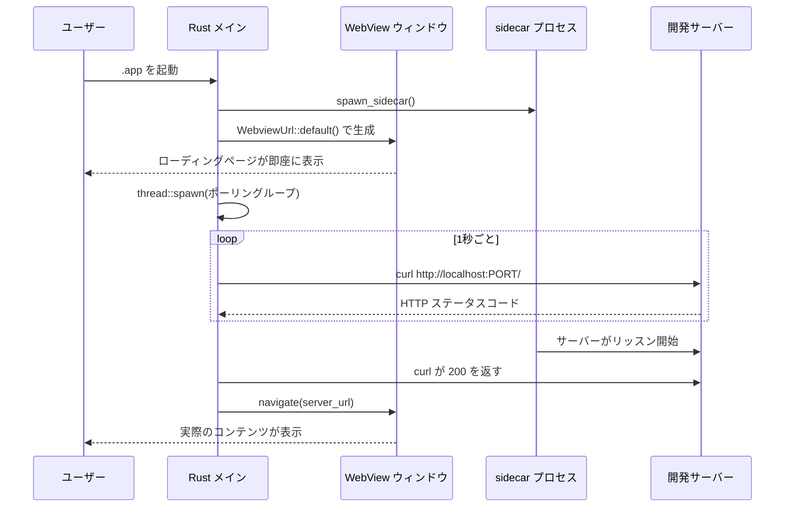
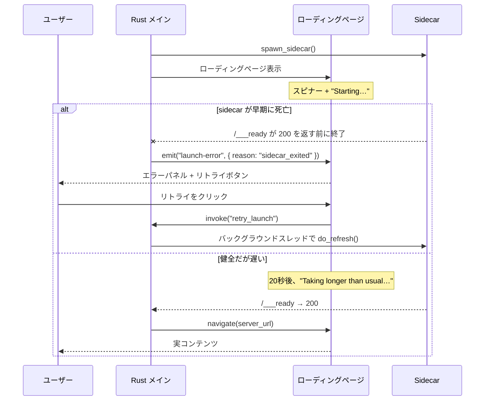

# ローディング画面パターン

Tauri アプリが開発サーバーをラップしたり sidecar プロセスを起動したりする場合、起動に遅延が生じる -- サーバーのコンパイルと配信開始までに通常 5〜30 秒かかる。ローディング画面がなければ、この間ユーザーには空白のウィンドウか、あるいはウィンドウすら表示されない。

ローディング画面パターンは、軽量な HTML ページを即座に表示し、サーバーの準備が完了したら実際のコンテンツにナビゲートすることで、この問題を解決する。

## 最重要ルール

<Warning>

**`setup()` 内でビルド完了を待ってはならない。** ウィンドウ生成前に `setup()` 内で `wait_for_build()` を呼ぶと、アプリがハングしたように見える -- ウィンドウなし、Dock インジケータなし、何もなし。ユーザーはアプリが起動中であることを認識できない。これは Tauri デスクトップアプリにおける最悪の UX ミスである。

</Warning>

以下は**間違った**方法:

```rust
// 悪い例: setup() をブロックし、30秒以上ウィンドウが表示されない
.setup(|app| {
    wait_for_build(Duration::from_secs(120));  // ここでブロック！

    let url = format!("http://localhost:{PORT}/");
    WebviewWindowBuilder::new(app, "main", WebviewUrl::External(url.parse().unwrap()))
        .build()?;

    Ok(())
})
```

そして以下が**正しい**方法:

```rust
// 良い例: ローディングページとともにウィンドウが即座に表示される
.setup(|app| {
    // ローディングページで今すぐウィンドウを表示
    WebviewWindowBuilder::new(app, "main", WebviewUrl::default())
        .title("My App")
        .inner_size(1200.0, 800.0)
        .build()?;

    // バックグラウンドでポーリングし、準備完了時にナビゲート
    let handle = app.handle().clone();
    thread::spawn(move || {
        wait_for_ready(Duration::from_secs(120));
        if let Some(w) = handle.get_webview_window("main") {
            let url: tauri::Url = server_url().parse().unwrap();
            let _ = w.navigate(url);
        }
    });

    Ok(())
})
```

## WebviewUrl::default() の動作

`WebviewUrl::default()` は `tauri.conf.json` の `frontendDist` で指定されたディレクトリから `index.html` を読み込む:

```json
{
  "build": {
    "frontendDist": "./frontend"
  }
}
```

つまり `./frontend/index.html` がローディングページとなる。これはコンパイル時にアプリ binary にバンドルされ、即座に読み込まれる -- サーバーは不要である。

## ローディングページの HTML

ローディングページは最小限で、自己完結し（外部依存なし）、視覚的に心地よいものであるべきだ:

```html
<!DOCTYPE html>
<html>
<head>
<style>
  * { margin: 0; padding: 0; box-sizing: border-box; }
  body {
    background: #181818;
    color: #b8b8b8;
    font-family: system-ui, sans-serif;
    display: flex;
    flex-direction: column;
    align-items: center;
    justify-content: center;
    height: 100vh;
    gap: 1.5rem;
  }
  .spinner {
    width: 32px;
    height: 32px;
    border: 3px solid #383838;
    border-top-color: #d69a66;
    border-radius: 50%;
    animation: spin 0.8s linear infinite;
  }
  @keyframes spin { to { transform: rotate(360deg); } }
  .text { font-size: 1.1rem; color: #888; }
  .sub { font-size: 0.85rem; color: #555; }
</style>
</head>
<body>
  <div class="spinner"></div>
  <div class="text">Starting documentation server...</div>
  <div class="sub">This may take a moment on first launch</div>
</body>
</html>
```

主な設計判断:

- **ダーク背景**（`#181818`） -- 一般的な開発ツールの美観に合わせ、眩しい白のフラッシュを防ぐ
- **純粋な CSS スピナー** -- JavaScript や外部リソース不要
- **システムフォント** -- 即座に読み込まれ、フォントのダウンロード不要
- **中央配置レイアウト** -- どのウィンドウサイズでも機能する
- **情報提供メッセージ** -- 何かが進行中であることをユーザーに伝える

## 完全なパターン: 開発 vs プロダクション

ローディング画面はプロダクションモードでのみ必要である。開発モードでは、`beforeDevCommand` により WebView が開く前にサーバーがすでに起動している。

```rust
const IS_DEV: bool = cfg!(debug_assertions);

// setup() 内:
if IS_DEV {
    // 開発: beforeDevCommand によりサーバーはすでに起動済み
    let url: tauri::Url = server_url().parse().unwrap();
    WebviewWindowBuilder::new(app, "main", WebviewUrl::External(url))
        .title("My App")
        .inner_size(1200.0, 800.0)
        .build()?;
} else {
    // プロダクション: ローディングページを表示し、サーバー準備完了時にナビゲート
    WebviewWindowBuilder::new(app, "main", WebviewUrl::default())
        .title("My App")
        .inner_size(1200.0, 800.0)
        .build()?;

    let handle = app.handle().clone();
    thread::spawn(move || {
        wait_for_ready(Duration::from_secs(120));
        if let Some(w) = handle.get_webview_window("main") {
            let url: tauri::Url = server_url().parse().unwrap();
            let _ = w.navigate(url);
        }
    });
}
```

## バックグラウンドスレッドによるポーリング

準備状態の確認は、サーバーがエラーでない HTTP ステータスを返すまでポーリングする:

```rust
fn check_ready() -> String {
    Command::new("/usr/bin/curl")
        .args([
            "-s",
            "-o", "/dev/null",
            "-w", "%{http_code}",
            &format!("http://localhost:{PORT}/"),
        ])
        .output()
        .map(|o| String::from_utf8_lossy(&o.stdout).trim().to_string())
        .unwrap_or_else(|_| "err".to_string())
}

fn wait_for_ready(timeout: Duration) {
    log("wait_for_ready: start");
    let start = Instant::now();
    while start.elapsed() < timeout {
        let code = check_ready();
        log(&format!("curl: {code} ({}s)", start.elapsed().as_secs()));
        if code != "000" && code != "err" {
            log("wait_for_ready: ready");
            thread::sleep(Duration::from_secs(1));
            return;
        }
        thread::sleep(Duration::from_secs(1));
    }
    log("wait_for_ready: TIMEOUT");
}
```

<Note>

ここでは絶対パスで `/usr/bin/curl` を使用している。これは意図的である -- `/usr/bin/curl` は macOS で PATH 環境に関係なく常に利用可能であるため、開発モードとプロダクションモードの両方で動作する。

</Note>

### なぜ Rust HTTP クライアントではなく curl なのか？

`reqwest` や `ureq` を使って準備状態の確認を純粋に Rust で行うことも可能である。`curl` アプローチが選ばれたのは実用的な理由による:

- 追加の依存関係が不要
- `/usr/bin/curl` は macOS に必ず存在する
- チェック内容は HTTP ステータスコードの取得だけという些細なもの
- バックグラウンドスレッドで実行するため、プロセスの起動はパフォーマンス上の懸念にならない

## シーケンス図

起動シーケンスの全体像は以下のとおりである:



## 適切な起動パターンの選択

アプリごとに起動時のニーズは異なる。この表は適切なアプローチを選ぶ手助けとなる：

| シナリオ                                                       | 推奨パターン                                                          | ドキュメント                                                                                      |
| -------------------------------------------------------------- | ---------------------------------------------------------------------------- | ----------------------------------------------------------------------------------------------------- |
| 開発サーバー / sidecar のラップで 5〜30 秒の起動遅延がある      | `WebviewUrl::default()` によるバンドル済みローディング HTML + バックグラウンドポーリング        | このページ                                                                                             |
| 起動時の白フラッシュを回避したい SPA                            | 非表示ウィンドウ + `PageLoadEvent::Finished` で `show()`                      | [ウィンドウの作成とライフサイクル](/pj/zudo-tauri/ja/docs/rust-backend/window-management/)                   |
| ブロッキング初期化がある（DB マイグレーション、認証、初回セットアップ）   | 別のスプラッシュウィンドウ（フレームなし、透明）                              | [ウィンドウの作成とライフサイクル](/pj/zudo-tauri/ja/docs/rust-backend/window-management/)                   |
| 開発モードのインラインローディングページ                        | `data:` URL（`webview-data-url` cargo feature が必要）                      | [ウィンドウの作成とライフサイクル](/pj/zudo-tauri/ja/docs/rust-backend/window-management/)                   |

<Tip>

公式の Tauri v2 スプラッシュスクリーンガイドでは、可能な限り、別のスプラッシュウィンドウを使用するよりも、メインウィンドウを素早く表示してアプリ内のローディング状態を見せることを推奨している。

</Tip>

## リフレッシュパターン

リフレッシュコマンド（Cmd+R）を実装する際に、同じローディング→ナビゲートのパターンを再利用できる:

```rust
fn do_refresh(app_handle: &AppHandle) {
    if !IS_DEV {
        let state = app_handle.state::<AppState>();
        if let Some(ref pnpm_path) = state.pnpm_path {
            let pnpm_path = pnpm_path.clone();
            let mut guard = state.sidecar.lock().unwrap();
            if let Some(mut old) = guard.take() {
                kill_sidecar(&mut old);
            }
            kill_port();
            *guard = Some(spawn_sidecar(&pnpm_path));
            drop(guard);
            wait_for_ready(Duration::from_secs(15));
        }
    }

    if let Some(w) = app_handle.get_webview_window("main") {
        let _ = w.navigate(server_url().parse().unwrap());
    }
}
```

この処理は、古い sidecar を kill し、ポートをクリーンアップし、新しい sidecar を起動し、準備完了を待ち、その後ナビゲートする。リフレッシュのタイムアウト（15秒）は初回起動のタイムアウト（120秒）より短い。これはサーバーが2回目以降の起動ではより速く起動することが期待されるためである。

## エラー状態とリトライ

「スピナー+テキスト」だけの最小ローディングページはハッピーパスでは機能するが、sidecar が既に死んでいたり、ビルドがストールしている状況ではユーザーに嘘をつくことになる。sidecar が健全にビルドしているのか、クラッシュして戻ってこないのか、どちらの場合も同じスピナーが見える。

次のレベルのパターンは、ローディングページをエラーパネルも兼ねるものにすることだ。スピナーはハッピーパスで、非表示のエラーパネルがバックエンドから発火される `launch-error` イベントをリスンし、リトライボタン付きの操作可能な状態に切り替わる。

### バックエンドの契約

Rust 側は[準備完了ポーリングで sidecar の死亡やタイムアウトを検出した](./process-lifecycle.mdx#準備完了ループでの-sidecar-の死亡検出)際に、ナビゲートする代わりに `launch-error` イベントを発火する:

```rust
// イベントペイロードの形
// { reason: "timeout" | "sidecar_exited", logPath: "/path/to/sidecar.log" }
```

対応する `retry_launch` コマンドがリスタートをトリガーするので、フロントエンドはリトライボタンを用意できる:

```rust
#[tauri::command]
fn retry_launch(app_handle: AppHandle) {
    // バックグラウンドスレッドで実行する -- IPC スレッドを絶対にブロックしない。
    // do_refresh() は失敗時に launch-error を再発火するため、
    // リトライが再度失敗した場合も自然に UI がエラー状態へ戻る。
    thread::spawn(move || {
        do_refresh(&app_handle);
    });
}
```

<Warning>

長時間かかるリスタートを IPC スレッド上でインラインに走らせてはならない。Tauri の IPC ランタイムは小さなスレッドプールでコマンドをディスパッチする。sidecar を起動して 15 秒の準備完了を待ってから return する `retry_launch` は、その時間帯、他のコマンドをすべてブロックする。処理はバックグラウンドの `std::thread` にスポーンし、すぐに return すること。

</Warning>

### フロントエンドのパネル

ローディング HTML に非表示のエラーパネルを追加する。インライン CSS と JS のみで構成する -- このページはバンドル済みでバンドラがなく、import は選択肢にない:

```html
<!-- frontend/index.html (省略版) -->
<body>
  <div id="spinner" class="spinner"></div>
  <div id="long-hint" class="sub" hidden>Taking longer than usual…</div>

  <div id="error-panel" hidden>
    <h2>Could not start the documentation server</h2>
    <p id="error-reason"></p>
    <p class="log"><code id="error-log-path"></code></p>
    <button id="retry">Retry</button>
    <button id="copy-log">Copy log path</button>
  </div>

  <script>
    const { event, core } = window.__TAURI__;

    event.listen("launch-error", ({ payload }) => {
      document.getElementById("spinner").hidden = true;
      document.getElementById("long-hint").hidden = true;
      document.getElementById("error-reason").textContent =
        payload.reason === "sidecar_exited"
          ? "The background server exited before becoming ready."
          : "The server took too long to respond.";
      document.getElementById("error-log-path").textContent = payload.logPath;
      document.getElementById("error-panel").hidden = false;
    });

    document.getElementById("retry").addEventListener("click", () => {
      document.getElementById("error-panel").hidden = true;
      document.getElementById("spinner").hidden = false;
      core.invoke("retry_launch");
    });

    document.getElementById("copy-log").addEventListener("click", () => {
      navigator.clipboard.writeText(
        document.getElementById("error-log-path").textContent,
      );
    });

    // ベルト・アンド・サスペンダーズ: 20 秒経ってもローディングページのまま
    // だったら、通常より時間がかかっていることをほのめかす。エラーとは別物 --
    // スピナーは回ったままで、パネルは非表示のまま。
    setTimeout(() => {
      if (document.getElementById("error-panel").hidden) {
        document.getElementById("long-hint").hidden = false;
      }
    }, 20_000);
  </script>
</body>
```

<Note>

20 秒の「時間がかかっています」ヒントは、エラーパネルとは視覚的に区別する。初回の遅いビルド（大きな依存関係インストール、cargo キャッシュが冷えている等）のユーザーに、失敗シグナルを誤って送らずに状況を伝えるのが狙いだ。エラーパネルはバックエンドが実際に `launch-error` を発火したときだけ表示する。

</Note>

### バンドルページの 2 つの前提条件

`frontend/index.html` はバンドル済みでバンドラがないため、Tauri API に到達する手段は `window.__TAURI__` しかない。設定で 2 つのディテールを揃える必要がある:

1. **`tauri.conf.json` の `withGlobalTauri: true`** -- Tauri v2 ではデフォルトが `false` で、`window.__TAURI__` そのものが存在しない状態になる。これを忘れると `event.listen` と `core.invoke` は無言で何もせず、パネルの配線が成立しない。
2. **`core:default` ケイパビリティ** -- `event:listen` とカスタムコマンドの invoke の両方がこれでカバーされている。追加のケイパビリティ付与は不要。

設定の詳細は [IPC → バンドル済みローディングページからの IPC 呼び出し](../frontend/ipc-commands.mdx#バンドル済みローディングページからの-ipc-呼び出し)を参照。

### シーケンス


