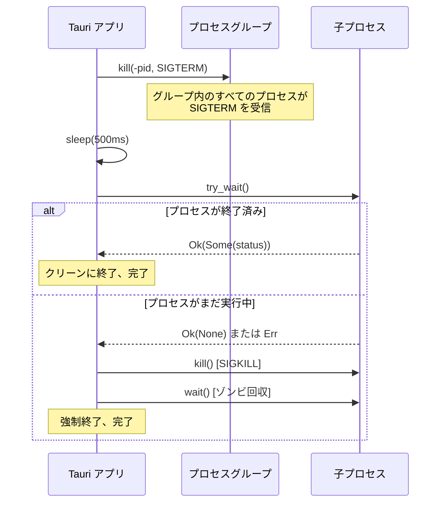
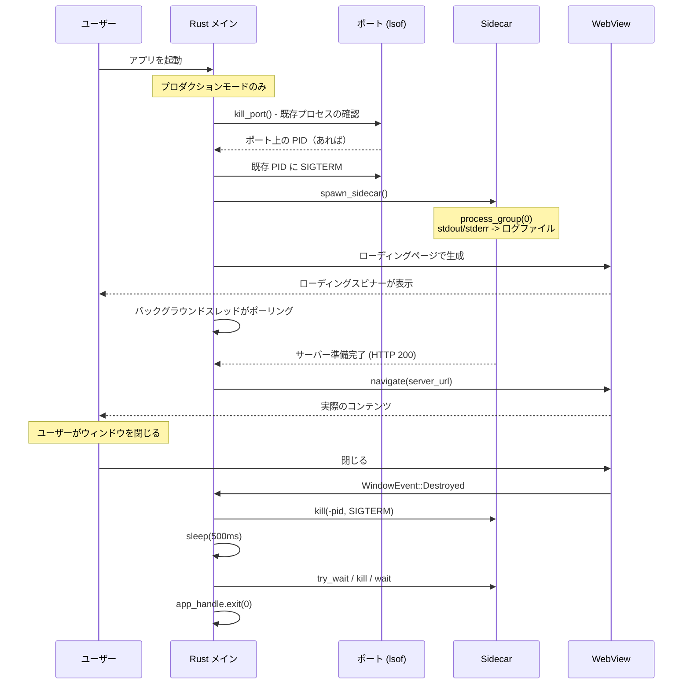

# プロセスライフサイクル

プロセスライフサイクルの管理は、Tauri ラッパーアプリで最もエラーが起きやすい部分の1つである。ここを間違えると、ゾンビプロセス、ポートの占有、2回目の起動ができないアプリという事態に陥る。

このページでは、ライフサイクルの全体像を扱う: 起動前のポートクリーンアップ、sidecar の stdout/stderr 処理、クリーンシャットダウンのためのプロセスグループ設定、macOS のウィンドウ閉じ＝終了パターン、そしてグレースフルな kill シーケンスである。

## 起動前に既存ポートをクリーンアップ

新しい sidecar を起動する前に、ポートが空いていることを確認する必要がある。アプリの前回インスタンスがクラッシュし、プロセスがポートをリッスンしたまま残っている可能性がある:

```rust
fn kill_port() {
    if let Ok(output) = Command::new("/usr/bin/lsof")
        .args(["-ti", &format!(":{PORT}")])
        .output()
    {
        let pids = String::from_utf8_lossy(&output.stdout);
        for line in pids.trim().lines() {
            if let Ok(pid) = line.trim().parse::<i32>() {
                log(&format!(
                    "kill_port: killing stale pid {pid} on port {PORT}"
                ));
                // SAFETY: pid は lsof から取得した有効なプロセス ID
                unsafe { libc::kill(pid, libc::SIGTERM) };
            }
        }
        if !pids.trim().is_empty() {
            thread::sleep(Duration::from_millis(500));
        }
    }
}
```

重要な点:

- 絶対パスで `/usr/bin/lsof` を使用（開発・プロダクション両方で動作）
- `-ti` で簡潔な出力（PID のみ、ヘッダなし）を指定のポートに対して取得
- `SIGKILL`（強制）ではなく `SIGTERM`（グレースフル）を送信
- プロセスが実際に終了するまで 500ms 待機
- すべての `spawn_sidecar()` の前に呼び出す

<Warning>

sidecar を起動する前に必ず `kill_port()` を呼び出すこと。この手順を省略して古いプロセスがポートを保持していると、新しい sidecar はバインドに失敗するか別のポートにバインドし、アプリは接続できなくなる。

</Warning>

### kill_port() を呼び出すタイミング

```rust
fn main() {
    let sidecar: Option<Sidecar> = if IS_DEV {
        None
    } else {
        kill_port();  // 初回起動前にクリーンアップ
        Some(spawn_sidecar(&pnpm_path))
    };
}

fn do_refresh(app_handle: &AppHandle) {
    // リフレッシュ時: 古い sidecar を kill → ポートをクリーンアップ → 新しい sidecar を起動
    if let Some(mut old) = guard.take() {
        kill_sidecar(&mut old);
    }
    kill_port();  // 再起動前にクリーンアップ
    *guard = Some(spawn_sidecar(&pnpm_path));
}
```

## sidecar の stdout/stderr リダイレクト

sidecar の出力はどこかに送る必要がある。親の stdout/stderr を継承する方法は開発モードでは動作するが（ターミナルで確認できる）、プロダクションでは無意味である（ターミナルがない）。ログファイルにリダイレクトする:

```rust
fn spawn_sidecar(pnpm_path: &std::path::Path) -> Sidecar {
    let sidecar_log_path = app_dir().join(".tauri-sidecar-log");

    let log_file = fs::OpenOptions::new()
        .create(true)
        .write(true)
        .truncate(true)  // 起動ごとに新しいログ
        .open(&sidecar_log_path)
        .unwrap_or_else(|e| {
            panic!("Failed to open sidecar log at {}: {e}",
                sidecar_log_path.display());
        });
    let log_file_clone = log_file
        .try_clone()
        .expect("Failed to clone sidecar log file handle");

    let mut cmd = Command::new(pnpm_path);
    cmd.args(["dev"])
        .current_dir(&target_dir)
        .stdout(Stdio::from(log_file))       // stdout -> ログファイル
        .stderr(Stdio::from(log_file_clone)); // stderr -> 同じログファイル

    // ...起動処理
}
```

<Note>

`try_clone()` の呼び出しが必要なのは、`Stdio::from()` がファイルハンドルの所有権を取得するためである。stdout 用と stderr 用に2つの別々のハンドルが必要だが、それらは同じファイルを指す。

</Note>

### ログファイル戦略

ここで使用しているパターンは:

- **起動ごとにトランケート**（`write(true).truncate(true)`） -- ログファイルには現在のセッションの出力のみ含まれる
- **アプリスコープのパス**（アプリディレクトリ内の `.tauri-sidecar-log`） -- デバッグ時に見つけやすい
- **アプリログとは別管理** -- アプリ自体のログ（`.tauri-log`）はライフサイクルイベントを追跡し、sidecar ログは生の stdout/stderr をキャプチャする

## クリーンシャットダウンのためのプロセスグループ

これは最も重要なパターンの1つである。`pnpm dev` のような sidecar を起動すると、それ自身が子プロセス（Vite、esbuild など）を起動する。`pnpm` プロセスだけを kill しても、その子プロセスは孤児となりポートを保持し続ける。

解決策は、sidecar を独自の**プロセスグループ**内で起動することである:

```rust
let mut cmd = Command::new(pnpm_path);
cmd.args(["dev"])
    .current_dir(&dir)
    .stdout(Stdio::from(log_file))
    .stderr(Stdio::from(log_file_clone));

#[cfg(unix)]
{
    use std::os::unix::process::CommandExt;
    cmd.process_group(0);  // 新しいプロセスグループ、PGID = 子プロセスの PID
}

let child = cmd.spawn().expect("Failed to spawn sidecar");
let pid = child.id();
```

`process_group(0)` は、子プロセスの PID をグループ ID とする新しいプロセスグループを作成するよう OS に指示する。この子プロセスが起動するすべてのプロセス（およびその子プロセス）は、このグループ ID を継承する。

### なぜこれが重要か

`process_group(0)` なしの場合:

```
Tauri アプリ (PID 100)
  └── pnpm (PID 200)     <-- これは kill できる
        └── vite (PID 300)  <-- これが孤児になる！
              └── esbuild (PID 400)  <-- これも！
```

`process_group(0)` ありの場合:

```
Tauri アプリ (PID 100)
  └── [プロセスグループ PGID=200]
        ├── pnpm (PID 200)
        ├── vite (PID 300)
        └── esbuild (PID 400)

kill(-200, SIGTERM) → すべてを kill できる
```

## macOS のウィンドウ閉じ＝終了パターン

macOS では、最後のウィンドウを閉じてもデフォルトではアプリケーションが終了しない -- プロセスは Dock に残り続ける。ラッパーアプリでは、これは誤った動作である: ウィンドウが閉じられたら、sidecar を kill してアプリを終了すべきだ。

```rust
.build(tauri::generate_context!())
.expect("error while building tauri application")
.run(move |app_handle, event| match &event {
    tauri::RunEvent::WindowEvent {
        event: tauri::WindowEvent::Destroyed,
        ..
    } => {
        // ウィンドウ閉じ時に sidecar を kill
        if !IS_DEV {
            if let Ok(mut g) = sidecar_for_exit.lock() {
                if let Some(mut s) = g.take() {
                    kill_sidecar(&mut s);
                }
            }
        }
        // アプリを強制終了
        app_handle.exit(0);
    }
    _ => {}
});
```

<Warning>

`app_handle.exit(0)` を忘れると、ウィンドウが閉じられた後も Rust プロセスは動作し続ける。sidecar も（kill を忘れた場合）動作し続ける。ユーザーにはウィンドウのない Dock アイコンが見え、なぜポートがまだ占有されているのか疑問に思うことになる。

</Warning>

### sidecar_for_exit パターン

sidecar の状態は `.run()` クロージャからアクセスできる必要があるが、これは `.setup()` クロージャとは別のスコープである。パターンとしては、アプリのビルド前に `Arc<Mutex<>>` をクローンする:

```rust
let app_state = AppState {
    sidecar: Arc::new(Mutex::new(sidecar)),
    pnpm_path: found_pnpm,
    zoom: Mutex::new(1.0),
};

// app_state を .manage() にムーブする前に Arc をクローン
let sidecar_for_exit = app_state.sidecar.clone();

tauri::Builder::default()
    .manage(app_state)  // app_state はここでムーブされる
    .setup(|app| { /* ... */ })
    .build(tauri::generate_context!())
    .run(move |app_handle, event| {
        // sidecar_for_exit はここからアクセス可能
        // ...
    });
```

## sidecar の kill シーケンス

kill シーケンスは2段階のアプローチをとる: まずグレースフルシャットダウンを試み、必要なら強制 kill する。

```rust
fn kill_sidecar(sidecar: &mut Sidecar) {
    log(&format!("kill_sidecar: pid={}", sidecar.pid));

    // フェーズ1: プロセスグループ全体に SIGTERM
    #[cfg(unix)]
    {
        if let Ok(pid) = i32::try_from(sidecar.pid) {
            if pid > 0 {
                // 負の PID でプロセスグループ全体にシグナルを送る
                // SAFETY: pid は有効な子プロセス ID
                unsafe { libc::kill(-pid, libc::SIGTERM) };
            }
        }
    }

    // グレースフルシャットダウンを待つ
    thread::sleep(Duration::from_millis(500));

    // フェーズ2: 終了を確認し、まだなら強制 kill
    match sidecar.child.try_wait() {
        Ok(Some(_)) => {
            log("kill_sidecar: process already exited");
        }
        _ => {
            log("kill_sidecar: escalating to SIGKILL");
            let _ = sidecar.child.kill();  // SIGKILL
            let _ = sidecar.child.wait();  // ゾンビプロセスの回収
        }
    }
}
```

### 2段階プロセスの解説



重要なポイント:

1. **`-pid`（負の値）への SIGTERM** はトップレベルのプロセスだけでなくプロセスグループ全体を対象とする
2. **500ms の待機**はプロセスにクリーンアップ（バッファのフラッシュ、コネクションの切断）の時間を与える
3. **`try_wait()`** はブロックせずにプロセスの終了を確認する
4. **`kill()` の後に `wait()`** -- `kill()` が SIGKILL を送り、`wait()` がゾンビプロセスを回収してリソースリークを防ぐ

<Tip>

`kill()` の後の `wait()` 呼び出しは不可欠である。これがないと、kill されたプロセスはゾンビとなる -- もう実行されないが、親がリープするまでプロセステーブルにエントリが残り続ける。

</Tip>

## 完全なライフサイクルシーケンス

アプリの起動から終了までの全ライフサイクルは以下のとおりである:



## 準備完了ループでの sidecar の死亡検出

素朴な準備完了ループは `/___ready` をポーリングし、`Ready` を返すかタイムアウトで諦めるだけである。sidecar が健全なときはそれで動くが、sidecar がすでに死んでいる場合 -- 典型的には初回起動時に `node_modules/` が存在しないケース -- タイムアウト時間をフルに消費してしまう。ユーザーは 120 秒間ローディングページを見せられ、その後アプリは死んだポートにナビゲートする。

解決策は、子プロセスがすでに終了している場合に `wait_for_ready` が短絡的に抜けられるようにすることだ。sidecar ハンドルを渡し、各ポーリング毎に `Child::try_wait()` を呼ぶ:

```rust
pub enum ReadyResult {
    Ready,
    Timeout,
    SidecarExited { code: Option<i32> },
}

pub fn wait_for_ready(
    sidecar: &Arc<Mutex<Option<Sidecar>>>,
    timeout: Duration,
) -> ReadyResult {
    let start = Instant::now();
    while start.elapsed() < timeout {
        // ロックは狭いスコープで取得する -- curl 呼び出しをまたいで保持してはならない。
        if let Ok(mut guard) = sidecar.lock() {
            if let Some(s) = guard.as_mut() {
                match s.child.try_wait() {
                    Ok(Some(status)) => {
                        return ReadyResult::SidecarExited {
                            code: status.code(),
                        };
                    }
                    Ok(None) => {} // まだ実行中
                    Err(e) => log(&format!("try_wait error: {e}")),
                }
            }
        }

        let code = check_ready();
        if code != "000" && code != "err" {
            thread::sleep(Duration::from_secs(1));
            return ReadyResult::Ready;
        }
        thread::sleep(Duration::from_secs(1));
    }
    ReadyResult::Timeout
}
```

押さえるべき点は 3 つある:

- **`try_wait()` は軽い。** `waitpid(WNOHANG)` 1 回分のシステムコールで、子プロセスが走っている間は `Ok(None)` を、終了した時点で `Ok(Some(status))` を返す。1 Hz のポーリングで呼んでも問題ない。
- **ミューテックスのロックは狭いスコープで。** ロック取得 → `try_wait()` → `curl` を実行する前にガードを破棄する。ネットワーク呼び出しをまたいでガードを保持してしまうと、同じミューテックスを必要とするリフレッシュや終了などのパスをブロックする。
- **両方の呼び出し元で `ReadyResult` を分岐処理する。** `setup()` の初回起動と `do_refresh()` のどちらも enum を消費し、死んだポートへナビゲートする代わりに `launch-error` イベントを発火する。フロントエンド側は[ローディング画面 → エラー状態とリトライ](./loading-screen.mdx#エラー状態とリトライ)を参照。

<Warning>

`curl` の呼び出しをまたいで `Mutex<Option<Sidecar>>` のガードを保持してはならない。ロックを握ったままの 1 秒の curl は、同じミューテックスに触れる必要があるリフレッシュやリトライ、ウィンドウクローズのイベントをすべて止めるのに十分な時間である。ガードは `try_wait()` の読み取りだけをカバーするスコープにする。

</Warning>

### launch-error イベントの発火

`wait_for_ready` が `Timeout` または `SidecarExited` を返したら、死んだ URL へナビゲートする代わりに Tauri イベントを発火する。ローディングページがそれをリスンし、エラー状態に切り替わる（loading-screen.mdx 参照）。

```rust
use tauri::{AppHandle, Emitter, Manager};

fn emit_launch_error(app_handle: &AppHandle, reason: &str) {
    if let Some(w) = app_handle.get_webview_window("main") {
        let _ = w.emit(
            "launch-error",
            serde_json::json!({
                "reason": reason,
                "logPath": sidecar_log_path().to_string_lossy(),
            }),
        );
    }
}

// setup() / do_refresh() 内:
match wait_for_ready(&state.sidecar, Duration::from_secs(120)) {
    ReadyResult::Ready => {
        let _ = w.navigate(server_url().parse().unwrap());
    }
    ReadyResult::Timeout => emit_launch_error(&handle, "timeout"),
    ReadyResult::SidecarExited { .. } => {
        emit_launch_error(&handle, "sidecar_exited");
    }
}
```

<Tip>

`tauri::Emitter` は v2 のトレイトで、`AppHandle` と `WebviewWindow` の両方に `.emit()` を追加する。アプリハンドルからではなくウィンドウから emit することで、そのウィンドウのフロントエンドリスナーに狙って届けられる。

`serde_json` は `tauri` 経由で推移的に入ってくるので、`dev-dependencies` から `dependencies` に昇格させてもコンパイル時間は変わらない。カスタム構造体を定義する代わりに `serde_json::json!` でペイロードを組み立てられるようになる。

</Tip>

## ロギング

アプリ自体のライフサイクルイベントと sidecar の出力は、別々のファイルに記録すべきである:

```rust
fn log(msg: &str) {
    use std::io::Write;
    let path = app_dir().join(".tauri-log");
    if let Ok(mut f) = fs::OpenOptions::new()
        .create(true)
        .append(true)  // トランケートではなく追記
        .open(&path)
    {
        let secs = SystemTime::now()
            .duration_since(UNIX_EPOCH)
            .unwrap_or_default()
            .as_secs();
        let _ = writeln!(f, "[{secs}] {msg}");
    }
}
```

これにより、デバッグ用に2つのログファイルが得られる:

| ファイル | 内容 |
|------|----------|
| `.tauri-log` | アプリライフサイクルイベント（起動、kill、準備完了、タイムアウト） |
| `.tauri-sidecar-log` | sidecar の生の stdout/stderr |

アプリログは `append(true)` で起動をまたいで蓄積する（間欠的な問題のデバッグに有用）。sidecar ログは `truncate(true)` で現在のセッションの出力のみを保持する。
