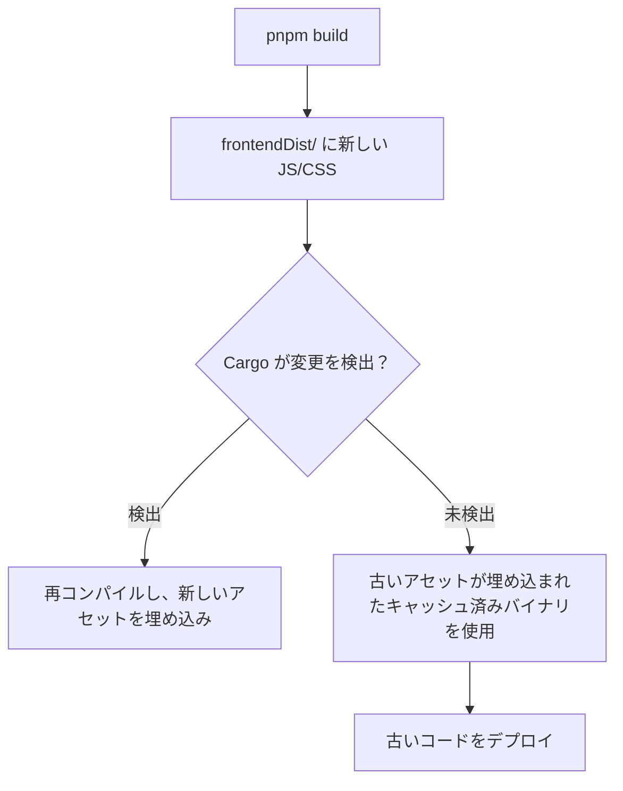

# Cargo キャッシュ無効化

Cargo はインクリメンタルコンパイルに優れており、変更されたもののみを再コンパイルする。しかし、この賢さが Tauri のフロントエンドアセット埋め込みに関しては裏目に出ることがある。Cargo が `frontendDist` 内のファイルの変更を検出できず、古いフロントエンドコードが含まれた本番ビルドが生成される場合がある。

## 問題

`cargo tauri build` を実行すると、まずフロントエンドビルド（`beforeBuildCommand`）が実行され、`frontendDist` に新しいファイルが生成される。次に Cargo が Rust コードをコンパイルし、`tauri::generate_context!()` を呼び出してそれらのファイルを埋め込む。

問題は、Cargo が Rust ソースファイルと `Cargo.toml` の変更は追跡するが、`frontendDist` の内容の変更を常に検出するとは限らないことである。フロントエンドのみが変更された場合（Rust コードの変更なし）、Cargo は古いフロントエンドアセットが埋め込まれたキャッシュ済みバイナリを再利用する可能性がある。



## 解決策

### build.rs の rerun-if-changed（根本原因の修正）

最善の解決策は、`build.rs` で Cargo にフロントエンド出力ディレクトリを監視するよう指示することである。これにより、手動の介入なしに Cargo が自動的にフロントエンドの変更を検出する：

```rust
// src-tauri/build.rs
fn main() {
    // Watch the frontend dist directory for changes
    println!("cargo:rerun-if-changed=../dist");
    tauri_build::build()
}
```

パス（`../dist`、`../dist-renderer` など）は `src-tauri/` からの相対パスで、実際の `frontendDist` ディレクトリに合わせて調整すること。これにより、`cargo tauri build` は常にフロントエンドの変更を検出し、最新のアセットを再埋め込みする。

<Tip>

これは根本原因を修正する唯一の解決策である。以下の他の解決策はすべて、各ビルドの前に手動操作が必要な回避策である。`build.rs` に `rerun-if-changed` を追加すれば、以降のセクションはスキップできる。

</Tip>

### touch src/main.rs

古典的な回避策は、Rust ソースファイルを touch して Cargo に再コンパイルを強制することである。

```bash
touch src/main.rs
cargo tauri build
```

<Warning>

`touch src/main.rs` は常に確実に動作するとは限らない。Cargo の変更検出は時間とともに賢くなっており、ファイルの内容が実際には変更されていない（タイムスタンプのみ変更）ことを認識して、再コンパイルをスキップする場合がある。

</Warning>

### cargo clean -p（推奨）

確実な解決策は、自分のクレートのビルド成果物のみをクリーンし、新規コンパイルを強制することである。

```bash
# Clean only your crate (fast, doesn't rebuild all dependencies)
cargo clean -p your-crate-name

# Then build
cargo tauri build
```

`your-crate-name` を `Cargo.toml` の `name` フィールドの値に置き換えること。すべての依存関係ではなく、自分のクレートの成果物のみを削除するため、`cargo clean` よりもはるかに高速である。

```bash
# Example for a crate named "zudotext"
cargo clean -p zudotext
cargo tauri build
```

<Tip>

忘れないよう、ビルドスクリプトや Makefile に追加しておくとよい。

```bash
# build.sh
#!/bin/bash
set -e
cargo clean -p zudotext
cargo tauri build
```

</Tip>

### 完全な cargo clean（最終手段）

`cargo clean -p` で解決しない場合は、すべてをクリーンする。

```bash
cargo clean
cargo tauri build
```

これはすべての依存関係をゼロからリビルドするため、所要時間が大幅に増加する（秒単位ではなく分単位）。最終手段としてのみ使用すること。

## ビルドの検証

ビルド後、新しいフロントエンドコードが実際にバイナリに埋め込まれていることを確認する。

### 新しいコードが存在することの確認

新しいフロントエンドビルドに存在するはずの文字列を検索する。

```bash
# Search for a known string from the new frontend code
grep -c "your-new-feature-string" \
  target/release/bundle/macos/YourApp.app/Contents/Resources/*.js

# Or in the main binary (if assets are embedded directly)
strings target/release/YourApp | grep "your-new-feature-string"
```

### 古いコードが存在しないことの確認

削除または変更された文字列を検索する。

```bash
# This should return 0 matches
grep -c "old-removed-string" \
  target/release/bundle/macos/YourApp.app/Contents/Resources/*.js
```

古い文字列が見つかった場合、ビルドにはまだ古いコードが含まれている。`cargo clean -p` に戻って実行すること。

### ビルドタイムスタンプの確認

```bash
# When was the binary built?
stat -f "%Sm" target/release/YourApp

# When were the frontend assets built?
stat -f "%Sm" dist-renderer/index.html
```

バイナリのタイムスタンプはフロントエンドビルドのタイムスタンプ**より後**であるべきである。バイナリの方が古い場合、Cargo は再コンパイルしていない。

## フロントエンドにビルドタイムスタンプを表示する

ビルドが最新であることを確認する最も確実な方法は、フロントエンドの UI にビルドタイムスタンプを直接埋め込むことである。たとえばアプリの設定ダイアログに表示すれば、JS バンドルを grep したり `stat` を実行したりせずに、一目で確認できる。

### Vite でタイムスタンプを注入する

Vite の `define` オプションを使用して、コンパイル時にビルドタイムスタンプを注入する：

```typescript
// vite-shared.ts (or vite.config.ts)
export const buildDefines = {
  __BUILD_TIMESTAMP__: JSON.stringify(new Date().toISOString()),
};
```

```typescript
// vite.config.ts
import { buildDefines } from "./vite-shared";

export default defineConfig({
  define: buildDefines,
  // ...
});
```

### グローバル型の宣言

TypeScript が注入されたグローバル変数を認識できるよう、型宣言を追加する：

```typescript
// globals.d.ts
declare const __BUILD_TIMESTAMP__: string;
```

### アプリ内での表示

設定ダイアログや About 画面にタイムスタンプを表示する：

```tsx
// settings-dialog.tsx
<p className="text-muted">build: {__BUILD_TIMESTAMP__}</p>
```

ビルド時に Vite が `__BUILD_TIMESTAMP__` をリテラル文字列 `"2026-04-06T10:17:18.054Z"` に置換するため、JS バンドルに直接埋め込まれる。リビルド後にアプリが古いタイムスタンプを表示している場合、そのビルドには古いフロントエンドコードが含まれている。`build.rs` の修正または `cargo clean -p` を適用すること。

<Tip>

このアプローチは任意の Vite `define` で使用できる。同様の方法で git コミットハッシュ、バージョン番号、環境名なども注入可能である。

</Tip>

## 自動化

古いアセットを含むビルドをデプロイしてしまうことを防ぐため、デプロイスクリプトに検証を追加する。

```bash
#!/bin/bash
set -e

APP_NAME="zudotext"
EXPECTED_STRING="v2.1.0"  # Something unique to the current version

# Force fresh build
cargo clean -p "$APP_NAME"
cargo tauri build

# Verify
if ! strings "target/release/$APP_NAME" | grep -q "$EXPECTED_STRING"; then
  echo "ERROR: Expected string '$EXPECTED_STRING' not found in binary!"
  echo "The build may contain stale frontend assets."
  exit 1
fi

echo "Build verified: contains '$EXPECTED_STRING'"
```

## なぜこれが起こるのか

Tauri はコンパイル時に `include_dir` マクロ（`tauri::generate_context!()` 経由）を使用してフロントエンドアセットを埋め込む。これはビルドスクリプトではなく、コンパイル時に実行されるプロシージャルマクロである。Cargo のプロシージャルマクロ入力に対する依存関係追跡には制限があり、マクロの呼び出し元（通常は `main.rs`）は追跡するが、マクロが読み込む外部ファイルは追跡しない。

これは Tauri のバグではなく、Cargo のビルドシステムの既知の制限である。回避策（`cargo clean -p`）が公式の推奨事項となっている。
