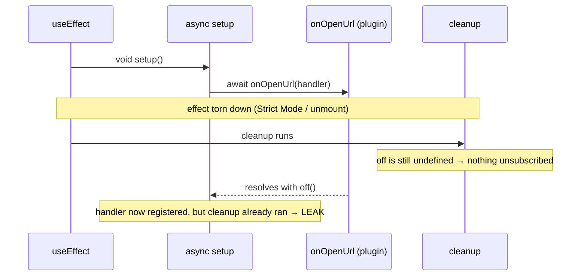

## ディープリンクとは何か

ディープリンクとは、ブラウザではなくアプリへ OS が引き渡すカスタム URL スキーム（`zudotext://open?workspace=...`）のことだ。こうしたリンクをクリックする（あるいは通知から開く）と、OS がアプリを起動またはフォアグラウンドに戻し、その URL をコードへ届ける。`tauri-plugin-deep-link` はこのスキームを OS に登録し、URL をフロントエンドへ届ける役割を担う。

このページでは、人がつまずく 2 点を扱う。

1. **登録** -- スキームをどこで宣言するか、なぜ `init()` がプラットフォームでゲートされるか。
2. **非同期な解除レース** -- React のエフェクトが購読の途中で破棄されたとき、URL ハンドラがリークしてしまう微妙なバグ。

## スキームを登録する

カスタムスキームは Tauri 設定の `plugins.deep-link` 配下で宣言する。マルチ設定の構成では、スキームは共有のベース設定ではなく、その機能を実際に出荷する**バリアント**設定（たとえば `tauri.conf.writing.json`）に置く。

```json
{
  "plugins": {
    "deep-link": {
      "desktop": {
        "schemes": ["zudotext"]
      }
    }
  }
}
```

Rust 側では、プラグインをビルダーへ組み込む。重要なのは `#[cfg(...)]` によるゲートだ。

```rust
fn main() {
    let builder = tauri::Builder::default()
        // zudotext:// URL scheme — registers the custom protocol with the OS
        // and emits a deep-link event to the renderer whenever the app is
        // opened (or foregrounded) via a zudotext:// link. The scheme itself
        // is declared in the variant config under plugins.deep-link.
        .plugin(tauri_plugin_deep_link::init());

    builder
        .run(tauri::generate_context!())
        .expect("error while running tauri application");
}
```

<Warning>

`tauri_plugin_deep_link::init()` は **iOS では無効化**すべきだ。デスクトップのスキーム登録と、iOS の Universal Links／カスタムスキームの経路は異なるネイティブリンカーのサポートを使うため、デスクトップ向けの `init()` はそのままでは通用しない。

```rust
#[cfg(not(target_os = "ios"))]
let builder = builder.plugin(tauri_plugin_deep_link::init());
```

これはスタイルの好みではなく、プラットフォームに課された制約だ -- その値は各 OS がカスタムスキームをどう解決するかによって固定される。

</Warning>

## フロントエンドから購読する

フロントエンドは `@tauri-apps/plugin-deep-link` の `onOpenUrl` ヘルパーで購読する。Tauri ランタイムを持たない Web／モックビルドからプラグインをツリーシェイクで取り除けるよう、**動的インポート**で読み込むこと。

```tsx
const { onOpenUrl } = await import("@tauri-apps/plugin-deep-link");
const off = await onOpenUrl((urls: string[]) => {
  for (const rawUrl of urls) {
    const url = new URL(rawUrl);
    if (url.protocol !== "zudotext:") continue;
    // route the URL into the app...
  }
});
```

`onOpenUrl` は解除関数（`off`）に解決する Promise を返す。この一点 -- 購読が**非同期に**確立されること -- が以下のバグの原因のすべてだ。

## 非同期な解除レース

React では自然とこれを `useEffect` に置き、クリーンアップ関数を返すことになる。だが `onOpenUrl` は `await` されるため、**待っている最中にエフェクトが破棄されうる**。Strict Mode（二重実行）、素早いアンマウント、依存配列の変化による再レンダリングのいずれもがクリーンアップを `await` の解決前に走らせる。

そうなると、素朴なクリーンアップは `off` がまだ `undefined` のまま走り -- 何も解除しない。その直後に `await` が解決してハンドラが登録され、今や**そのハンドラを解除する者は誰もいない**。ディープリンクのハンドラはリークし、次回のマウントでは 2 つ目が登録されてしまう。



修正はクロージャに捕捉した `cancelled` フラグだ。`await` が解決したらこれを確認する。すでにクリーンアップが走っていれば、その場で `off()` を呼んで return する。そうでなければ `off` を保存し、（将来の）クリーンアップがそれを使えるようにする。

```tsx
import { useEffect } from "react";

function useDeepLink(onUrl: (url: URL) => void) {
  useEffect(() => {
    let unsubscribe: (() => void) | undefined;
    let cancelled = false;

    const setup = async () => {
      // Guard: only register inside the real Tauri runtime.
      if (!("__TAURI_INTERNALS__" in globalThis)) return;
      try {
        // Dynamic import so the plugin is tree-shaken from web/mock builds.
        const { onOpenUrl } = await import("@tauri-apps/plugin-deep-link");
        const off = await onOpenUrl((urls: string[]) => {
          for (const rawUrl of urls) {
            try {
              onUrl(new URL(rawUrl));
            } catch {
              // Malformed URL — silently skip.
            }
          }
        });
        // The effect may have been torn down while awaiting onOpenUrl.
        // If so, cleanup already ran with `unsubscribe` undefined, so
        // unsubscribe here to avoid leaking the deep-link handler.
        if (cancelled) {
          off();
          return;
        }
        unsubscribe = off;
      } catch (err) {
        // Plugin not available (web/mock mode) — no-op.
        console.debug("[deep-link] plugin not available:", err);
      }
    };

    void setup();
    return () => {
      cancelled = true;
      unsubscribe?.();
    };
  }, [onUrl]);
}
```

2 つの分岐がレース全体をカバーする。

- **`off` を保存した後にクリーンアップが走る** -- 通常の経路。`unsubscribe?.()` が発火しハンドラが取り除かれる。
- **`off` が解決する前にクリーンアップが走る** -- レースの経路。`unsubscribe` はまだ `undefined` なのでクリーンアップは何も解除しないが、`cancelled = true` をセットする。`await` がようやく解決すると、`if (cancelled)` の分岐が自前で `off()` を呼ぶ。

<Tip>

このパターンは、解除ハンドルが `await` の後にしか得られない**あらゆる**購読に一般化できる。Tauri の `listen()`、`getCurrentWindow().onResized()`、動的にインポートしたイベントソースなどだ。クリーンアップ関数を得るために `await` するなら、それが届く頃にはエフェクトが消えている場合も併せて扱わなければならない。

</Tip>

## なぜ AbortController でなく素のブール値か

`AbortController` なら fetch をキャンセルできるが、`onOpenUrl` は signal を受け取らず、途中で中断もできない -- 常に実体のある購読に解決する。したがってここでキャンセルは無意味だ。必要なのは、**解決した購読にまだ所有者がいるかどうか**を知ることである。捕捉した `cancelled` ブール値はまさにその問いだけに答え、それ以上のことはしない。

## 要点

1. **スキームはバリアント設定の `plugins.deep-link` 配下で宣言する** -- 共有のベース設定ではない。
2. **`tauri_plugin_deep_link::init()` を `#[cfg(not(target_os = "ios"))]` でゲートする** -- デスクトップと iOS のスキーム登録はネイティブレベルで異なる。
3. **プラグインを動的インポートする** ことで、Tauri ランタイムを持たない Web／モックビルドからツリーシェイクで取り除く。
4. **`onOpenUrl` は非同期に解決する** ため、解除ハンドルを手にする前にエフェクトが破棄されうる。
5. **`cancelled` フラグを捕捉し**、エフェクトがすでに消えている場合は解決したコールバックの中から `off()` を呼ぶ -- さもなければディープリンクのハンドラがリークし、次回マウントで重複する。
