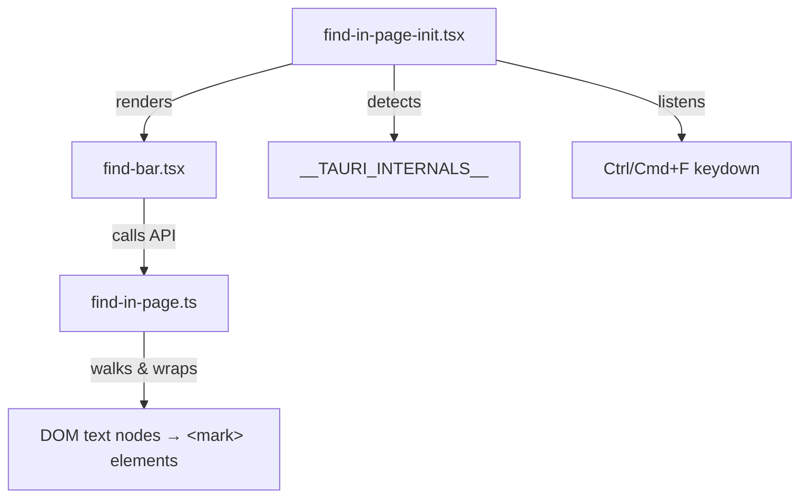

## なぜこれが必要か

Tauri の WebView はブラウザのネイティブな Ctrl+F 検索ダイアログを公開していない。Electron（`webContents.findInPage()` を提供）とは異なり、Tauri にはテキスト検索の組み込み API がない。アプリに長文コンテンツがあり、ユーザーが Ctrl+F の動作を期待する場合、DOM 操作を使って自前で実装する必要がある。

## アーキテクチャ

実装は明確な関心の分離を持つ 3 つのファイルに分割される：

| ファイル | 役割 | 依存関係 |
|---|---|---|
| `utils/find-in-page.ts` | 純粋な DOM 検索ユーティリティ | なし（フレームワーク非依存） |
| `components/find-bar.tsx` | 検索 UI（入力欄 + ナビゲーションボタン） | React、find-in-page ユーティリティ |
| `components/find-in-page-init.tsx` | Tauri 検出 + キーボードバインディング | React、FindBar コンポーネント |



## コアユーティリティ: `createFindInPage()`

このユーティリティはコンテナ要素内のテキストノードを走査し、部分文字列マッチ（大文字小文字を区別しない）を見つけ、各マッチを `<mark>` 要素でラップする。シンプルな API を公開する：

- **`find(container, query)`** -- コンテナ内を検索し、すべてのマッチをハイライトし、最初のマッチをアクティブにする
- **`next()`** / **`prev()`** -- マッチをスクロール付きで循環する
- **`stop()`** -- すべてのハイライトを削除し、元のテキストノードを復元する

```typescript
export interface FindResult {
  matches: number;
  activeMatchOrdinal: number; // 1-based
}

export interface FindInPage {
  find(container: HTMLElement, query: string): FindResult;
  next(): FindResult;
  prev(): FindResult;
  stop(): void;
}
```

### 完全な実装

```typescript
// utils/find-in-page.ts

export interface FindResult {
  matches: number;
  activeMatchOrdinal: number; // 1-based
}

export interface FindInPage {
  find(container: HTMLElement, query: string): FindResult;
  next(): FindResult;
  prev(): FindResult;
  stop(): void;
}

const MATCH_CLASS = "find-match";
const ACTIVE_CLASS = "find-match-active";

const EMPTY_RESULT: FindResult = Object.freeze({
  matches: 0,
  activeMatchOrdinal: 0,
});

export function createFindInPage(): FindInPage {
  let matchElements: HTMLElement[] = [];
  let activeIndex = -1;

  function clearMarks(): void {
    const parentsToNormalize = new Set<Node>();
    for (let i = matchElements.length - 1; i >= 0; i--) {
      const mark = matchElements[i];
      const parent = mark.parentNode;
      if (parent) {
        const textNode = document.createTextNode(mark.textContent || "");
        parent.replaceChild(textNode, mark);
        parentsToNormalize.add(parent);
      }
    }
    for (const parent of parentsToNormalize) {
      (parent as Element).normalize();
    }
    matchElements = [];
    activeIndex = -1;
  }

  function setActive(index: number): void {
    if (activeIndex >= 0 && activeIndex < matchElements.length) {
      const prev = matchElements[activeIndex];
      prev.classList.remove(ACTIVE_CLASS);
    }
    activeIndex = index;
    if (activeIndex >= 0 && activeIndex < matchElements.length) {
      const current = matchElements[activeIndex];
      current.classList.add(ACTIVE_CLASS);
      current.scrollIntoView?.({ block: "center" });
    }
  }

  function currentResult(): FindResult {
    if (matchElements.length === 0) return EMPTY_RESULT;
    return {
      matches: matchElements.length,
      activeMatchOrdinal: activeIndex + 1,
    };
  }

  function find(container: HTMLElement, query: string): FindResult {
    clearMarks();
    if (!query) return EMPTY_RESULT;

    const lowerQuery = query.toLowerCase();
    const walker = document.createTreeWalker(
      container,
      NodeFilter.SHOW_TEXT,
      null,
    );
    const textNodes: Text[] = [];
    let node: Text | null;
    while ((node = walker.nextNode() as Text | null)) {
      textNodes.push(node);
    }

    for (const textNode of textNodes) {
      const text = textNode.textContent || "";
      const lowerText = text.toLowerCase();
      const positions: number[] = [];
      let searchFrom = 0;
      while (searchFrom < lowerText.length) {
        const idx = lowerText.indexOf(lowerQuery, searchFrom);
        if (idx === -1) break;
        positions.push(idx);
        searchFrom = idx + lowerQuery.length;
      }
      if (positions.length === 0) continue;

      const parent = textNode.parentNode;
      if (!parent) continue;

      let remainingNode: Text = textNode;
      const nodeMarks: HTMLElement[] = [];

      for (let i = positions.length - 1; i >= 0; i--) {
        const pos = positions[i];
        const matchLen = query.length;
        if (pos + matchLen < remainingNode.length)
          remainingNode.splitText(pos + matchLen);
        let matchNode: Text;
        if (pos > 0) {
          matchNode = remainingNode.splitText(pos);
        } else {
          matchNode = remainingNode;
        }
        const mark = document.createElement("mark");
        mark.className = MATCH_CLASS;
        mark.textContent = matchNode.textContent;
        parent.replaceChild(mark, matchNode);
        nodeMarks.unshift(mark);
      }
      matchElements.push(...nodeMarks);
    }

    if (matchElements.length === 0) return EMPTY_RESULT;
    setActive(0);
    return currentResult();
  }

  function next(): FindResult {
    if (matchElements.length === 0) return EMPTY_RESULT;
    setActive((activeIndex + 1) % matchElements.length);
    return currentResult();
  }

  function prev(): FindResult {
    if (matchElements.length === 0) return EMPTY_RESULT;
    setActive(
      (activeIndex - 1 + matchElements.length) % matchElements.length,
    );
    return currentResult();
  }

  function stop(): void {
    clearMarks();
  }

  return { find, next, prev, stop };
}
```

### DOM 操作の仕組み

1. **TreeWalker** がコンテナ内のすべてのテキストノードを収集する
2. 各テキストノードについて、すべての部分文字列位置を検索する（大文字小文字を区別しない）
3. **分割とラップ** -- オフセットのずれを避けるため位置を逆順に処理する：
- `splitText()` でマッチした部分文字列を分離する
- テキストノードを `<mark class="find-match">` 要素に置き換える
4. **クリーンアップ**（`clearMarks`）はこのプロセスを逆転させる：各 `<mark>` をテキストノードに戻し、`normalize()` を呼んで隣接するテキストノードを再結合する

:::warning[単一テキストノードの制限]
このアプローチは単一の DOM テキストノード内のテキストのみマッチする。単語が要素をまたいで分割されている場合（例：`<em>hel</em>lo`）、"hello" にはマッチしない。ほとんどのコンテンツシナリオではこの制限は問題にならない。
:::

## 検索バー UI コンポーネント

検索バーはアクティブ時にビューポートの右上に表示されるフローティング React コンポーネントである。

**キーボードショートカット：**

- **Enter** -- 次のマッチ
- **Shift+Enter** -- 前のマッチ
- **Escape** -- 検索バーを閉じる

```tsx
// components/find-bar.tsx

import { useState, useRef, useEffect, useCallback } from "react";
import type { FindResult, FindInPage } from "@/utils/find-in-page";

interface FindBarProps {
  visible: boolean;
  onClose: () => void;
  findInPage: FindInPage;
  containerSelector: string;
}

export function FindBar({
  visible,
  onClose,
  findInPage,
  containerSelector,
}: FindBarProps) {
  const [query, setQuery] = useState("");
  const [matchInfo, setMatchInfo] = useState<FindResult | null>(null);
  const inputRef = useRef<HTMLInputElement>(null);

  useEffect(() => {
    if (visible) {
      inputRef.current?.focus();
      inputRef.current?.select();
    } else {
      setQuery("");
      setMatchInfo(null);
      findInPage.stop();
    }
  }, [visible, findInPage]);

  const handleFind = useCallback(
    (text: string) => {
      const container = document.querySelector(containerSelector);
      if (!text || !(container instanceof HTMLElement)) {
        setMatchInfo(null);
        findInPage.stop();
        return;
      }
      const result = findInPage.find(container, text);
      setMatchInfo(result.matches > 0 ? result : null);
    },
    [findInPage, containerSelector],
  );

  const handleKeyDown = useCallback(
    (e: React.KeyboardEvent) => {
      if (e.key === "Escape") {
        onClose();
      } else if (e.key === "Enter") {
        const result = e.shiftKey ? findInPage.prev() : findInPage.next();
        setMatchInfo(result.matches > 0 ? result : null);
      }
    },
    [onClose, findInPage],
  );

  if (!visible) return null;

  return (
    <div className="fixed top-[3.5rem] right-0 z-50 flex items-center gap-2 py-1.5 px-3 bg-surface border-b border-l border-muted rounded-bl-lg shadow-md">
      <input
        ref={inputRef}
        className="w-48 py-1 px-2 rounded text-small bg-bg border border-muted text-fg outline-none focus:border-accent"
        type="text"
        value={query}
        placeholder="Find in page..."
        aria-label="Find in page"
        onChange={(e) => {
          setQuery(e.target.value);
          handleFind(e.target.value);
        }}
        onKeyDown={handleKeyDown}
      />
      <span className="text-caption whitespace-nowrap min-w-[3rem] text-center text-fg/60">
        {matchInfo
          ? `${matchInfo.activeMatchOrdinal}/${matchInfo.matches}`
          : ""}
      </span>
      <button
        type="button"
        onClick={() => {
          const r = findInPage.prev();
          setMatchInfo(r.matches > 0 ? r : null);
        }}
        title="Previous (Shift+Enter)"
      >
        Prev
      </button>
      <button
        type="button"
        onClick={() => {
          const r = findInPage.next();
          setMatchInfo(r.matches > 0 ? r : null);
        }}
        title="Next (Enter)"
      >
        Next
      </button>
      <button type="button" onClick={onClose} title="Close (Esc)">
        Close
      </button>
    </div>
  );
}
```

## Tauri 統合と初期化

初期化コンポーネントはすべてを結びつける：Tauri 環境を検出し、Ctrl/Cmd+F をインターセプトし、Tauri 内で実行されている場合のみ検索バーをレンダリングする。

### Tauri 環境の検出

Tauri はグローバルな `__TAURI_INTERNALS__` オブジェクトを WebView に注入する。この存在を確認することで、開発中のブラウザ動作に影響を与えずに Tauri 固有の機能を条件付きで有効にできる：

```typescript
if (typeof window !== "undefined" && "__TAURI_INTERNALS__" in window) {
  // Tauri WebView 内で実行中
}
```

### 完全な初期化コンポーネント

```tsx
// components/find-in-page-init.tsx

import { useState, useEffect, useRef } from "react";
import { FindBar } from "./find-bar";
import { createFindInPage } from "@/utils/find-in-page";

const CONTENT_SELECTOR = "article.zd-content";

export default function FindInPageInit() {
  const [isTauri, setIsTauri] = useState(false);
  const [visible, setVisible] = useState(false);
  const findInPageRef = useRef(createFindInPage());

  // Tauri 環境を検出
  useEffect(() => {
    if (typeof window !== "undefined" && "__TAURI_INTERNALS__" in window) {
      setIsTauri(true);
    }
  }, []);

  // Tauri 内でのみ Cmd/Ctrl+F をインターセプト
  useEffect(() => {
    if (!isTauri) return;
    const handler = (e: KeyboardEvent) => {
      if ((e.metaKey || e.ctrlKey) && e.key === "f") {
        e.preventDefault();
        setVisible((prev) => !prev);
      }
    };
    document.addEventListener("keydown", handler);
    return () => document.removeEventListener("keydown", handler);
  }, [isTauri]);

  // Astro ページ遷移時にクリア
  useEffect(() => {
    const handler = () => {
      findInPageRef.current.stop();
      setVisible(false);
    };
    document.addEventListener("astro:before-swap", handler);
    return () => document.removeEventListener("astro:before-swap", handler);
  }, []);

  if (!isTauri) return null;

  return (
    <FindBar
      visible={visible}
      onClose={() => setVisible(false)}
      findInPage={findInPageRef.current}
      containerSelector={CONTENT_SELECTOR}
    />
  );
}
```

### 主な設計上の判断

- **find-in-page インスタンスに `useRef`** -- ユーティリティは内部状態（マッチリスト、アクティブインデックス）を保持する。`useRef` を使用することで、不要な再レンダリングを引き起こさずに 1 つのインスタンスが再レンダリング間で永続化される。
- **`containerSelector` prop** -- 検索を特定の要素（例：`article.zd-content`）にスコープすることで、ナビゲーション、ヘッダー、検索バー自体のテキストとのマッチを防止する。
- **トグル動作** -- Ctrl+F は検索バーを開くだけでなく開閉をトグルするため、ユーザーは同じショートカットで閉じることもできる。

## マッチハイライトの CSS

ユーティリティが挿入する `<mark>` 要素をスタイリングする：

```css
.find-match {
  background-color: rgba(255, 200, 0, 0.4);
  border-radius: 2px;
}
.find-match-active {
  background-color: rgba(255, 150, 0, 0.7);
  border-radius: 2px;
  outline: 2px solid rgba(255, 150, 0, 0.9);
}
```

アクティブなマッチはアウトラインリング付きのより強いオレンジ色を使用し、コンテンツが密なページでもユーザーが現在のマッチをすぐに確認できるようにする。

## ページ遷移時のクリーンアップ

クライアントサイドナビゲーション（View Transitions）を使用する Astro ベースのアプリでは、ページ間の遷移時に DOM が変更される。find-in-page の状態（ハイライトされた `<mark>` 要素、マッチリスト）は古くなるため、クリアする必要がある：

```typescript
document.addEventListener("astro:before-swap", () => {
  findInPage.stop();
  setVisible(false);
});
```

`astro:before-swap` イベントは Astro がページコンテンツを置き換える直前に発火するため、クリーンアップに適切なタイミングである。他のフレームワークでは同等のナビゲーションイベント（例：React Router の `useLocation` 変更、Next.js の `routeChangeStart`）を使用する。
