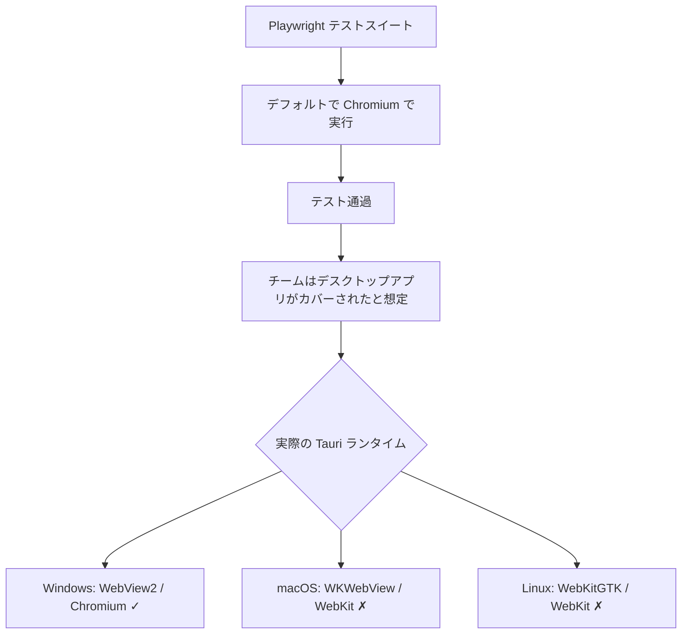
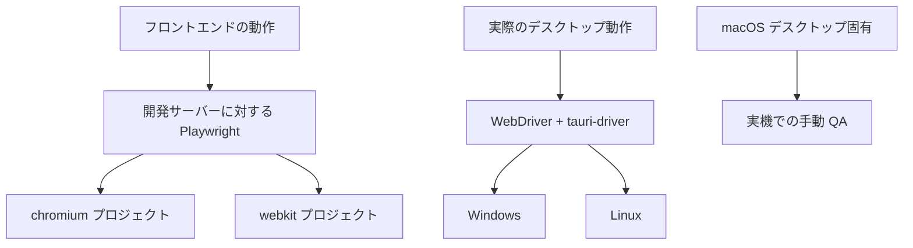

Playwright テストを Chromium だけで実行すると、実際の Tauri v2 アプリに出荷されるバグを見逃す可能性がある。

根本的な問題：Tauri はすべてのプラットフォームで同じレンダリングエンジンを使用しない。Windows では WebView2（Chromium ベース）を使用するが、macOS では WKWebView（WebKit）、Linux では WebKitGTK を使用する。Chromium で通過した Playwright スイートが、macOS や Linux の実際のアプリでは失敗する可能性がある。

<Warning>

**Chromium での Playwright テスト通過は、macOS や Linux での Tauri アプリの安全性を意味しない。** Playwright のプロジェクトマトリクスに必ず `webkit` を含める。

</Warning>

## 問題

よくあるテスト設定：

1. フロントエンド開発サーバーを起動する
2. `http://localhost:...` に対して Playwright を実行する
3. デフォルトブラウザ（Chromium）を使用する
4. Tauri デスクトップアプリを出荷し、テストがカバーしたと想定する

この想定は脆弱である。Tauri は 3 つのデスクトッププラットフォームのうち 2 つで、Chromium ではなくプラットフォームネイティブの WebView を使用する。

## プラットフォームエンジン表

| プラットフォーム | Tauri エンジン | Playwright デフォルト | 不一致？ |
| --- | --- | --- | --- |
| macOS | WKWebView (WebKit) | Chromium | **あり** |
| Windows | WebView2 (Edge/Chromium) | Chromium | なし（同系列） |
| Linux | WebKitGTK (WebKit) | Chromium | **あり** |

## なぜこれが起こるのか



実際には 2 つの異なるギャップがある：

1. **エンジンの不一致** -- テストは Chromium で実行されるが、本番環境では macOS/Linux で WebKit が実行される
2. **ランタイムの不一致** -- Playwright `webkit` を使用しても、テストは開発サーバーに対するブラウザセッションであり、完全な Tauri デスクトップアプリではない

<Info>

Playwright の `webkit` ブラウザは、Playwright チームがメンテナンスするパッチ済みの上流 WebKit ビルドである。Chromium よりも Tauri の WebKit ベースのランタイムにはるかに近いが、macOS のシステム WKWebView や Linux のディストリビューション固有の WebKitGTK とは **同一ではない**。

</Info>

## 修正：Playwright マトリクスに webkit を追加する

最小限の修正は、Chromium のみのテストをやめること。Playwright のプロジェクトリストに `webkit` を追加する：

```ts
// playwright.config.ts
import { defineConfig, devices } from "@playwright/test";

export default defineConfig({
  testDir: "./e2e",
  fullyParallel: true,
  retries: process.env.CI ? 2 : 0,
  use: {
    baseURL: "http://127.0.0.1:1420",
    trace: "on-first-retry",
  },
  webServer: {
    command: "pnpm dev",
    url: "http://127.0.0.1:1420",
    reuseExistingServer: !process.env.CI,
    timeout: 120_000,
  },
  projects: [
    {
      name: "chromium",
      use: { ...devices["Desktop Chrome"] },
    },
    {
      name: "webkit",
      use: { ...devices["Desktop Safari"] },
    },
  ],
});
```

CI で両方のプロジェクトを実行する：

```bash
pnpm exec playwright test
```

macOS や Linux のレンダリング問題を調査する際に WebKit のみ実行する：

```bash
pnpm exec playwright test --project=webkit
```

<Tip>

Tauri アプリが macOS や Linux をターゲットにしている場合、`webkit` を Playwright CI で **必須** として扱う。オプションではない。

</Tip>

## ブラウザレイヤーのテストがカバーしないもの

開発サーバーに対する Playwright はフロントエンドのリグレッションテストに有用であるが、以下は検証できない：

- Tauri IPC の動作（`invoke()`、`listen()`）
- ネイティブメニューとトレイ
- ファイルダイアログ
- ウィンドウ管理とマルチウィンドウ
- カスタムプロトコル統合
- デスクトップ固有の権限とパッケージング動作

ブラウザテストはフロントエンドがブラウザで動作することを証明する。パッケージ済みの Tauri デスクトップアプリがデスクトップアプリとして動作することは証明できない。

## 実際のデスクトップ E2E：WebDriver と tauri-driver

Tauri の公式テストドキュメントは、実際のデスクトップ E2E テストに [WebDriver via `tauri-driver`](https://v2.tauri.app/develop/tests/webdriver/) を推奨している。これはスタンドアロンのブラウザタブではなく、実際のデスクトップアプリをターゲットにする。

重要な制限はプラットフォームサポートである：

- **Windows**: サポートされている
- **Linux**: サポートされている
- **macOS**: **サポートされていない** -- WKWebView の WebDriver クライアントが存在しない

<Note>

`tauri-driver` はまだ「pre-alpha」とラベル付けされている。初期段階のインフラとして扱う。実際の信頼性を高めるところで使用するが、すべての手動検証を置き換えるとは想定しない。

</Note>

## Windows 固有のオプション：CDP 経由の Playwright

Windows は Playwright が実際の Tauri ランタイムに近づける唯一のプラットフォームである。Tauri は Windows で WebView2（Chromium ベース）を使用するため、Playwright は CDP 経由で接続できる：

```ts
import { chromium, expect } from "@playwright/test";

// Tauri アプリがリモートデバッグを有効にして起動されている必要がある
// tauri.conf.json の additionalBrowserArgs: "--remote-debugging-port=9222"
const browser = await chromium.connectOverCDP("http://127.0.0.1:9222");
const context = browser.contexts()[0];
const page = context.pages()[0];

await expect(page.getByRole("heading", { name: "Dashboard" })).toBeVisible();
await browser.close();
```

これは Windows では有用であるが、macOS の WKWebView の問題は解決せず、Linux の WebKitGTK にも一般化できない。

## 階層化テスト戦略

Tauri v2 の実践的な戦略は、1 つのツールで全てをカバーするのではなく、階層化である。



### レイヤー 1：Web レイヤー向け Playwright

ルーティング、フォーム、バリデーション、非同期 UI 状態、レイアウトリグレッション、ブラウザ向け JavaScript をテストする。**マトリクスに必ず `webkit` を含める。**

### レイヤー 2：実際のデスクトップ E2E 向け WebDriver

Tauri IPC フロー、デスクトップウィンドウ動作、ネイティブ統合ポイントのテストに、**Windows と Linux** で `tauri-driver` と Selenium または WebdriverIO を使用する。

### レイヤー 3：macOS での手動 QA

macOS の WKWebView ではデスクトップ WebDriver が利用できないため、以下については手動テストが必要である：

- メニュー動作とキーボードショートカット
- ファイルダイアログとディープリンク
- トレイ操作
- マルチウィンドウ動作
- プラットフォーム固有のレンダリング特性

<Warning>

macOS デスクトップ固有の動作については、現時点では macOS 実機でのテストに完全に代わる自動化手段はない。

</Warning>

## 実プロジェクトでの実践パターン

### テスト可能な Rust ロジックのためのスタンドアロン core クレート

強力なパターンとして、ビジネスロジックを **Tauri 依存のない** スタンドアロンの Rust クレートに抽出する方法がある。これにより、Rust ユニットテストを GUI 環境やプラットフォーム固有の WebView ライブラリなしに、あらゆるプラットフォーム（CI の Linux ランナー、WSL2）で実行できる。

```
tauri-app/
  src/         # Tauri 固有の配線（コマンド、State、アプリ設定）
  core/        # スタンドアロンクレート — 純粋な Rust、Tauri 依存なし
    src/
      helpers/
      settings.rs
      messages.rs
    Cargo.toml  # serde, chrono のみ — tauri 依存なし
```

core クレートは標準的な `#[cfg(test)]` インラインテストモジュールを使用し、どこでも `cargo test` でテストできる。Tauri 固有のレイヤーは薄く保つ — core に委譲する IPC コマンドラッパーのみである。

### macOS 自動化の回避策としての REST API スモークテスト

Tauri アプリが REST API を公開している場合（サイドカーや組み込み HTTP サーバー経由など）、実際のアプリライフサイクルをスクリプト化することで macOS デスクトップテストを部分的に自動化できる：

1. AppleScript 経由で `.app` バンドルを起動する
2. REST API が到達可能になるまで待機する
3. 稼働中のアプリに対して HTTP ベースのスモークテストを実行する
4. AppleScript 経由でアプリを終了する
5. クリーンなシャットダウンを検証する（ポート解放、孤立プロセスなし）

これはビジュアルテストの代替にはならないが、実際の macOS アプリバンドル内でバックエンドが機能していることを検証できる — 古いバイナリ、不足リソース、壊れた IPC 配線などのデプロイメント問題を検出できる。

## 重要なポイント

1. **Tauri v2 はすべてのプラットフォームで同じレンダリングエンジンを実行しない** -- Windows は Chromium、macOS/Linux は WebKit
2. **Chromium のみの Playwright カバレッジは macOS と Linux に誤った安心感を与える**
3. **Playwright `webkit` は重要だが完全ではない** -- WKWebView や WebKitGTK と同一ではない
4. **ブラウザレイヤーのテストは Tauri ネイティブ機能をカバーしない** -- IPC、メニュー、ダイアログ、ウィンドウ管理
5. **公式のデスクトップ E2E パスは WebDriver** via `tauri-driver` だが、Windows と Linux のみ
6. **階層化戦略を使用する**：Web レイヤーには `webkit` 付き Playwright、デスクトップ E2E には WebDriver、macOS には手動 QA

## 参考リンク

- [Tauri Tests](https://v2.tauri.app/develop/tests/)
- [Tauri WebDriver](https://v2.tauri.app/develop/tests/webdriver/)
- [Tauri Webview Versions](https://v2.tauri.app/reference/webview-versions/)
- [Playwright Browsers](https://playwright.dev/docs/browsers)
- [Playwright WebView2](https://playwright.dev/docs/webview2)
