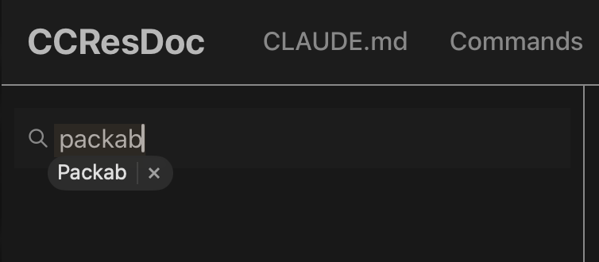

## 症状



macOS の Tauri アプリに検索入力欄を追加する。ユーザーが 1〜2 文字打った瞬間、入力欄の下に小さな浮遊バブルが出てくる -- 過去に入力した値と、それを消すための `×` ボタンが付いている。バブルをクリックすると、その値が入力欄に入る。

これは場違いに見える。アプリ自身が入力欄のすぐ下に独自の検索結果ドロップダウンを出していると、バブルがそれと重なってしまう。さらに悪いことに、バブルが提案している値はユーザーが前回たまたま入力した文字列にすぎず、アプリの実データとは何の関係もない。

これは Tauri のバグではない。**WebKit に組み込まれているフォーム自動補完の提案 UI** であり、Safari が表示しているのと同じものである。Tauri は macOS で WKWebView を使用しているため、その中で動く Web アプリには標準でこの挙動が付いてくる。

<Note>

Tauri アプリは WKWebView 内で動く Web アプリである。`<form>` や `<input>` に対して Safari が行うこと -- 自動補完、自動修正、スペルチェック、「Other Forms」の入力履歴 -- は、ページ側で明示的にオプトアウトしない限り、Tauri 内でも同じように発生する。

</Note>

<Info>

**プラットフォームの範囲。** この記事は macOS の Tauri アプリ -- 組み込みエンジンが WKWebView の場合 -- を対象としている。Windows のエンジンは WebView2（Chromium）、Linux のエンジンは WebKitGTK であり、それぞれ独自の自動補完機構を持っていて、挙動・デフォルト・無効化のノブが異なる。本記事で扱う HTML 属性（`autocomplete`、`autocorrect`、`autocapitalize`、`spellcheck`）は標準仕様であり広く移植可能であるが、以下で触れる WebKit 固有の癖 -- 特に `autocomplete="off"` がソフトなヒントとして扱われる点 -- は macOS / iOS の WKWebView 経路に固有の話である。

</Info>

## このバブルの正体

バブルは WebKit の **入力欄ごとの値履歴** である：同じフィールドに対して過去に入力された値を、オリジン（および WKWebView のデータストア）単位で保持している。以下のものでは **ない**：

- macOS の入力メソッド（IME）の予測変換
- インラインの自動修正 / テキスト置換
- HTML5 の `<datalist>`
- Tauri が注入しているオーバーレイ

WebKit は `name`、`id`、`type`、周囲のマークアップを元にしたヒューリスティクスで、どの入力欄を自動補完の対象にするかを決めている。資格情報フィールド（ログイン、パスワード）は別の経路で Keychain と紐付いている。それ以外 -- 検索ボックス、コメント欄、自由記述 -- については、そのオリジンとフィールドに対する WebKit のローカルな値キャッシュからバブルが出てくる。

ビルドしたばかりの Tauri アプリではキャッシュが空なので、初回起動時にバブルは出ない。同じ入力欄に何回かセッションをまたいで入力していくうちに、WebKit に十分な履歴が溜まり、提案を始める。

## 自動補完を残しておくべき場面

ほとんどの Web アプリでは残すのが正解である。ブラウザが自動補完を提供しているのは、ユーザーがそれを望んでいるからである：メールアドレス欄が自分のアドレスを覚えていてほしい、「氏名」欄に連絡先から流し込んでほしい、配送先住所をサイトごとに打ち直したくない -- これらの欄で自動補完を切ると、アプリが敵対的に感じられる。

デフォルトのままが正しいケース：

- ログインフォーム（バブルとは別経路で Keychain が処理する）
- プロフィール / 決済ページのメール、氏名、住所、電話番号
- [WHATWG の autocomplete トークン](https://developer.mozilla.org/ja/docs/Web/HTML/Attributes/autocomplete)（`email`、`street-address`、`cc-number` など）に対応する欄

## 無効化すべき場面

Tauri アプリは「Web フォーム」よりも「デスクトップツール」に近い側に寄っていることが多いので、こちら側に倒れがちである。次のように、入力欄が伝統的な意味でのフォームフィールドではない場合、バブルはノイズになる：

- **アプリ内検索ボックス** -- サイト内検索、コマンドパレット、ファイル検索、ログフィルタ。ユーザーが検索したいのはアプリのデータであって、自分の入力履歴ではない。
- **カスタム自動補完 / コンボボックス** -- アプリ自身が独自の候補ドロップダウンをすでに描画している。WebKit のバブルがその上に重なって衝突する。
- **使い捨ての機微情報フィールド** -- ワンタイムパスワード、CVV、画面に一度しか出てこない API トークン。これらは記憶されてはならない。

冒頭の CCResDoc のスクリーンショットはまさにこの典型である：アプリ自身が「Packab」の検索結果をすでに入力欄の下に描画しているところに、WebKit のバブルが同じ文字列を提案している。同じ役割の UI が二つ並んでいる状態である。

## 無効化の方法

**Tauri レベルの設定はない**。`tauri.conf.json` も `WKWebViewConfiguration` も「フォーム自動補完を無効化する」というスイッチを公開していない。抑制は HTML 側で、入力欄ごとに行う必要がある。

確実性が高い順のノブ：

### 1. まず `autocomplete="off"` を試す

```html
<input type="search" autocomplete="off" />
```

React では `autoComplete="off"`（キャメルケース）。

これは標準で、ほとんどのブラウザで効く。WebKit ではソフトなヒントとして扱われる -- ログイン / メール / 住所と分類された欄では、WebKit がこれを無視する権利を保持している（[WebKit bug 71395](https://bugs.webkit.org/show_bug.cgi?id=71395)）。汎用的な検索ボックスでは通常勝てるが、資格情報っぽく見える欄では負ける。

### 2. 予測しにくい `name` を使う、または `name` を外す

WebKit は値履歴を `name`（および補助的に `id`）で索引している。`name` が WebKit に値が保存されているフィールドに一致しなければ、バブルは出ない。

```html
<!-- 確実: name なし -->
<input type="search" autocomplete="off" />

<!-- 確実: 予測しにくい name -->
<input type="search" name="search-a8f3c9" autocomplete="off" />

<!-- 危険: "search" や "q" のような意味のある name は、同じオリジン内の
     どこかで保存された履歴と衝突する可能性がある -->
<input type="search" name="q" autocomplete="off" />
```

`name` を外すアプローチは、入力欄が実際の `<form>` 送信に参加しない場合に有効で、アプリ内検索やフィルタボックスのほとんどはこれに該当する。

### 3. `type="search"` か `type="text"` かは関係ない

どちらでもバブルは出る。`type="search"` を使うと Safari 上で小さなクリアボタンと丸い見た目が付くが、自動補完の挙動は変わらない。バブルを抑える目的で `type` を切り替えても効果はない。

### 4. 自動補完と他のテキスト補助機能を混同しない

以下の属性は WebKit の *別の* 機能を制御するものであり、自動補完バブルには影響を **与えない**：

```html
<input
  type="search"
  autocomplete="off"
  autocorrect="off"
  autocapitalize="off"
  spellcheck="false"
/>
```

| 属性 | 制御するもの |
|------|-------------|
| `autocomplete="off"` | 自動補完バブル（この記事の内容） |
| `autocorrect="off"` | macOS のインライン自動修正（赤い下線と置換） |
| `autocapitalize="off"` | 文頭・先頭文字の自動大文字化 |
| `spellcheck="false"` | スペルチェックの波線下線 |

アプリ内検索の入力 UX を最大限クリーンにしたいなら全部まとめて指定すればよいが、それぞれが別の問題を扱っていることは理解しておく必要がある。`spellcheck="false"` を足しても自動補完バブルは消えないし、`autocomplete="off"` を足してもスペルチェックの下線は止まらない。

## アプリ内検索向けの実用的なパターン

総合すると、CCResDoc 的な検索ボックスで使いたい入力欄のマークアップは典型的にはこうなる：

```tsx
<input
  type="search"
  // No name -- not part of a form submission
  placeholder="Search..."
  autoComplete="off"
  autoCorrect="off"
  autoCapitalize="off"
  spellCheck={false}
  value={query}
  onChange={(e) => setQuery(e.target.value)}
/>
```

`name` がどうしても必要な場合（フォームライブラリ等の都合で）は、実際のフォームフィールドと衝突しにくいランダム or ドメイン固有の名前を使う：

```tsx
<input
  type="search"
  name="ccresdoc-search-query"   // not "search" / "q" / "query"
  autoComplete="off"
  // ...
/>
```

<Tip>

`autocomplete="off"` を入れてもバブルが出続ける場合、ほぼ確実に WebKit がその欄の `name` や周囲のフォームを見て「これは興味深いフィールドだ」と判断している。`name` を変えるか外せば収まる。

</Tip>

## 重要なポイント

1. **このバブルは WKWebView のフォーム自動補完** であって、Tauri のオーバーレイではない。Safari と同じ挙動 -- なぜなら *中身が Safari のエンジンだから*。
2. **本物のフォームフィールド（メール、住所、ログイン）では自動補完を残す**。ここで切るとユーザーが損をする。
3. **アプリ内検索とカスタムコンボボックスでは切る**。アプリ自身の候補表示と重複・衝突するため。
4. **`autocomplete="off"` が最初のノブだが常に効くわけではない**。確実性を上げるには、意味のない `name`（または `name` なし）と組み合わせる。
5. **Tauri 側のグローバル設定はない**。HTML の入力ごとに対処する。
6. **`autocorrect` / `autocapitalize` / `spellcheck` は別の機能**。必要に応じて設定すればよいが、これだけで自動補完バブルが止まると期待してはいけない。
