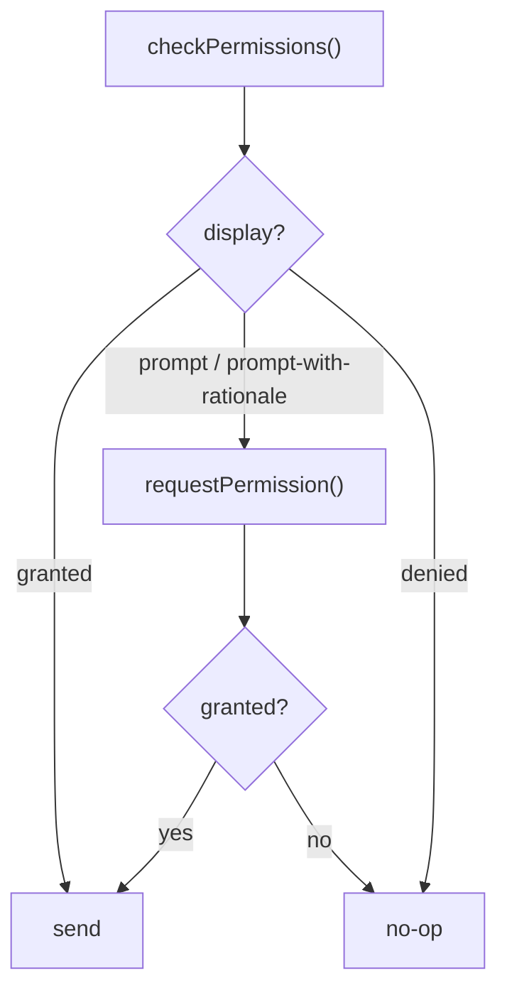

WebView でくるんだ iOS アプリに少しだけネイティブの手触りを足してくれる Tauri プラグインが 2 つある。触覚フィードバックの `tauri-plugin-haptics` と、ローカル通知の `tauri-plugin-notification` である。どちらもブラウザのタブでは意味を持たない iOS 向けの表面だ。コツは、**同じ**フロントエンドバンドルがクラッシュもせず、存在しないプラグインを引き込みもせず、Web でもデスクトップでも動き続けるように配線することにある。

## 1 つのコードベース、3 つのターゲット

目指すのは、ブラウザ・デスクトップ Tauri・iOS Tauri の 3 つにそのまま出荷できる単一のフロントエンドである。ハプティクスと通知のプラグインは iOS でしか役に立たないので、フロントエンドは:

- モジュール読み込み時点で iOS 専用プラグインに**ハード依存しない**、
- それ以外の環境では静かな no-op に縮退する、

という性質を満たす必要がある。

その仕組みが、ランタイムのプラットフォーム判定と**動的 `import()`** の組み合わせである。モジュール先頭の静的 `import` はバンドル読み込み時に解決される。つまり iOS 専用プラグインのコードが、実行できるかどうかに関係なく Web ビルドに取り込まれてしまう。ガードの後ろに置いた動的 `import()` はガードを通ったときにしか評価されないので、iOS 以外ではプラグインが一切読み込まれない。

```ts
// Minimal platform probe. Replace with your own detection if you already
// have one. The point is: only true when running inside Tauri on iOS.
export function isTauriIOS(): boolean {
  if (typeof window === "undefined") return false;
  const hasTauri = "__TAURI_INTERNALS__" in window;
  const isIOS = /iPad|iPhone|iPod/.test(navigator.userAgent);
  return hasTauri && isIOS;
}
```

以下のすべてはこのガードを通る。

## ハプティクス: 撃ちっぱなし（fire-and-forget）

触覚フィードバックは飾りである。UI をブロックしてはならず、呼び出し元に例外を投げてはならず、実際に発火したかどうかも問題にしてはならない。だから呼び出し側は `await` せず、実装は自分のエラーを握りつぶす。

このプラグインは 3 系統のフィードバックを公開しており、iOS の `UIFeedbackGenerator` にきれいに対応する:

- `impactFeedback("light" | "medium" | "heavy")` -- 強さの異なる物理的な「タップ」
- `notificationFeedback("success" | "warning" | "error")` -- システムの成功 / 警告 / エラーのパターン
- `selectionFeedback()` -- ピッカーで値が変わったときの軽いチック

```ts
export type HapticType =
  | "impact-light"
  | "impact-medium"
  | "impact-heavy"
  | "notification-success"
  | "notification-warning"
  | "notification-error"
  | "selection";

/**
 * Dynamically load and call tauri-plugin-haptics.
 * We use a dynamic import so the bundle does not hard-depend on the plugin
 * in non-iOS environments.
 */
async function callHaptic(type: HapticType): Promise<void> {
  if (!isTauriIOS()) return;
  try {
    // tauri-plugin-haptics JS binding exports named functions per haptic type
    const haptics = await import("@tauri-apps/plugin-haptics");
    switch (type) {
      case "impact-light":
        await haptics.impactFeedback("light");
        break;
      case "impact-medium":
        await haptics.impactFeedback("medium");
        break;
      case "impact-heavy":
        await haptics.impactFeedback("heavy");
        break;
      case "notification-success":
        await haptics.notificationFeedback("success");
        break;
      case "notification-warning":
        await haptics.notificationFeedback("warning");
        break;
      case "notification-error":
        await haptics.notificationFeedback("error");
        break;
      case "selection":
        await haptics.selectionFeedback();
        break;
    }
  } catch {
    // Plugin not available — silently ignore
  }
}

export function triggerHaptic(type: HapticType): void {
  // Fire-and-forget — callers don't need to await haptic completion
  callHaptic(type).catch(() => {});
}
```

安全装置が 2 層あることに注目してほしい。内側の `try/catch` はプラグインの欠落（例: バインディングがバンドルされていない）を処理し、呼び出し側の外側の `.catch(() => {})` は、拒否された promise が未処理の rejection にならないことを保証する。ボタンのハンドラは `triggerHaptic("impact-light")` を呼んで先へ進むだけでよい。

<Tip>

iOS 以外では、動的 `import()` に到達する前の `isTauriIOS()` ガードで関数が return するため、Web とデスクトップのバンドルはプラグインのチャンクを fetch すらしない。

</Tip>

## ローカル通知: パーミッションの状態機械

通知は事情が違う。いきなり送ることはできず、iOS はユーザーの許可を先に要求する。しかも、きれいに尋ねられるのは原則 1 回きりである。そのため送信は小さな状態機械の後ろでゲートされる。

プラグインの `checkPermissions()` は `display` を返し、その値は次のいずれかである:

- `granted` -- 自由に送れる
- `denied` -- ユーザーが拒否した。再度プロンプトせず、何もしない
- `prompt` -- まだ尋ねていない。`requestPermission()` を呼んでよい
- `prompt-with-rationale` -- まだ尋ねておらず、OS は先に理由を説明することを勧めている

ルールはこうだ。**まずチェックし、プロンプト可能なときだけリクエストし、granted のときだけ送る。**



## 即時送信とスケジュール送信

パーミッションが `granted` になったら、通知を発火する方法は 2 つある:

- **即時** -- `sendNotification({ title, body })` で今すぐ表示する。
- **遅延** -- `schedule([{ id, title, body, schedule: { at } }])` で、未来の `Date` に配信するよう通知を OS に預ける。発火時にアプリが動いている必要はない。

遅延の有無で分岐すれば、1 つのヘルパーで両方をカバーできる:

```ts
export interface ScheduleNotificationOptions {
  title: string;
  body: string;
  /** Optional delay in seconds (default 0 = immediate). */
  delaySeconds?: number;
}

async function getNotificationPlugin() {
  return import("@tauri-apps/plugin-notification");
}

export async function scheduleNotification(
  options: ScheduleNotificationOptions,
): Promise<void> {
  if (!isTauriIOS()) return;
  try {
    const { sendNotification, checkPermissions, requestPermission } =
      await getNotificationPlugin();

    // Permission state machine: check, then request only if still promptable.
    let { display } = await checkPermissions();
    if (display === "prompt" || display === "prompt-with-rationale") {
      display = (await requestPermission()) as typeof display;
    }
    if (display !== "granted") return;

    if (options.delaySeconds && options.delaySeconds > 0) {
      // Delayed: hand it to the OS scheduler with a future fire time.
      const { schedule } = await getNotificationPlugin();
      const fireAt = new Date(Date.now() + options.delaySeconds * 1000);
      await schedule([
        {
          id: Date.now(),
          title: options.title,
          body: options.body,
          schedule: { at: fireAt },
        },
      ]);
    } else {
      // Immediate: show it now.
      await sendNotification({ title: options.title, body: options.body });
    }
  } catch {
    // Plugin unavailable or permission denied — silently ignore
  }
}
```

いくつか強調しておきたい点がある:

- `requestPermission()` 自身が結果の `display` を返すので、`display` を再代入しておけば、1 つの `if (display !== "granted") return;` で「もともと granted」だった経路と「いま granted になった」経路の両方をカバーできる。
- `schedule()` の各エントリには一意な `id` が必要である。撃ちっぱなしの用途なら `Date.now()` で十分間に合う。後でキャンセルしたいなら本物のカウンタや安定したキーを使う。
- `schedule({ at })` は `Date` を取る。そこから先は OS が配信を所有する -- アプリを閉じてもスケジュール済みの通知はキャンセルされない。

<Warning>

ユーザーから見ればパーミッションは一発勝負である。`checkPermissions()` が `denied` を返したあとに `requestPermission()` をもう一度呼んでも、再プロンプトは**されない** -- iOS は即座に `denied` を返すだけだ。ユーザーは設定アプリから直すしかない。だからループで粘らず、`denied` 状態を尊重して静かにしていること。

</Warning>

## バックエンドのプラグイン初期化

どちらのプラグインも Rust のビルダーに登録する必要がある。全プラットフォームでコンパイルでき、iOS 以外では no-op になるので、登録そのものを feature ゲートする必要はない。

```rust
fn main() {
    tauri::Builder::default()
        // iOS native surface plugins — haptics and local notifications.
        // These plugins compile on all platforms but are no-ops outside iOS.
        .plugin(tauri_plugin_haptics::init())
        .plugin(tauri_plugin_notification::init())
        .run(tauri::generate_context!())
        .expect("error while running tauri application");
}
```

契約はこれで全部だ。バックエンドでは無条件に登録し、フロントエンドのすべての呼び出しは `isTauriIOS()` + 動的 `import()` の後ろでゲートする。これで同じバンドルがどこでも動く。
