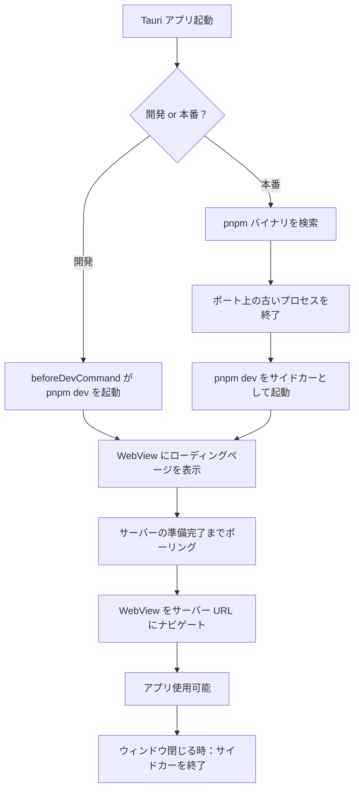

# ドキュメントビューアーアプリ

このレシピでは、ドキュメントサイトの開発サーバーをラップする軽量な Tauri アプリのアーキテクチャを解説する。Rust バックエンドが `pnpm dev` を起動し、サーバーの準備ができるまで待機し、ローカル URL に WebView をナビゲートする。Tauri アプリ自体にはフロントエンドフレームワークは使用せず、UI 全体はラップされた開発サーバーから提供される。

## アーキテクチャ概要



## 2つのモード

アプリは開発モードと本番モードで異なる動作をする。

- **開発モード**（`cargo tauri dev`）：Tauri の `beforeDevCommand` が `pnpm dev` を起動する。Rust コードは WebView をサーバー URL に向けるだけである。
- **本番モード**（`cargo tauri build`）：Rust コード自身が `pnpm` を見つけ、子プロセスとして起動し、準備完了を待ち、終了時にクリーンアップを行う。

```rust
const PORT: u16 = 32342;
const DEFAULT_PATH: &str = "/";
const IS_DEV: bool = cfg!(debug_assertions);
const PNPM_CMD: &str = "dev";
```

## pnpm の検索

本番モードでは、アプリはユーザーのシステム上で `pnpm` バイナリを見つける必要がある。GUI アプリはユーザーのシェル `PATH` を継承しないため、単に `pnpm` を呼び出すだけでは動作しない。

戦略は、まずハードコードされた既知のパス（バージョンマネージャのシムを含む）を確認し、次に `which` にフォールバックすることである。

```rust
fn find_pnpm() -> Option<PathBuf> {
    // Check well-known installation paths first
    let home = std::env::var("HOME").ok()?;
    let candidates = [
        "/opt/homebrew/bin/pnpm".to_string(),  // Apple Silicon Homebrew
        "/usr/local/bin/pnpm".to_string(),     // Intel Homebrew
        format!("{home}/.volta/bin/pnpm"),     // Volta シム
    ];
    for p in &candidates {
        let path = PathBuf::from(p);
        if path.exists() {
            return Some(path);
        }
    }

    // Fallback: ask the system
    if let Ok(output) = Command::new("/usr/bin/which").arg("pnpm").output() {
        let path_str = String::from_utf8_lossy(&output.stdout)
            .trim()
            .to_string();
        if !path_str.is_empty() {
            let path = PathBuf::from(&path_str);
            if path.exists() {
                return Some(path);
            }
        }
    }

    None
}
```

<Note>

GUI アプリのコンテキストでは `which` が信頼できない場合があるため、ハードコードされたパスを最初に確認する。`/usr/bin/which`（`which` だけではなく）を使用するのは、アプリの `PATH` に `/usr/bin` が含まれていない可能性があるためである。ユーザーが Volta で Node を pin しているケースが多い場合は `$HOME/.volta/bin/pnpm` もハードコードリストに含める -- Finder 起動は Volta のシム注入を見ない。

</Note>

## サイドカーの起動

サイドカーは独自のプロセスグループで起動する。これはクリーンアップにとって極めて重要である。開発サーバーを終了する際には、親の `pnpm` プロセスだけでなく、プロセスグループ全体を終了させる必要がある（`pnpm` 自体が子プロセスを起動するため）。

```rust
struct Sidecar {
    child: Child,
    pid: u32,
}

fn spawn_sidecar(pnpm_path: &std::path::Path) -> Sidecar {
    let dir = target_dir(); // The directory containing the project to serve

    let mut cmd = Command::new(pnpm_path);
    cmd.args([PNPM_CMD])
        .current_dir(&dir)
        .stdout(Stdio::from(log_file))
        .stderr(Stdio::from(log_file_clone));

    // Create a new process group so we can kill all child processes
    #[cfg(unix)]
    {
        use std::os::unix::process::CommandExt;
        cmd.process_group(0);
    }

    let child = cmd.spawn().expect("Failed to spawn pnpm sidecar");
    let pid = child.id();

    Sidecar { child, pid }
}
```

<Warning>

`process_group(0)` がないと、`pnpm` プロセスを終了しても、孤立した Node.js プロセスがポートにバインドされたまま残る。次回の起動時に、前回の実行から残ったゴーストプロセスによってポートが占有されているため、起動に失敗する。

</Warning>

## サイドカーの終了

プロセスだけでなく、プロセスグループ（負の PID）を終了させる。

```rust
fn kill_sidecar(sidecar: &mut Sidecar) {
    #[cfg(unix)]
    {
        if let Ok(pid) = i32::try_from(sidecar.pid) {
            if pid > 0 {
                // Negative PID signals the entire process group
                unsafe { libc::kill(-pid, libc::SIGTERM) };
            }
        }
    }

    // Wait briefly for graceful shutdown
    thread::sleep(Duration::from_millis(500));

    // Escalate if still running
    match sidecar.child.try_wait() {
        Ok(Some(_)) => {
            // Already exited
        }
        _ => {
            let _ = sidecar.child.kill();   // SIGKILL
            let _ = sidecar.child.wait();   // Reap
        }
    }
}
```

## 起動時のポートクリーンアップ

新しいサーバーを起動する前に、すでにポートでリッスンしているプロセスを終了させる。これは、前のアプリインスタンスがクリーンアップせずにクラッシュした場合のケースを処理する。

```rust
fn kill_port() {
    if let Ok(output) = Command::new("/usr/bin/lsof")
        .args(["-ti", &format!(":{PORT}")])
        .output()
    {
        let pids = String::from_utf8_lossy(&output.stdout);
        for line in pids.trim().lines() {
            if let Ok(pid) = line.trim().parse::<i32>() {
                unsafe { libc::kill(pid, libc::SIGTERM) };
            }
        }
        if !pids.trim().is_empty() {
            thread::sleep(Duration::from_millis(500));
        }
    }
}
```

## 準備完了ポーリング

アプリはサーバー URL にポーリングし、エラーでない HTTP ステータスコードが返されるまで待機する。

```rust
fn wait_for_ready(timeout: Duration) {
    let start = Instant::now();
    while start.elapsed() < timeout {
        let code = Command::new("/usr/bin/curl")
            .args([
                "-s", "-o", "/dev/null", "-w", "%{http_code}",
                &format!("http://localhost:{PORT}/"),
            ])
            .output()
            .map(|o| String::from_utf8_lossy(&o.stdout).trim().to_string())
            .unwrap_or_else(|_| "err".to_string());

        if code != "000" && code != "err" {
            // Server is ready
            thread::sleep(Duration::from_secs(1)); // Extra delay for stability
            return;
        }
        thread::sleep(Duration::from_secs(1));
    }
    // Timeout - proceed anyway and let the user see the error
}
```

<Tip>

`curl` だけではなく `/usr/bin/curl`（絶対パス）を使用すること。GUI アプリのコンテキストでは、シェルの `PATH` が設定されておらず、`curl` が見つからない場合がある。

</Tip>

## ローディング画面

ウィンドウはローディングページを表示した状態で即座に開かれ、サーバーの準備ができたらサーバー URL にナビゲートする。これにより、ビルドプロセス中にアプリがフリーズして見えることを回避する。

```rust
// In setup()
if IS_DEV {
    // Dev mode: server is already running, point directly to it
    let url: tauri::Url = server_url().parse().unwrap();
    WebviewWindowBuilder::new(app, "main", WebviewUrl::External(url))
        .title("zmod doc")
        .inner_size(1200.0, 800.0)
        .build()?;
} else {
    // Production: show default (bundled) page first
    WebviewWindowBuilder::new(app, "main", WebviewUrl::default())
        .title("zmod doc")
        .inner_size(1200.0, 800.0)
        .build()?;

    // Then navigate once server is ready (in background thread)
    let handle = app.handle().clone();
    thread::spawn(move || {
        wait_for_ready(Duration::from_secs(120));
        if let Some(w) = handle.get_webview_window("main") {
            let url: tauri::Url = server_url().parse().unwrap();
            let _ = w.navigate(url);
        }
    });
}
```

`tauri.conf.json` の `frontendDist` は、ローディングページのみを含む最小限のディレクトリを指す。

```json
{
  "build": {
    "frontendDist": "./frontend"
  }
}
```

```html
<!-- frontend/index.html -->
<!DOCTYPE html>
<html>
<body style="display:flex;align-items:center;justify-content:center;height:100vh;margin:0;font-family:sans-serif">
  <p>Loading...</p>
</body>
</html>
```

## ズームメニュー項目

ドキュメントビューアーにはズームコントロールが有用である。アプリは現在のズームレベルを `AppState` に保存し、JavaScript のインジェクションを通じて適用する。

```rust
struct AppState {
    sidecar: Arc<Mutex<Option<Sidecar>>>,
    pnpm_path: Option<PathBuf>,
    zoom: Mutex<f64>,
}

fn apply_zoom(app_handle: &AppHandle, level: f64) {
    let state = app_handle.state::<AppState>();
    *state.zoom.lock().unwrap() = level;
    if let Some(w) = app_handle.get_webview_window("main") {
        let _ = w.eval(&format!("document.body.style.zoom = '{level}'"));
    }
}
```

ズームコントロールのメニュー項目は以下の通りである。

```rust
let view_menu = SubmenuBuilder::new(app, "View")
    .item(
        &MenuItemBuilder::with_id("actual_size", "Actual Size")
            .accelerator("CmdOrCtrl+0")
            .build(app)?,
    )
    .item(
        &MenuItemBuilder::with_id("zoom_in", "Zoom In")
            .accelerator("CmdOrCtrl+=")
            .build(app)?,
    )
    .item(
        &MenuItemBuilder::with_id("zoom_out", "Zoom Out")
            .accelerator("CmdOrCtrl+-")
            .build(app)?,
    )
    .build()?;
```

ハンドラは以下の通りである。

```rust
app.on_menu_event(|app_handle, event| match event.id().as_ref() {
    "actual_size" => apply_zoom(app_handle, 1.0),
    "zoom_in" => {
        let state = app_handle.state::<AppState>();
        let z = (*state.zoom.lock().unwrap() + 0.1).min(3.0);
        apply_zoom(app_handle, z);
    }
    "zoom_out" => {
        let state = app_handle.state::<AppState>();
        let z = (*state.zoom.lock().unwrap() - 0.1).max(0.1);
        apply_zoom(app_handle, z);
    }
    _ => {}
});
```

## 終了時のプロセスクリーンアップ

ウィンドウが破棄された時にサイドカーを終了させる。

```rust
.run(move |app_handle, event| match &event {
    tauri::RunEvent::WindowEvent {
        event: tauri::WindowEvent::Destroyed,
        ..
    } => {
        if !IS_DEV {
            if let Ok(mut g) = sidecar_for_exit.lock() {
                if let Some(mut s) = g.take() {
                    kill_sidecar(&mut s);
                }
            }
        }
        app_handle.exit(0);
    }
    _ => {}
});
```

<Note>

`sidecar_for_exit` は、クロージャに移動する前に `AppState` からクローンされた `Arc<Mutex<Option<Sidecar>>>` である。`run()` クロージャはムーブキャプチャを行い、`setup()` クロージャよりも長く存続するため、これが必要となる。

</Note>

## sidecar でのコールドインストールブートストラップ

バンドル sidecar 型のドキュメントビューアーは、`node_modules/` が埋まっていることに依存する。クリーンな clone 直後 -- またはユーザーがキャッシュディレクトリを消去した後 -- では `node_modules/astro/astro.js` が存在せず、sidecar は起動に失敗し、webview は永遠にローディングページのままになる。

解決策は、sidecar 自身のエントリースクリプト内にプレビルドガードを入れることだ。エントリーポイントの欠損を検出し、先に `pnpm install` を走らせてから次に進む。無言で失敗する代わりに UX を「ビルド中」の状態に保つ。

```js
// doc/scripts/dev-stable.js
import { existsSync } from "node:fs";
import { spawn } from "node:child_process";
import path from "node:path";

const ROOT = path.resolve(import.meta.dirname, "..");

function findPnpm() {
  const candidates = [
    "/opt/homebrew/bin/pnpm",
    "/usr/local/bin/pnpm",
    `${process.env.HOME}/.volta/bin/pnpm`,
  ];
  for (const p of candidates) {
    if (existsSync(p)) return p;
  }
  // Fallback: /usr/bin/which
  try {
    const { execFileSync } = require("node:child_process");
    const p = execFileSync("/usr/bin/which", ["pnpm"]).toString().trim();
    return p && existsSync(p) ? p : null;
  } catch {
    return null;
  }
}

async function ensureNodeModules(root = ROOT) {
  // Fast path: astro.js が既にあればスキップ。
  if (existsSync(path.join(root, "node_modules/astro/astro.js"))) return;

  const pnpm = findPnpm();
  if (!pnpm) {
    console.error(
      "pnpm not found — install Node.js and pnpm before launching.",
    );
    process.exit(1);
  }

  await new Promise((resolve, reject) => {
    const child = spawn(pnpm, ["install", "--prefer-offline"], {
      cwd: root,
      stdio: "inherit", // ログは sidecar.log に流れる
    });
    child.on("exit", (code) => {
      if (code === 0) resolve();
      else reject(new Error(`pnpm install exited with code ${code}`));
    });
  });
}

// Main
try {
  await serve(); // build() が終わるまで /___ready は 503
  await ensureNodeModules();
  await build();
} catch (err) {
  console.error("sidecar fatal:", err);
  process.exit(1);
}
```

間違えやすい勘所が 3 つある:

1. **Finder / launchd の PATH は最小限。** Finder から起動された `.app` の内部では、`PATH` は典型的に `/usr/bin:/bin:/usr/sbin:/sbin` だけだ。ユーザーのシェル `PATH` に乗っている `pnpm` には届かない。絶対パスを先に探り、`/usr/bin/which pnpm` にフォールバックし、どちらも駄目なら明確なメッセージで終了する。[Rust 側の `find_pnpm()` 戦略](#pnpm-の検索)と同じ考え方だ。

2. **インストール中もローディングページは有効のまま。** `pnpm install` が走っている間、sidecar の `/___ready` は 503 を返し続ける。Rust の準備完了ポーラーも sidecar 側の `LOADING_HTML` の自動リフレッシュも「まだビルド中」のスピナーを表示したまま -- インストール中の UX 劣化は起きない。インストールのログは `stdio: "inherit"` を通って sidecar ログに流れるので、エラー状態のローディングページが表示するファイルに残る。

3. **pnpm 不在時の明確な停止。** `findPnpm()` が `null` を返したら、「pnpm not found」のメッセージを stderr に出して `process.exit(1)` する。そうすれば [`wait_for_ready` の sidecar 死亡検出器](../architecture/process-lifecycle.mdx#準備完了ループでの-sidecar-の死亡検出)が約 1 秒で `launch-error` 経由でユーザーに失敗を通知できる。無言でハングさせると UI はスピナーのまま固まる。

<Tip>

ファストパスの `existsSync(node_modules/astro/astro.js)` ショートサーキットは、起動ごとに `stat` を 1 回呼ぶだけのコストで保険になる。省略すると、何も変わっていないときでもフルの `pnpm install` が起動のたびに走り、ユーザーはスピナーの余分な 1〜2 秒に気付く。

</Tip>

### コールドパスのスモークテスト

コールドインストールパスは `node_modules/` が空のときしか走らないため、テストしなければ無言で劣化する。`--cold` フラグを付けた最小の起動スクリプトで回帰の監視面を可視化する:

```bash
#!/usr/bin/env bash
# test-launch.sh [--cold] [iterations]
set -euo pipefail

COLD=0
ITERS=1
for arg in "$@"; do
  case "$arg" in
    --cold) COLD=1 ;;
    *) ITERS="$arg" ;;
  esac
done

if [[ "$COLD" -eq 1 ]]; then
  # イテレーション毎ではなく最初の 1 回前に 1 度だけ消す -- マルチラン時も
  # コールドパスはちょうど 1 回だけ走り、残りは定常状態の再起動を測る。
  rm -rf "./node_modules"
fi

for i in $(seq 1 "$ITERS"); do
  open -W -a "MyApp.app"
done
```

これで 1 回目のイテレーションで `ensureNodeModules` のブートストラップを走らせ、それ以降は健全な再起動を測る。CI（あるいは各リリース前）で回しておけば、フレッシュインストールのパスが気付かぬうちに壊れることはなくなる。

## 設定ファイル

対応する `tauri.conf.json` は以下の通りである。

```json
{
  "productName": "zmod doc",
  "version": "0.1.0",
  "identifier": "com.takazudo.zmod-doc",
  "build": {
    "frontendDist": "./frontend",
    "beforeDevCommand": "cd ../../doc && pnpm dev",
    "devUrl": "http://localhost:32342/"
  },
  "app": {
    "windows": [],
    "security": {
      "csp": null
    }
  },
  "bundle": {
    "active": true,
    "targets": "all",
    "icon": [],
    "category": "DeveloperTool",
    "macOS": {
      "minimumSystemVersion": "10.15"
    }
  }
}
```

ポイント：

- **`windows: []`** -- ウィンドウは Rust でプログラム的に作成するため空
- **`beforeDevCommand` で `cd` を使用** -- コマンドの CWD は設定ファイルのディレクトリではなくリポジトリルートであるため
- **`frontendDist: "./frontend"`** -- 最小限のローディングページであり、実際のコンテンツではない
- **`beforeBuildCommand` がない** -- 本番アプリは独自のサーバーを起動するため、静的アセットの埋め込みを行わない
