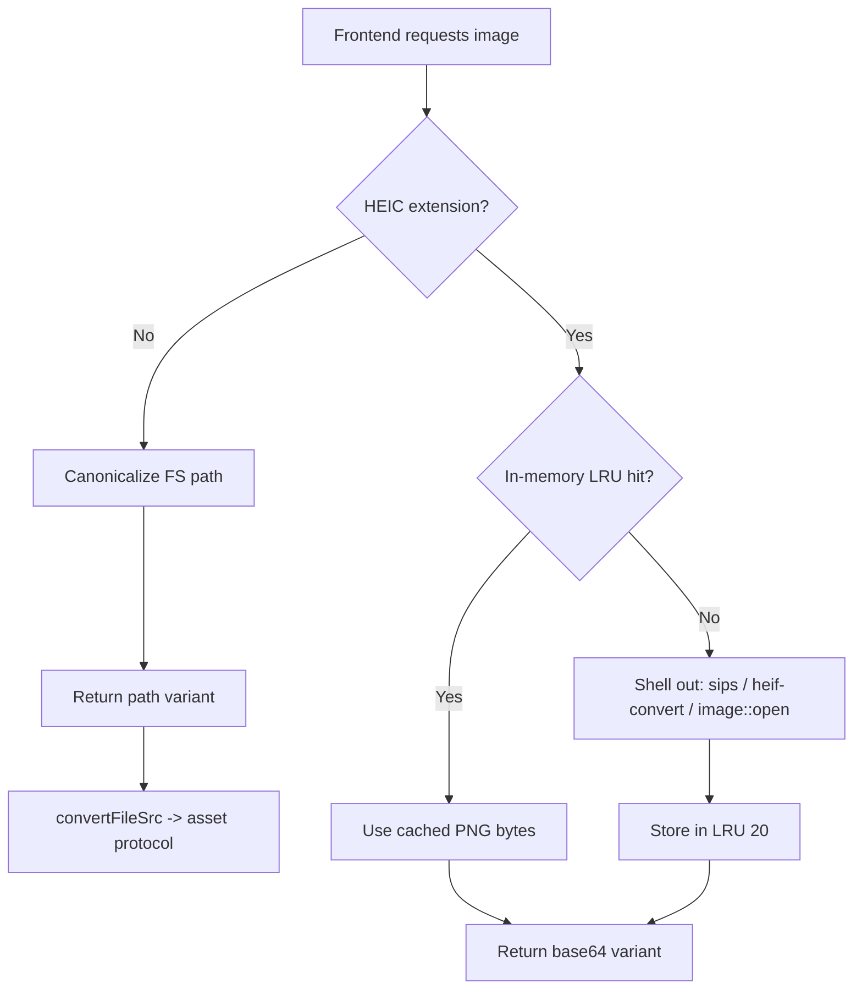

このレシピでは、Tauri ベースの画像ビューアーにおける画像パイプラインを解説する。Rust の `image` クレートが扱えない形式（HEIC）をどうデコードするか、フルサイズ画像を WebView へ効率的に渡す方法、そしてプロセス再起動をまたいで生き残るようサムネイルをディスクにキャッシュする方法を扱う。以下の各要素は、いずれも微妙に間違えやすい、苦労して得た知見である。

## パイプライン概要



## HEIC のデコード：プラットフォーム依存のシェルアウトチェーン

Rust の `image` クレートには HEIC デコーダがない。HEIC ファイルは HEVC でコード化された画像データを用いるが、クレートにはそのコーデックが同梱されていない。`.heic` ファイルに対して `image::open` を呼んでも、単に失敗するだけである。

回避策は、HEIC を *デコードできる* プラットフォームのツールにシェルアウトし、一時的な PNG を書き出してから読み戻すことである。macOS では組み込みの `sips` ユーティリティが HEIC を PNG に変換し、Linux では `heif-convert`（`libheif` 由来）が同じことを行う。最後の `image::open` の試行は、将来の `image` ビルドが HEIC サポートを獲得した場合に備えた、最終手段のフォールバックとして機能する。

```rust
fn convert_heic_to_png(heic_path: &Path) -> Result<Vec<u8>, String> {
    let temp_dir = std::env::temp_dir().join("image-stash-viewer-heic");
    fs::create_dir_all(&temp_dir).map_err(|e| format!("Failed to create temp dir: {e}"))?;

    let unique_id = format!(
        "{}-{}",
        std::process::id(),
        std::time::SystemTime::now()
            .duration_since(UNIX_EPOCH)
            .unwrap_or_default()
            .as_nanos()
    );
    let temp_png = temp_dir.join(format!(
        "{}-{}.png",
        heic_path.file_stem().unwrap_or_default().to_string_lossy(),
        unique_id
    ));

    #[cfg(target_os = "macos")]
    {
        let result = Command::new("sips")
            .args([
                "-s",
                "format",
                "png",
                &heic_path.to_string_lossy(),
                "--out",
                &temp_png.to_string_lossy(),
            ])
            .output();

        if let Ok(output) = result {
            if output.status.success() {
                let data = fs::read(&temp_png);
                let _ = fs::remove_file(&temp_png);
                if let Ok(data) = data {
                    return Ok(data);
                }
            } else {
                let _ = fs::remove_file(&temp_png);
            }
        }
    }

    #[cfg(not(target_os = "macos"))]
    {
        let result = Command::new("heif-convert")
            .args([
                &heic_path.to_string_lossy().to_string(),
                &temp_png.to_string_lossy().to_string(),
            ])
            .output();

        if let Ok(output) = result {
            if output.status.success() {
                let data = fs::read(&temp_png);
                let _ = fs::remove_file(&temp_png);
                if let Ok(data) = data {
                    return Ok(data);
                }
            } else {
                let _ = fs::remove_file(&temp_png);
            }
        }
    }

    let img = image::open(heic_path).map_err(|e| format!("Failed to open HEIC: {e}"))?;
    let mut buf = Vec::new();
    let mut cursor = std::io::Cursor::new(&mut buf);
    img.write_to(&mut cursor, image::ImageFormat::Png)
        .map_err(|e| format!("Failed to encode PNG: {e}"))?;
    Ok(buf)
}
```

<Note>

一時 PNG の名前にはプロセス ID とナノ秒のタイムスタンプを埋め込んでおり、同時に走る変換どうしが同じパスで衝突しないようにしている。一時ファイルは、変換が成功したか失敗したかにかかわらず、そのバイト列をメモリへ読み戻した時点で即座に削除される。

</Note>

## 画像を返す：タグ付き列挙体によるレスポンス

デコードが済んだら、画像を WebView へ届ける必要がある。その方法には大きく異なる2通りがあり、バックエンドはタグ付き列挙体を返すことでファイルごとに適切なものを選ぶ。

```rust
#[derive(Debug, Serialize)]
#[serde(rename_all = "camelCase", tag = "type")]
pub enum ImageDataResponse {
    #[serde(rename = "path")]
    Path { path: String, mime: String },
    #[serde(rename = "base64")]
    Base64 { data: String },
}
```

通常の画像（JPEG、PNG、GIF、WebP など）の場合、バックエンドは `path` バリアントを返す。すなわちファイルシステムパスを正規化し、その文字列をフロントエンドへ渡す。フロントエンドはそれを `convertFileSrc()` に通してアセットプロトコルの URL を得る。WebView はその URL からディスク上のファイルを直接読み込み、IPC ブリッジを経由したコピーは発生しない。これはゼロコピー配信であり、大きな原本画像に最適である。

HEIC ファイルの場合、指し示すべきディスク上の PNG が存在しない。メモリ上でデコードされたからである。そこでバックエンドは `data:` URL を載せた `base64` バリアントを返す。base64 へのエンコードは本当に必要な形式に対してのみ支払われ、通常の画像はそれを完全にスキップする。

```rust
#[tauri::command]
pub fn get_image_data(
    app_handle: tauri::AppHandle,
    path: String,
) -> Result<ImageDataResponse, String> {
    let file_path = Path::new(&path);

    if !file_path.exists() {
        return Err(format!("File not found: {path}"));
    }

    let ext = file_path
        .extension()
        .map(|e| e.to_string_lossy().to_string())
        .unwrap_or_default();

    if is_heic_ext(&ext) {
        let state = app_handle.state::<AppState>();
        let png_data = get_heic_png_cached(file_path, &state)?;
        let b64 = base64::engine::general_purpose::STANDARD.encode(&png_data);
        Ok(ImageDataResponse::Base64 {
            data: format!("data:image/png;base64,{b64}"),
        })
    } else {
        let canonical = fs::canonicalize(file_path)
            .map_err(|e| format!("Failed to canonicalize path: {e}"))?;
        let mime = mime_from_ext(&ext);
        Ok(ImageDataResponse::Path {
            path: canonical.to_string_lossy().to_string(),
            mime,
        })
    }
}
```

フロントエンドでは、`tag: "type"` という判別子のおかげで分岐は自明になる。`path` バリアントだけを `convertFileSrc` に通して書き換え、`base64` バリアントはすでにそのまま使える `data:` URL である。

```typescript
async getImageData(path: string): Promise<ImageDataResponse> {
  const response: ImageDataResponse = await invoke('get_image_data', {
    path,
  });
  if (response.type === 'path') {
    return {
      ...response,
      path: convertFileSrc(response.path),
    };
  }
  return response;
}
```

<Tip>

`convertFileSrc` の URL を読み込むには、ケーパビリティでアセットプロトコルを有効化し、スコープを設定しておく必要がある。適切な `assetProtocol` スコープがないと、path バリアントは WebView がフェッチを拒否する URL に解決されてしまう。

</Tip>

## 2層構成のサムネイルキャッシュ

サムネイルは2つの階層でキャッシュされる。

1. **メモリ内 LRU（20エントリ）** はデコード済みの HEIC PNG バイト列を保持し、同じ HEIC への繰り返しのリクエストで `sips` を再実行しないようにする。
2. **ディスク上のサムネイルキャッシュ** は `dirs::cache_dir()` 配下に置かれ、形式を問わずあらゆる画像のリサイズ済み PNG を保持する。

どちらのキャッシュも `path + mtime` をキーにしているため、ファイルを編集すると mtime が変化し、古いエントリは自動的にバイパスされる。手動での無効化は不要である。

メモリ内 LRU は、素朴な `HashMap` とアクセス順を追う `VecDeque` の組み合わせである。

```rust
pub struct HeicCache {
    data: HashMap<String, Vec<u8>>,
    order: VecDeque<String>,
    max_size: usize,
}

impl HeicCache {
    /// Get cached PNG data. Returns cloned data and refreshes LRU position.
    pub fn get(&mut self, key: &str) -> Option<Vec<u8>> {
        if self.data.contains_key(key) {
            self.order.retain(|k| k != key);
            self.order.push_back(key.to_string());
            self.data.get(key).cloned()
        } else {
            None
        }
    }

    /// Insert PNG data. Evicts oldest entry if at capacity.
    pub fn insert(&mut self, key: String, value: Vec<u8>) {
        if self.data.contains_key(&key) {
            self.order.retain(|k| k != &key);
        } else if self.data.len() >= self.max_size {
            if let Some(oldest) = self.order.pop_front() {
                self.data.remove(&oldest);
            }
        }
        self.data.insert(key.clone(), value);
        self.order.push_back(key);
    }
}
```

キャッシュキーはパスと mtime を連結したものである。

```rust
fn get_heic_png_cached(path: &Path, state: &AppState) -> Result<Vec<u8>, String> {
    let path_str = path.to_string_lossy();
    let mtime = get_mtime_ms(path);
    let cache_key = format!("{path_str}:{mtime}");

    if let Ok(mut cache) = state.heic_cache.lock() {
        if let Some(data) = cache.get(&cache_key) {
            return Ok(data);
        }
    }

    let png_data = convert_heic_to_png(path)?;

    if let Ok(mut cache) = state.heic_cache.lock() {
        cache.insert(cache_key, png_data.clone());
    }

    Ok(png_data)
}
```

ディスクキャッシュのディレクトリは起動時に作成され、バックグラウンドスレッドがただちに30日より古いエントリを掃き出すことで、キャッシュが際限なく肥大化しないようにする。

```rust
impl AppState {
    pub fn new() -> Self {
        let cache_dir = dirs::cache_dir()
            .unwrap_or_else(|| PathBuf::from("/tmp"))
            .join("image-stash-viewer")
            .join("thumbnails");
        std::fs::create_dir_all(&cache_dir).ok();
        let eviction_dir = cache_dir.clone();
        std::thread::spawn(move || {
            evict_old_disk_cache(&eviction_dir);
        });
        Self {
            thumbnail_cache_dir: cache_dir,
            watcher: Mutex::new(None),
            watched_dir: Mutex::new(None),
            heic_cache: Mutex::new(HeicCache::new(HEIC_CACHE_MAX_ENTRIES)),
        }
    }
}
```

掃き出し処理は専用のスレッドで走るため、巨大なキャッシュディレクトリがアプリ起動をブロックすることは決してない。

```rust
fn evict_old_disk_cache(cache_dir: &Path) {
    let max_age = Duration::from_secs(DISK_CACHE_MAX_AGE_DAYS * 24 * 60 * 60);
    let now = SystemTime::now();

    let entries = match std::fs::read_dir(cache_dir) {
        Ok(entries) => entries,
        Err(_) => return,
    };

    for entry in entries.flatten() {
        let path = entry.path();
        if !path.is_file() {
            continue;
        }
        let metadata = match entry.metadata() {
            Ok(m) => m,
            Err(_) => continue,
        };
        let modified = match metadata.modified() {
            Ok(t) => t,
            Err(_) => continue,
        };
        if let Ok(age) = now.duration_since(modified) {
            if age > max_age {
                let _ = std::fs::remove_file(&path);
            }
        }
    }
}
```

ディスクキャッシュの探索は、安定ハッシュ・サイズ・mtime からファイル名を組み立て、存在すればその PNG をそのまま読み戻す。

```rust
let mtime = get_mtime_ms(file_path);
let cache_key = format!("{}-{}-{}", stable_hash(&path), size, mtime);
let cache_path = state.thumbnail_cache_dir.join(format!("{cache_key}.png"));

if cache_path.exists() {
    let data = fs::read(&cache_path).map_err(|e| format!("Failed to read cache: {e}"))?;
    let b64 = base64::engine::general_purpose::STANDARD.encode(&data);
    return Ok(format!("data:image/png;base64,{b64}"));
}
```

<Note>

メモリ内 LRU は `AppState` 上の `Mutex` の中に存在する。各 `get` はロックを解放する前にバイト列をクローンして取り出すため、変換処理（`sips`）がミューテックスを保持したまま走ることはない。同じ `AppState` がこれらのキャッシュと並んでディレクトリウォッチャをどう保持しているかは、[ファイルウォッチャのレシピ](../rust-backend/file-watchers.mdx)を参照してほしい。

</Note>

## なぜ `stable_hash` は FNV-1a を手書きしているのか

ディスクキャッシュのファイル名はファイルパスのハッシュに依存する。`std::hash::DefaultHasher` に手を伸ばしたくなるが、それでは再起動をまたいでキャッシュが静かに壊れてしまう。そこでビューアーは代わりに FNV-1a を手書きしている。

```rust
/// Deterministic hash for cache keys (stable across process restarts).
fn stable_hash(s: &str) -> String {
    use std::num::Wrapping;
    let mut h = Wrapping(0xcbf29ce484222325u64);
    for b in s.bytes() {
        h ^= Wrapping(b as u64);
        h *= Wrapping(0x100000001b3u64);
    }
    format!("{:016x}", h.0)
}
```

`DefaultHasher` が誤った道具である理由は次のとおりである。

- `std::hash::DefaultHasher` は **プロセスごとにランダムなキーでシードされる SipHash** である。同じ入力文字列でも、起動するたびに *異なる* 値にハッシュされる。
- ディスクキャッシュのファイル名は `{stable_hash}-{size}-{mtime}.png` である。ハッシュが起動のたびに変わると、**前回実行時のサムネイルファイルは今回計算されるキーにひとつも一致しなくなる**。
- その結果、すべてのディスク探索はミスし、すべてのサムネイルがゼロから再生成され、古いファイルは孤児になる。キャッシュは際限なく肥大化しながらヒット率はほぼ0%という、両方の最悪を引き当てる。

FNV-1a は **固定の定数** を用いる。すなわち64ビットのオフセットベーシス `0xcbf29ce484222325` と素数 `0x100000001b3` である。ランダムなシードがないため、同じパスは常に同じ値にハッシュされる。キャッシュキーは再起動をまたいで安定し、昨日のサムネイルが今日も再利用される。ソースのコメントもその意図を端的に述べている。*プロセス再起動をまたいで安定（stable across process restarts）* である。

<Warning>

「単純化のため」と称して `DefaultHasher` に差し替えてはならない。コンパイルは通り、単一プロセス内のテストもパスし、バグは本番環境で静かに役立たずになったキャッシュとしてしか現れない。まさにレビューを生き延びてしまう類のリグレッションである。決定論的なハッシュと、同じ入力が同じ出力を生むことを確認するテストを維持すること。

</Warning>
