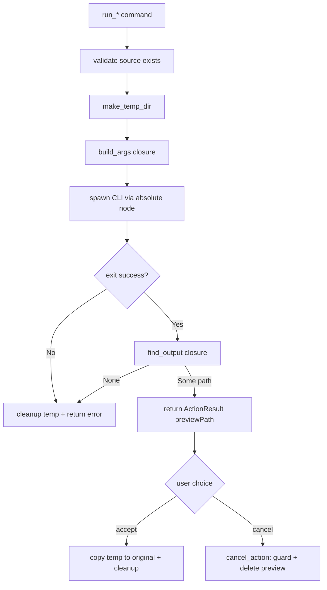

## パターン

モノレポ構成のデスクトップアプリは、Tauri シェルと並んで独自のコマンドラインツールを同梱することが多い。この例ではワークスペースが `sub-packages/` 配下に 2 つの Node CLI -- `orange-calibrator` と `product-photo-maker` -- を持つ。アプリはこれらを **ワンショットのサブプロセス** として実行する。起動し、終了を待ち、出力を読み取って終わりだ。

ユーザーの元ファイルを即座に書き換えるのではなく、各アクションは **プレビュー → 承認 → キャンセル** の契約に従う：

1. **実行** -- CLI は結果をシステム temp ディレクトリに書き込み、`ActionResult { previewPath }` を返す。元ファイルには手を触れない。
2. **承認** -- temp ファイルを元ファイルに上書きコピーし、その後 temp ファイルをクリーンアップする。
3. **キャンセル** -- temp 上のプレビューを削除し、元ファイルはそのまま残す。

これにより破壊的な操作（元ファイルの上書き）が明示的なユーザーの制御下に置かれ、ユーザーが確定するまでどのアクションも簡単に取り消せる。

## CLI と Node の解決

CLI はプロジェクトルートからの固定的な相対位置に存在するため、Rust は `CARGO_MANIFEST_DIR` から上方向にたどって解決する：

```rust
use super::project_root; // PathBuf from CARGO_MANIFEST_DIR, walked up to the repo root

let root = project_root();
let mut script = root.clone();
for part in &["sub-packages", "orange-calibrator", "bin", "orange-calibrator.mjs"] {
    script = script.join(part);
}
```

スクリプトは素の `node` ではなく **絶対パスの `node`** で実行する。Finder から起動したアプリは Homebrew やバージョンマネージャのバイナリを含まない最小限の `PATH` を継承するため、`Command::new("node")` は失敗する。解決ロジックの全体は [バージョンマネージャ対応の Node 検出](./node-detection.mdx) を参照のこと。ここでは `find_node()` が絶対パスを返すと知っていれば十分だ：

```rust
fn run_node_script(script: &PathBuf, args: &[&str]) -> Result<std::process::Output, String> {
    let root = project_root();
    let node = find_node(); // absolute path -- never bare "node"
    Command::new(&node)
        .arg(script)
        .args(args)
        .current_dir(&root)
        .output()
        .map_err(|e| format!("Failed to run {}: {e}", script.display()))
}
```

## 結果型

`ActionResult` はレンダラに返される値だ。`preview_path` フィールドは serde によってワイヤ上で `previewPath` にリネームされる：

```rust
use serde::Serialize;

#[derive(Debug, Serialize)]
#[serde(rename_all = "camelCase")]
pub struct ActionResult {
    pub success: bool,
    pub preview_path: String,
    pub error: Option<String>,
}

impl ActionResult {
    fn ok(preview_path: String) -> Self {
        Self { success: true, preview_path, error: None }
    }

    fn err(msg: String) -> Self {
        Self { success: false, preview_path: String::new(), error: Some(msg) }
    }
}
```

## temp ディレクトリへのステージング

実行ごとに `std::env::temp_dir()` 配下の固有の temp ディレクトリが割り当てられる。プロセス ID とナノ秒タイムスタンプを組み合わせることで、並行実行や繰り返し実行間の衝突を避けられる：

```rust
use std::fs;
use std::path::PathBuf;

fn make_temp_dir(prefix: &str) -> Result<PathBuf, String> {
    let nanos = std::time::SystemTime::now()
        .duration_since(std::time::UNIX_EPOCH)
        .unwrap_or_default()
        .as_nanos();
    let dir = std::env::temp_dir()
        .join(prefix)
        .join(format!("{}-{}", std::process::id(), nanos));
    fs::create_dir_all(&dir).map_err(|e| format!("Failed to create temp dir: {e}"))?;
    Ok(dir)
}
```

## 汎用的な run_action スケルトン

両方のアクションは同じ形を共有する。ソースを検証し、temp ディレクトリを作り、CLI 引数を組み立て、起動し、出力を見つけ、エラー時にはクリーンアップする。`run_action` はそのスケルトンを一度だけ捉え、アクション固有の 2 つの部分をクロージャとして差し込む：

- `build_args` -- temp ディレクトリとソースパスを受け取り、CLI の引数ベクタを生成する（必要に応じて入力ファイルを temp ディレクトリへステージングする）。
- `find_output` -- temp ディレクトリを受け取り、CLI が生成したファイルを特定する。

```rust
/// Validate source file and run a CLI script, returning the result.
fn run_action(
    source_path: &str,
    prefix: &str,
    script_parts: &[&str],
    build_args: impl FnOnce(&PathBuf, &str) -> Result<Vec<String>, String>,
    find_output: impl FnOnce(&PathBuf) -> Option<String>,
) -> ActionResult {
    let source = PathBuf::from(source_path);
    if !source.exists() {
        return ActionResult::err(format!("File not found: {source_path}"));
    }

    let temp_dir = match make_temp_dir(prefix) {
        Ok(d) => d,
        Err(e) => return ActionResult::err(e),
    };

    let root = project_root();
    let mut script = root.clone();
    for part in script_parts {
        script = script.join(part);
    }

    let args = match build_args(&temp_dir, source_path) {
        Ok(a) => a,
        Err(e) => {
            cleanup_temp_path(&temp_dir.to_string_lossy());
            return ActionResult::err(e);
        }
    };
    let args_refs: Vec<&str> = args.iter().map(|s| s.as_str()).collect();

    match run_node_script(&script, &args_refs) {
        Ok(result) => {
            if result.status.success() {
                match find_output(&temp_dir) {
                    Some(path) => ActionResult::ok(path),
                    None => {
                        cleanup_temp_path(&temp_dir.to_string_lossy());
                        ActionResult::err("Script succeeded but produced no output".to_string())
                    }
                }
            } else {
                cleanup_temp_path(&temp_dir.to_string_lossy());
                let stderr = String::from_utf8_lossy(&result.stderr).to_string();
                ActionResult::err(format!("Script failed: {stderr}"))
            }
        }
        Err(e) => {
            cleanup_temp_path(&temp_dir.to_string_lossy());
            ActionResult::err(e)
        }
    }
}
```

すべての失敗パスが return の前に `cleanup_temp_path` を実行している点に注目してほしい。失敗した実行や出力のない実行が temp ディレクトリに残骸を残すことは決してない。

## 具体的なアクション

`run_orange_tweak` は薄い呼び出し側だ。この CLI は入力をその場で書き換えるため、`build_args` はまずソースを temp ディレクトリへコピーし、CLI をそのコピーに向ける。`find_output` はそのコピーがまだ存在すれば、それを返す：

```rust
#[tauri::command]
pub fn run_orange_tweak(path: String) -> ActionResult {
    let source = PathBuf::from(&path);
    let file_name = source
        .file_name()
        .unwrap_or_default()
        .to_string_lossy()
        .to_string();

    run_action(
        &path,
        "imgs-viewer-orange",
        &["sub-packages", "orange-calibrator", "bin", "orange-calibrator.mjs"],
        |temp_dir, _source_path| {
            // Copy file to temp dir first (orange-calibrator modifies in-place)
            let temp_copy = temp_dir.join(&file_name);
            fs::copy(&source, &temp_copy)
                .map_err(|e| format!("Failed to copy file: {e}"))?;
            Ok(vec!["process".to_string(), temp_copy.to_string_lossy().to_string()])
        },
        |temp_dir| {
            let temp_copy = temp_dir.join(&file_name);
            if temp_copy.exists() {
                Some(temp_copy.to_string_lossy().to_string())
            } else {
                None
            }
        },
    )
}
```

`run_product_photo` のような 2 つ目のアクションも、まったく同じスケルトンを再利用する。異なるのは `build_args`（CLI フラグ）と `find_output`（temp ディレクトリを走査して最初の画像ファイルを探す）だけだ。

## 承認

承認は temp ファイルを元ファイルに上書きコピーし、その後 temp ファイルとその親ディレクトリを削除する：

```rust
fn accept_file(from: &str, to: &str) -> Result<bool, String> {
    let from_path = PathBuf::from(from);
    let to_path = PathBuf::from(to);

    if !from_path.exists() {
        return Err(format!("Source file not found: {from}"));
    }

    fs::copy(&from_path, &to_path)
        .map_err(|e| format!("Failed to copy file: {e}"))?;

    // Clean up temp file and its parent dir
    let _ = fs::remove_file(&from_path);
    if let Some(parent) = from_path.parent() {
        let _ = fs::remove_dir(parent);
    }

    Ok(true)
}

#[tauri::command]
pub fn accept_orange_tweak(original_path: String, temp_path: String) -> Result<bool, String> {
    accept_file(&temp_path, &original_path)
}
```

## キャンセル — temp ディレクトリガード付き

`cancel_action` はプレビューを削除する。しかしパスはレンダラから渡されるため、フロントエンドのバグ（あるいは侵害されたレンダラ）が *任意の* パスを渡しうる。そこでこのコマンドは `std::env::temp_dir()` 配下にないパスを一律で拒否する：

```rust
#[tauri::command]
pub fn cancel_action(preview_path: String) -> Result<bool, String> {
    // Only allow cleanup of paths within the system temp directory.
    // This guards against a renderer bug passing an arbitrary path
    // and deleting files outside the staging area.
    let temp_dir = std::env::temp_dir();
    let path = PathBuf::from(&preview_path);
    if !path.starts_with(&temp_dir) {
        return Err("Can only clean up files in the temp directory".to_string());
    }
    cleanup_temp_path(&preview_path);
    Ok(true)
}
```

```rust
fn cleanup_temp_path(path: &str) {
    let p = PathBuf::from(path);
    if p.exists() {
        if p.is_dir() {
            let _ = fs::remove_dir_all(&p);
        } else {
            let _ = fs::remove_file(&p);
            if let Some(parent) = p.parent() {
                let _ = fs::remove_dir(parent);
            }
        }
    }
}
```

<Warning>

削除操作において、レンダラ由来のパスを決して信用してはならない。`starts_with(temp_dir())` のチェックは「ステージングされたプレビューをクリーンアップする」のと「レンダラが指定した任意のファイルを削除する」の違いそのものだ。今日の呼び出し側が自分の信頼できるフロントエンドコードだけであっても、このガードは残しておくこと。

</Warning>

## フロー図



## まとめ

1. **書き換えずにステージングする** -- CLI の出力を temp ディレクトリに書き、プレビューパスを返す。元ファイルに触れるのは `accept_*` だけだ。
2. **`node` は常に絶対パスで解決する** -- Finder から起動したアプリは最小限の `PATH` を持つ。[バージョンマネージャ対応の Node 検出](./node-detection.mdx) を参照。
3. **同梱 CLI は `project_root()` からの相対で解決する** -- `CARGO_MANIFEST_DIR` から上方向にたどることで、開発時にもバンドル時にもパスが成り立つ。
4. **スケルトンを `run_action` に切り出す** -- `build_args`/`find_output` クロージャを差し込み、各アクションが「検証 → temp ディレクトリ → 起動 → 出力特定 → エラー時クリーンアップ」を再利用する。
5. **`cancel_action` を任意パスから守る** -- `std::env::temp_dir()` 配下にないものを拒否し、レンダラのバグがステージング領域の外のファイルを削除できないようにする。
