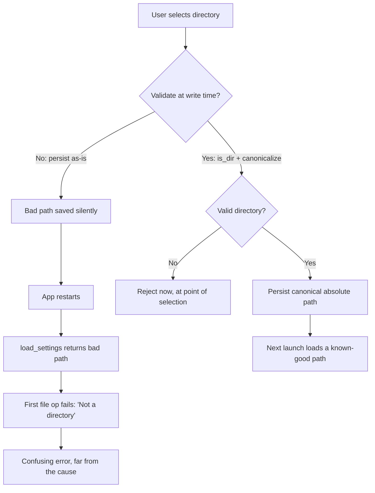

## このページで扱う内容

ここで扱うのは **グローバルなアプリ設定をディスク上のどこに置き、どう安全に書き込むか** であり、他の 2 つの設定ページとは関心事が異なる：

- [外部編集検知付き設定キャッシュ](./settings-cache.mdx) は、**プロジェクト単位**の設定ファイル（ワークスペースごとに 1 つ）の `AppState` 内 mtime キャッシュである。
- [設定バリデーションパターン](./settings-validation.mdx) は、読み込み時に設定の**値**をサニタイズする TypeScript のスキーマ／マイグレーション層である。

このページはその両方の下にある層を扱う。OS 標準の設定ディレクトリに保存される単一の**グローバルな** `settings.json` と、不正なファイルでもアプリをクラッシュさせず、次回起動時に機能しないパスを永続化しない Rust の読み書きパスである。

## 設定の保存場所

設定は OS 標準のユーザーごとの設定ディレクトリに置くべきであり、バイナリの隣やプロジェクトフォルダ内ではない。[`dirs`](https://docs.rs/dirs) クレートはプラットフォームごとに正しい場所を解決する（Linux では `~/.config`、macOS では `~/Library/Application Support`、Windows では `%APPDATA%`）：

```rust
use dirs;
use serde::{Deserialize, Serialize};
use std::fs;
use std::path::{Path, PathBuf};

#[derive(Debug, Serialize, Deserialize, Default)]
#[serde(rename_all = "camelCase")]
struct Settings {
    watched_dir: Option<String>,
}

fn settings_path() -> Option<PathBuf> {
    dirs::config_dir().map(|p| p.join("wip-assets-viewer").join("settings.json"))
}
```

ファイルは `dirs::config_dir()/<app>/settings.json` に配置される。アプリ固有のサブディレクトリ下に名前空間を切ることで、他のアプリの設定との衝突を防ぐ。

## 読み込み：不正なファイルではデフォルト、決してエラーにしない

`load_settings()` は `Settings` を直接返す -- `Result<Settings, _>` では**ない**。あらゆる失敗パス（設定ディレクトリがない、ファイルが読めない、JSON が壊れている）は `Settings::default()` に解決される。パース失敗は診断可能なように stderr にログ出力されるが、伝播はしない：

```rust
fn load_settings() -> Settings {
    let path = match settings_path() {
        Some(p) => p,
        None => return Settings::default(),
    };
    let content = match fs::read_to_string(&path) {
        Ok(c) => c,
        Err(_) => return Settings::default(),
    };
    match serde_json::from_str::<Settings>(&content) {
        Ok(s) => s,
        Err(e) => {
            eprintln!("wip-assets-viewer: corrupt settings file at {path:?}: {e}");
            Settings::default()
        }
    }
}
```

<Tip>

エラーではなく `Settings::default()` を返すという選択は意図的である。設定ファイルは手で編集され、ときどき余計なカンマや切り詰められた内容で終わってしまう。もし `load_settings()` が呼び出し側で unwrap しなければならない `Result` を返していたら、1 文字の不正な文字でアプリの起動が止まってしまう。デフォルトにフォールバックすれば、アプリは常に起動する -- ユーザーは保存していた設定を失うが、再選択すればよく、ウィンドウが二度と開かないよりはるかにましである。

</Tip>

## 保存

`save_settings` は必要なら親ディレクトリを作成し、整形された JSON を書き込む。読み込みとは異なり、書き込みは `Result` を**返す** -- 書き込み失敗は呼び出し側のコマンドがユーザーに伝えるべきものである：

```rust
fn save_settings(settings: &Settings) -> Result<(), String> {
    let path = settings_path().ok_or("Could not locate config dir")?;
    if let Some(parent) = path.parent() {
        fs::create_dir_all(parent)
            .map_err(|e| format!("Failed to create settings directory: {e}"))?;
    }
    let content =
        serde_json::to_string_pretty(settings).map_err(|e| format!("Serialization failed: {e}"))?;
    fs::write(&path, content).map_err(|e| format!("Failed to write settings: {e}"))?;
    Ok(())
}
```

## 読み込み後ではなく永続化前に検証する

読み込みコマンドは些細なものだ -- 読み込んだ値をそのまま返すだけである：

```rust
#[tauri::command]
pub fn get_watched_dir() -> Option<String> {
    load_settings().watched_dir
}
```

書き込みコマンドこそが重要な処理を行う場所である。ディレクトリパスを永続化する前に、`set_watched_dir` は `is_dir()` でそれが**既存のディレクトリ**であることを確認し、次に `canonicalize()` する（シンボリックリンクと `..` を解決して絶対パスにする） -- そしてその後にのみ保存する：

```rust
#[tauri::command]
pub fn set_watched_dir(dir: String) -> Result<(), String> {
    // Minimal defensive validation: reject paths that aren't existing directories
    // before persisting. Without this, a stale/typo'd persisted value gets fed to
    // list_files on every launch and surfaces as a confusing "Not a directory"
    // error after restart instead of at the point of selection.
    let path = Path::new(&dir);
    if !path.is_dir() {
        return Err(format!("Not a directory: {dir}"));
    }
    let canonical = path
        .canonicalize()
        .map_err(|e| format!("Could not canonicalize path: {e}"))?;
    let mut settings = load_settings();
    settings.watched_dir = Some(canonical.to_string_lossy().to_string());
    save_settings(&settings)
}
```

<Warning>

**この検証が読み込み時ではなく書き込み時にある、苦労の末に得られた理由。** `is_dir()` チェックを省き、届いたパスをそのまま永続化したとしよう。タイポされた、あるいはすでに削除されたディレクトリが、何の文句もなく `settings.json` に書き込まれる。アプリは問題なさそうに見える -- **次回起動**までは。そのとき `load_settings()` が不正なパスを返し、それを使う最初の操作（ファイル一覧、ディレクトリの監視）が紛らわしい「Not a directory」エラーで失敗する。

ユーザーは起動時に失敗を目にするが、それは実際に間違ったディレクトリを選んだ瞬間から時間的にも場所的にも離れている。デバッグするには、起動時のエラーを前のセッションで行った選択と関連付けなければならない。書き込み時に検証すれば、選択の時点で即座に失敗し、ユーザーがたった今選んだディレクトリがエラーメッセージにそのまま現れる。

</Warning>

## なぜ書き込み時に検証するのか



永続化前にカノニカライズすることには第 2 の利点がある。保存される値が絶対的でシンボリックリンクを解決済みのパスになる点だ。相対パスや、後で移動するシンボリックリンクを経由したパスは次回起動時に曖昧になるが、カノニカル形式は安定している。

## 重要なポイント

1. **グローバル設定は `dirs::config_dir()/<app>/settings.json` に保存する** -- アプリごとに名前空間を切った OS 標準の場所。
2. **`load_settings()` はあらゆる失敗で `Settings::default()` を返し、決してエラーにしない** -- 手で編集された、または壊れたファイルは stderr にログ出力されるが、それでもアプリは起動できる。
3. **パスは読み込み時ではなく書き込み時に検証する** -- `set_watched_dir` 内の `is_dir()` と `canonicalize()` により、不正な選択は即座に失敗し、次回起動時の不可解なエラーにはならない。
4. **保存は `Result` を返し、読み込みは返さない** -- 書き込み失敗は伝える価値があり、読み込み失敗は静かにデフォルトへ縮退すべきである。
