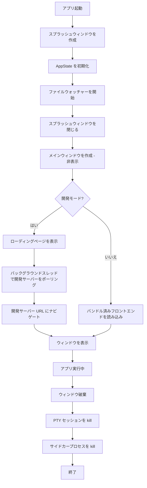

## なぜ Rust でウィンドウを作成するのか

Tauri v2 は `tauri.conf.json` でウィンドウを定義できるが、Rust でプログラム的に作成することで以下を制御できる：

- スプラッシュスクリーンのタイミング
- 開発サーバーの準備完了ポーリング
- 条件付きウィンドウ作成
- 複数ウィンドウインスタンス
- プラットフォーム固有の設定

## スプラッシュスクリーンパターン

アプリの初期化中に軽量なスプラッシュウィンドウを表示し、その後メインウィンドウに置き換える：

```rust
.setup(|app| {
    // 1. Create splash window (non-fatal if it fails)
    if let Err(e) = native::window::create_splash_window(app.handle()) {
        eprintln!("Failed to create splash window: {e}");
    }

    // 2. Do initialization work
    let project_root = resolve_project_root();
    let app_state = Arc::new(AppState::new(project_root));
    app.manage(app_state);

    // Start file watchers, etc.

    // 3. Close splash, create main window
    native::window::close_splash_window(app.handle());
    native::window::create_main_window(app.handle())?;

    Ok(())
})
```

### スプラッシュウィンドウの作成

スプラッシュウィンドウはフレームなし、透明、常に最前面で表示される：

```rust
pub fn create_splash_window(
    handle: &tauri::AppHandle,
) -> tauri::Result<()> {
    let url = WebviewUrl::App("../frontend/splash.html".into());

    let _window = WebviewWindowBuilder::new(handle, "splash", url)
        .title("myapp")
        .inner_size(400.0, 200.0)
        .decorations(false)
        .transparent(true)
        .always_on_top(true)
        .resizable(false)
        .build()?;

    Ok(())
}
```

### スプラッシュの閉じ方

```rust
pub fn close_splash_window(handle: &tauri::AppHandle) {
    if let Some(window) = handle.get_webview_window("splash") {
        let _ = window.close();
    }
}
```

<Note>

プログラムでウィンドウを作成する場合、`tauri.conf.json` の `"windows"` 配列は空にしておく：`"windows": []`。両方の場所でウィンドウを定義すると、重複が発生する。

</Note>

<Warning>

**表示ギャップ**に注意：メインウィンドウが表示される前にスプラッシュを閉じると、一瞬ウィンドウが何も表示されない状態になる。スプラッシュはメインウィンドウの表示準備ができるまで開いたままにするか、スプラッシュを完全にスキップして `PageLoadEvent::Finished` または遅延 `show()` を使用した非表示メインウィンドウを使用する。

</Warning>

## 開発サーバーポーリング付きメインウィンドウ

開発時には、ウィンドウ作成時に Vite 開発サーバーがまだ準備できていない場合がある。パターンは：ローディングページを即座に表示し、サーバーが応答したら開発サーバーにナビゲートする。

```rust
const DEV_SERVER_URL: &str = "http://localhost:37461";

pub fn create_main_window(
    handle: &tauri::AppHandle,
) -> tauri::Result<()> {
    // Unique label for multiple windows
    let label = if handle.get_webview_window("main").is_some() {
        format!("main-{}", std::time::SystemTime::now()
            .duration_since(std::time::UNIX_EPOCH)
            .unwrap_or_default()
            .as_millis())
    } else {
        "main".to_string()
    };

    let url = if cfg!(debug_assertions) {
        // Inline loading page as data: URL
        WebviewUrl::External(
            loading_page_data_url().parse().unwrap(),
        )
    } else {
        WebviewUrl::default() // Bundled frontend
    };

    let window = WebviewWindowBuilder::new(handle, &label, url)
        .title("myapp")
        .inner_size(1400.0, 800.0)
        .visible(false) // Start hidden
        .on_navigation(move |url: &tauri::Url| {
            let url_str = url.as_str();
            // Allow local and tauri URLs
            if url_str.starts_with("http://localhost")
                || url_str.starts_with("tauri://")
                || url_str.starts_with("data:")
            {
                return true;
            }
            // Open external URLs in default browser
            if url_str.starts_with("http://")
                || url_str.starts_with("https://")
            {
                let owned = url_str.to_string();
                tauri::async_runtime::spawn_blocking(move || {
                    let _ = open::that(owned);
                });
                return false;
            }
            false // Block unknown schemes
        })
        .build()?;

    // In dev: poll Vite, navigate when ready
    if cfg!(debug_assertions) {
        let win = window.clone();
        std::thread::spawn(move || {
            if wait_for_dev_server(DEV_SERVER_URL, 120) {
                let url: tauri::Url =
                    DEV_SERVER_URL.parse().unwrap();
                let _ = win.navigate(url);
            }
        });
    }

    // 二重安全策: フォーカスイベント または 遅延で表示
    let win_clone = window.clone();
    window.on_window_event(move |event| {
        if let tauri::WindowEvent::Focused(true) = event {
            if !win_clone.is_visible().unwrap_or(false) {
                let _ = win_clone.show();
            }
        }
    });

    let win = window.clone();
    std::thread::spawn(move || {
        std::thread::sleep(std::time::Duration::from_millis(200));
        let _ = win.show();
    });

    Ok(())
}
```

### 開発サーバーの準備完了チェック

HTTP リクエストの代わりに TCP 接続試行を使用してより高速にポーリングする：

```rust
fn wait_for_dev_server(url: &str, timeout_secs: u64) -> bool {
    let addr = url
        .strip_prefix("http://")
        .or_else(|| url.strip_prefix("https://"))
        .and_then(|h| h.split('/').next())
        .expect("invalid URL");

    let start = std::time::Instant::now();
    let timeout = std::time::Duration::from_secs(timeout_secs);

    while start.elapsed() < timeout {
        if std::net::TcpStream::connect(addr).is_ok() {
            return true;
        }
        std::thread::sleep(std::time::Duration::from_millis(500));
    }
    false
}
```

<Tip>

`TcpStream::connect` は準備完了チェックにおいて HTTP リクエストより高速である。完全な HTTP レスポンスを待たずに、ポートが開いた時点で即座に返る。

</Tip>

<Warning>

上記の `data:` URL アプローチは `Cargo.toml` で `webview-data-url` cargo feature を有効にする必要がある。有効にしないと、WebView は data URL を読み込めない。バンドルされた HTML ファイル（`WebviewUrl::default()` または `WebviewUrl::App(...)`）の方がメンテナンス性で優れる -- 編集しやすく、外部アセットを含めることができ、追加の feature flag が不要である。

</Warning>

<Tip>

`on_window_event(Focused)` ハンドラはセーフティネットとして機能する -- タイマーによる `show()` が WebView のレンダリング完了前に発火した場合、Focused イベントがキャッチする。両方を組み合わせることで、どちらか単独よりも信頼性の高い動作が得られる。

</Tip>

## アンチフラッシュ: ページ読み込み時に表示

バンドル済みフロントエンドを読み込むアプリ（サーバーポーリング不要）では、白フラッシュを防ぐ最もシンプルな方法は、非表示で開始し最初のページ読み込み時に表示すること：

```rust
use tauri::webview::PageLoadEvent;

tauri::Builder::default()
  .on_page_load(|webview, payload| {
    if webview.label() == "main"
      && matches!(payload.event(), PageLoadEvent::Finished)
    {
      let _ = webview.window().show();
    }
  })
```

これは手動の 200ms 遅延アプローチに代わるもので、実際のコンテンツのレンダリングを待つためより信頼性が高い。

<Note>

ウィンドウビルダーで `.visible(false)` と組み合わせることで、ウィンドウは非表示で開始され、ページが完全に読み込まれた後にのみ表示される。

</Note>

<Note>

Rust 側ではなくフロントエンドの JavaScript API からウィンドウの表示を制御する場合、Tauri v2 の設定で以下のケイパビリティを付与する必要がある：

```json
{
  "permissions": [
    "core:window:allow-show",
    "core:window:allow-hide"
  ]
}
```

これらのパーミッションがないと、フロントエンドからの `appWindow.show()` や `appWindow.hide()` の呼び出しは黙って失敗する。

</Note>

## macOS：長押しアクセント文字メニューの抑制

macOS はキーを長押しするとアクセント文字ポップアップを表示する。これはキーリピートを使用するアプリ（テキストエディタ、ターミナルエミュレーターなど）に干渉する。`setup()` 内で抑制する：

```rust
#[cfg(target_os = "macos")]
{
    use objc2_foundation::{NSUserDefaults, NSString};
    let defaults = NSUserDefaults::standardUserDefaults();
    unsafe {
        let key = NSString::from_str("ApplePressAndHoldEnabled");
        defaults.setBool_forKey(false, &key);
    }
}
```

<Note>

これは現在のプロセスにのみ影響する。システム全体の設定は変更しない。他のアプリケーションは通常通りアクセントメニューを表示し続ける。

</Note>

## 外部リンクの処理

`on_navigation` コールバックは、WebView が読み込みを許可する URL を制御する。外部リンクをデフォルトブラウザで開くために使用する：

```rust
.on_navigation(move |url: &tauri::Url| {
    let url_str = url.as_str();

    // Allow local dev server and tauri asset URLs
    if url_str.starts_with("http://localhost")
        || url_str.starts_with("https://localhost")
        || url_str.starts_with("tauri://")
        || url_str.starts_with("asset://")
        || url_str.starts_with("data:")
    {
        return true;
    }

    // External HTTP(S) links -> default browser
    if url_str.starts_with("http://")
        || url_str.starts_with("https://")
    {
        let owned = url_str.to_string();
        tauri::async_runtime::spawn_blocking(move || {
            let _ = open::that(owned);
        });
        return false;
    }

    // Block unknown schemes (javascript:, file:, etc.)
    false
})
```

<Warning>

`javascript:` および `file:` スキームは常にブロックする。これらを許可すると、WebView にセキュリティ脆弱性が生じる。

</Warning>

## ウィンドウ破棄イベントの処理

ウィンドウが破棄された際にリソースをクリーンアップするために `on_window_event` を使用する：

```rust
.on_window_event(|window, event| {
    if let tauri::WindowEvent::Destroyed = event {
        if window.label() == "main" {
            if let Some(state) = window.try_state::<Arc<AppState>>() {
                // Kill all PTY sessions
                commands::terminal::kill_all_ptys(&state);
            }
        }
    }
})
```

### サイドカープロセスのクリーンアップ

サイドカープロセスを生成するアプリでは、`run` コールバックを使用してウィンドウ破棄時にクリーンアップする：

```rust
.build(tauri::generate_context!())
.expect("error while building tauri application")
.run(move |app_handle, event| match &event {
    tauri::RunEvent::WindowEvent {
        event: tauri::WindowEvent::Destroyed,
        ..
    } => {
        if let Ok(mut guard) = sidecar_arc.lock() {
            if let Some(mut sidecar) = guard.take() {
                kill_sidecar(&mut sidecar);
            }
        }
        app_handle.exit(0);
    }
    _ => {}
});
```

<Warning>

アプリが子プロセス（PTY セッション、サイドカーサーバー）を生成する場合、ウィンドウ破棄時に明示的に kill する必要がある。そうしなければ、アプリ終了後もオーファンプロセスとして実行し続ける。

</Warning>

## ウィンドウライフサイクルの概要



## 重要なポイント

1. **プログラムでウィンドウを作成する場合、`tauri.conf.json` の `"windows": []` を空にする**
2. **ウィンドウは非表示で開始する** -- コンテンツが準備できてから表示し、白いフラッシュを回避する
3. **ローディングページには `data:` URL を使用する** -- バンドルされた HTML ファイルは不要（ただし `webview-data-url` feature flag が必要）
4. **TCP 接続で開発サーバーをポーリングする** -- HTTP リクエストより高速
5. **子プロセスはウィンドウ破棄時に必ずクリーンアップする**
6. **`on_navigation` でリンクの動作を制御する** -- 外部リンクはデフォルトブラウザで開く
7. **プラットフォーム固有のコード** は `#[cfg(target_os = "macos")]` ガードの背後に配置する

<Warning>

`tauri-plugin-window-state` を使用する場合、起動時に永続化された `VISIBLE` 状態が復元される可能性があり、非表示→表示パターンと競合する。表示フラグの永続化を明示的に除外するか、プラグインがコードの準備ができる前にウィンドウを表示してしまう。

</Warning>
