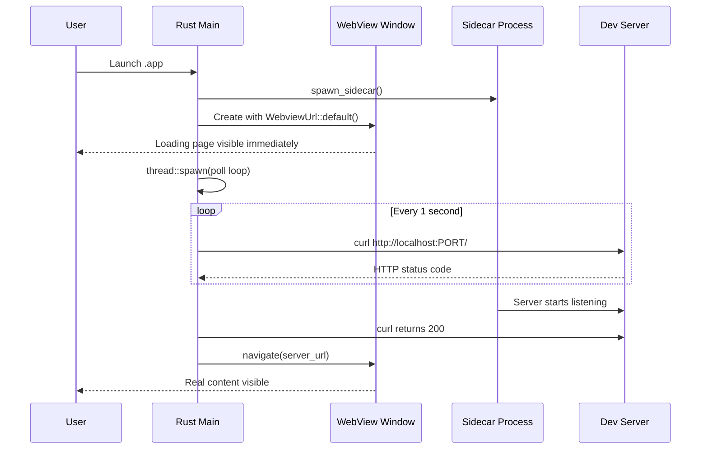
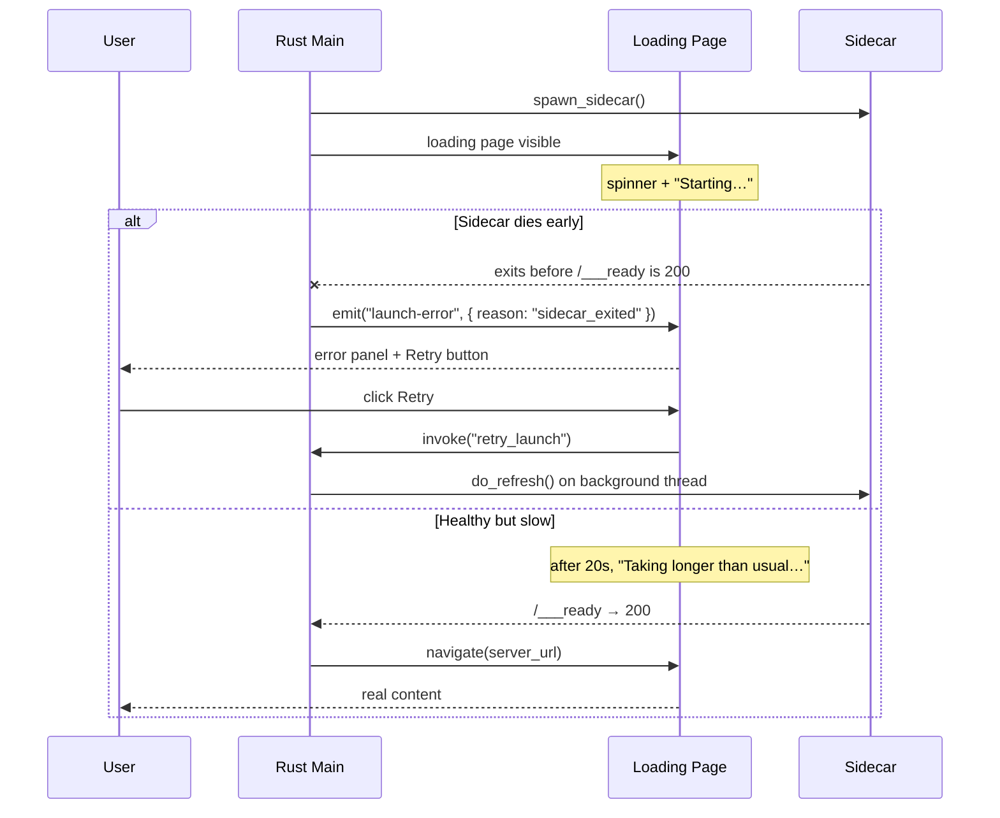

# Loading Screen Pattern

When your Tauri app wraps a dev server or spawns a sidecar process, there is a startup delay -- typically 5-30 seconds while the server compiles and starts serving. Without a loading screen, the user sees either a blank window or no window at all during this time.

The loading screen pattern solves this by showing a lightweight HTML page immediately, then navigating to the real content once the server is ready.

## The Critical Rule

<Warning>

**Never block `setup()` waiting for a build to complete.** If you call `wait_for_build()` inside `setup()` before creating the window, the app appears to hang -- no window, no Dock indicator, nothing. The user has no idea the app is starting. This is the single worst UX mistake in Tauri desktop apps.

</Warning>

Here is the **wrong** way:

```rust
// BAD: Blocks setup(), no window appears for 30+ seconds
.setup(|app| {
    wait_for_build(Duration::from_secs(120));  // Blocks here!

    let url = format!("http://localhost:{PORT}/");
    WebviewWindowBuilder::new(app, "main", WebviewUrl::External(url.parse().unwrap()))
        .build()?;

    Ok(())
})
```

And here is the **right** way:

```rust
// GOOD: Window appears immediately with loading page
.setup(|app| {
    // Show window NOW with the loading page from frontendDist
    WebviewWindowBuilder::new(app, "main", WebviewUrl::default())
        .title("My App")
        .inner_size(1200.0, 800.0)
        .build()?;

    // Poll in background, navigate when ready
    let handle = app.handle().clone();
    thread::spawn(move || {
        wait_for_ready(Duration::from_secs(120));
        if let Some(w) = handle.get_webview_window("main") {
            let url: tauri::Url = server_url().parse().unwrap();
            let _ = w.navigate(url);
        }
    });

    Ok(())
})
```

## How WebviewUrl::default() Works

`WebviewUrl::default()` loads the `index.html` from the directory specified by `frontendDist` in `tauri.conf.json`:

```json
{
  "build": {
    "frontendDist": "./frontend"
  }
}
```

This means `./frontend/index.html` is your loading page. It is bundled into the app binary at compile time and loads instantly -- no server required.

## The Loading Page HTML

The loading page should be minimal, self-contained (no external dependencies), and visually pleasant:

```html
<!DOCTYPE html>
<html>
<head>
<style>
  * { margin: 0; padding: 0; box-sizing: border-box; }
  body {
    background: #181818;
    color: #b8b8b8;
    font-family: system-ui, sans-serif;
    display: flex;
    flex-direction: column;
    align-items: center;
    justify-content: center;
    height: 100vh;
    gap: 1.5rem;
  }
  .spinner {
    width: 32px;
    height: 32px;
    border: 3px solid #383838;
    border-top-color: #d69a66;
    border-radius: 50%;
    animation: spin 0.8s linear infinite;
  }
  @keyframes spin { to { transform: rotate(360deg); } }
  .text { font-size: 1.1rem; color: #888; }
  .sub { font-size: 0.85rem; color: #555; }
</style>
</head>
<body>
  <div class="spinner"></div>
  <div class="text">Starting documentation server...</div>
  <div class="sub">This may take a moment on first launch</div>
</body>
</html>
```

Key design decisions:

- **Dark background** (`#181818`) -- matches common dev tool aesthetics and avoids a jarring white flash
- **Pure CSS spinner** -- no JavaScript or external resources needed
- **System font** -- loads instantly, no font download
- **Centered layout** -- works at any window size
- **Informative message** -- tells the user something is happening

## The Full Pattern: Dev vs Production

The loading screen is only needed in production mode. In dev mode, `beforeDevCommand` ensures the server is already running before the WebView opens.

```rust
const IS_DEV: bool = cfg!(debug_assertions);

// Inside setup():
if IS_DEV {
    // Dev: server is already running via beforeDevCommand
    let url: tauri::Url = server_url().parse().unwrap();
    WebviewWindowBuilder::new(app, "main", WebviewUrl::External(url))
        .title("My App")
        .inner_size(1200.0, 800.0)
        .build()?;
} else {
    // Production: show loading page, navigate when server is ready
    WebviewWindowBuilder::new(app, "main", WebviewUrl::default())
        .title("My App")
        .inner_size(1200.0, 800.0)
        .build()?;

    let handle = app.handle().clone();
    thread::spawn(move || {
        wait_for_ready(Duration::from_secs(120));
        if let Some(w) = handle.get_webview_window("main") {
            let url: tauri::Url = server_url().parse().unwrap();
            let _ = w.navigate(url);
        }
    });
}
```

## Background Thread Polling

The readiness check polls the server until it responds with a non-error HTTP status:

```rust
fn check_ready() -> String {
    Command::new("/usr/bin/curl")
        .args([
            "-s",
            "-o", "/dev/null",
            "-w", "%{http_code}",
            &format!("http://localhost:{PORT}/"),
        ])
        .output()
        .map(|o| String::from_utf8_lossy(&o.stdout).trim().to_string())
        .unwrap_or_else(|_| "err".to_string())
}

fn wait_for_ready(timeout: Duration) {
    log("wait_for_ready: start");
    let start = Instant::now();
    while start.elapsed() < timeout {
        let code = check_ready();
        log(&format!("curl: {code} ({}s)", start.elapsed().as_secs()));
        if code != "000" && code != "err" {
            log("wait_for_ready: ready");
            thread::sleep(Duration::from_secs(1));
            return;
        }
        thread::sleep(Duration::from_secs(1));
    }
    log("wait_for_ready: TIMEOUT");
}
```

<Note>

This uses `/usr/bin/curl` with an absolute path. This is intentional -- it works in both dev and production modes because `/usr/bin/curl` is always available on macOS, regardless of the PATH environment.

</Note>

### Why curl Instead of a Rust HTTP Client?

You could use `reqwest` or `ureq` to make the readiness check purely in Rust. The `curl` approach was chosen for pragmatic reasons:

- No additional dependency needed
- `/usr/bin/curl` is guaranteed to exist on macOS
- The check is trivial -- just getting an HTTP status code
- It runs in a background thread, so spawning a process is not a performance concern

## Sequence Diagram

Here is the full startup sequence:



## Choosing the Right Startup Pattern

Different apps have different startup needs. This table helps you pick the right approach:

| Scenario                                                       | Recommended pattern                                                          | Where documented                                                                                      |
| -------------------------------------------------------------- | ---------------------------------------------------------------------------- | ----------------------------------------------------------------------------------------------------- |
| App wraps a dev server / sidecar with 5-30s startup            | Bundled loading HTML via `WebviewUrl::default()` + background polling        | This page                                                                                             |
| SPA that just needs to avoid white flash on launch             | Hidden window + `show()` on `PageLoadEvent::Finished`                        | [Window Creation and Lifecycle](/pj/zudo-tauri/docs/rust-backend/window-management/)                   |
| App has blocking init (DB migrations, auth, first-run setup)   | Separate splash window (frameless, transparent)                              | [Window Creation and Lifecycle](/pj/zudo-tauri/docs/rust-backend/window-management/)                   |
| Dev mode inline loading page                                   | `data:` URL (requires `webview-data-url` cargo feature)                      | [Window Creation and Lifecycle](/pj/zudo-tauri/docs/rust-backend/window-management/)                   |

<Tip>

The official Tauri v2 splashscreen guide recommends showing the main window quickly with in-app loading state over using a separate splash window, whenever possible.

</Tip>

## The Refresh Pattern

When implementing a refresh command (Cmd+R), you can reuse the same loading-then-navigate pattern:

```rust
fn do_refresh(app_handle: &AppHandle) {
    if !IS_DEV {
        let state = app_handle.state::<AppState>();
        if let Some(ref pnpm_path) = state.pnpm_path {
            let pnpm_path = pnpm_path.clone();
            let mut guard = state.sidecar.lock().unwrap();
            if let Some(mut old) = guard.take() {
                kill_sidecar(&mut old);
            }
            kill_port();
            *guard = Some(spawn_sidecar(&pnpm_path));
            drop(guard);
            wait_for_ready(Duration::from_secs(15));
        }
    }

    if let Some(w) = app_handle.get_webview_window("main") {
        let _ = w.navigate(server_url().parse().unwrap());
    }
}
```

This kills the old sidecar, cleans up the port, spawns a new one, waits for it to be ready, and then navigates. The timeout for refresh (15 seconds) is shorter than the initial startup timeout (120 seconds) because the server is expected to start faster on subsequent launches.

## Error State and Retry

The minimal "spinner + text" loading page works for the happy path, but it lies to the user when the sidecar has already died or the build has stalled. The user sees the same spinner whether the sidecar is building normally or has crashed and will never come back.

The next-level pattern is a loading page that doubles as an error panel. The spinner is the happy path; a hidden error panel listens for a backend-emitted `launch-error` event and flips into an actionable state with a Retry button.

### The backend contract

The Rust side emits a `launch-error` event instead of navigating when [readiness polling detects sidecar death or a timeout](./process-lifecycle.mdx#detecting-sidecar-death-in-the-readiness-loop):

```rust
// Shape of the event payload
// { reason: "timeout" | "sidecar_exited", logPath: "/path/to/sidecar.log" }
```

A matching `retry_launch` command triggers the restart so the frontend can offer a Retry button:

```rust
#[tauri::command]
fn retry_launch(app_handle: AppHandle) {
    // Spawn on a background thread — never block the IPC thread.
    // do_refresh() re-emits launch-error on failure, so a retry
    // that fails again naturally flips the UI back to the error state.
    thread::spawn(move || {
        do_refresh(&app_handle);
    });
}
```

<Warning>

Never run a long restart inline on the IPC thread. Tauri's IPC runtime dispatches commands on a small thread pool; a `retry_launch` that spawns a sidecar, waits 15 s for readiness, and then returns will block other commands for that entire window. Spawn the work on a background `std::thread` and return immediately.

</Warning>

### The frontend panel

The loading HTML grows a hidden error panel. Inline CSS and JS only — the page is bundled and has no bundler, so imports are not an option:

```html
<!-- frontend/index.html (abbreviated) -->
<body>
  <div id="spinner" class="spinner"></div>
  <div id="long-hint" class="sub" hidden>Taking longer than usual…</div>

  <div id="error-panel" hidden>
    <h2>Could not start the documentation server</h2>
    <p id="error-reason"></p>
    <p class="log"><code id="error-log-path"></code></p>
    <button id="retry">Retry</button>
    <button id="copy-log">Copy log path</button>
  </div>

  <script>
    const { event, core } = window.__TAURI__;

    event.listen("launch-error", ({ payload }) => {
      document.getElementById("spinner").hidden = true;
      document.getElementById("long-hint").hidden = true;
      document.getElementById("error-reason").textContent =
        payload.reason === "sidecar_exited"
          ? "The background server exited before becoming ready."
          : "The server took too long to respond.";
      document.getElementById("error-log-path").textContent = payload.logPath;
      document.getElementById("error-panel").hidden = false;
    });

    document.getElementById("retry").addEventListener("click", () => {
      document.getElementById("error-panel").hidden = true;
      document.getElementById("spinner").hidden = false;
      core.invoke("retry_launch");
    });

    document.getElementById("copy-log").addEventListener("click", () => {
      navigator.clipboard.writeText(
        document.getElementById("error-log-path").textContent,
      );
    });

    // Belt-and-suspenders: if we are still on the loading page after 20s,
    // hint that things are taking longer than usual. Distinct from an error —
    // the spinner keeps spinning, the panel stays hidden.
    setTimeout(() => {
      if (document.getElementById("error-panel").hidden) {
        document.getElementById("long-hint").hidden = false;
      }
    }, 20_000);
  </script>
</body>
```

<Note>

The 20-second "taking longer than usual" hint is visually distinct from the error panel. It nudges users who are on a slow first build (large dependency install, cold cargo cache) without falsely signalling failure. The error panel only appears when the backend has actually emitted `launch-error`.

</Note>

### Two prerequisites for the bundled page

Because `frontend/index.html` is bundled and has no bundler, `window.__TAURI__` is the only way to reach the Tauri API. Two config details must line up:

1. **`withGlobalTauri: true` in `tauri.conf.json`** — in Tauri v2 the default is `false`, meaning `window.__TAURI__` does not exist. If you forget this, `event.listen` and `core.invoke` silently do nothing and the panel never wires up.
2. **`core:default` capability** — this already covers both `event:listen` and custom command invokes for the window. No additional capability grants are needed.

See [IPC → Calling IPC from a bundled loading page](../frontend/ipc-commands.mdx#calling-ipc-from-a-bundled-loading-page) for the config details.

### Sequence


