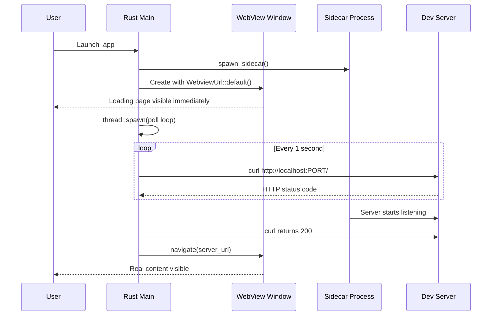

# Loading Screen Pattern

When your Tauri app wraps a dev server or spawns a sidecar process, there is a startup delay -- typically 5-30 seconds while the server compiles and starts serving. Without a loading screen, the user sees either a blank window or no window at all during this time.

The loading screen pattern solves this by showing a lightweight HTML page immediately, then navigating to the real content once the server is ready.

## The Critical Rule

<Warning>

**Never block `setup()` waiting for a build to complete.** If you call `wait_for_build()` inside `setup()` before creating the window, the app appears to hang -- no window, no Dock indicator, nothing. The user has no idea the app is starting. This is the single worst UX mistake in Tauri desktop apps.

</Warning>

Here is the **wrong** way:

```rust
// BAD: Blocks setup(), no window appears for 30+ seconds
.setup(|app| {
    wait_for_build(Duration::from_secs(120));  // Blocks here!

    let url = format!("http://localhost:{PORT}/");
    WebviewWindowBuilder::new(app, "main", WebviewUrl::External(url.parse().unwrap()))
        .build()?;

    Ok(())
})
```

And here is the **right** way:

```rust
// GOOD: Window appears immediately with loading page
.setup(|app| {
    // Show window NOW with the loading page from frontendDist
    WebviewWindowBuilder::new(app, "main", WebviewUrl::default())
        .title("My App")
        .inner_size(1200.0, 800.0)
        .build()?;

    // Poll in background, navigate when ready
    let handle = app.handle().clone();
    thread::spawn(move || {
        wait_for_ready(Duration::from_secs(120));
        if let Some(w) = handle.get_webview_window("main") {
            let url: tauri::Url = server_url().parse().unwrap();
            let _ = w.navigate(url);
        }
    });

    Ok(())
})
```

## How WebviewUrl::default() Works

`WebviewUrl::default()` loads the `index.html` from the directory specified by `frontendDist` in `tauri.conf.json`:

```json
{
  "build": {
    "frontendDist": "./frontend"
  }
}
```

This means `./frontend/index.html` is your loading page. It is bundled into the app binary at compile time and loads instantly -- no server required.

## The Loading Page HTML

The loading page should be minimal, self-contained (no external dependencies), and visually pleasant:

```html
<!DOCTYPE html>
<html>
<head>
<style>
  * { margin: 0; padding: 0; box-sizing: border-box; }
  body {
    background: #181818;
    color: #b8b8b8;
    font-family: system-ui, sans-serif;
    display: flex;
    flex-direction: column;
    align-items: center;
    justify-content: center;
    height: 100vh;
    gap: 1.5rem;
  }
  .spinner {
    width: 32px;
    height: 32px;
    border: 3px solid #383838;
    border-top-color: #d69a66;
    border-radius: 50%;
    animation: spin 0.8s linear infinite;
  }
  @keyframes spin { to { transform: rotate(360deg); } }
  .text { font-size: 1.1rem; color: #888; }
  .sub { font-size: 0.85rem; color: #555; }
</style>
</head>
<body>
  <div class="spinner"></div>
  <div class="text">Starting documentation server...</div>
  <div class="sub">This may take a moment on first launch</div>
</body>
</html>
```

Key design decisions:

- **Dark background** (`#181818`) -- matches common dev tool aesthetics and avoids a jarring white flash
- **Pure CSS spinner** -- no JavaScript or external resources needed
- **System font** -- loads instantly, no font download
- **Centered layout** -- works at any window size
- **Informative message** -- tells the user something is happening

## The Full Pattern: Dev vs Production

The loading screen is only needed in production mode. In dev mode, `beforeDevCommand` ensures the server is already running before the WebView opens.

```rust
const IS_DEV: bool = cfg!(debug_assertions);

// Inside setup():
if IS_DEV {
    // Dev: server is already running via beforeDevCommand
    let url: tauri::Url = server_url().parse().unwrap();
    WebviewWindowBuilder::new(app, "main", WebviewUrl::External(url))
        .title("My App")
        .inner_size(1200.0, 800.0)
        .build()?;
} else {
    // Production: show loading page, navigate when server is ready
    WebviewWindowBuilder::new(app, "main", WebviewUrl::default())
        .title("My App")
        .inner_size(1200.0, 800.0)
        .build()?;

    let handle = app.handle().clone();
    thread::spawn(move || {
        wait_for_ready(Duration::from_secs(120));
        if let Some(w) = handle.get_webview_window("main") {
            let url: tauri::Url = server_url().parse().unwrap();
            let _ = w.navigate(url);
        }
    });
}
```

## Background Thread Polling

The readiness check polls the server until it responds with a non-error HTTP status:

```rust
fn check_ready() -> String {
    Command::new("/usr/bin/curl")
        .args([
            "-s",
            "-o", "/dev/null",
            "-w", "%{http_code}",
            &format!("http://localhost:{PORT}/"),
        ])
        .output()
        .map(|o| String::from_utf8_lossy(&o.stdout).trim().to_string())
        .unwrap_or_else(|_| "err".to_string())
}

fn wait_for_ready(timeout: Duration) {
    log("wait_for_ready: start");
    let start = Instant::now();
    while start.elapsed() < timeout {
        let code = check_ready();
        log(&format!("curl: {code} ({}s)", start.elapsed().as_secs()));
        if code != "000" && code != "err" {
            log("wait_for_ready: ready");
            thread::sleep(Duration::from_secs(1));
            return;
        }
        thread::sleep(Duration::from_secs(1));
    }
    log("wait_for_ready: TIMEOUT");
}
```

<Note>

This uses `/usr/bin/curl` with an absolute path. This is intentional -- it works in both dev and production modes because `/usr/bin/curl` is always available on macOS, regardless of the PATH environment.

</Note>

### Why curl Instead of a Rust HTTP Client?

You could use `reqwest` or `ureq` to make the readiness check purely in Rust. The `curl` approach was chosen for pragmatic reasons:

- No additional dependency needed
- `/usr/bin/curl` is guaranteed to exist on macOS
- The check is trivial -- just getting an HTTP status code
- It runs in a background thread, so spawning a process is not a performance concern

## Sequence Diagram

Here is the full startup sequence:



## Choosing the Right Startup Pattern

Different apps have different startup needs. This table helps you pick the right approach:

| Scenario                                                       | Recommended pattern                                                          | Where documented                                                                                      |
| -------------------------------------------------------------- | ---------------------------------------------------------------------------- | ----------------------------------------------------------------------------------------------------- |
| App wraps a dev server / sidecar with 5-30s startup            | Bundled loading HTML via `WebviewUrl::default()` + background polling        | This page                                                                                             |
| SPA that just needs to avoid white flash on launch             | Hidden window + `show()` on `PageLoadEvent::Finished`                        | [Window Creation and Lifecycle](/pj/zudo-tauri/docs/rust-backend/window-management/)                   |
| App has blocking init (DB migrations, auth, first-run setup)   | Separate splash window (frameless, transparent)                              | [Window Creation and Lifecycle](/pj/zudo-tauri/docs/rust-backend/window-management/)                   |
| Dev mode inline loading page                                   | `data:` URL (requires `webview-data-url` cargo feature)                      | [Window Creation and Lifecycle](/pj/zudo-tauri/docs/rust-backend/window-management/)                   |

<Tip>

The official Tauri v2 splashscreen guide recommends showing the main window quickly with in-app loading state over using a separate splash window, whenever possible.

</Tip>

## The Refresh Pattern

When implementing a refresh command (Cmd+R), you can reuse the same loading-then-navigate pattern:

```rust
fn do_refresh(app_handle: &AppHandle) {
    if !IS_DEV {
        let state = app_handle.state::<AppState>();
        if let Some(ref pnpm_path) = state.pnpm_path {
            let pnpm_path = pnpm_path.clone();
            let mut guard = state.sidecar.lock().unwrap();
            if let Some(mut old) = guard.take() {
                kill_sidecar(&mut old);
            }
            kill_port();
            *guard = Some(spawn_sidecar(&pnpm_path));
            drop(guard);
            wait_for_ready(Duration::from_secs(15));
        }
    }

    if let Some(w) = app_handle.get_webview_window("main") {
        let _ = w.navigate(server_url().parse().unwrap());
    }
}
```

This kills the old sidecar, cleans up the port, spawns a new one, waits for it to be ready, and then navigates. The timeout for refresh (15 seconds) is shorter than the initial startup timeout (120 seconds) because the server is expected to start faster on subsequent launches.
