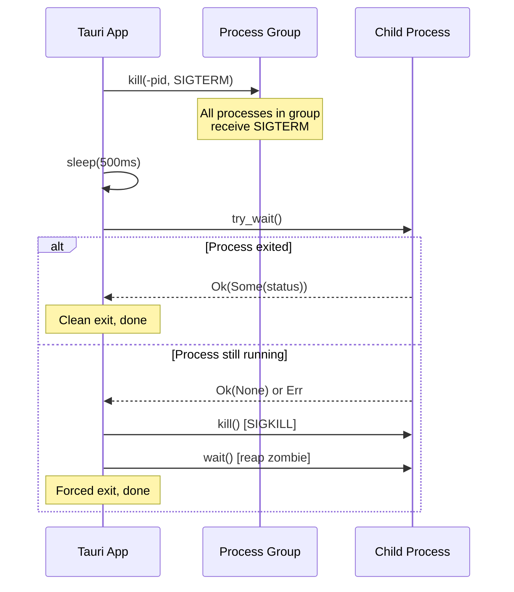
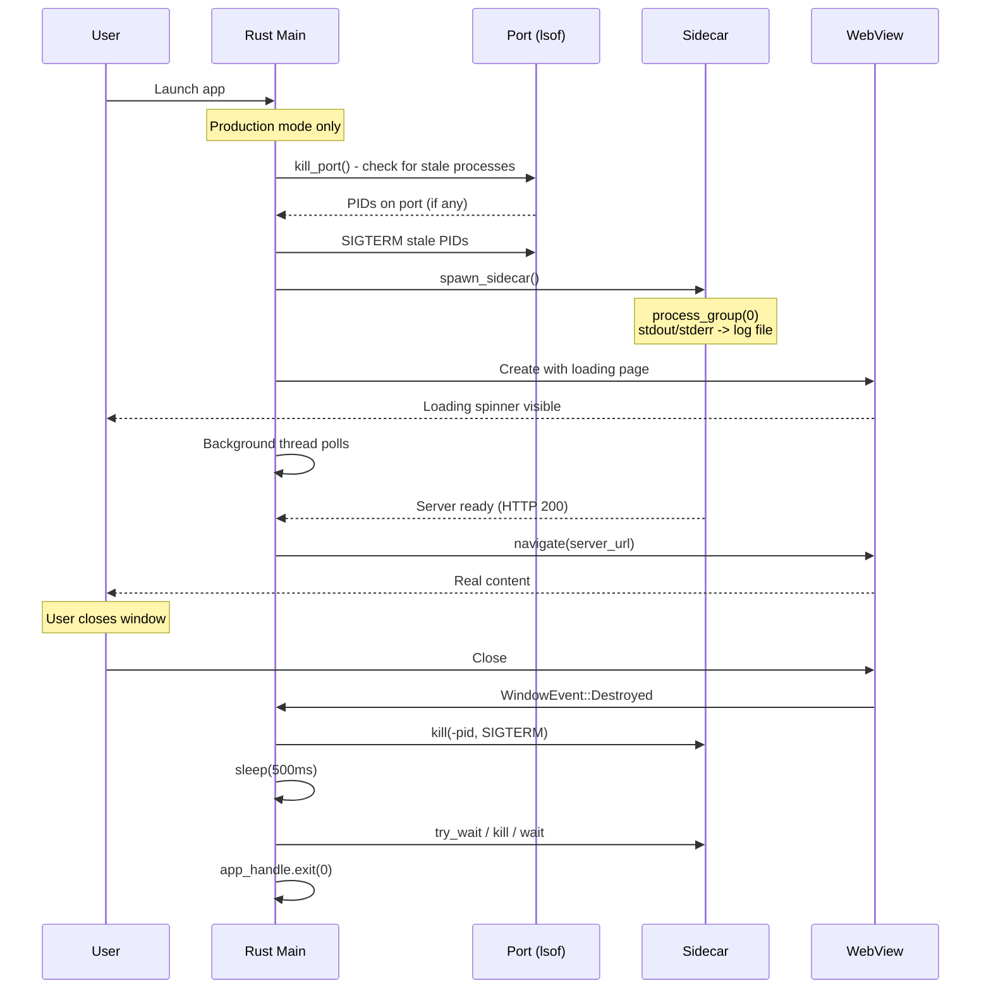

# Process Lifecycle

Managing process lifecycles is one of the most error-prone aspects of Tauri wrapper apps. If you get this wrong, you end up with zombie processes, occupied ports, and apps that will not launch a second time.

This page covers the full lifecycle: port cleanup before launch, sidecar stdout/stderr handling, process group setup for clean shutdown, the macOS window-close-must-exit pattern, and the graceful kill sequence.

## Kill Stale Port Before Spawn

Before spawning a new sidecar, you must ensure the port is free. A previous instance of the app may have crashed and left a process listening on the port:

```rust
fn kill_port() {
    if let Ok(output) = Command::new("/usr/bin/lsof")
        .args(["-ti", &format!(":{PORT}")])
        .output()
    {
        let pids = String::from_utf8_lossy(&output.stdout);
        for line in pids.trim().lines() {
            if let Ok(pid) = line.trim().parse::<i32>() {
                log(&format!(
                    "kill_port: killing stale pid {pid} on port {PORT}"
                ));
                // SAFETY: pid is a valid process ID obtained from lsof
                unsafe { libc::kill(pid, libc::SIGTERM) };
            }
        }
        if !pids.trim().is_empty() {
            thread::sleep(Duration::from_millis(500));
        }
    }
}
```

Key details:

- Uses `/usr/bin/lsof` with absolute path (works in both dev and production)
- `-ti` gives terse output (just PIDs, no headers) for the given port
- Sends `SIGTERM` (graceful) rather than `SIGKILL` (forced)
- Waits 500ms for processes to actually terminate
- Called before every `spawn_sidecar()`

<Warning>

Always call `kill_port()` before spawning the sidecar. If you skip this step and a stale process is holding the port, your new sidecar will either fail to bind or bind to a different port, and your app will never connect to it.

</Warning>

### When to Call kill_port()

```rust
fn main() {
    let sidecar: Option<Sidecar> = if IS_DEV {
        None
    } else {
        kill_port();  // Clean up before first spawn
        Some(spawn_sidecar(&pnpm_path))
    };
}

fn do_refresh(app_handle: &AppHandle) {
    // On refresh: kill old sidecar, then clean the port, then spawn new
    if let Some(mut old) = guard.take() {
        kill_sidecar(&mut old);
    }
    kill_port();  // Clean up before re-spawn
    *guard = Some(spawn_sidecar(&pnpm_path));
}
```

## Sidecar stdout/stderr Redirection

Sidecar output must go somewhere. Letting it inherit the parent's stdout/stderr works in dev mode (you see it in the terminal) but is useless in production (there is no terminal). Redirect to a log file:

```rust
fn spawn_sidecar(pnpm_path: &std::path::Path) -> Sidecar {
    let sidecar_log_path = app_dir().join(".tauri-sidecar-log");

    let log_file = fs::OpenOptions::new()
        .create(true)
        .write(true)
        .truncate(true)  // Fresh log each launch
        .open(&sidecar_log_path)
        .unwrap_or_else(|e| {
            panic!("Failed to open sidecar log at {}: {e}",
                sidecar_log_path.display());
        });
    let log_file_clone = log_file
        .try_clone()
        .expect("Failed to clone sidecar log file handle");

    let mut cmd = Command::new(pnpm_path);
    cmd.args(["dev"])
        .current_dir(&target_dir)
        .stdout(Stdio::from(log_file))       // stdout -> log file
        .stderr(Stdio::from(log_file_clone)); // stderr -> same log file

    // ...spawn
}
```

<Note>

The `try_clone()` call is necessary because `Stdio::from()` takes ownership of the file handle. You need two separate handles -- one for stdout and one for stderr -- even though they point to the same file.

</Note>

### Log File Strategy

The pattern used here is:

- **Truncate on each launch** (`write(true).truncate(true)`) -- the log file only contains output from the current session
- **App-scoped path** (`.tauri-sidecar-log` in the app directory) -- easy to find for debugging
- **Separate from app log** -- the app's own log (`.tauri-log`) tracks lifecycle events; the sidecar log captures raw stdout/stderr

## Process Group for Clean Shutdown

This is one of the most important patterns. When you spawn a sidecar like `pnpm dev`, it spawns its own child processes (Vite, esbuild, etc.). If you only kill the `pnpm` process, its children become orphans and keep holding the port.

The solution is to spawn the sidecar in its own **process group**:

```rust
let mut cmd = Command::new(pnpm_path);
cmd.args(["dev"])
    .current_dir(&dir)
    .stdout(Stdio::from(log_file))
    .stderr(Stdio::from(log_file_clone));

#[cfg(unix)]
{
    use std::os::unix::process::CommandExt;
    cmd.process_group(0);  // New process group, PGID = child PID
}

let child = cmd.spawn().expect("Failed to spawn sidecar");
let pid = child.id();
```

`process_group(0)` tells the OS to create a new process group with the child's PID as the group ID. All processes spawned by this child (and their children) inherit this group ID.

### Why This Matters

Without `process_group(0)`:

```
Tauri App (PID 100)
  └── pnpm (PID 200)     <-- You can kill this
        └── vite (PID 300)  <-- This becomes an orphan!
              └── esbuild (PID 400)  <-- This too!
```

With `process_group(0)`:

```
Tauri App (PID 100)
  └── [Process Group PGID=200]
        ├── pnpm (PID 200)
        ├── vite (PID 300)
        └── esbuild (PID 400)

kill(-200, SIGTERM) → kills ALL of them
```

## macOS Window Close Must Exit

On macOS, closing the last window does not terminate the application by default -- the process stays alive in the Dock. For wrapper apps, this is wrong: if the window is closed, the sidecar should be killed and the app should exit.

```rust
.build(tauri::generate_context!())
.expect("error while building tauri application")
.run(move |app_handle, event| match &event {
    tauri::RunEvent::WindowEvent {
        event: tauri::WindowEvent::Destroyed,
        ..
    } => {
        // Kill sidecar on window close
        if !IS_DEV {
            if let Ok(mut g) = sidecar_for_exit.lock() {
                if let Some(mut s) = g.take() {
                    kill_sidecar(&mut s);
                }
            }
        }
        // Force app exit
        app_handle.exit(0);
    }
    _ => {}
});
```

<Warning>

If you forget `app_handle.exit(0)`, the Rust process will keep running after the window is closed. The sidecar will also keep running (if you forgot to kill it). The user will see a Dock icon with no window and wonder why their port is still occupied.

</Warning>

### The sidecar_for_exit Pattern

The sidecar state must be accessible from the `.run()` closure, which is separate from the `.setup()` closure. The pattern is to clone the `Arc<Mutex<>>` before building the app:

```rust
let app_state = AppState {
    sidecar: Arc::new(Mutex::new(sidecar)),
    pnpm_path: found_pnpm,
    zoom: Mutex::new(1.0),
};

// Clone the Arc before moving app_state into .manage()
let sidecar_for_exit = app_state.sidecar.clone();

tauri::Builder::default()
    .manage(app_state)  // app_state moved here
    .setup(|app| { /* ... */ })
    .build(tauri::generate_context!())
    .run(move |app_handle, event| {
        // sidecar_for_exit is accessible here
        // ...
    });
```

## Sidecar Kill Sequence

The kill sequence is a two-phase approach: try graceful shutdown first, then force-kill if necessary.

```rust
fn kill_sidecar(sidecar: &mut Sidecar) {
    log(&format!("kill_sidecar: pid={}", sidecar.pid));

    // Phase 1: SIGTERM the entire process group
    #[cfg(unix)]
    {
        if let Ok(pid) = i32::try_from(sidecar.pid) {
            if pid > 0 {
                // Negative PID signals the entire process group
                // SAFETY: pid is a valid child process ID
                unsafe { libc::kill(-pid, libc::SIGTERM) };
            }
        }
    }

    // Wait for graceful shutdown
    thread::sleep(Duration::from_millis(500));

    // Phase 2: Check if it exited, force-kill if not
    match sidecar.child.try_wait() {
        Ok(Some(_)) => {
            log("kill_sidecar: process already exited");
        }
        _ => {
            log("kill_sidecar: escalating to SIGKILL");
            let _ = sidecar.child.kill();  // SIGKILL
            let _ = sidecar.child.wait();  // Reap zombie
        }
    }
}
```

### The Two Phases Explained



Key points:

1. **SIGTERM to `-pid`** (negative) targets the entire process group, not just the top-level process
2. **500ms wait** gives processes time to clean up (flush buffers, close connections)
3. **`try_wait()`** checks if the process exited without blocking
4. **`kill()` then `wait()`** -- `kill()` sends SIGKILL, and `wait()` reaps the zombie process to prevent resource leaks

<Tip>

The `wait()` call after `kill()` is essential. Without it, the killed process becomes a zombie -- it no longer runs, but its entry stays in the process table until the parent reaps it.

</Tip>

## Complete Lifecycle Sequence

Here is the full lifecycle from app launch to app exit:



## Detecting Sidecar Death in the Readiness Loop

The naive readiness loop polls `/___ready` and either returns `Ready` or gives up after a timeout. That works when the sidecar is healthy, but it burns the full timeout whenever the sidecar has already died — typically because a dependency like `node_modules/` is missing on a fresh install. The user sees the loading page for the full 120 s and then the app navigates to a dead port anyway.

The fix is to let `wait_for_ready` short-circuit when the child process has exited. Pass the sidecar handle in and call `Child::try_wait()` each poll tick:

```rust
pub enum ReadyResult {
    Ready,
    Timeout,
    SidecarExited { code: Option<i32> },
}

pub fn wait_for_ready(
    sidecar: &Arc<Mutex<Option<Sidecar>>>,
    timeout: Duration,
) -> ReadyResult {
    let start = Instant::now();
    while start.elapsed() < timeout {
        // Scope the lock narrowly — do NOT hold it across the curl call.
        if let Ok(mut guard) = sidecar.lock() {
            if let Some(s) = guard.as_mut() {
                match s.child.try_wait() {
                    Ok(Some(status)) => {
                        return ReadyResult::SidecarExited {
                            code: status.code(),
                        };
                    }
                    Ok(None) => {} // still running
                    Err(e) => log(&format!("try_wait error: {e}")),
                }
            }
        }

        let code = check_ready();
        if code != "000" && code != "err" {
            thread::sleep(Duration::from_secs(1));
            return ReadyResult::Ready;
        }
        thread::sleep(Duration::from_secs(1));
    }
    ReadyResult::Timeout
}
```

Three details matter:

- **`try_wait()` is cheap.** It is a single `waitpid(WNOHANG)` syscall that returns `Ok(None)` while the child runs and `Ok(Some(status))` once it exits. Safe to call in a 1 Hz poll.
- **Scope the mutex lock narrowly.** Acquire → `try_wait()` → drop the guard before running `curl`. Holding the guard across the network call would block refresh, exit, and any other path that needs the same mutex.
- **Both call sites branch on `ReadyResult`.** `setup()`'s initial launch and `do_refresh()` both consume the enum and surface a `launch-error` event instead of navigating to a dead port. See [Loading Screen → Error state and retry](./loading-screen.mdx#error-state-and-retry) for the frontend side.

<Warning>

Do NOT hold the `Mutex<Option<Sidecar>>` guard across the `curl` call. A one-second curl with the lock held is enough to stall any refresh, retry, or window-close event that also needs to touch the sidecar. Scope the guard to just the `try_wait()` read.

</Warning>

### Emitting a launch-error event

When `wait_for_ready` returns `Timeout` or `SidecarExited`, emit a Tauri event instead of navigating to a dead URL. The loading page listens for it and flips into an error state (see loading-screen.mdx).

```rust
use tauri::{AppHandle, Emitter, Manager};

fn emit_launch_error(app_handle: &AppHandle, reason: &str) {
    if let Some(w) = app_handle.get_webview_window("main") {
        let _ = w.emit(
            "launch-error",
            serde_json::json!({
                "reason": reason,
                "logPath": sidecar_log_path().to_string_lossy(),
            }),
        );
    }
}

// In setup() / do_refresh():
match wait_for_ready(&state.sidecar, Duration::from_secs(120)) {
    ReadyResult::Ready => {
        let _ = w.navigate(server_url().parse().unwrap());
    }
    ReadyResult::Timeout => emit_launch_error(&handle, "timeout"),
    ReadyResult::SidecarExited { .. } => {
        emit_launch_error(&handle, "sidecar_exited");
    }
}
```

<Tip>

`tauri::Emitter` is the v2 trait that adds `.emit()` to `AppHandle` and `WebviewWindow`. Emitting from the window (not the app handle) targets that window's frontend listeners cleanly.

`serde_json` ships transitively via `tauri`, so promoting it from `dev-dependencies` to `dependencies` costs nothing in compile time and lets you build the payload with `serde_json::json!` instead of a custom struct.

</Tip>

## Logging

Both the app's own lifecycle events and the sidecar's output should be logged to separate files:

```rust
fn log(msg: &str) {
    use std::io::Write;
    let path = app_dir().join(".tauri-log");
    if let Ok(mut f) = fs::OpenOptions::new()
        .create(true)
        .append(true)  // Append, don't truncate
        .open(&path)
    {
        let secs = SystemTime::now()
            .duration_since(UNIX_EPOCH)
            .unwrap_or_default()
            .as_secs();
        let _ = writeln!(f, "[{secs}] {msg}");
    }
}
```

This gives you two log files for debugging:

| File | Contents |
|------|----------|
| `.tauri-log` | App lifecycle events (spawn, kill, ready, timeout) |
| `.tauri-sidecar-log` | Raw sidecar stdout/stderr |

The app log uses `append(true)` so it accumulates across launches (useful for debugging intermittent issues). The sidecar log uses `truncate(true)` so it only shows the current session's output.
