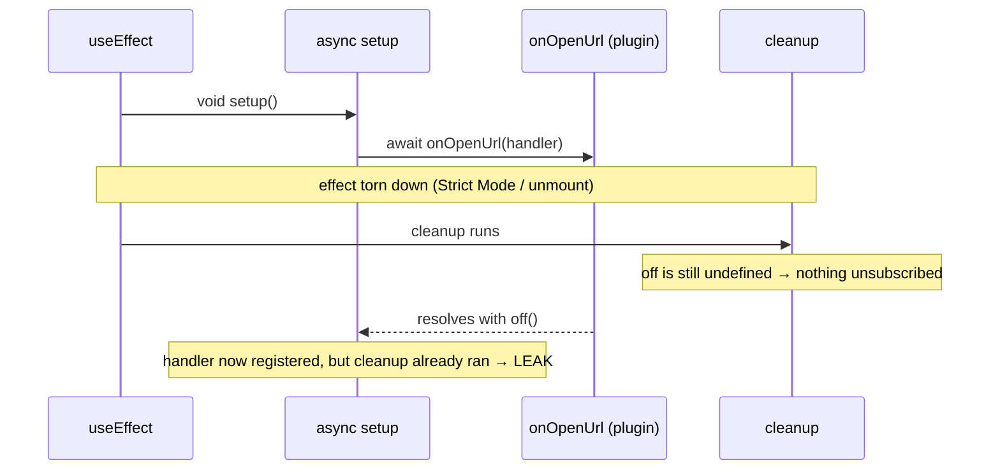

## What a deep link does

A deep link is a custom URL scheme -- `zudotext://open?workspace=...` -- that the OS hands to your app instead of a browser. Click such a link (or open it from a notification) and the OS launches or foregrounds your app, then delivers the URL to your code. `tauri-plugin-deep-link` registers the scheme with the OS and surfaces the URL to the frontend.

This page covers two things that bite people:

1. **Registration** -- where the scheme is declared and why `init()` is gated by platform.
2. **The async teardown race** -- the subtle bug that leaks the URL handler when a React effect is torn down mid-subscription.

## Registering the scheme

The custom scheme is declared in the Tauri config under `plugins.deep-link`. In a multi-config setup the scheme lives in the **variant** config that actually ships the feature (for example `tauri.conf.writing.json`), not the shared base config:

```json
{
  "plugins": {
    "deep-link": {
      "desktop": {
        "schemes": ["zudotext"]
      }
    }
  }
}
```

On the Rust side, the plugin is wired into the builder. The important detail is the `#[cfg(...)]` gate:

```rust
fn main() {
    let builder = tauri::Builder::default()
        // zudotext:// URL scheme — registers the custom protocol with the OS
        // and emits a deep-link event to the renderer whenever the app is
        // opened (or foregrounded) via a zudotext:// link. The scheme itself
        // is declared in the variant config under plugins.deep-link.
        .plugin(tauri_plugin_deep_link::init());

    builder
        .run(tauri::generate_context!())
        .expect("error while running tauri application");
}
```

<Warning>

`tauri_plugin_deep_link::init()` should be gated **off iOS**. Desktop scheme registration and the iOS Universal Links / custom-scheme path use different native linker support, so the desktop `init()` does not apply cleanly there:

```rust
#[cfg(not(target_os = "ios"))]
let builder = builder.plugin(tauri_plugin_deep_link::init());
```

This is a platform-imposed quirk, not a stylistic choice -- the value is fixed by how each OS resolves custom schemes.

</Warning>

## Subscribing from the frontend

The frontend listens with the `onOpenUrl` helper from `@tauri-apps/plugin-deep-link`. Import it **dynamically** so the plugin is tree-shaken out of any web/mock build that has no Tauri runtime:

```tsx
const { onOpenUrl } = await import("@tauri-apps/plugin-deep-link");
const off = await onOpenUrl((urls: string[]) => {
  for (const rawUrl of urls) {
    const url = new URL(rawUrl);
    if (url.protocol !== "zudotext:") continue;
    // route the URL into the app...
  }
});
```

`onOpenUrl` returns a Promise that resolves to an unsubscribe function (`off`). That single fact -- the subscription is established **asynchronously** -- is the entire source of the bug below.

## The async teardown race

In React you naturally put this in a `useEffect` and return a cleanup function. But `onOpenUrl` is `await`ed, which means the effect can be **torn down while you are still awaiting it**. Strict Mode (double-invoke), a fast unmount, or a re-render that changes a dependency all trigger cleanup before the `await` resolves.

When that happens, the naive cleanup runs while `off` is still `undefined` -- so it unsubscribes nothing. A moment later the `await` resolves, the handler is registered, and now **nothing will ever unsubscribe it.** The deep-link handler is leaked, and on the next mount you register a second one.



The fix is a `cancelled` flag captured in the closure. After the `await` resolves, check it: if cleanup already ran, call `off()` right there and return; otherwise store `off` so the (future) cleanup can use it.

```tsx
import { useEffect } from "react";

function useDeepLink(onUrl: (url: URL) => void) {
  useEffect(() => {
    let unsubscribe: (() => void) | undefined;
    let cancelled = false;

    const setup = async () => {
      // Guard: only register inside the real Tauri runtime.
      if (!("__TAURI_INTERNALS__" in globalThis)) return;
      try {
        // Dynamic import so the plugin is tree-shaken from web/mock builds.
        const { onOpenUrl } = await import("@tauri-apps/plugin-deep-link");
        const off = await onOpenUrl((urls: string[]) => {
          for (const rawUrl of urls) {
            try {
              onUrl(new URL(rawUrl));
            } catch {
              // Malformed URL — silently skip.
            }
          }
        });
        // The effect may have been torn down while awaiting onOpenUrl.
        // If so, cleanup already ran with `unsubscribe` undefined, so
        // unsubscribe here to avoid leaking the deep-link handler.
        if (cancelled) {
          off();
          return;
        }
        unsubscribe = off;
      } catch (err) {
        // Plugin not available (web/mock mode) — no-op.
        console.debug("[deep-link] plugin not available:", err);
      }
    };

    void setup();
    return () => {
      cancelled = true;
      unsubscribe?.();
    };
  }, [onUrl]);
}
```

Two branches cover the whole race:

- **Cleanup runs after `off` is stored** -- the normal path. `unsubscribe?.()` fires and the handler is removed.
- **Cleanup runs before `off` resolves** -- the race path. `unsubscribe` is still `undefined`, so the cleanup unsubscribes nothing, but it sets `cancelled = true`. When the `await` finally resolves, the `if (cancelled)` branch calls `off()` itself.

<Tip>

The pattern generalizes to **any** subscription whose unsubscribe handle is only available after an `await`: Tauri's `listen()`, `getCurrentWindow().onResized()`, a dynamically imported event source. If you `await` to get the cleanup function, you must also handle the case where the effect is gone by the time it arrives.

</Tip>

## Why a plain boolean and not AbortController

An `AbortController` would let you cancel a fetch, but `onOpenUrl` does not accept a signal and cannot be aborted mid-flight -- it always resolves to a real subscription. So cancellation is meaningless here; what you need is to know **whether the resolved subscription still has an owner.** A captured `cancelled` boolean answers exactly that question and nothing more.

## Key takeaways

1. **Declare the scheme in the variant config** under `plugins.deep-link`, not the shared base config.
2. **Gate `tauri_plugin_deep_link::init()` with `#[cfg(not(target_os = "ios"))]`** -- desktop and iOS scheme registration differ at the native level.
3. **Import the plugin dynamically** so web/mock builds without a Tauri runtime tree-shake it out.
4. **`onOpenUrl` resolves asynchronously**, so the effect can be torn down before you hold the unsubscribe handle.
5. **Capture a `cancelled` flag** and call `off()` from inside the resolved callback when the effect is already gone -- otherwise the deep-link handler leaks and duplicates on the next mount.
