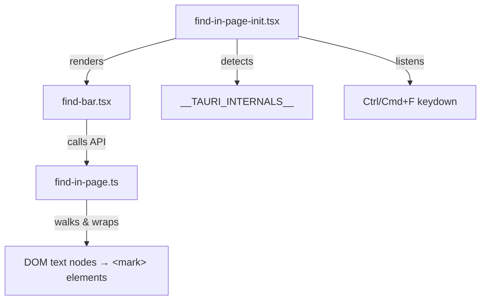

## Why you need this

Tauri's webview does not expose the browser's native Ctrl+F find dialog. Unlike Electron (which provides `webContents.findInPage()`), Tauri has no built-in API for text search. If your app has long-form content and users expect Ctrl+F to work, you need to implement it yourself using DOM manipulation.

## Architecture

The implementation splits into three files with clear separation of concerns:

| File | Role | Dependencies |
|---|---|---|
| `utils/find-in-page.ts` | Pure DOM search utility | None (framework-agnostic) |
| `components/find-bar.tsx` | Search UI (input + navigation) | React, find-in-page utility |
| `components/find-in-page-init.tsx` | Tauri detection + keyboard binding | React, FindBar component |



## Core utility: `createFindInPage()`

The utility walks text nodes inside a container element, finds substring matches (case-insensitive), and wraps each match in a `<mark>` element. It exposes a simple API:

- **`find(container, query)`** -- search within a container, highlight all matches, activate the first one
- **`next()`** / **`prev()`** -- cycle through matches with scroll-into-view
- **`stop()`** -- remove all highlights and restore original text nodes

```typescript
export interface FindResult {
  matches: number;
  activeMatchOrdinal: number; // 1-based
}

export interface FindInPage {
  find(container: HTMLElement, query: string): FindResult;
  next(): FindResult;
  prev(): FindResult;
  stop(): void;
}
```

### Full implementation

```typescript
// utils/find-in-page.ts

export interface FindResult {
  matches: number;
  activeMatchOrdinal: number; // 1-based
}

export interface FindInPage {
  find(container: HTMLElement, query: string): FindResult;
  next(): FindResult;
  prev(): FindResult;
  stop(): void;
}

const MATCH_CLASS = "find-match";
const ACTIVE_CLASS = "find-match-active";

const EMPTY_RESULT: FindResult = Object.freeze({
  matches: 0,
  activeMatchOrdinal: 0,
});

export function createFindInPage(): FindInPage {
  let matchElements: HTMLElement[] = [];
  let activeIndex = -1;

  function clearMarks(): void {
    const parentsToNormalize = new Set<Node>();
    for (let i = matchElements.length - 1; i >= 0; i--) {
      const mark = matchElements[i];
      const parent = mark.parentNode;
      if (parent) {
        const textNode = document.createTextNode(mark.textContent || "");
        parent.replaceChild(textNode, mark);
        parentsToNormalize.add(parent);
      }
    }
    for (const parent of parentsToNormalize) {
      (parent as Element).normalize();
    }
    matchElements = [];
    activeIndex = -1;
  }

  function setActive(index: number): void {
    if (activeIndex >= 0 && activeIndex < matchElements.length) {
      const prev = matchElements[activeIndex];
      prev.classList.remove(ACTIVE_CLASS);
    }
    activeIndex = index;
    if (activeIndex >= 0 && activeIndex < matchElements.length) {
      const current = matchElements[activeIndex];
      current.classList.add(ACTIVE_CLASS);
      current.scrollIntoView?.({ block: "center" });
    }
  }

  function currentResult(): FindResult {
    if (matchElements.length === 0) return EMPTY_RESULT;
    return {
      matches: matchElements.length,
      activeMatchOrdinal: activeIndex + 1,
    };
  }

  function find(container: HTMLElement, query: string): FindResult {
    clearMarks();
    if (!query) return EMPTY_RESULT;

    const lowerQuery = query.toLowerCase();
    const walker = document.createTreeWalker(
      container,
      NodeFilter.SHOW_TEXT,
      null,
    );
    const textNodes: Text[] = [];
    let node: Text | null;
    while ((node = walker.nextNode() as Text | null)) {
      textNodes.push(node);
    }

    for (const textNode of textNodes) {
      const text = textNode.textContent || "";
      const lowerText = text.toLowerCase();
      const positions: number[] = [];
      let searchFrom = 0;
      while (searchFrom < lowerText.length) {
        const idx = lowerText.indexOf(lowerQuery, searchFrom);
        if (idx === -1) break;
        positions.push(idx);
        searchFrom = idx + lowerQuery.length;
      }
      if (positions.length === 0) continue;

      const parent = textNode.parentNode;
      if (!parent) continue;

      let remainingNode: Text = textNode;
      const nodeMarks: HTMLElement[] = [];

      for (let i = positions.length - 1; i >= 0; i--) {
        const pos = positions[i];
        const matchLen = query.length;
        if (pos + matchLen < remainingNode.length)
          remainingNode.splitText(pos + matchLen);
        let matchNode: Text;
        if (pos > 0) {
          matchNode = remainingNode.splitText(pos);
        } else {
          matchNode = remainingNode;
        }
        const mark = document.createElement("mark");
        mark.className = MATCH_CLASS;
        mark.textContent = matchNode.textContent;
        parent.replaceChild(mark, matchNode);
        nodeMarks.unshift(mark);
      }
      matchElements.push(...nodeMarks);
    }

    if (matchElements.length === 0) return EMPTY_RESULT;
    setActive(0);
    return currentResult();
  }

  function next(): FindResult {
    if (matchElements.length === 0) return EMPTY_RESULT;
    setActive((activeIndex + 1) % matchElements.length);
    return currentResult();
  }

  function prev(): FindResult {
    if (matchElements.length === 0) return EMPTY_RESULT;
    setActive(
      (activeIndex - 1 + matchElements.length) % matchElements.length,
    );
    return currentResult();
  }

  function stop(): void {
    clearMarks();
  }

  return { find, next, prev, stop };
}
```

### How the DOM manipulation works

1. **TreeWalker** collects all text nodes inside the container
2. For each text node, find all substring positions (case-insensitive)
3. **Split and wrap** -- iterate positions in reverse to avoid offset shifts:
- `splitText()` to isolate the matched substring
- Replace the text node with a `<mark class="find-match">` element
4. **Cleanup** (`clearMarks`) reverses the process: replace each `<mark>` with a text node, then call `normalize()` to merge adjacent text nodes back together

:::warning[Single text node limitation]
This approach only matches text within a single DOM text node. If a word is split across elements (e.g., `<em>hel</em>lo`), it will not match "hello". This is acceptable for most content scenarios.
:::

## Find bar UI component

The find bar is a floating React component that renders at the top-right of the viewport when active.

**Keyboard shortcuts:**

- **Enter** -- next match
- **Shift+Enter** -- previous match
- **Escape** -- close the find bar

```tsx
// components/find-bar.tsx

import { useState, useRef, useEffect, useCallback } from "react";
import type { FindResult, FindInPage } from "@/utils/find-in-page";

interface FindBarProps {
  visible: boolean;
  onClose: () => void;
  findInPage: FindInPage;
  containerSelector: string;
}

export function FindBar({
  visible,
  onClose,
  findInPage,
  containerSelector,
}: FindBarProps) {
  const [query, setQuery] = useState("");
  const [matchInfo, setMatchInfo] = useState<FindResult | null>(null);
  const inputRef = useRef<HTMLInputElement>(null);

  useEffect(() => {
    if (visible) {
      inputRef.current?.focus();
      inputRef.current?.select();
    } else {
      setQuery("");
      setMatchInfo(null);
      findInPage.stop();
    }
  }, [visible, findInPage]);

  const handleFind = useCallback(
    (text: string) => {
      const container = document.querySelector(containerSelector);
      if (!text || !(container instanceof HTMLElement)) {
        setMatchInfo(null);
        findInPage.stop();
        return;
      }
      const result = findInPage.find(container, text);
      setMatchInfo(result.matches > 0 ? result : null);
    },
    [findInPage, containerSelector],
  );

  const handleKeyDown = useCallback(
    (e: React.KeyboardEvent) => {
      if (e.key === "Escape") {
        onClose();
      } else if (e.key === "Enter") {
        const result = e.shiftKey ? findInPage.prev() : findInPage.next();
        setMatchInfo(result.matches > 0 ? result : null);
      }
    },
    [onClose, findInPage],
  );

  if (!visible) return null;

  return (
    <div className="fixed top-[3.5rem] right-0 z-50 flex items-center gap-2 py-1.5 px-3 bg-surface border-b border-l border-muted rounded-bl-lg shadow-md">
      <input
        ref={inputRef}
        className="w-48 py-1 px-2 rounded text-small bg-bg border border-muted text-fg outline-none focus:border-accent"
        type="text"
        value={query}
        placeholder="Find in page..."
        aria-label="Find in page"
        onChange={(e) => {
          setQuery(e.target.value);
          handleFind(e.target.value);
        }}
        onKeyDown={handleKeyDown}
      />
      <span className="text-caption whitespace-nowrap min-w-[3rem] text-center text-fg/60">
        {matchInfo
          ? `${matchInfo.activeMatchOrdinal}/${matchInfo.matches}`
          : ""}
      </span>
      <button
        type="button"
        onClick={() => {
          const r = findInPage.prev();
          setMatchInfo(r.matches > 0 ? r : null);
        }}
        title="Previous (Shift+Enter)"
      >
        Prev
      </button>
      <button
        type="button"
        onClick={() => {
          const r = findInPage.next();
          setMatchInfo(r.matches > 0 ? r : null);
        }}
        title="Next (Enter)"
      >
        Next
      </button>
      <button type="button" onClick={onClose} title="Close (Esc)">
        Close
      </button>
    </div>
  );
}
```

## Tauri integration and initialization

The initialization component ties everything together: it detects the Tauri environment, intercepts Ctrl/Cmd+F, and renders the find bar only when running inside Tauri.

### Tauri environment detection

Tauri injects a global `__TAURI_INTERNALS__` object into the webview. Checking for its existence lets you conditionally enable Tauri-specific features without affecting browser behavior during development:

```typescript
if (typeof window !== "undefined" && "__TAURI_INTERNALS__" in window) {
  // Running inside Tauri webview
}
```

### Full initialization component

```tsx
// components/find-in-page-init.tsx

import { useState, useEffect, useRef } from "react";
import { FindBar } from "./find-bar";
import { createFindInPage } from "@/utils/find-in-page";

const CONTENT_SELECTOR = "article.zd-content";

export default function FindInPageInit() {
  const [isTauri, setIsTauri] = useState(false);
  const [visible, setVisible] = useState(false);
  const findInPageRef = useRef(createFindInPage());

  // Detect Tauri environment
  useEffect(() => {
    if (typeof window !== "undefined" && "__TAURI_INTERNALS__" in window) {
      setIsTauri(true);
    }
  }, []);

  // Intercept Cmd/Ctrl+F only in Tauri
  useEffect(() => {
    if (!isTauri) return;
    const handler = (e: KeyboardEvent) => {
      if ((e.metaKey || e.ctrlKey) && e.key === "f") {
        e.preventDefault();
        setVisible((prev) => !prev);
      }
    };
    document.addEventListener("keydown", handler);
    return () => document.removeEventListener("keydown", handler);
  }, [isTauri]);

  // Clear on Astro page navigation
  useEffect(() => {
    const handler = () => {
      findInPageRef.current.stop();
      setVisible(false);
    };
    document.addEventListener("astro:before-swap", handler);
    return () => document.removeEventListener("astro:before-swap", handler);
  }, []);

  if (!isTauri) return null;

  return (
    <FindBar
      visible={visible}
      onClose={() => setVisible(false)}
      findInPage={findInPageRef.current}
      containerSelector={CONTENT_SELECTOR}
    />
  );
}
```

### Key design decisions

- **`useRef` for the find-in-page instance** -- the utility maintains internal state (match list, active index). Using `useRef` ensures one instance persists across re-renders without triggering unnecessary updates.
- **`containerSelector` prop** -- scoping search to a specific element (e.g., `article.zd-content`) prevents matching text in the navigation, header, or find bar itself.
- **Toggle behavior** -- Ctrl+F toggles the find bar open/closed rather than just opening it, so users can dismiss it with the same shortcut.

## CSS for match highlights

Style the `<mark>` elements inserted by the utility:

```css
.find-match {
  background-color: rgba(255, 200, 0, 0.4);
  border-radius: 2px;
}
.find-match-active {
  background-color: rgba(255, 150, 0, 0.7);
  border-radius: 2px;
  outline: 2px solid rgba(255, 150, 0, 0.9);
}
```

The active match uses a stronger orange with an outline ring so users can immediately see which match they are on, even in content-dense pages.

## Page navigation cleanup

In Astro-based apps that use client-side navigation (View Transitions), the DOM mutates when navigating between pages. The find-in-page state (highlighted `<mark>` elements, match list) becomes stale and must be cleared:

```typescript
document.addEventListener("astro:before-swap", () => {
  findInPage.stop();
  setVisible(false);
});
```

The `astro:before-swap` event fires just before Astro replaces the page content, making it the right place to clean up. For other frameworks, use the equivalent navigation event (e.g., React Router's `useLocation` change, Next.js `routeChangeStart`).
