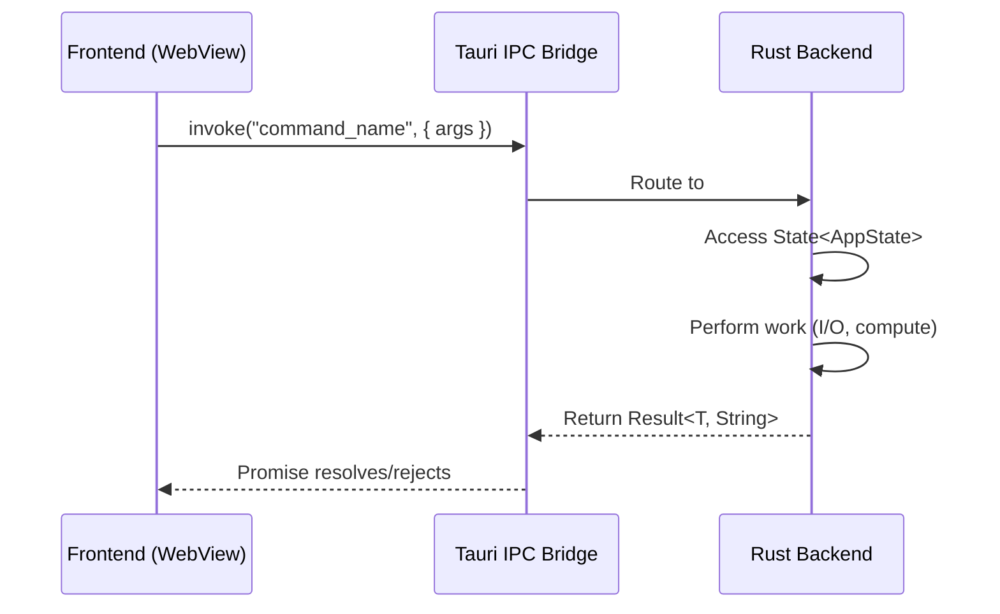

This section covers frontend integration patterns for Tauri v2 applications. The frontend runs inside a platform webview (WKWebView on macOS, WebView2 on Windows) and communicates with the Rust backend through IPC commands.

## What you will find here

### IPC Commands

The bridge between your frontend and Rust backend. The [IPC Commands](/frontend/ipc-commands/) page covers command registration, function signatures, state access, error handling, and async patterns with real examples.

### useEffect Pitfall

A subtle but severe performance bug specific to Tauri's webview. The [useEffect Pitfall](/frontend/use-effect-pitfall/) page explains why `useLayoutEffect` with IPC calls causes the macOS beach ball and how to fix it.

### Playwright Testing Pitfall

Tauri uses different rendering engines per platform (WebKit on macOS/Linux, Chromium on Windows). Running Playwright tests only in Chromium gives false confidence. The [Playwright Testing](/frontend/playwright-engine-pitfall/) page explains the engine mismatch and how to build a layered testing strategy.

### Capabilities and Permissions

Tauri v2 uses a capabilities system to control what the frontend can access. The [Capabilities](/frontend/capabilities/) page covers the permission model, plugin access, and security considerations.

## The IPC model

Tauri v2 uses a message-passing architecture between the frontend and the Rust backend:



Key characteristics:

- **Asynchronous by default** -- `invoke()` returns a `Promise`
- **JSON serialization** -- arguments and return values are serialized via serde
- **Type-safe on the Rust side** -- commands are regular Rust functions with typed parameters
- **String errors** -- Tauri commands return `Result<T, String>` for error handling

## Frontend framework compatibility

These patterns work with any frontend framework. The Tauri `invoke()` API is framework-agnostic:

```tsx
// React
import { invoke } from "@tauri-apps/api/core";

useEffect(() => {
  invoke("settings_get").then((settings) => {
    setSettings(settings);
  });
}, []);
```

```tsx
// Svelte
import { invoke } from "@tauri-apps/api/core";

onMount(async () => {
  const settings = await invoke("settings_get");
});
```

```tsx
// Vue
import { invoke } from "@tauri-apps/api/core";

onMounted(async () => {
  const settings = await invoke("settings_get");
});
```

## Events from Rust to frontend

The Rust backend can push events to the frontend using `AppHandle::emit()`:

```rust
// Rust side
app_handle.emit("messages:changed", payload)?;
```

```tsx
// Frontend side
import { listen } from "@tauri-apps/api/event";

const unlisten = await listen("messages:changed", (event) => {
  console.log("File changed:", event.payload.filename);
});

// Clean up on unmount
onCleanup(() => unlisten());
```

This bidirectional communication model (invoke for frontend-to-backend, emit/listen for backend-to-frontend) is the foundation for building responsive Tauri applications.
