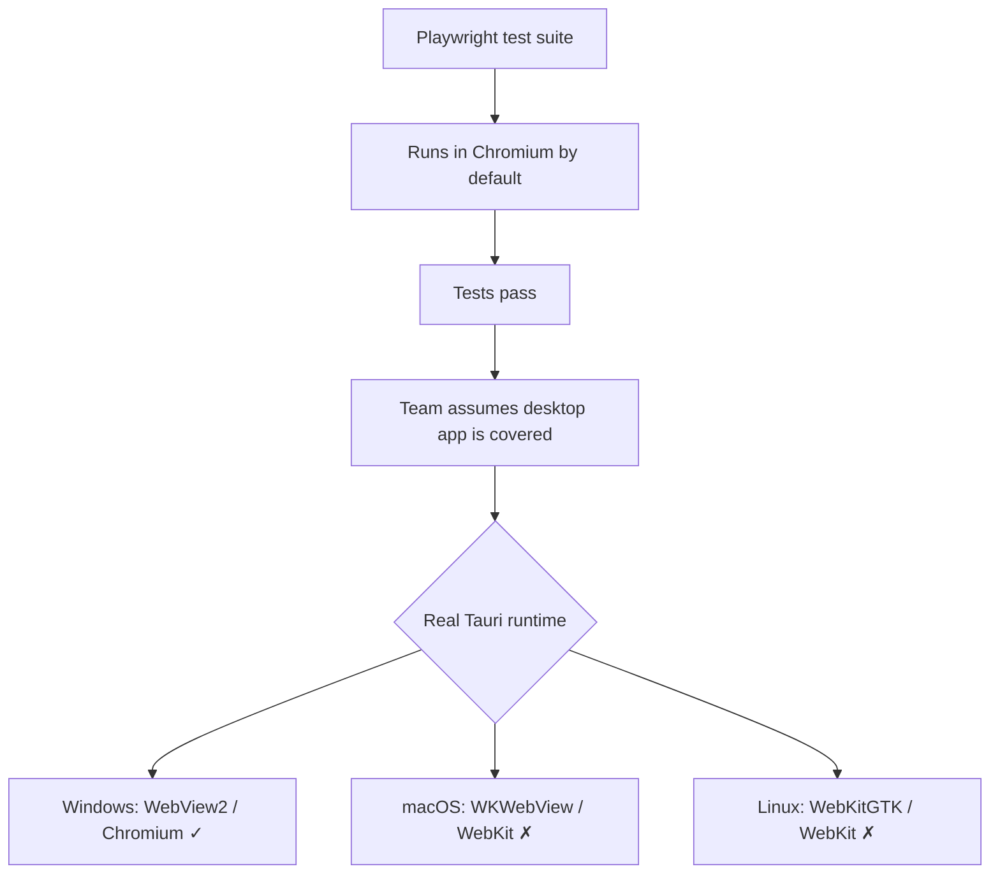
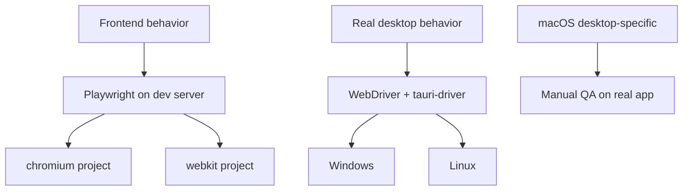

If you run Playwright tests only in Chromium, you can miss bugs that ship in a real Tauri v2 app.

The core problem: Tauri does not use the same rendering engine on every platform. On Windows it uses WebView2 (Chromium-based), but on macOS it uses WKWebView (WebKit) and on Linux it uses WebKitGTK. A Playwright suite that passes in Chromium can still fail in the actual app on macOS or Linux.

<Warning>

**Passing Playwright tests in Chromium does not mean your Tauri app is safe on macOS or Linux.** Always include `webkit` in your Playwright project matrix.

</Warning>

## The problem

A common testing setup:

1. Start the frontend dev server
2. Run Playwright against `http://localhost:...`
3. Use the default browser (Chromium)
4. Ship a Tauri desktop app and assume tests covered it

That assumption is weak. Tauri uses platform-native webviews, not Chromium, on two out of three desktop platforms.

## Platform engine table

| Platform | Tauri Engine | Playwright Default | Mismatch? |
| --- | --- | --- | --- |
| macOS | WKWebView (WebKit) | Chromium | **Yes** |
| Windows | WebView2 (Edge/Chromium) | Chromium | No (same family) |
| Linux | WebKitGTK (WebKit) | Chromium | **Yes** |

## Why it happens



There are actually two separate gaps:

1. **Engine mismatch** -- tests run in Chromium while production runs in WebKit on macOS/Linux
2. **Runtime mismatch** -- even with Playwright `webkit`, you are testing a browser session against a dev server, not the full Tauri desktop app

<Info>

Playwright's `webkit` browser is a patched upstream WebKit build maintained by the Playwright team. It is much closer to Tauri's WebKit-based runtimes than Chromium, but it is **not** identical to the system WKWebView on macOS or the distro-specific WebKitGTK on Linux.

</Info>

## The fix: add webkit to your Playwright matrix

The minimum fix is to stop testing only in Chromium. Add `webkit` to your Playwright project list:

```ts
// playwright.config.ts
import { defineConfig, devices } from "@playwright/test";

export default defineConfig({
  testDir: "./e2e",
  fullyParallel: true,
  retries: process.env.CI ? 2 : 0,
  use: {
    baseURL: "http://127.0.0.1:1420",
    trace: "on-first-retry",
  },
  webServer: {
    command: "pnpm dev",
    url: "http://127.0.0.1:1420",
    reuseExistingServer: !process.env.CI,
    timeout: 120_000,
  },
  projects: [
    {
      name: "chromium",
      use: { ...devices["Desktop Chrome"] },
    },
    {
      name: "webkit",
      use: { ...devices["Desktop Safari"] },
    },
  ],
});
```

Run both projects in CI:

```bash
pnpm exec playwright test
```

Run only WebKit when investigating a macOS or Linux rendering issue:

```bash
pnpm exec playwright test --project=webkit
```

<Tip>

If your Tauri app targets macOS or Linux, treat `webkit` as **required** in Playwright CI, not optional.

</Tip>

## What browser-layer tests do not cover

Playwright against a dev server is valuable for frontend regressions, but it does not validate:

- Tauri IPC behavior (`invoke()`, `listen()`)
- Native menus and tray
- File dialogs
- Window management and multi-window
- Custom protocol integration
- Desktop-specific permission and packaging behavior

A browser test proves your frontend works in a browser. It cannot prove your packaged Tauri desktop app works as a desktop app.

## Real desktop E2E: WebDriver and tauri-driver

Tauri's official testing docs recommend [WebDriver via `tauri-driver`](https://v2.tauri.app/develop/tests/webdriver/) for real desktop end-to-end testing. This targets the actual desktop app, not a standalone browser tab.

The important limitation is platform support:

- **Windows**: supported
- **Linux**: supported
- **macOS**: **not supported** -- no WKWebView WebDriver client exists

<Note>

`tauri-driver` is still labeled "pre-alpha". Treat it as early-stage infrastructure. Use it where it adds real confidence, but do not assume it replaces all manual verification.

</Note>

## Windows-specific option: Playwright over CDP

Windows is the one platform where Playwright can get closer to the real Tauri runtime. Since Tauri uses WebView2 (Chromium-based) on Windows, Playwright can attach via CDP:

```ts
import { chromium, expect } from "@playwright/test";

// Requires the Tauri app to be launched with remote debugging enabled
// via additionalBrowserArgs: "--remote-debugging-port=9222" in tauri.conf.json
const browser = await chromium.connectOverCDP("http://127.0.0.1:9222");
const context = browser.contexts()[0];
const page = context.pages()[0];

await expect(page.getByRole("heading", { name: "Dashboard" })).toBeVisible();
await browser.close();
```

This is useful on Windows, but it does not solve the macOS WKWebView problem and does not generalize to Linux WebKitGTK.

## Layered testing strategy

The practical strategy for Tauri v2 is layered, not one-tool-fits-all.



### Layer 1: Playwright for the web layer

Test routing, forms, validation, async UI state, layout regressions, and browser-facing JavaScript. **Always include `webkit` in the matrix.**

### Layer 2: WebDriver for real desktop E2E

Use `tauri-driver` with Selenium or WebdriverIO for testing Tauri IPC flows, desktop window behavior, and native integration points on **Windows and Linux**.

### Layer 3: Manual QA on macOS

Because desktop WebDriver is not available for macOS WKWebView, manual testing remains necessary for:

- Menu behavior and keyboard shortcuts
- File dialogs and deep links
- Tray interactions
- Multi-window behavior
- Platform-specific rendering quirks

<Warning>

For macOS desktop-specific behavior, there is currently no full automated substitute for testing the real app on macOS hardware.

</Warning>

## Key takeaways

1. **Tauri v2 does not run the same rendering engine on every platform** -- Chromium on Windows, WebKit on macOS/Linux
2. **Chromium-only Playwright coverage gives false confidence** for macOS and Linux
3. **Playwright `webkit` is important but imperfect** -- it is not the same as WKWebView or WebKitGTK
4. **Browser-layer tests do not cover Tauri-native features** -- IPC, menus, dialogs, windowing
5. **Official desktop E2E path is WebDriver** via `tauri-driver`, but only on Windows and Linux
6. **Use a layered strategy**: Playwright with `webkit` for the web layer, WebDriver for desktop E2E, manual QA on macOS

## References

- [Tauri Tests](https://v2.tauri.app/develop/tests/)
- [Tauri WebDriver](https://v2.tauri.app/develop/tests/webdriver/)
- [Tauri Webview Versions](https://v2.tauri.app/reference/webview-versions/)
- [Playwright Browsers](https://playwright.dev/docs/browsers)
- [Playwright WebView2](https://playwright.dev/docs/webview2)
