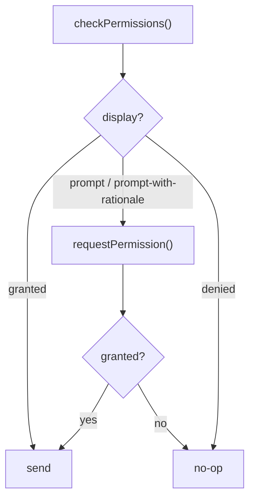

Two Tauri plugins give a WebView-wrapped iOS app a bit of native feel: `tauri-plugin-haptics` for tactile feedback and `tauri-plugin-notification` for local notifications. Both are iOS-relevant surfaces that have no meaning in a browser tab. The trick is wiring them so the **same** frontend bundle still runs on the web and on desktop without crashing or pulling in a plugin that isn't there.

## One Codebase, Three Targets

The goal is a single frontend that ships unchanged to the browser, to desktop Tauri, and to iOS Tauri. The haptics and notification plugins only do something useful on iOS, so the frontend must:

- never **hard-depend** on an iOS-only plugin at module load time, and
- degrade to a silent no-op everywhere else.

The mechanism is a runtime platform check plus a **dynamic `import()`**. A static `import` at the top of a module is resolved when the bundle loads -- which means the iOS-only plugin code is pulled into the web build whether or not it can run. A dynamic `import()` behind a guard is only evaluated when the guard passes, so the plugin never loads off-iOS.

```ts
// Minimal platform probe. Replace with your own detection if you already
// have one. The point is: only true when running inside Tauri on iOS.
export function isTauriIOS(): boolean {
  if (typeof window === "undefined") return false;
  const hasTauri = "__TAURI_INTERNALS__" in window;
  const isIOS = /iPad|iPhone|iPod/.test(navigator.userAgent);
  return hasTauri && isIOS;
}
```

Everything below funnels through this guard.

## Haptics: Fire-and-Forget

Haptic feedback is cosmetic. It must never block the UI, never throw into a caller, and never matter whether it actually fired. So the call site never `await`s it, and the implementation swallows its own errors.

The plugin exposes three families of feedback, which map cleanly onto iOS's `UIFeedbackGenerator`:

- `impactFeedback("light" | "medium" | "heavy")` -- a physical "tap" of varying strength
- `notificationFeedback("success" | "warning" | "error")` -- the system success/warning/error patterns
- `selectionFeedback()` -- the light tick used when a value changes in a picker

```ts
export type HapticType =
  | "impact-light"
  | "impact-medium"
  | "impact-heavy"
  | "notification-success"
  | "notification-warning"
  | "notification-error"
  | "selection";

/**
 * Dynamically load and call tauri-plugin-haptics.
 * We use a dynamic import so the bundle does not hard-depend on the plugin
 * in non-iOS environments.
 */
async function callHaptic(type: HapticType): Promise<void> {
  if (!isTauriIOS()) return;
  try {
    // tauri-plugin-haptics JS binding exports named functions per haptic type
    const haptics = await import("@tauri-apps/plugin-haptics");
    switch (type) {
      case "impact-light":
        await haptics.impactFeedback("light");
        break;
      case "impact-medium":
        await haptics.impactFeedback("medium");
        break;
      case "impact-heavy":
        await haptics.impactFeedback("heavy");
        break;
      case "notification-success":
        await haptics.notificationFeedback("success");
        break;
      case "notification-warning":
        await haptics.notificationFeedback("warning");
        break;
      case "notification-error":
        await haptics.notificationFeedback("error");
        break;
      case "selection":
        await haptics.selectionFeedback();
        break;
    }
  } catch {
    // Plugin not available — silently ignore
  }
}

export function triggerHaptic(type: HapticType): void {
  // Fire-and-forget — callers don't need to await haptic completion
  callHaptic(type).catch(() => {});
}
```

Note the two layers of safety: the inner `try/catch` handles a missing plugin (e.g. the binding isn't bundled), and the outer `.catch(() => {})` at the call site guarantees a rejected promise never becomes an unhandled rejection. A button handler just calls `triggerHaptic("impact-light")` and moves on.

<Tip>

On non-iOS the function returns at the `isTauriIOS()` guard before the dynamic `import()` is ever reached, so the web and desktop bundles never even fetch the plugin chunk.

</Tip>

## Local Notifications: The Permission State Machine

Notifications are different. You cannot just send one -- iOS requires the user to grant permission first, and you only get to ask once cleanly. So sending is gated behind a small state machine.

The plugin's `checkPermissions()` returns a `display` value that is one of:

- `granted` -- send freely
- `denied` -- the user said no; do not prompt again, do nothing
- `prompt` -- not yet asked; you may call `requestPermission()`
- `prompt-with-rationale` -- not yet asked, and the OS suggests you explain why first

The rule: **check first, request only when still promptable, send only when granted.**



## Immediate vs Scheduled

Once permission is `granted`, there are two ways to fire a notification:

- **Immediate** -- `sendNotification({ title, body })` shows it right now.
- **Delayed** -- `schedule([{ id, title, body, schedule: { at } }])` hands the notification to the OS to deliver at a future `Date`. The app does not need to be running when it fires.

A single helper can cover both by branching on a delay:

```ts
export interface ScheduleNotificationOptions {
  title: string;
  body: string;
  /** Optional delay in seconds (default 0 = immediate). */
  delaySeconds?: number;
}

async function getNotificationPlugin() {
  return import("@tauri-apps/plugin-notification");
}

export async function scheduleNotification(
  options: ScheduleNotificationOptions,
): Promise<void> {
  if (!isTauriIOS()) return;
  try {
    const { sendNotification, checkPermissions, requestPermission } =
      await getNotificationPlugin();

    // Permission state machine: check, then request only if still promptable.
    let { display } = await checkPermissions();
    if (display === "prompt" || display === "prompt-with-rationale") {
      display = (await requestPermission()) as typeof display;
    }
    if (display !== "granted") return;

    if (options.delaySeconds && options.delaySeconds > 0) {
      // Delayed: hand it to the OS scheduler with a future fire time.
      const { schedule } = await getNotificationPlugin();
      const fireAt = new Date(Date.now() + options.delaySeconds * 1000);
      await schedule([
        {
          id: Date.now(),
          title: options.title,
          body: options.body,
          schedule: { at: fireAt },
        },
      ]);
    } else {
      // Immediate: show it now.
      await sendNotification({ title: options.title, body: options.body });
    }
  } catch {
    // Plugin unavailable or permission denied — silently ignore
  }
}
```

A few things worth calling out:

- `requestPermission()` itself returns the resulting `display`, so reassigning `display` lets the single `if (display !== "granted") return;` cover both the already-granted path and the just-granted path.
- Each `schedule()` entry needs a unique `id`. `Date.now()` is a serviceable id for fire-and-forget cases; use a real counter or stable key if you ever need to cancel.
- `schedule({ at })` takes a `Date`. The OS owns delivery from there -- closing the app does not cancel a scheduled notification.

<Warning>

Permission is a one-shot from the user's perspective. If `checkPermissions()` returns `denied`, calling `requestPermission()` again will **not** re-prompt -- iOS just returns `denied` immediately. The user has to go to Settings. So never loop on it; respect the `denied` state and stay silent.

</Warning>

## Backend Plugin Init

Both plugins must be registered in the Rust builder. They compile on every platform and are no-ops outside iOS, so there's no need to feature-gate the registration itself.

```rust
fn main() {
    tauri::Builder::default()
        // iOS native surface plugins — haptics and local notifications.
        // These plugins compile on all platforms but are no-ops outside iOS.
        .plugin(tauri_plugin_haptics::init())
        .plugin(tauri_plugin_notification::init())
        .run(tauri::generate_context!())
        .expect("error while running tauri application");
}
```

That's the whole contract: register on the backend unconditionally, gate every frontend call behind `isTauriIOS()` + dynamic `import()`, and the same bundle runs everywhere.
