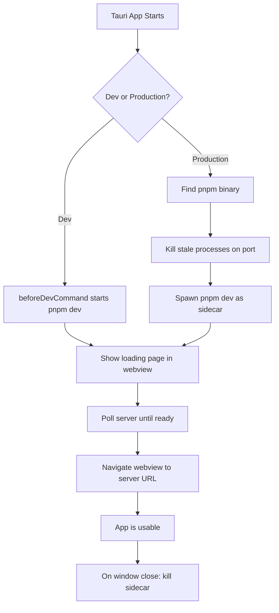

# Doc Viewer App

This recipe covers the architecture of a lightweight Tauri app that wraps a documentation site's dev server. The Rust backend spawns `pnpm dev`, waits for the server to become ready, and navigates the webview to the local URL. No frontend framework is used in the Tauri app itself -- the entire UI comes from the wrapped dev server.

## Architecture Overview



## The Two Modes

The app behaves differently in dev and production:

- **Dev mode** (`cargo tauri dev`): Tauri's `beforeDevCommand` starts `pnpm dev`. The Rust code just points the webview at the server URL.
- **Production** (`cargo tauri build`): The Rust code itself finds `pnpm`, spawns it as a child process, waits for readiness, and cleans up on exit.

```rust
const PORT: u16 = 32342;
const DEFAULT_PATH: &str = "/";
const IS_DEV: bool = cfg!(debug_assertions);
const PNPM_CMD: &str = "dev";
```

## Finding pnpm

In production, the app needs to find the `pnpm` binary on the user's system. A GUI app does not inherit the user's shell `PATH`, so you cannot rely on just calling `pnpm`.

The strategy: check hardcoded well-known paths first (including version-manager shims), then fall back to `which`.

```rust
fn find_pnpm() -> Option<PathBuf> {
    // Check well-known installation paths first
    let home = std::env::var("HOME").ok()?;
    let candidates = [
        "/opt/homebrew/bin/pnpm".to_string(),  // Apple Silicon Homebrew
        "/usr/local/bin/pnpm".to_string(),     // Intel Homebrew
        format!("{home}/.volta/bin/pnpm"),     // Volta shim
    ];
    for p in &candidates {
        let path = PathBuf::from(p);
        if path.exists() {
            return Some(path);
        }
    }

    // Fallback: ask the system
    if let Ok(output) = Command::new("/usr/bin/which").arg("pnpm").output() {
        let path_str = String::from_utf8_lossy(&output.stdout)
            .trim()
            .to_string();
        if !path_str.is_empty() {
            let path = PathBuf::from(&path_str);
            if path.exists() {
                return Some(path);
            }
        }
    }

    None
}
```

<Note>

Hardcoded paths are checked first because `which` can be unreliable in GUI app contexts. The `/usr/bin/which` path is used (not just `which`) because the app's `PATH` may not include `/usr/bin`. Include `$HOME/.volta/bin/pnpm` in the hardcoded list when your users commonly pin Node via Volta — Finder launches do not see Volta's shim injection.

</Note>

## Spawning the Sidecar

The sidecar is spawned in its own process group. This is critical for cleanup -- when you need to kill the dev server, you kill the entire process group, not just the parent `pnpm` process (which itself spawns child processes).

```rust
struct Sidecar {
    child: Child,
    pid: u32,
}

fn spawn_sidecar(pnpm_path: &std::path::Path) -> Sidecar {
    let dir = target_dir(); // The directory containing the project to serve

    let mut cmd = Command::new(pnpm_path);
    cmd.args([PNPM_CMD])
        .current_dir(&dir)
        .stdout(Stdio::from(log_file))
        .stderr(Stdio::from(log_file_clone));

    // Create a new process group so we can kill all child processes
    #[cfg(unix)]
    {
        use std::os::unix::process::CommandExt;
        cmd.process_group(0);
    }

    let child = cmd.spawn().expect("Failed to spawn pnpm sidecar");
    let pid = child.id();

    Sidecar { child, pid }
}
```

<Warning>

Without `process_group(0)`, killing the `pnpm` process leaves orphaned Node.js processes still bound to the port. The next launch fails because the port is occupied by ghosts from the previous run.

</Warning>

## Killing the Sidecar

Kill the process group (negative PID), not just the process:

```rust
fn kill_sidecar(sidecar: &mut Sidecar) {
    #[cfg(unix)]
    {
        if let Ok(pid) = i32::try_from(sidecar.pid) {
            if pid > 0 {
                // Negative PID signals the entire process group
                unsafe { libc::kill(-pid, libc::SIGTERM) };
            }
        }
    }

    // Wait briefly for graceful shutdown
    thread::sleep(Duration::from_millis(500));

    // Escalate if still running
    match sidecar.child.try_wait() {
        Ok(Some(_)) => {
            // Already exited
        }
        _ => {
            let _ = sidecar.child.kill();   // SIGKILL
            let _ = sidecar.child.wait();   // Reap
        }
    }
}
```

## Port Cleanup on Startup

Before spawning a new server, kill anything already listening on the port. This handles the case where a previous app instance crashed without cleaning up:

```rust
fn kill_port() {
    if let Ok(output) = Command::new("/usr/bin/lsof")
        .args(["-ti", &format!(":{PORT}")])
        .output()
    {
        let pids = String::from_utf8_lossy(&output.stdout);
        for line in pids.trim().lines() {
            if let Ok(pid) = line.trim().parse::<i32>() {
                unsafe { libc::kill(pid, libc::SIGTERM) };
            }
        }
        if !pids.trim().is_empty() {
            thread::sleep(Duration::from_millis(500));
        }
    }
}
```

## Readiness Polling

The app polls the server URL until it returns a non-error HTTP status code:

```rust
fn wait_for_ready(timeout: Duration) {
    let start = Instant::now();
    while start.elapsed() < timeout {
        let code = Command::new("/usr/bin/curl")
            .args([
                "-s", "-o", "/dev/null", "-w", "%{http_code}",
                &format!("http://localhost:{PORT}/"),
            ])
            .output()
            .map(|o| String::from_utf8_lossy(&o.stdout).trim().to_string())
            .unwrap_or_else(|_| "err".to_string());

        if code != "000" && code != "err" {
            // Server is ready
            thread::sleep(Duration::from_secs(1)); // Extra delay for stability
            return;
        }
        thread::sleep(Duration::from_secs(1));
    }
    // Timeout - proceed anyway and let the user see the error
}
```

<Tip>

Use `/usr/bin/curl` (absolute path) instead of just `curl`. In a GUI app context, the shell `PATH` may not be set up, and `curl` might not be found.

</Tip>

## Loading Screen

The window opens immediately with a loading page, then navigates to the server URL once it is ready. This avoids the app appearing frozen during the build process.

```rust
// In setup()
if IS_DEV {
    // Dev mode: server is already running, point directly to it
    let url: tauri::Url = server_url().parse().unwrap();
    WebviewWindowBuilder::new(app, "main", WebviewUrl::External(url))
        .title("zmod doc")
        .inner_size(1200.0, 800.0)
        .build()?;
} else {
    // Production: show default (bundled) page first
    WebviewWindowBuilder::new(app, "main", WebviewUrl::default())
        .title("zmod doc")
        .inner_size(1200.0, 800.0)
        .build()?;

    // Then navigate once server is ready (in background thread)
    let handle = app.handle().clone();
    thread::spawn(move || {
        wait_for_ready(Duration::from_secs(120));
        if let Some(w) = handle.get_webview_window("main") {
            let url: tauri::Url = server_url().parse().unwrap();
            let _ = w.navigate(url);
        }
    });
}
```

The `frontendDist` in `tauri.conf.json` points to a minimal directory with just a loading page:

```json
{
  "build": {
    "frontendDist": "./frontend"
  }
}
```

```html
<!-- frontend/index.html -->
<!DOCTYPE html>
<html>
<body style="display:flex;align-items:center;justify-content:center;height:100vh;margin:0;font-family:sans-serif">
  <p>Loading...</p>
</body>
</html>
```

## Zoom Menu Items

A doc viewer benefits from zoom controls. The app stores the current zoom level in `AppState` and applies it via JavaScript injection:

```rust
struct AppState {
    sidecar: Arc<Mutex<Option<Sidecar>>>,
    pnpm_path: Option<PathBuf>,
    zoom: Mutex<f64>,
}

fn apply_zoom(app_handle: &AppHandle, level: f64) {
    let state = app_handle.state::<AppState>();
    *state.zoom.lock().unwrap() = level;
    if let Some(w) = app_handle.get_webview_window("main") {
        let _ = w.eval(&format!("document.body.style.zoom = '{level}'"));
    }
}
```

Menu items for zoom control:

```rust
let view_menu = SubmenuBuilder::new(app, "View")
    .item(
        &MenuItemBuilder::with_id("actual_size", "Actual Size")
            .accelerator("CmdOrCtrl+0")
            .build(app)?,
    )
    .item(
        &MenuItemBuilder::with_id("zoom_in", "Zoom In")
            .accelerator("CmdOrCtrl+=")
            .build(app)?,
    )
    .item(
        &MenuItemBuilder::with_id("zoom_out", "Zoom Out")
            .accelerator("CmdOrCtrl+-")
            .build(app)?,
    )
    .build()?;
```

And the handler:

```rust
app.on_menu_event(|app_handle, event| match event.id().as_ref() {
    "actual_size" => apply_zoom(app_handle, 1.0),
    "zoom_in" => {
        let state = app_handle.state::<AppState>();
        let z = (*state.zoom.lock().unwrap() + 0.1).min(3.0);
        apply_zoom(app_handle, z);
    }
    "zoom_out" => {
        let state = app_handle.state::<AppState>();
        let z = (*state.zoom.lock().unwrap() - 0.1).max(0.1);
        apply_zoom(app_handle, z);
    }
    _ => {}
});
```

## Process Cleanup on Exit

When the window is destroyed, kill the sidecar:

```rust
.run(move |app_handle, event| match &event {
    tauri::RunEvent::WindowEvent {
        event: tauri::WindowEvent::Destroyed,
        ..
    } => {
        if !IS_DEV {
            if let Ok(mut g) = sidecar_for_exit.lock() {
                if let Some(mut s) = g.take() {
                    kill_sidecar(&mut s);
                }
            }
        }
        app_handle.exit(0);
    }
    _ => {}
});
```

<Note>

The `sidecar_for_exit` is an `Arc<Mutex<Option<Sidecar>>>` cloned from `AppState` before moving into the closure. This is needed because the `run()` closure captures by move and outlives the `setup()` closure.

</Note>

## Cold-Install Bootstrap in the Sidecar

A bundled-sidecar doc viewer depends on `node_modules/` being populated. On a fresh clone — or after the user wipes the cache directory — `node_modules/astro/astro.js` does not exist, the sidecar fails to start, and the webview sits on the loading page forever.

The fix is a pre-build guard inside the sidecar's own entry script that detects the missing entrypoint and runs `pnpm install` before proceeding. It keeps the UX in the "still building" state rather than failing silently.

```js
// doc/scripts/dev-stable.js
import { existsSync } from "node:fs";
import { spawn } from "node:child_process";
import path from "node:path";

const ROOT = path.resolve(import.meta.dirname, "..");

function findPnpm() {
  const candidates = [
    "/opt/homebrew/bin/pnpm",
    "/usr/local/bin/pnpm",
    `${process.env.HOME}/.volta/bin/pnpm`,
  ];
  for (const p of candidates) {
    if (existsSync(p)) return p;
  }
  // Fallback: /usr/bin/which
  try {
    const { execFileSync } = require("node:child_process");
    const p = execFileSync("/usr/bin/which", ["pnpm"]).toString().trim();
    return p && existsSync(p) ? p : null;
  } catch {
    return null;
  }
}

async function ensureNodeModules(root = ROOT) {
  // Fast path: if astro.js is already installed, skip.
  if (existsSync(path.join(root, "node_modules/astro/astro.js"))) return;

  const pnpm = findPnpm();
  if (!pnpm) {
    console.error(
      "pnpm not found — install Node.js and pnpm before launching.",
    );
    process.exit(1);
  }

  await new Promise((resolve, reject) => {
    const child = spawn(pnpm, ["install", "--prefer-offline"], {
      cwd: root,
      stdio: "inherit", // logs flow to sidecar.log
    });
    child.on("exit", (code) => {
      if (code === 0) resolve();
      else reject(new Error(`pnpm install exited with code ${code}`));
    });
  });
}

// Main
try {
  await serve(); // /___ready → 503 until build() finishes
  await ensureNodeModules();
  await build();
} catch (err) {
  console.error("sidecar fatal:", err);
  process.exit(1);
}
```

Three subtleties that are easy to get wrong:

1. **Finder / launchd has a minimal PATH.** Inside a `.app` launched from Finder, `PATH` is typically just `/usr/bin:/bin:/usr/sbin:/sbin`. `pnpm` on the user's shell `PATH` is not reachable. Probe absolute paths first, fall back to `/usr/bin/which pnpm`, and bail out with a clear message if neither works. Mirrors the [`find_pnpm()` strategy in Rust](#finding-pnpm).

2. **Loading page stays valid during install.** While `pnpm install` runs, the sidecar's `/___ready` endpoint keeps returning 503. Both the Rust readiness poller and the sidecar-side `LOADING_HTML` auto-refresh keep showing the "still building" spinner — no UX regression during the install. The install logs flow through `stdio: "inherit"` into the sidecar log, so they appear in the file that the error-state loading page would surface if something went wrong.

3. **Clear fail-stop on missing pnpm.** If `findPnpm()` returns `null`, print a discoverable "pnpm not found" message to stderr and `process.exit(1)` so the [sidecar-death detector in `wait_for_ready`](../architecture/process-lifecycle.mdx#detecting-sidecar-death-in-the-readiness-loop) surfaces the failure to the user via `launch-error` within ~1 s. Hanging the sidecar with no exit would leave the UI stuck on the spinner.

<Tip>

The fast-path `existsSync(node_modules/astro/astro.js)` short-circuit costs a single `stat` call on every launch, which is worth the insurance. Skip it and you spawn a full `pnpm install` on every launch even when nothing needs to change — users will notice the extra second or two of spinner.

</Tip>

### Smoke-testing the cold path

Because the cold-install path only runs when `node_modules/` is empty, it silently rots if you never test it. A minimal launch script with a `--cold` flag keeps the regression surface visible:

```bash
#!/usr/bin/env bash
# test-launch.sh [--cold] [iterations]
set -euo pipefail

COLD=0
ITERS=1
for arg in "$@"; do
  case "$arg" in
    --cold) COLD=1 ;;
    *) ITERS="$arg" ;;
  esac
done

if [[ "$COLD" -eq 1 ]]; then
  # Wipe once, before the first iteration, not per-iter — so multi-run
  # smoke still exercises the cold path exactly once and then measures
  # steady-state relaunches.
  rm -rf "./node_modules"
fi

for i in $(seq 1 "$ITERS"); do
  open -W -a "MyApp.app"
done
```

This exercises the `ensureNodeModules` bootstrap on the first iteration and then measures healthy relaunches on subsequent ones. Run it in CI (or before each release) so the fresh-install path never breaks unnoticed.

## Config File

The corresponding `tauri.conf.json`:

```json
{
  "productName": "zmod doc",
  "version": "0.1.0",
  "identifier": "com.takazudo.zmod-doc",
  "build": {
    "frontendDist": "./frontend",
    "beforeDevCommand": "cd ../../doc && pnpm dev",
    "devUrl": "http://localhost:32342/"
  },
  "app": {
    "windows": [],
    "security": {
      "csp": null
    }
  },
  "bundle": {
    "active": true,
    "targets": "all",
    "icon": [],
    "category": "DeveloperTool",
    "macOS": {
      "minimumSystemVersion": "10.15"
    }
  }
}
```

Key points:

- **`windows: []`** -- empty because windows are created programmatically in Rust
- **`beforeDevCommand` uses `cd`** -- because the command CWD is the repo root, not the config directory
- **`frontendDist: "./frontend"`** -- minimal loading page, not the actual content
- **No `beforeBuildCommand`** -- the production app spawns its own server, it does not embed static assets
