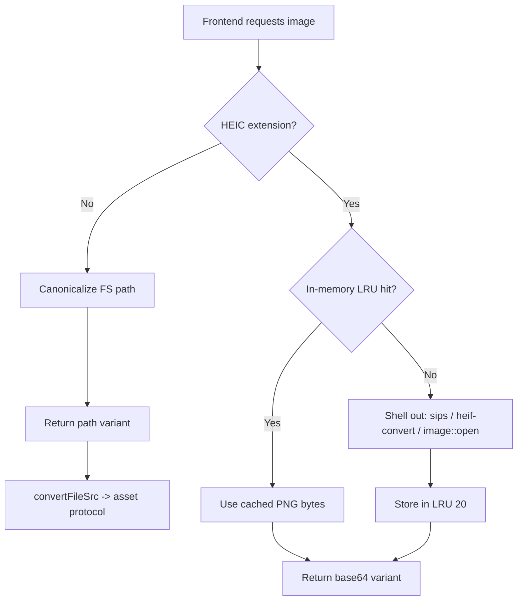

This recipe covers the image pipeline of a Tauri-based image viewer: how to decode formats the Rust `image` crate cannot handle (HEIC), how to hand full-size images to the webview efficiently, and how to cache thumbnails on disk so that they survive process restarts. Each piece below is a hard-won detail that is easy to get subtly wrong.

## Pipeline Overview



## Decoding HEIC: the platform shellout chain

The Rust `image` crate has no HEIC decoder. HEIC files use HEVC-coded image data, and the crate ships no codec for it. Calling `image::open` on a `.heic` file simply fails.

The workaround is to shell out to a platform tool that *can* decode HEIC, write a temporary PNG, and read it back. On macOS the built-in `sips` utility converts HEIC to PNG; on Linux, `heif-convert` (from `libheif`) does the same. A final `image::open` attempt acts as a last-ditch fallback in case a future `image` build does grow HEIC support.

```rust
fn convert_heic_to_png(heic_path: &Path) -> Result<Vec<u8>, String> {
    let temp_dir = std::env::temp_dir().join("image-stash-viewer-heic");
    fs::create_dir_all(&temp_dir).map_err(|e| format!("Failed to create temp dir: {e}"))?;

    let unique_id = format!(
        "{}-{}",
        std::process::id(),
        std::time::SystemTime::now()
            .duration_since(UNIX_EPOCH)
            .unwrap_or_default()
            .as_nanos()
    );
    let temp_png = temp_dir.join(format!(
        "{}-{}.png",
        heic_path.file_stem().unwrap_or_default().to_string_lossy(),
        unique_id
    ));

    #[cfg(target_os = "macos")]
    {
        let result = Command::new("sips")
            .args([
                "-s",
                "format",
                "png",
                &heic_path.to_string_lossy(),
                "--out",
                &temp_png.to_string_lossy(),
            ])
            .output();

        if let Ok(output) = result {
            if output.status.success() {
                let data = fs::read(&temp_png);
                let _ = fs::remove_file(&temp_png);
                if let Ok(data) = data {
                    return Ok(data);
                }
            } else {
                let _ = fs::remove_file(&temp_png);
            }
        }
    }

    #[cfg(not(target_os = "macos"))]
    {
        let result = Command::new("heif-convert")
            .args([
                &heic_path.to_string_lossy().to_string(),
                &temp_png.to_string_lossy().to_string(),
            ])
            .output();

        if let Ok(output) = result {
            if output.status.success() {
                let data = fs::read(&temp_png);
                let _ = fs::remove_file(&temp_png);
                if let Ok(data) = data {
                    return Ok(data);
                }
            } else {
                let _ = fs::remove_file(&temp_png);
            }
        }
    }

    let img = image::open(heic_path).map_err(|e| format!("Failed to open HEIC: {e}"))?;
    let mut buf = Vec::new();
    let mut cursor = std::io::Cursor::new(&mut buf);
    img.write_to(&mut cursor, image::ImageFormat::Png)
        .map_err(|e| format!("Failed to encode PNG: {e}"))?;
    Ok(buf)
}
```

<Note>

The temp PNG name embeds the process ID and a nanosecond timestamp so that concurrent conversions never collide on the same path. The temp file is deleted as soon as its bytes are read back into memory, whether the conversion succeeded or failed.

</Note>

## Returning images: the tagged-enum response

Once decoded, an image needs to reach the webview. There are two very different ways to do this, and the backend picks the right one per file by returning a tagged enum.

```rust
#[derive(Debug, Serialize)]
#[serde(rename_all = "camelCase", tag = "type")]
pub enum ImageDataResponse {
    #[serde(rename = "path")]
    Path { path: String, mime: String },
    #[serde(rename = "base64")]
    Base64 { data: String },
}
```

For a normal image (JPEG, PNG, GIF, WebP...) the backend returns the `path` variant: it canonicalizes the filesystem path and hands that string to the frontend. The frontend runs it through `convertFileSrc()` to obtain an asset-protocol URL, which the webview loads directly off disk with no copy through the IPC bridge — zero-copy delivery, ideal for large originals.

For a HEIC file there is no on-disk PNG to point at — it was decoded in memory. So the backend returns the `base64` variant carrying a `data:` URL. Encoding to base64 is only paid for the formats that genuinely need it; normal images skip it entirely.

```rust
#[tauri::command]
pub fn get_image_data(
    app_handle: tauri::AppHandle,
    path: String,
) -> Result<ImageDataResponse, String> {
    let file_path = Path::new(&path);

    if !file_path.exists() {
        return Err(format!("File not found: {path}"));
    }

    let ext = file_path
        .extension()
        .map(|e| e.to_string_lossy().to_string())
        .unwrap_or_default();

    if is_heic_ext(&ext) {
        let state = app_handle.state::<AppState>();
        let png_data = get_heic_png_cached(file_path, &state)?;
        let b64 = base64::engine::general_purpose::STANDARD.encode(&png_data);
        Ok(ImageDataResponse::Base64 {
            data: format!("data:image/png;base64,{b64}"),
        })
    } else {
        let canonical = fs::canonicalize(file_path)
            .map_err(|e| format!("Failed to canonicalize path: {e}"))?;
        let mime = mime_from_ext(&ext);
        Ok(ImageDataResponse::Path {
            path: canonical.to_string_lossy().to_string(),
            mime,
        })
    }
}
```

On the frontend, the `tag: "type"` discriminant makes the branch trivial. Only the `path` variant is rewritten through `convertFileSrc`; the `base64` variant is already a usable `data:` URL.

```typescript
async getImageData(path: string): Promise<ImageDataResponse> {
  const response: ImageDataResponse = await invoke('get_image_data', {
    path,
  });
  if (response.type === 'path') {
    return {
      ...response,
      path: convertFileSrc(response.path),
    };
  }
  return response;
}
```

<Tip>

The asset protocol must be enabled and scoped in your capabilities for `convertFileSrc` URLs to load. Without the right `assetProtocol` scope, the path variant resolves to a URL the webview refuses to fetch.

</Tip>

## Two-tier thumbnail cache

Thumbnails are cached at two levels:

1. **In-memory LRU (20 entries)** holding decoded HEIC PNG bytes, so repeated requests for the same HEIC do not re-run `sips`.
2. **On-disk thumbnail cache** under `dirs::cache_dir()`, holding the resized PNG for every image regardless of format.

Both caches are keyed on `path + mtime`, so editing a file changes its mtime and the stale entry is bypassed automatically — no manual invalidation needed.

The in-memory LRU is a plain `HashMap` plus a `VecDeque` tracking access order:

```rust
pub struct HeicCache {
    data: HashMap<String, Vec<u8>>,
    order: VecDeque<String>,
    max_size: usize,
}

impl HeicCache {
    /// Get cached PNG data. Returns cloned data and refreshes LRU position.
    pub fn get(&mut self, key: &str) -> Option<Vec<u8>> {
        if self.data.contains_key(key) {
            self.order.retain(|k| k != key);
            self.order.push_back(key.to_string());
            self.data.get(key).cloned()
        } else {
            None
        }
    }

    /// Insert PNG data. Evicts oldest entry if at capacity.
    pub fn insert(&mut self, key: String, value: Vec<u8>) {
        if self.data.contains_key(&key) {
            self.order.retain(|k| k != &key);
        } else if self.data.len() >= self.max_size {
            if let Some(oldest) = self.order.pop_front() {
                self.data.remove(&oldest);
            }
        }
        self.data.insert(key.clone(), value);
        self.order.push_back(key);
    }
}
```

The cache key concatenates path and mtime:

```rust
fn get_heic_png_cached(path: &Path, state: &AppState) -> Result<Vec<u8>, String> {
    let path_str = path.to_string_lossy();
    let mtime = get_mtime_ms(path);
    let cache_key = format!("{path_str}:{mtime}");

    if let Ok(mut cache) = state.heic_cache.lock() {
        if let Some(data) = cache.get(&cache_key) {
            return Ok(data);
        }
    }

    let png_data = convert_heic_to_png(path)?;

    if let Ok(mut cache) = state.heic_cache.lock() {
        cache.insert(cache_key, png_data.clone());
    }

    Ok(png_data)
}
```

The disk cache directory is created at startup, and a background thread immediately sweeps out entries older than 30 days so the cache does not grow without bound:

```rust
impl AppState {
    pub fn new() -> Self {
        let cache_dir = dirs::cache_dir()
            .unwrap_or_else(|| PathBuf::from("/tmp"))
            .join("image-stash-viewer")
            .join("thumbnails");
        std::fs::create_dir_all(&cache_dir).ok();
        let eviction_dir = cache_dir.clone();
        std::thread::spawn(move || {
            evict_old_disk_cache(&eviction_dir);
        });
        Self {
            thumbnail_cache_dir: cache_dir,
            watcher: Mutex::new(None),
            watched_dir: Mutex::new(None),
            heic_cache: Mutex::new(HeicCache::new(HEIC_CACHE_MAX_ENTRIES)),
        }
    }
}
```

The eviction runs on its own thread so a large cache directory never blocks app startup:

```rust
fn evict_old_disk_cache(cache_dir: &Path) {
    let max_age = Duration::from_secs(DISK_CACHE_MAX_AGE_DAYS * 24 * 60 * 60);
    let now = SystemTime::now();

    let entries = match std::fs::read_dir(cache_dir) {
        Ok(entries) => entries,
        Err(_) => return,
    };

    for entry in entries.flatten() {
        let path = entry.path();
        if !path.is_file() {
            continue;
        }
        let metadata = match entry.metadata() {
            Ok(m) => m,
            Err(_) => continue,
        };
        let modified = match metadata.modified() {
            Ok(t) => t,
            Err(_) => continue,
        };
        if let Ok(age) = now.duration_since(modified) {
            if age > max_age {
                let _ = std::fs::remove_file(&path);
            }
        }
    }
}
```

The disk cache lookup builds its filename from the stable hash, size, and mtime, then reads the PNG straight back if present:

```rust
let mtime = get_mtime_ms(file_path);
let cache_key = format!("{}-{}-{}", stable_hash(&path), size, mtime);
let cache_path = state.thumbnail_cache_dir.join(format!("{cache_key}.png"));

if cache_path.exists() {
    let data = fs::read(&cache_path).map_err(|e| format!("Failed to read cache: {e}"))?;
    let b64 = base64::engine::general_purpose::STANDARD.encode(&data);
    return Ok(format!("data:image/png;base64,{b64}"));
}
```

<Note>

The in-memory LRU lives inside a `Mutex` on `AppState`. Each `get` clones the bytes out before releasing the lock, so the conversion work (`sips`) never happens while the mutex is held. See [the file watcher recipe](../rust-backend/file-watchers.mdx) for how the same `AppState` carries the directory watcher alongside these caches.

</Note>

## Why `stable_hash` is hand-rolled FNV-1a

The disk cache filename depends on a hash of the file path. It is tempting to reach for `std::hash::DefaultHasher`, but that would silently break the cache across restarts. The viewer hand-rolls FNV-1a instead:

```rust
/// Deterministic hash for cache keys (stable across process restarts).
fn stable_hash(s: &str) -> String {
    use std::num::Wrapping;
    let mut h = Wrapping(0xcbf29ce484222325u64);
    for b in s.bytes() {
        h ^= Wrapping(b as u64);
        h *= Wrapping(0x100000001b3u64);
    }
    format!("{:016x}", h.0)
}
```

Here is why `DefaultHasher` is the wrong tool:

- `std::hash::DefaultHasher` is **SipHash seeded with a per-process random key**. The same input string hashes to a *different* value on every launch.
- The disk cache filenames are `{stable_hash}-{size}-{mtime}.png`. If the hash changes every launch, **none of last run's thumbnail files ever match** the keys this run computes.
- The result: every disk lookup misses, every thumbnail is regenerated from scratch, and the old files are orphaned. The cache grows unbounded while delivering a ~0% hit rate — the worst of both worlds.

FNV-1a uses **fixed constants** — the 64-bit offset basis `0xcbf29ce484222325` and the prime `0x100000001b3`. There is no random seed, so the same path always hashes to the same value. Cache keys stay stable across restarts and yesterday's thumbnails are reused today. The source comment states the intent directly: *stable across process restarts.*

<Warning>

Do not swap in `DefaultHasher` for "simplicity." It compiles, the tests in a single process pass, and the bug only shows up as a quietly useless cache in production — exactly the kind of regression that survives review. Keep the deterministic hash and a test that asserts the same input yields the same output.

</Warning>
