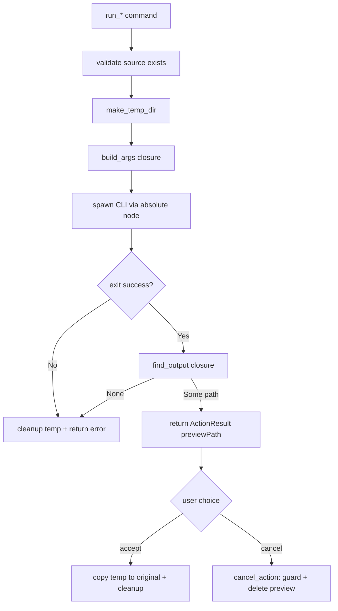

## The pattern

A monorepo desktop app often ships its own command-line tools alongside the Tauri shell. In this example the workspace contains two Node CLIs -- `orange-calibrator` and `product-photo-maker` -- under `sub-packages/`. The app runs them as **one-shot subprocesses**: spawn, wait for exit, read the output, done.

Rather than mutate the user's original file immediately, each action follows a **preview → accept → cancel** contract:

1. **Run** -- the CLI writes its result into the system temp directory and returns an `ActionResult { previewPath }`. The original file is untouched.
2. **Accept** -- copy the temp file over the original, then clean up the temp file.
3. **Cancel** -- delete the temp preview and leave the original alone.

This keeps the destructive step (overwriting the original) under explicit user control, and makes every action trivially undoable until the user commits.

## Resolving the CLI and Node

The CLIs live at a fixed location relative to the project root, so Rust resolves them by walking up from `CARGO_MANIFEST_DIR`:

```rust
use super::project_root; // PathBuf from CARGO_MANIFEST_DIR, walked up to the repo root

let root = project_root();
let mut script = root.clone();
for part in &["sub-packages", "orange-calibrator", "bin", "orange-calibrator.mjs"] {
    script = script.join(part);
}
```

The scripts are run with an **absolute `node` path**, not bare `node`. An app launched from Finder inherits a minimal `PATH` that does not include Homebrew or version-manager binaries, so `Command::new("node")` would fail. See [Node Detection with Version Managers](./node-detection.mdx) for the full resolution logic; here it is enough to know `find_node()` returns an absolute path:

```rust
fn run_node_script(script: &PathBuf, args: &[&str]) -> Result<std::process::Output, String> {
    let root = project_root();
    let node = find_node(); // absolute path -- never bare "node"
    Command::new(&node)
        .arg(script)
        .args(args)
        .current_dir(&root)
        .output()
        .map_err(|e| format!("Failed to run {}: {e}", script.display()))
}
```

## The result type

`ActionResult` is the value returned to the renderer. The `preview_path` field is renamed to `previewPath` on the wire via serde:

```rust
use serde::Serialize;

#[derive(Debug, Serialize)]
#[serde(rename_all = "camelCase")]
pub struct ActionResult {
    pub success: bool,
    pub preview_path: String,
    pub error: Option<String>,
}

impl ActionResult {
    fn ok(preview_path: String) -> Self {
        Self { success: true, preview_path, error: None }
    }

    fn err(msg: String) -> Self {
        Self { success: false, preview_path: String::new(), error: Some(msg) }
    }
}
```

## Staging in the temp dir

Every run gets its own unique temp directory under `std::env::temp_dir()`. Combining the process ID with a nanosecond timestamp avoids collisions between concurrent or repeated runs:

```rust
use std::fs;
use std::path::PathBuf;

fn make_temp_dir(prefix: &str) -> Result<PathBuf, String> {
    let nanos = std::time::SystemTime::now()
        .duration_since(std::time::UNIX_EPOCH)
        .unwrap_or_default()
        .as_nanos();
    let dir = std::env::temp_dir()
        .join(prefix)
        .join(format!("{}-{}", std::process::id(), nanos));
    fs::create_dir_all(&dir).map_err(|e| format!("Failed to create temp dir: {e}"))?;
    Ok(dir)
}
```

## The generic run_action skeleton

Both actions share the same shape: validate the source, make a temp dir, build CLI args, spawn, locate the output, and clean up on any error. `run_action` captures that skeleton once and threads the two action-specific pieces in as closures:

- `build_args` -- given the temp dir and source path, produce the CLI argument vector (and optionally stage input files into the temp dir).
- `find_output` -- given the temp dir, locate the file the CLI produced.

```rust
/// Validate source file and run a CLI script, returning the result.
fn run_action(
    source_path: &str,
    prefix: &str,
    script_parts: &[&str],
    build_args: impl FnOnce(&PathBuf, &str) -> Result<Vec<String>, String>,
    find_output: impl FnOnce(&PathBuf) -> Option<String>,
) -> ActionResult {
    let source = PathBuf::from(source_path);
    if !source.exists() {
        return ActionResult::err(format!("File not found: {source_path}"));
    }

    let temp_dir = match make_temp_dir(prefix) {
        Ok(d) => d,
        Err(e) => return ActionResult::err(e),
    };

    let root = project_root();
    let mut script = root.clone();
    for part in script_parts {
        script = script.join(part);
    }

    let args = match build_args(&temp_dir, source_path) {
        Ok(a) => a,
        Err(e) => {
            cleanup_temp_path(&temp_dir.to_string_lossy());
            return ActionResult::err(e);
        }
    };
    let args_refs: Vec<&str> = args.iter().map(|s| s.as_str()).collect();

    match run_node_script(&script, &args_refs) {
        Ok(result) => {
            if result.status.success() {
                match find_output(&temp_dir) {
                    Some(path) => ActionResult::ok(path),
                    None => {
                        cleanup_temp_path(&temp_dir.to_string_lossy());
                        ActionResult::err("Script succeeded but produced no output".to_string())
                    }
                }
            } else {
                cleanup_temp_path(&temp_dir.to_string_lossy());
                let stderr = String::from_utf8_lossy(&result.stderr).to_string();
                ActionResult::err(format!("Script failed: {stderr}"))
            }
        }
        Err(e) => {
            cleanup_temp_path(&temp_dir.to_string_lossy());
            ActionResult::err(e)
        }
    }
}
```

Note that every failure path runs `cleanup_temp_path` before returning -- a failed or output-less run never leaves stray files in the temp dir.

## A concrete action

`run_orange_tweak` is a thin caller. The CLI modifies its input in place, so `build_args` first copies the source into the temp dir, then points the CLI at the copy; `find_output` returns that same copy if it still exists:

```rust
#[tauri::command]
pub fn run_orange_tweak(path: String) -> ActionResult {
    let source = PathBuf::from(&path);
    let file_name = source
        .file_name()
        .unwrap_or_default()
        .to_string_lossy()
        .to_string();

    run_action(
        &path,
        "imgs-viewer-orange",
        &["sub-packages", "orange-calibrator", "bin", "orange-calibrator.mjs"],
        |temp_dir, _source_path| {
            // Copy file to temp dir first (orange-calibrator modifies in-place)
            let temp_copy = temp_dir.join(&file_name);
            fs::copy(&source, &temp_copy)
                .map_err(|e| format!("Failed to copy file: {e}"))?;
            Ok(vec!["process".to_string(), temp_copy.to_string_lossy().to_string()])
        },
        |temp_dir| {
            let temp_copy = temp_dir.join(&file_name);
            if temp_copy.exists() {
                Some(temp_copy.to_string_lossy().to_string())
            } else {
                None
            }
        },
    )
}
```

A second action like `run_product_photo` reuses the exact same skeleton; only its `build_args` (CLI flags) and `find_output` (scan the temp dir for the first image file) differ.

## Accepting

Accept copies the temp file over the original and then removes the temp file and its parent directory:

```rust
fn accept_file(from: &str, to: &str) -> Result<bool, String> {
    let from_path = PathBuf::from(from);
    let to_path = PathBuf::from(to);

    if !from_path.exists() {
        return Err(format!("Source file not found: {from}"));
    }

    fs::copy(&from_path, &to_path)
        .map_err(|e| format!("Failed to copy file: {e}"))?;

    // Clean up temp file and its parent dir
    let _ = fs::remove_file(&from_path);
    if let Some(parent) = from_path.parent() {
        let _ = fs::remove_dir(parent);
    }

    Ok(true)
}

#[tauri::command]
pub fn accept_orange_tweak(original_path: String, temp_path: String) -> Result<bool, String> {
    accept_file(&temp_path, &original_path)
}
```

## Cancelling — with a temp-dir guard

`cancel_action` deletes the preview. But the path comes from the renderer, which means a frontend bug (or a compromised renderer) could pass *any* path. The command therefore hard-rejects any path that is not under `std::env::temp_dir()`:

```rust
#[tauri::command]
pub fn cancel_action(preview_path: String) -> Result<bool, String> {
    // Only allow cleanup of paths within the system temp directory.
    // This guards against a renderer bug passing an arbitrary path
    // and deleting files outside the staging area.
    let temp_dir = std::env::temp_dir();
    let path = PathBuf::from(&preview_path);
    if !path.starts_with(&temp_dir) {
        return Err("Can only clean up files in the temp directory".to_string());
    }
    cleanup_temp_path(&preview_path);
    Ok(true)
}
```

```rust
fn cleanup_temp_path(path: &str) {
    let p = PathBuf::from(path);
    if p.exists() {
        if p.is_dir() {
            let _ = fs::remove_dir_all(&p);
        } else {
            let _ = fs::remove_file(&p);
            if let Some(parent) = p.parent() {
                let _ = fs::remove_dir(parent);
            }
        }
    }
}
```

<Warning>

Never trust a path that originated in the renderer for a delete operation. The `starts_with(temp_dir())` check is the difference between "clean up a staged preview" and "delete an arbitrary file the renderer named." Keep the guard even if the only caller today is your own trusted frontend code.

</Warning>

## Flow diagram



## Key takeaways

1. **Stage, don't mutate** -- write the CLI output into the temp dir and return a preview path; only `accept_*` touches the original.
2. **Always resolve `node` to an absolute path** -- a Finder-launched app has a minimal `PATH`. See [Node Detection with Version Managers](./node-detection.mdx).
3. **Resolve bundled CLIs relative to `project_root()`** -- walk up from `CARGO_MANIFEST_DIR` so the path holds in dev and in the bundle.
4. **Factor the skeleton into `run_action`** -- thread `build_args`/`find_output` closures so each action reuses validate → temp-dir → spawn → locate-output → cleanup-on-error.
5. **Guard `cancel_action` against arbitrary paths** -- reject anything not under `std::env::temp_dir()` so a renderer bug can never delete files outside the staging area.
