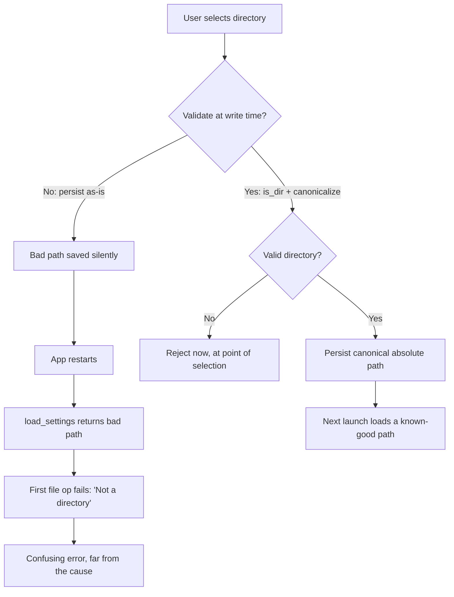

## What this page covers

This is about **where global app settings live on disk and how to write them safely** -- a different concern from the two other settings pages:

- [Settings Cache with External Edit Detection](./settings-cache.mdx) is an in-`AppState` mtime cache of a **project-scoped** settings file (one per workspace).
- [Settings Validation Pattern](./settings-validation.mdx) is a TypeScript schema/migration layer that sanitizes settings **values** on load.

This page is the layer underneath both: a single **global** `settings.json` stored in the OS-standard config directory, with a Rust read/write path that never crashes the app on a bad file and never persists a path that won't work on the next launch.

## Where settings live

Settings belong in the OS-standard per-user config directory, not next to the binary and not in the project folder. The [`dirs`](https://docs.rs/dirs) crate resolves the right location per platform (`~/.config` on Linux, `~/Library/Application Support` on macOS, `%APPDATA%` on Windows):

```rust
use dirs;
use serde::{Deserialize, Serialize};
use std::fs;
use std::path::{Path, PathBuf};

#[derive(Debug, Serialize, Deserialize, Default)]
#[serde(rename_all = "camelCase")]
struct Settings {
    watched_dir: Option<String>,
}

fn settings_path() -> Option<PathBuf> {
    dirs::config_dir().map(|p| p.join("wip-assets-viewer").join("settings.json"))
}
```

The file lands at `dirs::config_dir()/<app>/settings.json`. Namespacing under an app-specific subdirectory keeps it from colliding with other apps' config.

## Loading: default on a bad file, never an error

`load_settings()` returns `Settings` directly -- **not** `Result<Settings, _>`. Every failure path (no config dir, unreadable file, corrupt JSON) resolves to `Settings::default()`. A parse failure is logged to stderr so it is diagnosable, but it does not propagate:

```rust
fn load_settings() -> Settings {
    let path = match settings_path() {
        Some(p) => p,
        None => return Settings::default(),
    };
    let content = match fs::read_to_string(&path) {
        Ok(c) => c,
        Err(_) => return Settings::default(),
    };
    match serde_json::from_str::<Settings>(&content) {
        Ok(s) => s,
        Err(e) => {
            eprintln!("wip-assets-viewer: corrupt settings file at {path:?}: {e}");
            Settings::default()
        }
    }
}
```

<Tip>

The choice to return `Settings::default()` instead of an error is deliberate. Settings files get hand-edited and occasionally end up with a stray comma or truncated content. If `load_settings()` returned a `Result` that the caller had to unwrap, one malformed character would block the app from booting. Falling back to defaults means the app always starts -- the user loses their saved preferences, but they can re-select them, which is far better than a window that never opens.

</Tip>

## Saving

`save_settings` creates the parent directory if needed, then writes pretty-printed JSON. Unlike loading, writing **does** return a `Result` -- a failed write is something the calling command should surface to the user:

```rust
fn save_settings(settings: &Settings) -> Result<(), String> {
    let path = settings_path().ok_or("Could not locate config dir")?;
    if let Some(parent) = path.parent() {
        fs::create_dir_all(parent)
            .map_err(|e| format!("Failed to create settings directory: {e}"))?;
    }
    let content =
        serde_json::to_string_pretty(settings).map_err(|e| format!("Serialization failed: {e}"))?;
    fs::write(&path, content).map_err(|e| format!("Failed to write settings: {e}"))?;
    Ok(())
}
```

## Validate before you persist, not after you load

The reading command is trivial -- just hand back the loaded value:

```rust
#[tauri::command]
pub fn get_watched_dir() -> Option<String> {
    load_settings().watched_dir
}
```

The writing command is where the important work happens. Before persisting a directory path, `set_watched_dir` checks that it is an **existing directory** with `is_dir()`, then `canonicalize()`s it (resolving symlinks and `..` into an absolute path) -- and only then saves:

```rust
#[tauri::command]
pub fn set_watched_dir(dir: String) -> Result<(), String> {
    // Minimal defensive validation: reject paths that aren't existing directories
    // before persisting. Without this, a stale/typo'd persisted value gets fed to
    // list_files on every launch and surfaces as a confusing "Not a directory"
    // error after restart instead of at the point of selection.
    let path = Path::new(&dir);
    if !path.is_dir() {
        return Err(format!("Not a directory: {dir}"));
    }
    let canonical = path
        .canonicalize()
        .map_err(|e| format!("Could not canonicalize path: {e}"))?;
    let mut settings = load_settings();
    settings.watched_dir = Some(canonical.to_string_lossy().to_string());
    save_settings(&settings)
}
```

<Warning>

**The hard-won reason this validation lives at write time, not read time.** Suppose you skip the `is_dir()` check and persist whatever path arrives. A typo'd or since-deleted directory gets written to `settings.json` without complaint. The app seems fine -- until the **next launch**, when `load_settings()` returns the bad path and the first operation that uses it (listing files, watching the directory) fails with a confusing "Not a directory" error.

The user now sees a failure on startup, far in time and place from the moment they actually picked the wrong directory. Debugging it means correlating a boot-time error with a selection they made in a previous session. Validating at write time fails immediately, at the point of selection, with the directory the user just chose right there in the error message.

</Warning>

## Why validate at write time



Canonicalizing before persisting has a second benefit: the stored value is an absolute, symlink-resolved path. A relative path or a path through a symlink that later moves would be ambiguous on the next launch; the canonical form is stable.

## Key takeaways

1. **Store global settings in `dirs::config_dir()/<app>/settings.json`** -- the OS-standard location, namespaced per app.
2. **`load_settings()` returns `Settings::default()` on any failure, never an error** -- a hand-edited or corrupt file logs to stderr but still lets the app boot.
3. **Validate paths at write time, not read time** -- `is_dir()` plus `canonicalize()` in `set_watched_dir` means a bad selection fails immediately, not as a baffling error on the next launch.
4. **Saving returns a `Result`; loading does not** -- a write failure is worth surfacing; a read failure should silently degrade to defaults.
