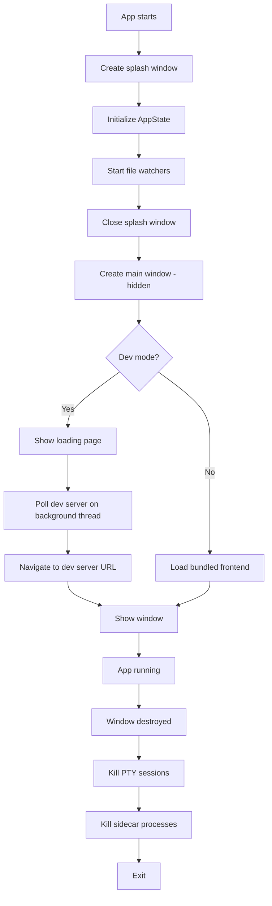

## Why create windows in Rust?

Tauri v2 lets you define windows in `tauri.conf.json`, but creating them programmatically in Rust gives you control over:

- Splash screen timing
- Dev server readiness polling
- Conditional window creation
- Multiple window instances
- Platform-specific configuration

## Splash screen pattern

Show a lightweight splash window while the app initializes, then replace it with the main window:

```rust
.setup(|app| {
    // 1. Create splash window (non-fatal if it fails)
    if let Err(e) = native::window::create_splash_window(app.handle()) {
        eprintln!("Failed to create splash window: {e}");
    }

    // 2. Do initialization work
    let project_root = resolve_project_root();
    let app_state = Arc::new(AppState::new(project_root));
    app.manage(app_state);

    // Start file watchers, etc.

    // 3. Close splash, create main window
    native::window::close_splash_window(app.handle());
    native::window::create_main_window(app.handle())?;

    Ok(())
})
```

### Splash window creation

The splash window is frameless, transparent, and always on top:

```rust
pub fn create_splash_window(
    handle: &tauri::AppHandle,
) -> tauri::Result<()> {
    let url = WebviewUrl::App("../frontend/splash.html".into());

    let _window = WebviewWindowBuilder::new(handle, "splash", url)
        .title("myapp")
        .inner_size(400.0, 200.0)
        .decorations(false)
        .transparent(true)
        .always_on_top(true)
        .resizable(false)
        .build()?;

    Ok(())
}
```

### Closing the splash

```rust
pub fn close_splash_window(handle: &tauri::AppHandle) {
    if let Some(window) = handle.get_webview_window("splash") {
        let _ = window.close();
    }
}
```

<Note>

When creating windows programmatically, keep the `"windows"` array in `tauri.conf.json` empty: `"windows": []`. If you define windows in both places, you will get duplicates.

</Note>

<Warning>

Watch out for the **visibility gap**: if you close the splash before the main window is visible, the user briefly sees no window at all. Either keep the splash open until the main window is ready to show, or skip the splash entirely and use a hidden main window with `PageLoadEvent::Finished` or a delayed `show()`.

</Warning>

## Main window with dev server polling

In development, the Vite dev server may not be ready when the window is created. The pattern is: show a loading page immediately, then navigate to the dev server once it responds.

```rust
const DEV_SERVER_URL: &str = "http://localhost:37461";

pub fn create_main_window(
    handle: &tauri::AppHandle,
) -> tauri::Result<()> {
    // Unique label for multiple windows
    let label = if handle.get_webview_window("main").is_some() {
        format!("main-{}", std::time::SystemTime::now()
            .duration_since(std::time::UNIX_EPOCH)
            .unwrap_or_default()
            .as_millis())
    } else {
        "main".to_string()
    };

    let url = if cfg!(debug_assertions) {
        // Inline loading page as data: URL
        WebviewUrl::External(
            loading_page_data_url().parse().unwrap(),
        )
    } else {
        WebviewUrl::default() // Bundled frontend
    };

    let window = WebviewWindowBuilder::new(handle, &label, url)
        .title("myapp")
        .inner_size(1400.0, 800.0)
        .visible(false) // Start hidden
        .on_navigation(move |url: &tauri::Url| {
            let url_str = url.as_str();
            // Allow local and tauri URLs
            if url_str.starts_with("http://localhost")
                || url_str.starts_with("tauri://")
                || url_str.starts_with("data:")
            {
                return true;
            }
            // Open external URLs in default browser
            if url_str.starts_with("http://")
                || url_str.starts_with("https://")
            {
                let owned = url_str.to_string();
                tauri::async_runtime::spawn_blocking(move || {
                    let _ = open::that(owned);
                });
                return false;
            }
            false // Block unknown schemes
        })
        .build()?;

    // In dev: poll Vite, navigate when ready
    if cfg!(debug_assertions) {
        let win = window.clone();
        std::thread::spawn(move || {
            if wait_for_dev_server(DEV_SERVER_URL, 120) {
                let url: tauri::Url =
                    DEV_SERVER_URL.parse().unwrap();
                let _ = win.navigate(url);
            }
        });
    }

    // Belt-and-suspenders: show on focus event OR after delay
    let win_clone = window.clone();
    window.on_window_event(move |event| {
        if let tauri::WindowEvent::Focused(true) = event {
            if !win_clone.is_visible().unwrap_or(false) {
                let _ = win_clone.show();
            }
        }
    });

    let win = window.clone();
    std::thread::spawn(move || {
        std::thread::sleep(std::time::Duration::from_millis(200));
        let _ = win.show();
    });

    Ok(())
}
```

### Dev server readiness check

Use TCP connection attempts instead of HTTP requests for faster polling:

```rust
fn wait_for_dev_server(url: &str, timeout_secs: u64) -> bool {
    let addr = url
        .strip_prefix("http://")
        .or_else(|| url.strip_prefix("https://"))
        .and_then(|h| h.split('/').next())
        .expect("invalid URL");

    let start = std::time::Instant::now();
    let timeout = std::time::Duration::from_secs(timeout_secs);

    while start.elapsed() < timeout {
        if std::net::TcpStream::connect(addr).is_ok() {
            return true;
        }
        std::thread::sleep(std::time::Duration::from_millis(500));
    }
    false
}
```

<Tip>

`TcpStream::connect` is faster than an HTTP request for readiness checks. It returns as soon as the port is open, without waiting for the full HTTP response.

</Tip>

<Warning>

The `data:` URL approach shown above requires the `webview-data-url` cargo feature to be enabled in `Cargo.toml`. Without it, the webview will fail to load data URLs. Bundled HTML files (`WebviewUrl::default()` or `WebviewUrl::App(...)`) are generally preferred for maintainability -- they are easier to edit, can include external assets, and do not require extra feature flags.

</Warning>

<Tip>

The `on_window_event(Focused)` handler acts as a safety net -- if the timed `show()` fires before the webview finishes rendering, the Focused event will catch it. Combining both gives more reliable behavior than either alone.

</Tip>

## Anti-flash: show on page load

For apps that load bundled frontend (no server polling needed), the simplest way to prevent white flash is to start hidden and show on first page load:

```rust
use tauri::webview::PageLoadEvent;

tauri::Builder::default()
  .on_page_load(|webview, payload| {
    if webview.label() == "main"
      && matches!(payload.event(), PageLoadEvent::Finished)
    {
      let _ = webview.window().show();
    }
  })
```

This replaces the manual 200ms delay approach and is more reliable because it waits for actual content to render.

<Note>

Combine this with `.visible(false)` on the window builder so the window starts hidden and only appears once the page has fully loaded.

</Note>

<Note>

If you control window visibility from the frontend JavaScript API instead of from Rust, you must grant these capabilities in your Tauri v2 configuration:

```json
{
  "permissions": [
    "core:window:allow-show",
    "core:window:allow-hide"
  ]
}
```

Without these permissions, calls to `appWindow.show()` or `appWindow.hide()` from the frontend will silently fail.

</Note>

## macOS: suppress press-and-hold accent menu

macOS shows an accent character popup when you press and hold a key. This interferes with apps that use key-repeat (text editors, terminal emulators). Suppress it in `setup()`:

```rust
#[cfg(target_os = "macos")]
{
    use objc2_foundation::{NSUserDefaults, NSString};
    let defaults = NSUserDefaults::standardUserDefaults();
    unsafe {
        let key = NSString::from_str("ApplePressAndHoldEnabled");
        defaults.setBool_forKey(false, &key);
    }
}
```

<Note>

This only affects the current process. It does not change the system-wide setting. Other applications continue to show the accent menu normally.

</Note>

## External link handling

The `on_navigation` callback controls which URLs the webview is allowed to load. Use it to open external links in the default browser:

```rust
.on_navigation(move |url: &tauri::Url| {
    let url_str = url.as_str();

    // Allow local dev server and tauri asset URLs
    if url_str.starts_with("http://localhost")
        || url_str.starts_with("https://localhost")
        || url_str.starts_with("tauri://")
        || url_str.starts_with("asset://")
        || url_str.starts_with("data:")
    {
        return true;
    }

    // External HTTP(S) links -> default browser
    if url_str.starts_with("http://")
        || url_str.starts_with("https://")
    {
        let owned = url_str.to_string();
        tauri::async_runtime::spawn_blocking(move || {
            let _ = open::that(owned);
        });
        return false;
    }

    // Block unknown schemes (javascript:, file:, etc.)
    false
})
```

<Warning>

Always block `javascript:` and `file:` schemes. Allowing them opens security vulnerabilities in the webview.

</Warning>

## Window destroy event handling

Use `on_window_event` to clean up resources when a window is destroyed:

```rust
.on_window_event(|window, event| {
    if let tauri::WindowEvent::Destroyed = event {
        if window.label() == "main" {
            if let Some(state) = window.try_state::<Arc<AppState>>() {
                // Kill all PTY sessions
                commands::terminal::kill_all_ptys(&state);
            }
        }
    }
})
```

### Sidecar process cleanup

For apps that spawn sidecar processes, clean them up on window destroy using the `run` callback:

```rust
.build(tauri::generate_context!())
.expect("error while building tauri application")
.run(move |app_handle, event| match &event {
    tauri::RunEvent::WindowEvent {
        event: tauri::WindowEvent::Destroyed,
        ..
    } => {
        if let Ok(mut guard) = sidecar_arc.lock() {
            if let Some(mut sidecar) = guard.take() {
                kill_sidecar(&mut sidecar);
            }
        }
        app_handle.exit(0);
    }
    _ => {}
});
```

<Warning>

If your app spawns child processes (PTY sessions, sidecar servers), you must explicitly kill them on window destroy. Otherwise they become orphan processes that continue running after the app closes.

</Warning>

## Window lifecycle summary



## Key takeaways

1. **Keep `"windows": []` empty in tauri.conf.json** when creating windows programmatically
2. **Start windows hidden** and show after content is ready to avoid white flash
3. **Use `data:` URLs for loading pages** -- no need for bundled HTML files (but note the `webview-data-url` feature flag requirement)
4. **Poll dev server with TCP connect** -- faster than HTTP requests
5. **Always clean up child processes** on window destroy
6. **Use `on_navigation` to control link behavior** -- open external links in the default browser
7. **Platform-specific code** goes behind `#[cfg(target_os = "macos")]` guards

<Warning>

If you use `tauri-plugin-window-state`, it may restore the persisted `VISIBLE` state on launch, which fights with the hidden-then-show pattern. You need to explicitly exclude the visibility flag from being persisted, or the plugin will show the window before your code is ready to display content.

</Warning>
